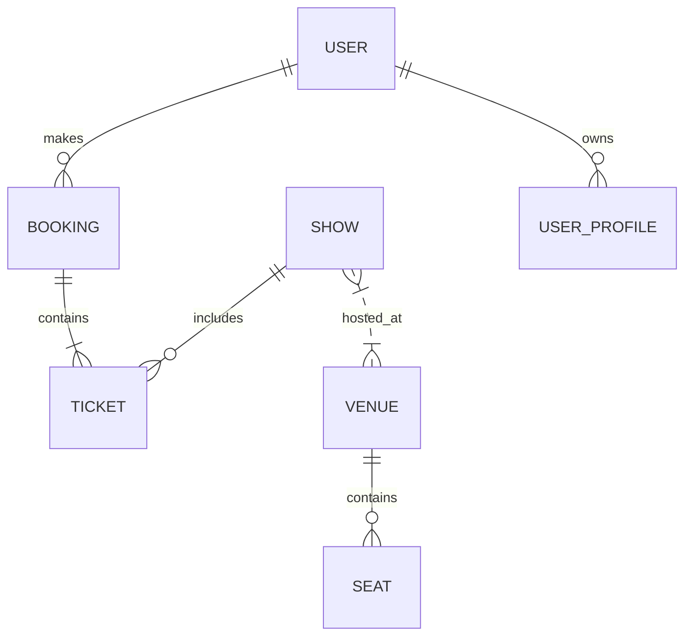
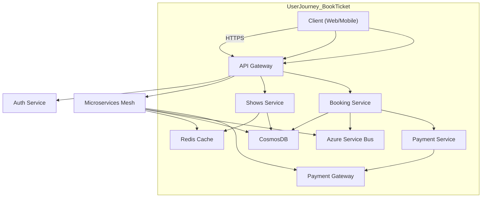

# Book My Show System Design Document

---

## 1. System Overview

- **Executive Summary:** Book My Show is a large-scale online platform for booking tickets for movies, events, and shows, delivering seamless user experience under high traffic and diverse user demands.
- **Problem Statement:** Design a fault-tolerant, scalable, and performant ticketing platform supporting real-time seat availability, secure payments, and personalized recommendations.
- **Scope Boundaries:** Focus on ticket booking for movies/events; exclude content streaming and offline box office integration.
- **Key Challenges:** High concurrency during peak releases, real-time seat locking, payment processing reliability, and personalized experience.

---

## 2. Requirements Analysis

- **Functional Requirements:**
  - FR1: Search & browse shows/movies/events
  - FR2: Real-time seat availability and selection
  - FR3: Ticket booking & payment processing
  - FR4: User profile & booking history
  - FR5: Personalized recommendations
  - FR6: Cancellation & refund processing
  - FR7: Notifications & alerts

- **Non-Functional Requirements:**
  - CAP Positioning: Favor availability & partition tolerance over strict consistency (AP) with eventual consistency on seat availability
  - SLA: P99 latency < 200ms for reads, 500ms for writes; 99.95% uptime
  - Scale Estimates: 50M DAU, peak QPS 500K reads, 100K writes; 90:10 read/write ratio
  - Consistency vs Availability: Favor eventual consistency for bookings with compensating transaction patterns

---

## 3. Capacity Planning & Back-of-Envelope Calculations

- Traffic Estimate:
  - DAU = 50 million
  - Peak QPS = 500K read, 100K write
  - Growth: 20% YoY

- Storage:
  - Hot Data: Seat availability, bookings (recent 6 months)
  - Cold Data: Archive older bookings, logs

- Bandwidth & Compute:
  - Scale API Gateway & microservices with auto-scaling
  - Use CDN for static content

- Cost Implications:
  - Azure CosmosDB for global scale
  - Azure Kubernetes Service (AKS) for microservices
  - Azure Service Bus for async workflows

---

## 4. Data Model



- Core entities: User, Booking, Ticket, Show, Venue, Seat, UserProfile
- Database choice: CosmosDB (multi-model), supporting globally distributed multi-region writes and flexible schema
- Partitioning: Hash on ShowID for seat availability, UserID for bookings
- Indexing: Composite indexes on (ShowID, SeatID), UserID for fast lookup

---

## 5. API Design

- Protocol: REST with JSON for interoperability and ease of client integration

- Critical APIs:

| API Endpoint                | Method | Request                             | Response                      | Notes                        |
|-----------------------------|--------|-----------------------------------|------------------------------|------------------------------|
| /shows                      | GET    | Query params (date, location)     | List of shows/movies          | Cached heavily               |
| /shows/{showId}/seats       | GET    | showId                            | Real-time seat layout         | Cached, with short TTL       |
| /bookings                   | POST   | userId, showId, seatIds, payment  | Booking confirmation          | Idempotent, async payment    |
| /bookings/{bookingId}       | GET    | bookingId                        | Booking details               | Authorization required      |
| /users/{userId}/profile     | GET    | userId                           | User profile                  | Protected endpoint          |

- Rate limiting: API key or OAuth token based, 1000 QPS per user
- Error handling: HTTP 4xx/5xx with error codes and retry guidance

---

## 6. High-Level Architecture (HLD)



- Request Flow Examples:
  - Search: Client -> API Gateway -> Shows Service -> Cache/DB -> Client
  - Booking: Client -> API Gateway -> Booking Service -> Payment Service -> External Payment Gateway

---

## 7. Microservices Decomposition

- Services:
  - User Service: User management
  - Shows Service: Show catalog, seat availability
  - Booking Service: Bookings and reservations
  - Payment Service: Payment processing
  - Notification Service: Alerts, emails, SMS

- Communication:
  - Sync via REST/gRPC for queries
  - Async via Azure Service Bus for booking events

- Service Discovery: Azure Kubernetes Service with internal DNS

- Boundaries:
  - Bounded Contexts based on domain: User, Shows, Booking separate for scalability and fault isolation

---

## 8. Deep Dives

### Distributed Transactions / Saga Pattern

- Use orchestration-based saga for booking and payments
- Local transactions:
  - Booking service reserves seats
  - Payment service processes payment
- Compensating actions to release seats if payment fails

```python
# Simplified Saga orchestration pattern pseudocode
class BookingSaga:
    def __init__(self):
        self.state = 'START'

    def reserve_seats(self):
        # call seat reservation microservice
        pass

    def process_payment(self):
        # call payment microservice
        pass

    def compensate(self):
        # release seats if payment fails
        pass
```

### Real-Time Updates (WebSockets + SignalR)

- Use SignalR in Azure for realtime seat availability updates
- Broadcast seat lock/unlock events to users in the same show page

### Caching Strategies

- Multi-tier caching:
  - CDN for static content
  - Redis for seat availability & session data
  - Client-side caching with ETags
- Cache invalidation on booking confirm/cancel

---

## 9. Infrastructure & DevOps

- Azure Services:
  - AKS for container orchestration
  - CosmosDB for multi-region DB
  - Azure Service Bus for async messaging
  - Azure Functions for lightweight event processing
  - Azure Monitor & App Insights for observability

- CI/CD:
  - GitHub Actions for pipelines
  - Terraform/Bicep for IaC
  - Blue-green deployments with feature flags

---

## 10. Cross-Cutting Concerns

- Security:
  - OAuth2 with Azure Active Directory (AAD)
  - RBAC for authorization
  - Encryption at rest (CosmosDB) & transit (HTTPS/TLS)
  - Key Vault for secrets management

- Observability:
  - Metrics & tracing via Azure Monitor & App Insights
  - Centralized logging and alerts

- Resilience:
  - Circuit breakers, retries with exponential backoff
  - Bulkheads to isolate failures

- Performance:
  - Redis caching, lazy loading, CDN

---

## 11. Scalability & Reliability

- Horizontal scaling via AKS autoscaling
- CosmosDB multi-region writes with global distribution
- CQRS for read-heavy workloads
- Azure Service Bus for decoupling and buffering
- Disaster recovery using geo-replication and backups
- Multi-region deployment for latency & availability
- Load balancers at L4 & L7

---

## 12. Trade-offs & Alternatives

| Decision                     | Pros                                           | Cons                                    |
|------------------------------|------------------------------------------------|------------------------------------------|
| CosmosDB (NoSQL)             | Scalability, global distribution, flexible schema | Eventual consistency challenges          |
| SQL (like PostgreSQL)        | Strong consistency, complex queries            | Scaling write throughput limited         |
| Microservices               | Scalability, fault isolation                    | Inter-service latency & complexity       |
| Monolith                    | Simplicity and easier debugging                 | Scaling bottlenecks at high loads        |
| Eventual consistency        | High availability                               | Consistency delays in seat availability  |

---

## 13. Interview Discussion Points

- Clarifications on CAP trade-offs and consistency models
- Strategies for handling payment failures
- Approaches for personalized recommendation scaling
- Real-time updates and consistency challenges
- Extending system to include offline box office integration
- Handling peak traffic spikes and DoS attacks

