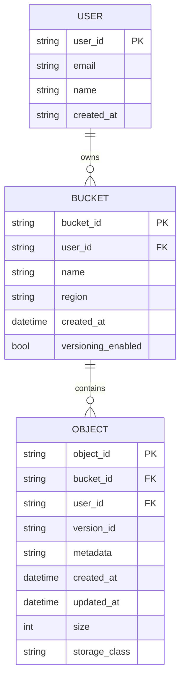
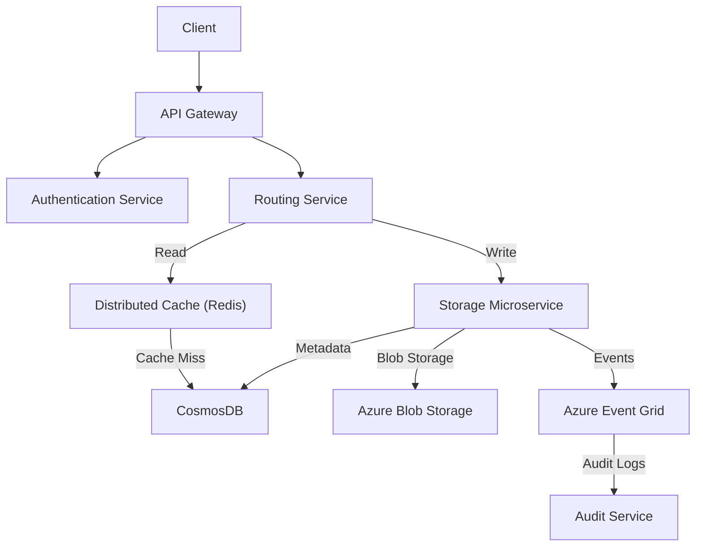
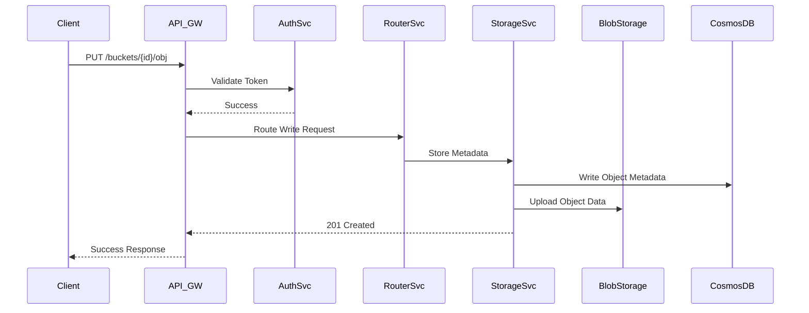

# Cloud Storage System Design

---

## 1. System Overview

Cloud Storage System offers scalable, durable, and highly available object/file storage accessible via API and client integrations. It is designed to manage vast unstructured data with efficient metadata management and rapid data retrieval.

**Problem Scope:** Provide cloud-native storage for objects/files with multi-tenant support, consistency control, and seamless global access.

**Key Challenges:**
- Handling massive, multi-petabyte storage growth
- Ensuring strong durability and high availability
- Balancing consistency with geo-distributed availability
- Optimizing latency for both small and large object access
- Secure multi-tenant data isolation and access management

---

## 2. Requirements Analysis

### Functional Requirements (FRs)
- FR1: Upload/download objects reliably with versioning
- FR2: Metadata management (tags, ACLs, lifecycle policies)
- FR3: Strong consistency on object metadata; eventual consistency for replicas
- FR4: Multi-region replication and failover
- FR5: Access control and audit logging
- FR6: Object lifecycle management (archive, delete)
- FR7: Bulk operations (batch upload, delete)

### Non-Functional Requirements (NFRs)
- **CAP Positioning:** Favor Availability and Partition tolerance (AP) with tunable consistency per operation.
- **SLAs:**
  - P99 latency: < 150ms for reads/writes
  - Uptime: 99.99%
- **Scale Estimates:**
  - DAU: 50M+ users
  - QPS: Read-to-write ratio ~10:1, with peak QPS ~1M reads, 100K writes
  - Data: 5+ exabytes hot+cold store
- **Consistency vs Availability:** Prioritize availability with configurable consistency for critical metadata update operations

---

## 3. Capacity Planning & Back-of-Envelope Calculations

- Traffic:
  - Peak writes: 100K QPS * avg 1MB = 100 GB/s write bandwidth
  - Peak reads: 1M QPS * avg 0.5MB = 500 GB/s read bandwidth
- Storage:
  - Hot data (30%) ~1.5 EB
  - Cold data (70%) ~3.5 EB archived
- Bandwidth & Compute:
  - CDN & edge caching to offload read traffic
  - Compute nodes: ~1000 cluster nodes distributed globally
- Cost:
  - Azure Blob Storage + CDN (~$0.02/GB hot, $0.004/GB cold)
  - Networking & compute scoped with autoscaling

---

## 4. Data Model



- **Database Selection:** CosmosDB (multi-region, multi-model) chosen for geo-replication & tunable consistency
- **Partitioning:** Partition by bucket_id for write locality; shard objects across partitions by hash of object_id
- **Indexing:** Index on object_id, bucket_id, version_id, created_at

> [!tip] Prioritize partition key design for write/read load balancing and low latency

---

## 5. API Design

- Protocol: REST + JSON favored for broad compatibility and caching

| API           | Method | Path                     | Request                        | Response                         | Notes                               |
|---------------|--------|--------------------------|-------------------------------|---------------------------------|-----------------------------------|
| Upload Object | PUT    | /buckets/{bucket_id}/obj | Multipart/form-data + metadata | 201 Created + object metadata    | Supports versioning                |
| Get Object    | GET    | /buckets/{bucket_id}/obj | Query params: version_id       | 200 OK + object stream           | Conditional GET (ETag caching)    |
| Delete Object | DELETE | /buckets/{bucket_id}/obj | Query params: version_id       | 204 No Content                   | Soft delete with lifecycle hooks |
| List Objects  | GET    | /buckets/{bucket_id}/objs| Query params: prefix, limit    | 200 OK + object list              | Pagination supported              |
| Update Metadata| PATCH  | /buckets/{bucket_id}/obj | JSON body (metadata updates)   | 200 OK + updated metadata        | Partial update supported          |
| Bulk Delete   | POST   | /buckets/{bucket_id}/bulk-delete | JSON array of object IDs    | 202 Accepted                    | Async processing                  |

- Rate limiting: Per API key to avoid abuse
- Authentication: OAuth2 with Azure AD integration

---

## 6. High-Level Architecture



### Request Flow - Upload Object



---

## 7. Microservices Decomposition

| Service Name        | Responsibility                    | Communication Type                  |
|---------------------|---------------------------------|----------------------------------|
| Auth Service        | Authentication and Authorization | Sync (REST/gRPC)                   |
| Router Service      | Request routing and load balancing| Sync                             |
| Storage Service     | Object and metadata management    | Async writes with Event Grid pub/sub |
| Audit Service       | Audit logs and compliance         | Async via event consumption       |
| Notification Service| Event-based user notifications    | Async                            |

> [!important] Divide by bounded contexts: Storage (objects), Identity (users), Audit/Notification

---

## 8. Deep Dives

### File Storage and CDN Strategy

- Source files stored in Azure Blob Storage with geo-replication
- Edge caching via Azure CDN for minimized latency and bandwidth offload
- Signed URLs for secure, time-limited client direct downloads

### Distributed Transactions and Saga

- Use saga pattern for multi-step operations (e.g., multi-region replication)
- Compensating transactions on partial failure

```python
# Simplified saga for object replication
class ObjectReplicationSaga:
    def __init__(self, object_id):
        self.object_id = object_id

    def execute(self):
        try:
            self.replicate_to_region("eastus")
            self.replicate_to_region("westus")
        except Exception as e:
            self.compensate()

    def replicate_to_region(self, region):
        # API call to replicate object
        pass

    def compensate(self):
        # rollback logic
        pass
```

### Caching & Cache Invalidation

- Use Redis as distributed cache for metadata and hot objects
- Cache objects with TTLs adjusted by access patterns
- Cache invalidation on update/delete

---

## 9. Infrastructure & DevOps

- Azure Kubernetes Service (AKS) for microservice orchestration
- Azure CosmosDB for globally distributed metadata
- Azure Blob Storage for large object storage
- Azure Event Grid for event-driven architecture
- Azure Monitor & Application Insights for observability
- Terraform IaC with blue-green deployment pipeline

---

## 10. Cross-Cutting Concerns

### Security

- OAuth2 via Azure AD for auth, RBAC for permissioning
- Encrypt data at rest (Azure Storage Encryption) and in transit (TLS)
- Azure Key Vault for secrets management

### Observability

- Integrated metrics and logs with Azure Monitor and App Insights
- Distributed tracing with OpenTelemetry
- Alerting on SLA breaches and error spikes

### Resilience

- Circuit breakers with Polly + retries with exponential backoff
- Bulkheads to isolate service failures
- Chaos testing with Azure Chaos Studio

### Performance

- CDN for content delivery
- Redis caching layers
- Query and index optimization

---

## 11. Scalability & Reliability

- Horizontal scaling with AKS autoscaling
- CosmosDB read replicas for read scaling
- CQRS pattern: writes to metadata sync, reads primarily from cache
- Message queues (Event Grid) for asynchronous processing
- Geo-redundancy and automated failover
- Multi-region active-active deployment

---

## 12. Trade-offs & Alternatives

| Decision                 | Pros                           | Cons                            |
|--------------------------|--------------------------------|--------------------------------|
| CosmosDB (NoSQL)         | Geo-replication, scalability, tunable consistency | Complex query limitations      |
| CosmosDB vs SQL          | Better geo and partition compared to classic SQL | Less strong relational integrity |
| Microservices            | Scalability, independent deploy | Increased complexity            |
| Monolith (Rejected)      | Simplicity initial development  | Scaling bottlenecks, team coordination |
| Blob Storage + CDN       | Low cost, high throughput       | Cold start latency on cache miss |

---

## 13. Interview Discussion Points

- How to handle object version conflicts/merge?
- Backup and DR strategies for object metadata and blobs?
- Strategies for multi-tenancy data isolation?
- Optimizing for costs vs performance at scale?
- Handling large file uploads (>5GB multipart strategies)?
- What failure modes exist in multi-region replication?
- Consistency models and tunable consistency trade-offs?
- Monitoring SLA violations and automated remediation?

