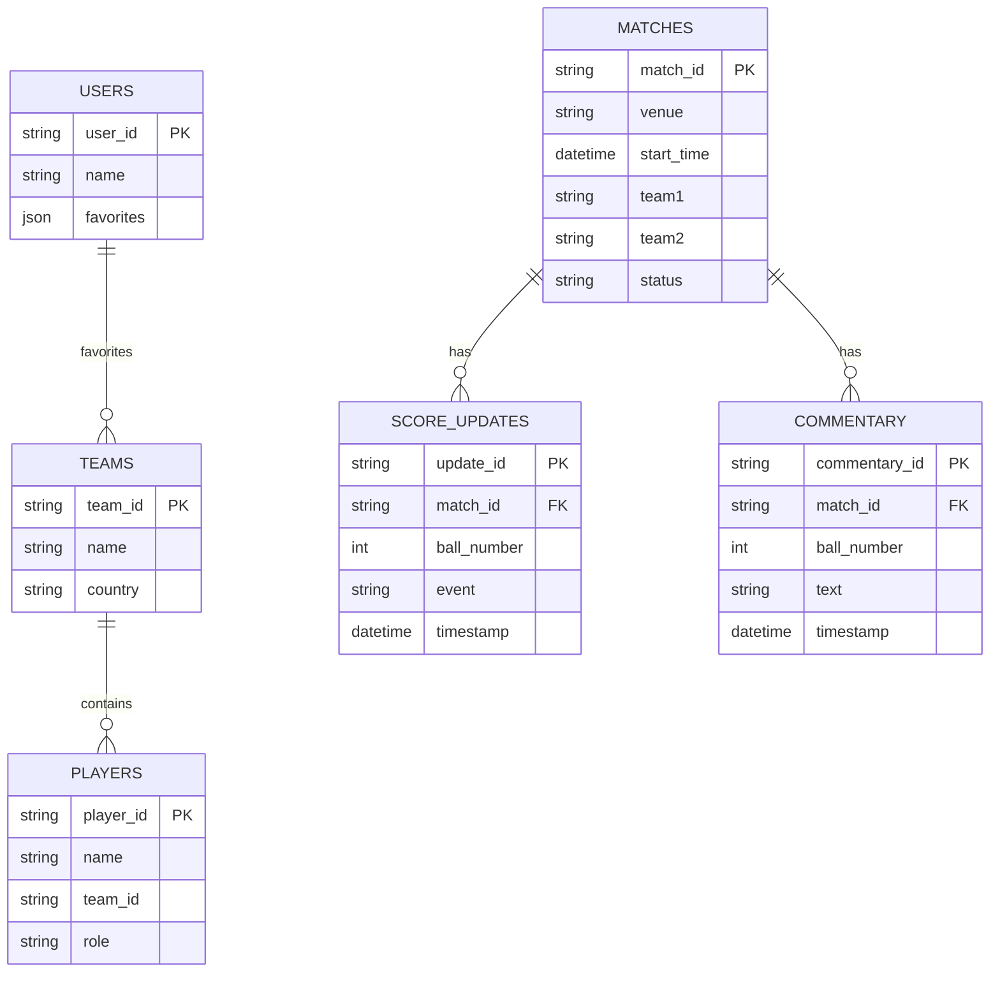
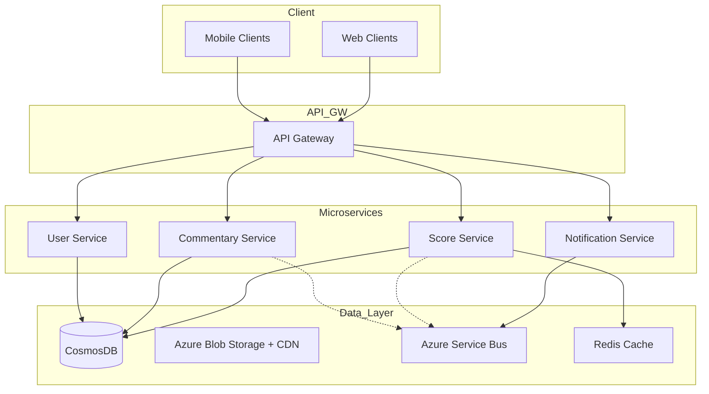
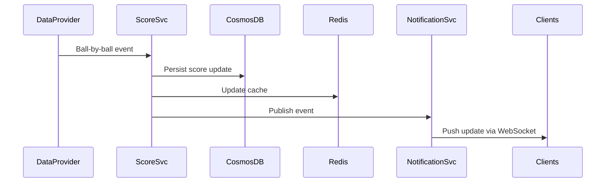

# Cricbuzz/Espncricinfo System Design

---

## 1. System Overview

**Executive Summary:**
Cricbuzz/Espncricinfo is a high-traffic sports platform delivering live cricket scores, commentary, player stats, and news with real-time updates to millions worldwide. It demands extremely low-latency data delivery, high availability, and scalability to handle global cricket events spikes.

**Core Problem Statement & Scope:**
Build a globally scalable, highly available real-time cricket score and content distribution system supporting live updates, historical data, user personalization, and multi-platform clients (web/mobile).

**Key Challenges:**
- Real-time data ingestion and propagation with minimal latency
- Handling traffic spikes during live matches
- Managing diverse data types: live scorecards, commentary, multimedia content
- Ensuring data consistency balanced with high availability
- Personalization and user engagement at scale

---

## 2. Requirements Analysis

### Functional Requirements
- FR1: Real-time live score updates (ball-by-ball)
- FR2: Detailed player statistics and historical match data
- FR3: Live commentary and match highlights (text, images, videos)
- FR4: User personalization (favorite teams, notifications)
- FR5: Search for matches, players, and stats
- FR6: Notifications and alerts for match events
- FR7: Multi-platform access – web, mobile apps, APIs

### Non-Functional Requirements
- CAP Positioning: Prioritize **Availability** and **Partition tolerance** over strict Consistency (BASE semantics)
- SLAs: P99 latency < 200ms for live updates; 99.95% uptime
- Scale Estimates:
  - DAU: ~10 million active users globally
  - QPS: Peak reads ~100K+ QPS during matches, writes QPS ~10K (ball updates)
  - Read/write ratio ~10:1
  - Data Volume: Daily ingest ~5TB multimedia + live data
- Trade-offs: Eventual consistency acceptable for user personalization and non-critical data, strong consistency for score updates where feasible

---

## 3. Capacity Planning & Back-of-Envelope

- **Traffic Estimates:**
  - Users: 10M DAU, average sessions 2 per day
  - QPS Peak: Reads = 10M * 2 sessions * 1 request/min ≈ 333K reads/sec peak
  - Writes: Ball-by-ball update every 30 seconds per match, 50 matches concurrent → ~1.6K write QPS
  - Growth: 20% YoY traffic increase

- **Storage Estimates:**
  - Hot data: last 30 days live + historical queries ~ 10TB
  - Cold data: archival multimedia, stats >30 days ~ 100TB

- **Bandwidth & Compute:**
  - CDN for multimedia and static content, expect 10 Gbps outgoing peak bandwidth
  - Compute: Microservices on AKS with auto-scale for live processing and APIs

- **Cost Implications:**
  - CosmosDB for primary data store (hot data)
  - Azure Blob Storage + CDN for multimedia
  - Azure Service Bus for event ingestion
  - Plan for $50K-$100K monthly depending on user growth and media consumption

---

## 4. Data Model



- **Database Selection:** CosmosDB for scalable, globally distributed NoSQL with multi-region writes for low latency.
- **Partitioning:** Partition by match_id for score/commentary, by user_id for personalization.
- **Indexing:** Time-series index on score updates and commentary for efficient timeline queries.

> [!tip] Balance between query flexibility and write throughput is critical; denormalize some data for faster reads.

---

## 5. API Design

### Protocol Choice: REST + WebSocket for real-time updates

| API | Method | Path | Request | Response | Notes |
|------|--------|------|---------|----------|-------|
| Get Match Details | GET | /matches/{match_id} | - | Match details JSON | 200, 404 |
| Get Live Score | GET | /matches/{match_id}/score | - | Live score JSON | 200, 404, 503 |
| Post Score Update | POST | /matches/{match_id}/score | Ball info JSON | Ack 202/Err 40x | Auth, rate-limited |
| Get Commentary | GET | /matches/{match_id}/commentary | Pagination params | Commentary list | 200, 404 |
| Subscribe Live Updates | WS | /live-updates | Sub details | Live event stream | Auth, heartbeat |
| Search Players | GET | /search/players?q= | Query string | Player list | Rate-limited |

- Authentication via OAuth 2.0 (Azure AD)
- Rate limiting at API Gateway layer
- Robust error handling with clear error codes

---

## 6. High-Level Architecture



### Sequence: Live Score Update


---

## 7. Microservices Decomposition

| Service | Responsibility | Communication |
|---------|----------------|---------------|
| Score Service | Manage live scores, persist updates | Sync REST + async event
| Commentary Service | Manage commentary updates | Sync REST + async event
| User Service | User profiles, personalization | Sync REST
| Notification Service | Push real-time updates, alerts | Async pub/sub

- Communication: REST for queries, async messaging (Azure Service Bus) for events
- Service Discovery: Kubernetes native via AKS DNS, optionally Consul
- Bounded Contexts: Scores vs Commentary vs User personalized data separated for independent scaling

> [!important] Service boundaries reflect domain-driven design to isolate high-throughput critical paths from low-frequency operations.

---

## 8. Deep Dives

### Real-time Updates with WebSocket

- Use an API gateway with WebSocket support for persistent connections
- Push ball-by-ball updates and events with JSON payloads
- Heartbeat and reconnect strategies for client reliability

### Search Implementation

- Azure Cognitive Search for indexing player profiles, matches, and commentary
- Support autocomplete, fuzzy search, ranking by relevance
- Periodic incremental indexing from CosmosDB

### Caching & Cache Invalidation

- Redis for hot data caching (score, commentary)
- Cache invalidated on update events
- TTL set for ephemeral data (1-5 mins)

```python
# Example Python snippet: Cached fetch pattern
import redis
cache = redis.Redis()

def get_live_score(match_id):
    cached = cache.get(match_id)
    if cached:
        return cached
    # fallback to DB
    score = db_query_live_score(match_id)
    cache.set(match_id, score, ex=60)
    return score
```

---

## 9. Infrastructure & DevOps

- Azure Kubernetes Service (AKS) for container orchestration
- CosmosDB with multi-region writes for globally distributed data
- Azure Blob Storage + CDN for media
- Azure Service Bus for event ingestion
- Azure Functions for serverless tasks (e.g., notifications)
- CI/CD using GitHub Actions + Azure DevOps pipelines
- Infrastructure as Code with Bicep + Terraform
- Blue-green deployments with traffic shift via Azure Front Door

---

## 10. Cross-Cutting Concerns

### Security
- OAuth 2.0 with Azure AD for user and service authentication
- Role-based access control (RBAC) for APIs
- TLS for data in transit, AES-256 encryption at rest
- Azure Key Vault for secret management

### Observability
- Azure Monitor + App Insights for metrics, logs, distributed tracing
- Alerts based on error rates, latency (SLI/SLO aligned)

### Resilience
- Circuit breakers (Polly in .NET)
- Retries with exponential backoff
- Bulkheads to isolate failures
- Chaos engineering in pre-prod

### Performance
- Redis caching
- CDN for static assets
- Query optimization and connection pooling

---

## 11. Scalability & Reliability

- Horizontal scaling on AKS with HPA based on CPU/QPS
- CosmosDB with multi-region replication and read replicas
- Azure Service Bus as messaging buffer
- Disaster recovery:
  - RTO < 5 min, RPO < 1 min
  - Backup to geo-redundant storage
- Multi-region deployment with Azure Front Door for global load balancing

---

## 12. Trade-offs & Alternatives

| Decision | Pros | Cons |
|----------|------|------|
| CosmosDB vs SQL | Global distribution, scale, elasticity | Complex consistency, cost |
| REST + WebSocket | Simple, industry standard | WebSocket complexity handled at scale |
| Microservices over Monolith | Scalability, independent deploy | Operational overhead |
| Azure Blob + CDN vs On-prem | Elastic, scalable media delivery | Vendor lock-in |

At 10x scale, consider CQRS and event sourcing for write optimization.

---

## 13. Interview Discussion Points

- How to handle data consistency vs availability?
- Scaling live update streams efficiently?
- Hot partitions in CosmosDB and mitigation?
- Extending personalization with ML?
- Failover strategy for critical real-time notifications?
- Impact of CDN cache invalidation strategies?

> [!tip] Prepare to discuss your rationale and how you'd debug live incident scenarios.

