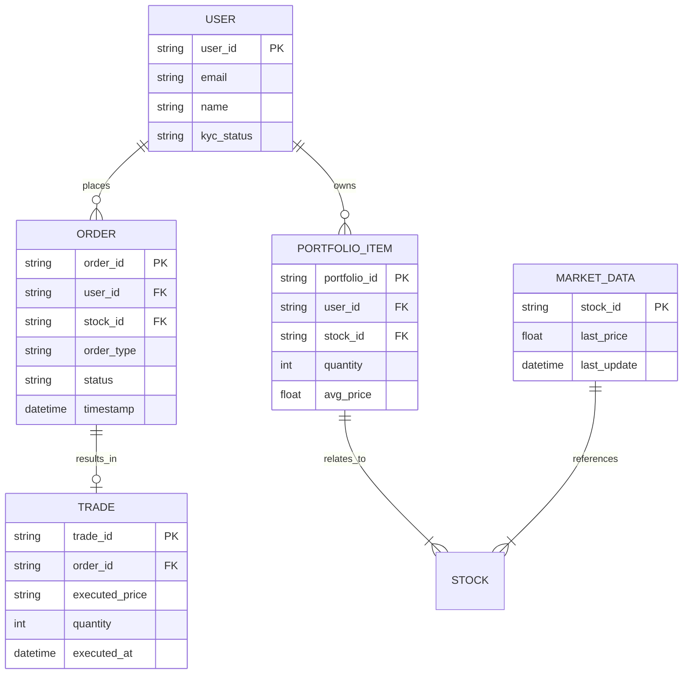
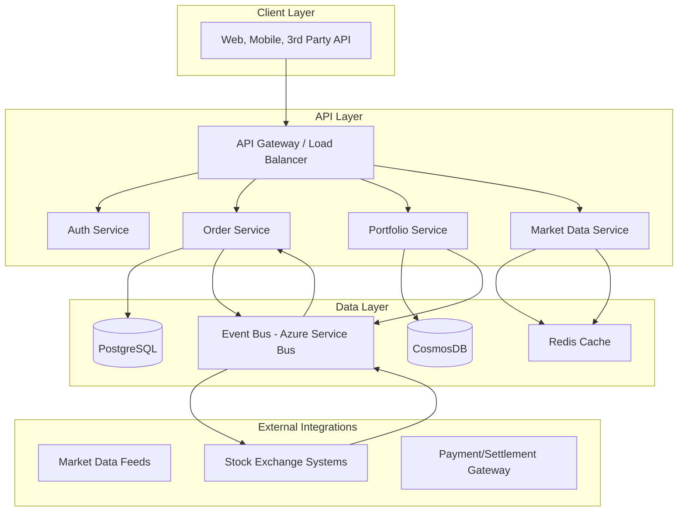
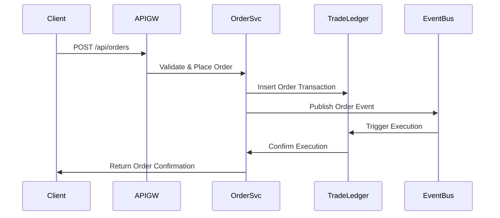

# Stock Broker System Design (Zerodha/Upstock/5paisa) - Senior/Staff/Principal Engineer Interview

---

## 1. System Overview

- **Executive Summary:**
  A highly available, low-latency, real-time stock brokerage platform enabling retail investors to trade stocks, derivatives, and mutual funds with advanced order types and portfolio management.
  This system supports millions of users executing high-frequency trades and market data consumption.

- **Core Problem Statement & Scope:**
  Build a cloud-native distributed system that handles real-time order placement, execution, and settlement with live market data feeds and portfolio tracking.
  Scope includes trade lifecycle from order intake to settlement, user portfolio management, and market data dissemination.

- **Key Challenges:**
  - Real-time low-latency trade execution and market data delivery
  - Strong consistency for order placement vs availability for market data
  - Scalability to millions of daily active users (DAU) with unpredictable spikes
  - Secure handling of sensitive financial and user data
  - Regulatory compliance and auditability

## 2. Requirements Analysis

**Functional Requirements (FRs):**
1. Real-time order placement, modification, and cancellation
2. Live market data streaming with high update frequency
3. Portfolio and holdings management with real-time updates
4. User authentication, authorization, and KYC management
5. Trade settlement and transaction history
6. Notifications for order/trade events
7. Reporting and compliance audit logs

**Non-Functional Requirements (NFRs):**
- **CAP Theorem:** Prioritize Consistency and Partition Tolerance (CP) for order placement to ensure trade integrity, Availability prioritized for market data dissemination (AP)
- **SLAs:**
  - Order placement P99 latency < 150 ms
  - Market data update latency < 50 ms
  - System uptime 99.99%
- **Scale Estimates:**
  - DAU: 5 million users
  - Peak QPS: 100,000 writes (orders), 1 million reads (market data)
  - Read/Write ratio (orders): ~10:1
  - Data volume: 500 TB yearly (orders, ticks, user data)
- **Consistency vs Availability:**
  - Strong consistency for trade/order book state
  - Eventual consistency for market data and metrics

## 3. Capacity Planning & Back-of-Envelope Calculations

- **Traffic:**
  - Estimated 5M DAU * 20 orders per day average = 100M orders/day ~1157 orders/sec average, peak 100k QPS during market hours
  - Market data: ~1M QPS read-heavy streaming data
- **Storage:**
  - Orders: 100M/day * 200B/order record = 20TB/day raw data
  - Market ticks: 50,000 symbols * 100 updates/s * 6.5 hours * 200B record = ~4 TB daily
  - Portfolio: user holdings and transactions ~10 TB/year
- **Bandwidth & Compute:**
  - Use Azure Event Hubs for market data ingestion
  - AKS clusters for microservices, autoscale with CPU/memory triggers
- **Cost:**
  - Leverage Cosmos DB with multi-region write/read for geo-redundancy
  - Use Azure CDN for market data delivery

## 4. Data Model



- Database choice: Cosmos DB (NoSQL) for high availability, multi-region writes; PostgreSQL for transactional trade/order ledger
- Partitioning: Hash partition on user_id for orders and portfolios; range partition on timestamp for trades
- Indexing: Composite indexes on user_id + timestamp for query hot paths
- Trade-offs: NoSQL for market/Microservice scalability, relational for ACID order transactions

## 5. API Design

- RESTful APIs for client interactions; gRPC internal for low-latency between services

| API                      | HTTP Method | Path                    | Description                  | Auth       | Rate Limit          |
|--------------------------|-------------|-------------------------|------------------------------|------------|---------------------|
| Place Order              | POST        | /api/orders             | Place new order              | OAuth2     | 60 req/min/user      |
| Modify Order             | PUT         | /api/orders/{order_id}  | Modify existing order        | OAuth2     | 30 req/min/user      |
| Cancel Order             | DELETE      | /api/orders/{order_id}  | Cancel an order             | OAuth2     | 30 req/min/user      |
| Get Portfolio            | GET         | /api/portfolios/{user_id}| Retrieve portfolio details  | OAuth2     | 100 req/min/user     |
| Market Data Stream       | GET         | /api/marketdata/stream  | Real-time market ticker     | OAuth2     | 1000 req/min/user    |
| Get Trade History        | GET         | /api/trades/{user_id}   | Historical trades retrieval | OAuth2     | 50 req/min/user      |

- Error handling: Standard HTTP status codes (400, 401, 403, 404, 429, 500), JSON error response with error_code and message

## 6. High-Level Architecture (HLD)



Sequence diagram for order placement:



## 7. Microservices Decomposition

| Service Name       | Responsibility                          | Communication   |
|--------------------|---------------------------------------|-----------------|
| Auth Service       | User authentication and OAuth2 tokens | Sync (HTTP/gRPC)|
| Order Service       | Handle order lifecycle (place/modify) | Sync, Async (event bus) |
| Portfolio Service   | Manage user holdings and positions     | Sync            |
| Market Data Service | Stream live market data to clients     | Async, Pub/Sub  |
| Trade Execution     | Interface with exchange for order match| Async           |
| Notification       | Push trades and order updates to users | Async, WebSocket|

- Service discovery via Kubernetes DNS + service mesh (e.g., Istio)
- Orchestration: Event-driven with Saga pattern for multi-step order processing
- Boundaries defined by business domain for independent scaling

## 8. Deep Dives

### Real-time Updates (WebSocket + SignalR)
- Market data and order updates pushed using WebSocket or SignalR connections
- Low latency, bi-directional channels from server to client
- Handle connection scaling via Azure SignalR Service

### Distributed Transactions & Saga Pattern
- Distributed transactional workflow for order processing
- Step 1: Validate order -> Step 2: Reserve funds -> Step 3: Place order -> Step 4: Execution confirmation
- Use compensating transactions to rollback in case of failure

```python
# Simplified Saga orchestration snippet (Python)
class OrderSaga:
    def __init__(self):
        self.state = 'start'

    def execute(self, order):
        try:
            self.reserve_funds(order)
            self.place_order(order)
            self.confirm_execution(order)
            self.state = 'completed'
        except Exception:
            self.compensate(order)
            self.state = 'failed'

    def reserve_funds(self, order):
        pass
    def place_order(self, order):
        pass
    def confirm_execution(self, order):
        pass
    def compensate(self, order):
        pass
```

### Caching Strategy & Cache Invalidation
- Cache portfolio and market quote data in Redis
- Use TTLs and pub/sub to invalidate cache on updates
- Cache aside pattern preferred for reads

## 9. Infrastructure & DevOps

- Azure Kubernetes Service (AKS) for containerized microservices
- Azure Cosmos DB for multi-region distributed storage
- Azure Service Bus for event-driven messaging
- Azure SignalR Service for real-time client communication
- Azure Monitor + Application Insights for observability
- CI/CD: GitHub Actions or Azure DevOps pipelines
- IaC: Terraform or Azure Bicep for infrastructure deployment
- Deployments: Blue-Green and Canary deployments supported

## 10. Cross-Cutting Concerns

- **Security:**
  - Authentication via Azure Active Directory (AAD) + OAuth2
  - Role-Based Access Control (RBAC) for authorization
  - Encryption at rest (Azure Key Vault) and in transit (TLS)
  - API Gateway enforces rate limiting and throttling
- **Observability:**
  - Metrics collection via Azure Monitor -> Azure Dashboards
  - Distributed Tracing via Application Insights + OpenTelemetry
  - Centralized logging with ELK stack or Azure Monitor Logs
  - Alerting with Azure Alerts based on SLIs
- **Resilience:**
  - Circuit Breaker pattern & retries with exponential backoff (Polly library)
  - Bulkheads to isolate failures
  - Timeout policies with graceful degradation
  - Chaos testing in pre-prod
- **Performance:**
  - Redis caching for hot reads
  - CDN for static content and market data
  - Connection pooling for DB clients

## 11. Scalability & Reliability

- Horizontal pod autoscaling in AKS based on CPU and custom metrics
- Cosmos DB multi-region writes and read replicas
- CQRS to separate read-heavy market data queries
- Buffered event ingestion with Azure Service Bus
- Multi-region active-active deployment with failover
- Load balancing with Azure Front Door (L7), internal and external
- Daily backups and geo-redundant disaster recovery (RTO < 5 mins)

## 12. Trade-offs & Alternatives

| Decision                     | Pros                                         | Cons                                    |
|------------------------------|----------------------------------------------|-----------------------------------------|
| Cosmos DB (NoSQL)            | Highly available, multi-region writes       | Limited complex joins and ACID support  |
| PostgreSQL for trade ledger  | Strong ACID, complex transactions supported | Single region, needs scaling layer       |
| Microservices architecture  | Independent scaling, team autonomy           | Higher operational complexity            |
| REST API + gRPC internal     | Standardized external APIs, low latency internals| Requires multiple protocol support      |
| Azure-native stack           | Tight integration, managed services           | Potential vendor lock-in                 |

- Changes at 10x scale:
  - Introduce partitioned order books per market segment
  - Use event sourcing and CQRS for trade ledger
  - Harden rate limiting and abuse detection

## 13. Interview Discussion Points

- How to ensure strong consistency in distributed order management?
- Strategies for handling high-frequency trading spikes?
- Tradeoffs in real-time market data vs eventual consistency?
- Security models for multi-tenant brokerage platform?
- Disaster recovery test plans and multi-region failover?
- Approaches to minimize latency in real-time updates?
- Explain Saga pattern usage in complex distributed transactions
- API rate limiting and abuse prevention techniques

