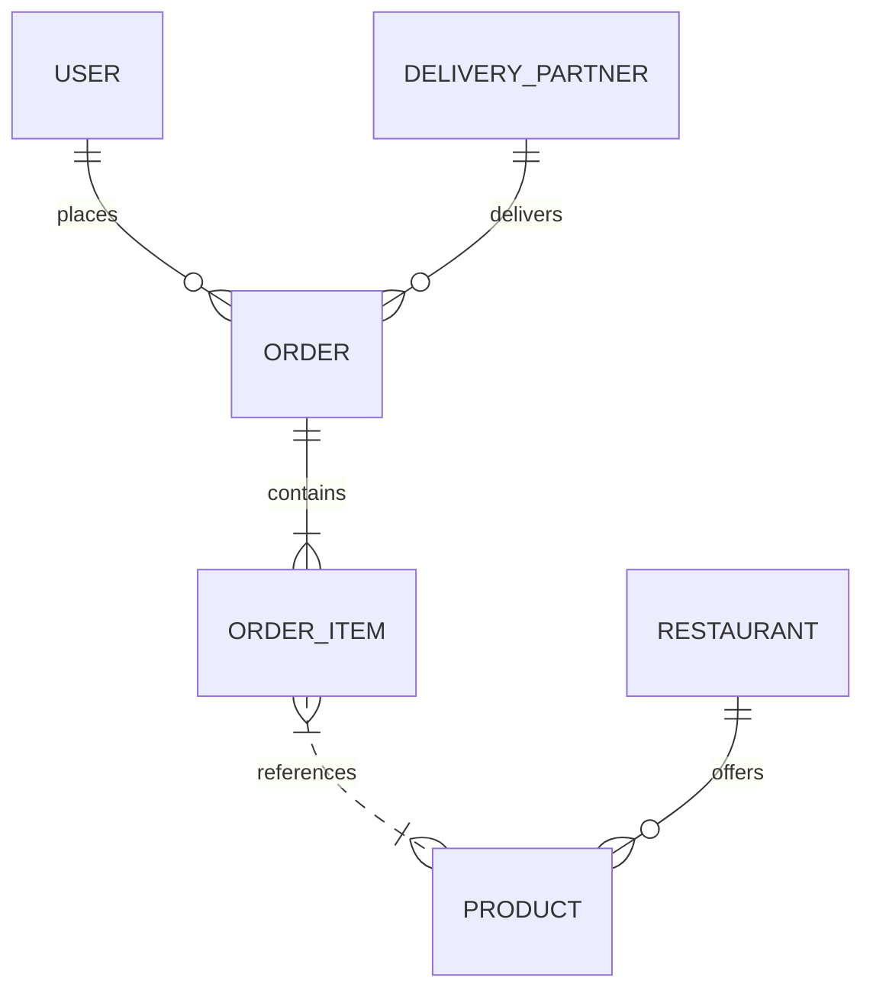
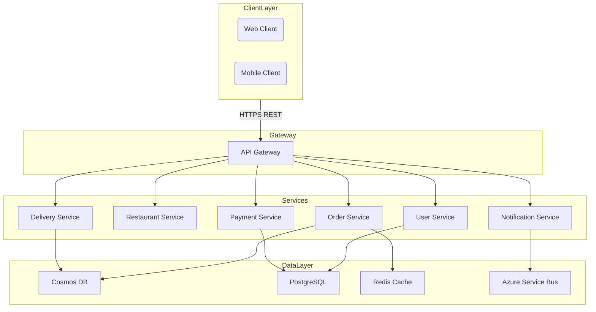
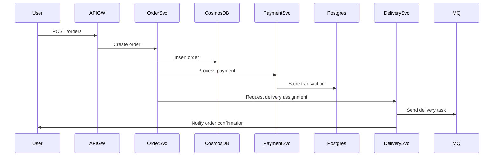

# Swiggy/Zomato System Design Document

---

## 1. System Overview

- Swiggy/Zomato is a hyper-local food delivery platform connecting consumers, restaurants, and delivery agents.
- Core problem: Efficiently matching food orders to nearby kitchens and delivery partners with real-time updates and high availability.
- Challenges: Low latency ordering, dynamic delivery routing, scale to millions of concurrent orders, and complex payment integrations.

---

## 2. Requirements Analysis

### Functional Requirements (FRs)
- User registration, login, and profile management
- Restaurant listing with menus, real-time availability
- Order placement, tracking, and status updates
- Delivery partner assignment and live location tracking
- Payment processing and invoicing
- Ratings & reviews for restaurants and delivery
- Notifications (order status, promotions)

### Non-Functional Requirements (NFRs)
- CAP Positioning: AP (Availability & Partition Tolerance) prioritized with careful consistency on payments (CP for critical data).
- SLAs: P99 order placement latency < 200ms; system uptime 99.95%; delivery tracking update frequency within 5 seconds.
- Scale Estimates: DAU ~10M, peak QPS ~50K (80% read-heavy), data > USD 500TB annually.
- Trade-offs: Eventual consistency on order status allowed; strict consistency on payments and user profiles.

---

## 3. Capacity Planning & Back-of-Envelope Calculations

- DAU = 10M users; peak QPS = 50K requests/sec (80% reads = 40K RPS, 20% writes = 10K WPS)
- Average order ~1min from placement to cook preparation start; orders/day ~5M
- Storage:
  - Hot data: active orders and live locations (5 TB)
  - Cold data: historical orders, analytics (500 TB/year)
- Bandwidth:
  - Live location update ~10KB per update, 1 update every 5s per delivery partner, ~100K active partners => ~200 Mbps
- Compute:
  - Microservices on AKS with auto-scale; use Azure Functions for event-driven tasks.
- Cost:
  - Azure Cosmos DB for scale; estimated $100K/month storage and RUs
---

## 4. Data Model



- Database: CosmosDB for operational data (NoSQL, global distribution); PostgreSQL for relational data like payments
- Partitioning: OrderId partition key with time-range sharding; Geography-based partitioning for restaurants
- Indexing: Composite indexes on userId + orderStatus; geospatial indexes for delivery location queries

---

## 5. API Design

- RESTful APIs chosen for wide compatibility and statelessness

| API Endpoint              | Method | Description                     | Request Body                      | Response                         | Error Codes       |
|---------------------------|--------|---------------------------------|----------------------------------|---------------------------------|-------------------|
| /users                    | POST   | Register new user               | {name, email, password}           | {userId, token}                  | 400, 409          |
| /restaurants              | GET    | List nearby restaurants         | {location, cuisine}               | [{restaurantId, name, ...}]      | 400               |
| /orders                   | POST   | Place new order                | {userId, items, paymentMethod}    | {orderId, status}                | 400, 402, 409     |
| /orders/{orderId}         | GET    | Get order status               | -                                | {status, deliveryPartner, eta}  | 404               |
| /delivery/assign          | POST   | Assign delivery partner        | {orderId, location}               | {partnerId, eta}                 | 404, 409          |
| /payments/process         | POST   | Process payment                | {orderId, paymentDetails}         | {paymentStatus}                  | 402, 500          |
| /notifications/subscribe  | POST   | Subscribe to order notifications | {userId, orderId}                | {subscriptionId}                 | 400               |

- Auth: OAuth2 with token-based authentication
- Rate Limits: 1000 RPS/user; global throttling for spikes

---

## 6. High-Level Architecture (HLD)



- Sequence diagram for order placement:



---

## 7. Microservices Decomposition

| Service Name      | Responsibility                        | Communication Pattern  |
|-------------------|-------------------------------------|-----------------------|
| User Service      | User management and authentication  | Sync REST              |
| Restaurant Service | Menu, availability                   | Sync REST              |
| Order Service     | Order lifecycle management          | Sync+Async (event bus) |
| Delivery Service  | Delivery partner management          | Async (message queue)  |
| Payment Service   | Payment processing and reconciliation| Sync REST              |
| Notification Service | Push notifications and alerts     | Async (event-driven)   |

- Services follow Domain-Driven Design (DDD) boundaries around user, order, delivery, payment contexts
- Service discovery via Kubernetes DNS + API Gateway routing
- Justification: Decouples domains to scale independently and isolate failures

---

## 8. Deep Dives

### Distributed Transactions & Saga Pattern

- Order placement spans Order, Payment, Delivery services
- Implement Saga with orchestration pattern:
```python
# Pseudocode for saga orchestration
class OrderSaga:
    def run(order):
        try:
            payment_result = payment_service.charge(order)
            if not payment_result.success:
                raise Exception("Payment failed")
            delivery_result = delivery_service.assign(order)
            if not delivery_result.success:
                raise Exception("Delivery assignment failed")
            order_service.confirm(order)
        except Exception as e:
            order_service.compensate(order)
```
- Compensating transactions rollback previous steps on failure
- Relax strict ACID, favor eventual consistency

### Real-time Updates (WebSockets)

- Clients receive live order and delivery status
- Use Azure SignalR Service for scalable WebSocket management
- Push GPS updates from delivery partners every 5 seconds

### Search Implementation

- Use Azure Cognitive Search for restaurant and dish search
- Indexed by cuisine, ratings, location with geospatial queries

---

## 9. Infrastructure & DevOps

- Azure Kubernetes Service (AKS) to host microservices
- Azure Cosmos DB for NoSQL operational storage
- Azure PostgreSQL for relational data
- Azure SignalR for real-time communication
- Azure Service Bus for asynchronous messaging
- Application Insights & Azure Monitor for telemetry
- CI/CD: GitHub Actions with Infrastructure as Code via Terraform
- Deployment: Canary release with automated rollback

---

## 10. Cross-Cutting Concerns

- **Security:** Azure AD OAuth2, RBAC, Key Vault for secrets, TLS everywhere
- **Observability:** Azure Monitor metrics, App Insights tracing, centralized logs with ELK stack
- **Resilience:** Circuit breakers (Polly), retries with exponential backoff, bulkheads
- **Performance:** Redis caching, CDN for static content, DB query tuning

---

## 11. Scalability & Reliability

- Horizontal scaling with AKS pod autoscaling
- Cosmos DB global distribution with multi-region failover
- CQRS pattern for separating reads/writes in orders
- Azure Service Bus to buffer delivery events
- Backup strategy with daily snapshots, RTO < 1 hour
- L7 Load balancing at API gateway (Azure Front Door)

---

## 12. Trade-offs & Alternatives

| Decision               | Pros                                       | Cons                              |
|------------------------|--------------------------------------------|----------------------------------|
| CosmosDB over SQL      | Global distribution, scalability          | Eventual consistency complexity  |
| Microservices over Monolith | Independent scaling, fault isolation | Operational complexity            |
| REST vs gRPC          | Simpler clients, cacheable HTTP semantics  | gRPC better for internal comms   |

- At 100x scale, consider event sourcing and CQRS
- Could trade some eventual consistency for stronger guarantees in critical paths

---

## 13. Interview Discussion Points

- How to handle order surge during festival sales?
- Trade-offs between consistency and availability in payment processing?
- Extending to new cities: data locality and latency considerations
- Mitigating cold start times for real-time delivery tracking
- Handling partial failures in saga orchestration
