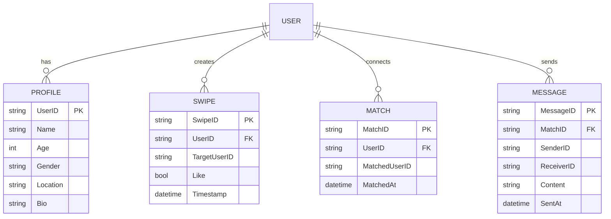
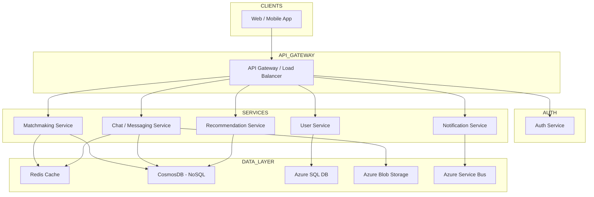

# 🎯 Dating App (Tinder) System Design Document

---

## 1. System Overview
- **Executive Summary:** A cloud-native, scalable dating platform facilitating real-time discovery, matching, and chatting based on user preferences and proximity.
- **Problem & Scope:** Design for massive-scale user matching and messaging, enabling swipe-based UI, geo-location filtering; excludes payment, advanced analytics, or advertising modules.
- **Key Challenges:** Low-latency real-time swiping and messaging, geo-distributed users, personalized recommendations, strong privacy and security compliance.

## 2. Requirements Analysis
### Functional Requirements (FRs)
- User registration, authentication, and profile management
- Swipe (like/dislike) operated matching algorithm
- Real-time chat with message notifications
- Location-based user recommendations
- Undo last swipe, view match history

### Non-Functional Requirements (NFRs)
- **CAP Theorem:** Prioritize Availability & Partition Tolerance; allow eventual consistency on match state to handle geo-distribution and network splits.
- **SLAs:** P99 latency < 200ms for UI responses; 99.95% uptime.
- **Scale Estimates:**
  - DAU: 10 million
  - QPS: 100,000 reads / 10,000 writes (9:1 read/write ratio)
  - Data Volume: ~1PB/year from profiles, matches, chat messages
- **Consistency vs Availability:** Strong consistency for user authentication/profile; eventual consistency for match status and swipe data.

## 3. Capacity Planning & Back-of-Envelope Calculations
- **Traffic Estimates:**
  - 10M DAU × 10 swipes/day = 100M swipes daily
  - Peak QPS: ~10k writes (swipes/messages), 100k reads (profiles, matches)
  - Growth: 5% monthly compounding expected over next 2 years
- **Storage:**
  - Hot data: user profiles, matches (~100GB daily)
  - Cold data: chat history archived in Blob storage
- **Bandwidth:** Estimated peak ~50MB/s inbound/outbound for messaging and media
- **Compute:** 1000+ cores for ML recommendations, matching logic
- **Cost Implications:** Use Azure CosmosDB for globally distributed data, AKS for compute, Redis for caching, Azure Service Bus for messaging, Blob Storage for chat and media

## 4. Data Model
- **Core Entities & Relationships (ER Diagram):**



- **Database Choice:**
  - CosmosDB (NoSQL) for swipes, matches, messages – horizontal scalability, geo-replication
  - PostgreSQL or Azure SQL DB for user profiles requiring strong consistency
- **Partitioning:** Shard by UserID for user-centric queries; consistent hashing to distribute load
- **Indexing:** Index on UserID, Timestamp, Location (geoindex/spatial indexes) for fast fetch & filtering
- **Trade-offs:** NoSQL offers scalable writes & geo-distribution but eventual consistency; SQL units for relational queries (profile updates)

## 5. API Design
- Use REST over HTTPS for standard client compatibility and caching
- **Main endpoints:**
  - `POST /auth/login` – User login with OAuth2 JWT tokens
  - `GET /profile/{userId}` – Fetch user profile
  - `POST /swipe` – Submit a swipe action
  - `GET /matches` – List user matches
  - `POST /message` – Send chat message
  - `POST /undo-swipe` – Undo last swipe
- **Error Handling:** Standard HTTP codes (e.g., 401 Unauthorized, 429 Too Many Requests)
- **Rate Limiting:** Token bucket per user/IP; throttle via API gateway
- **Auth:** OAuth 2.0 Bearer tokens with Azure AD integration

## 6. High-Level Architecture



- **Request flows:**
  - User Login: Client → API Gateway → Auth Service → SQL DB → JWT Token
  - Swipe Action: Client → API Gateway → Match Service → CosmosDB + Redis Cache
  - Chat Message: Client → API Gateway → Chat Service → CosmosDB + Blob Storage + Notifications

## 7. Microservices Decomposition
- **User Service:** Handles auth, user profiles
- **Match Service:** Processes swipes, calculates and stores matches
- **Chat Service:** Manages messaging, media, real-time updates
- **Notification Service:** Push notifications, using Azure Service Bus
- **Recommendation Service:** ML-based user suggestions
- **Communication:** Mostly RESTful sync calls; async via Service Bus for notifications
- **Service Discovery:** Azure Kubernetes Service (AKS) native DNS-based service discovery
- **Bounded Contexts:** Separate user identity, matching logic, and messaging for scalability and independent deployments

## 8. Deep Dives
### Real-time Updates with SignalR
```typescript
// Server-side simplified SignalR hub example
import { HubConnectionBuilder } from '@microsoft/signalr';

const connection = new HubConnectionBuilder()
  .withUrl("/chatHub")
  .build();

connection.on("ReceiveMessage", (user, message) => {
  console.log(`${user}: ${message}`);
});

connection.start().catch(err => console.error(err));
```
- Supports bi-directional real-time messaging.
- Scales with Azure SignalR Service.

### Rate Limiting with Token Bucket
```python
class TokenBucket:
    def __init__(self, capacity, refill_rate):
        self.capacity = capacity
        self.tokens = capacity
        self.refill_rate = refill_rate
        self.last_checked = time.time()

    def allow(self, tokens=1):
        now = time.time()
        elapsed = now - self.last_checked
        self.tokens = min(self.capacity, self.tokens + elapsed * self.refill_rate)
        self.last_checked = now
        if self.tokens >= tokens:
            self.tokens -= tokens
            return True
        return False
```
- Prevents API abuse; ensures smooth user experience.

### Search via Azure Cognitive Search
- Geo-spatial filtering, full-text search on profiles.
- Scales independently from primary DB.

## 9. Infrastructure & DevOps
- AKS for container orchestration
- Azure CosmosDB for NoSQL globally distributed DB
- Azure Service Bus for async messaging
- Azure Blob Storage for media/files
- CI/CD pipelines using GitHub Actions & Terraform for IaC
- Blue-green deployments with AKS for zero downtime

## 10. Cross-Cutting Concerns
- **Security:** Azure AD OAuth 2.0, RBAC, TLS everywhere, Key Vault for secrets
- **Observability:** Azure Monitor, Application Insights with distributed tracing
- **Resilience:** Circuit breakers via Polly library, retries with exponential backoff
- **Performance:** Multi-tier Redis caching, CDN for static content, query optimization

## 11. Scalability & Reliability
- Use AKS horizontal auto-scaling on CPU/mem and KEDA event-driven scaling
- CosmosDB read replicas with consistent prefix reads; CQRS pattern for heavy read workloads
- Azure Service Bus queues for decoupling and throttling
- Disaster Recovery: Geo-replicated backups, 1-hour RTO
- Multi-region active-active with traffic manager for failover
- Layer 7 load balancing with API Gateway for request routing

## 12. Trade-offs & Alternatives
| Decision | Pros | Cons |
| -------- | ---- | ---- |
| CosmosDB for swipes/messages | Global scale, low latency | Eventual consistency complexity |
| SQL for profiles | Strong consistency | Less scalable for huge writes |
| Microservices | Independent deploy & scale | Increased complexity |
| Real-time SignalR | Responsive UX | Additional infrastructure cost |

- At 10x scale, consider sharding matches by region for locality
- Build vs Buy: leverage Azure SignalR instead of building WebSocket stack

## 13. Interview Discussion Points
- Improving matching algorithms with ML personalization
- Handling abusive users and moderation
- Scaling chat for millions of concurrent users
- Data privacy and GDPR compliance
- Monitoring and incident response strategies

---

> [!tip] This document balances concise, clear architecture with practical trade-offs typical of large scale distributed systems, with strong Azure-native integration.
