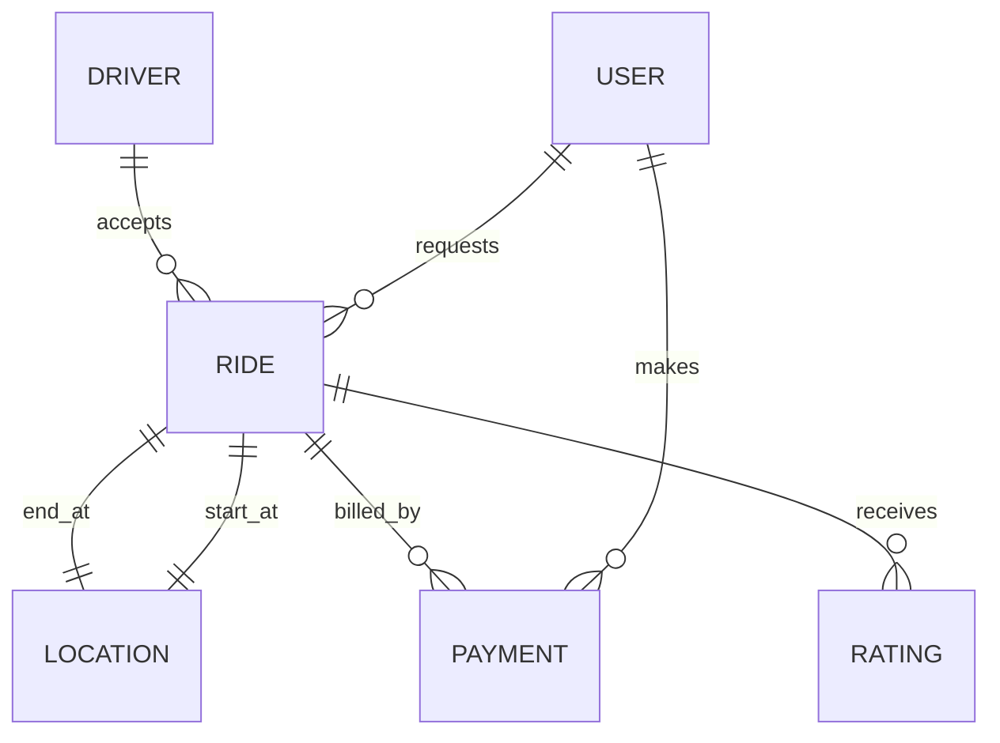
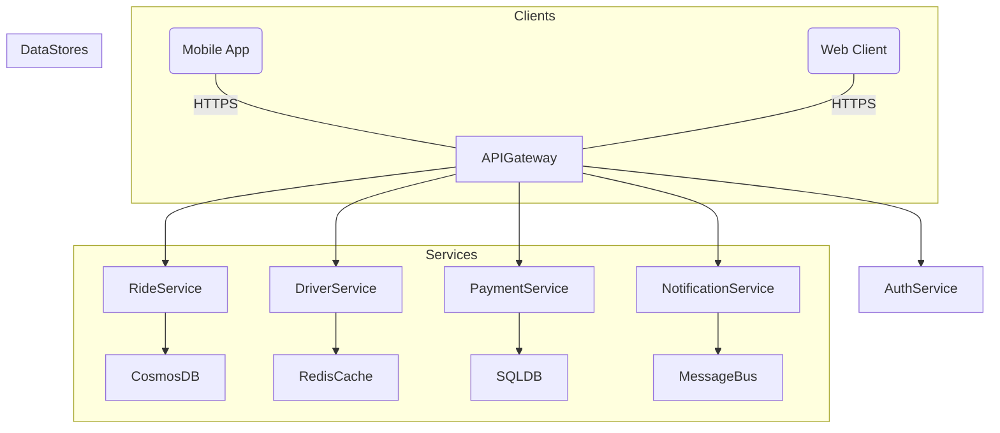
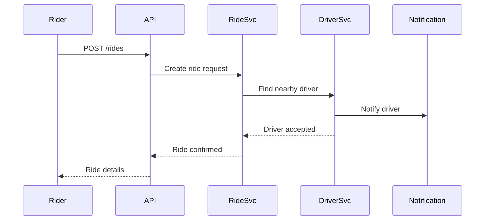

# Uber/Lyft System Design - Senior Engineer Interview

---

## 1. System Overview 🎯

- Ride-hailing platform connecting riders with drivers in real-time, optimizing transportation at city scale.
- Core scope: matching, ride lifecycle management, payment, and real-time tracking; excludes advanced features like autonomous vehicles or food delivery.
- Challenges: low-latency real-time matching, high availability, location accuracy, surge pricing, and handling geographic scale.

---

## 2. Requirements Analysis 📊

### Functional Requirements (FRs)
- User registration, profile & authentication
- Real-time ride request & driver matching
- Ride tracking and status updates
- Fare calculation & surge pricing
- Payment processing & receipts
- Ratings & feedback
- Trip history & support

### Non-Functional Requirements (NFRs)
- **CAP Positioning:** Prioritize availability and partition tolerance (AP) with eventual consistency for non-critical data (ratings, trip history), strong consistency for payments.
- **SLAs:** P99 latency < 200ms for match, 99.95% uptime, payment success > 99.9%
- **Scale Estimates:** 
  - DAU ~10M
  - Peak QPS ~50K (read:write ratio ~4:1)
  - Data volume: ~10 PB/year (rides, logs, telemetry)
- **Consistency vs Availability:** For ride matching and state transitions, prefer availability with eventual consistency to maintain responsiveness.

---

## 3. Capacity Planning & Back-of-Envelope Calculations 🔧

- Ride requests per day: 10M users * 2 rides avg = 20M
- Peak QPS approx:
  - Writes (ride requests, updates): ~12.5K QPS
  - Reads (status, tracking, fare calc): ~50K QPS
- Storage:
  - Hot data (active rides & recent trips): 500GB - SSD
  - Cold data (historical rides): multi-PB on Azure Blob Storage
- Bandwidth: Real-time GPS updates (~1KB per update per driver every 5 sec)
- Use Azure CosmosDB for global low latency & Redis cache for hot data
- Estimated cloud cost ~$2-3M annually at scale

---

## 4. Data Model 🔍



- Core entities: User, Driver, Ride, Location, Payment, Rating
- Database: CosmosDB for global distribution & multi-model support (document/key-value + graph)
- Schema snippet: CosmosDB JSON with partition key as `userId` or `rideId`

```json
{
  "rideId": "uuid",
  "userId": "uuid",
  "driverId": "uuid",
  "startLocation": {"lat": 12.9716, "lng": 77.5946},
  "endLocation": {"lat": 12.9352, "lng": 77.6245},
  "status": "active",
  "fare": 250,
  "timestamp": "2025-10-05T04:00:00Z"
}
```

- Trade-offs:
  - CosmosDB offers multi-region writes for availability but requires careful partition choice to avoid hotspots.
  - Strong consistency is challenging globally; design uses session consistency where applicable.
  - SQL DB can be considered for payments for ACID compliance.

---

## 5. API Design 🚦

- Protocol: REST over HTTPS for simplicity and broad support

| API Endpoint             | Method | Request                          | Response                           | Notes                        |
|--------------------------|--------|---------------------------------|----------------------------------|------------------------------|
| POST /rides              | POST   | {userId, startLocation, endLocation, paymentMethod} | {rideId, estimatedFare, driverInfo} | Rate-limited, auth required   |
| GET /rides/{rideId}      | GET    | N/A                             | Ride status & location            | P99 < 200ms latency           |
| POST /rides/{rideId}/cancel | POST | N/A                             | Success/failure                  | Cancellation policies         |
| GET /drivers/nearby     | GET    | {location, radius}               | List of available drivers         | Geo-indexed query             |
| POST /payments           | POST   | {rideId, paymentMethod}          | Payment confirmation              | Secure, PCI compliant         |
| POST /users/{userId}/rating | POST | {rideId, rating, comments}       | Success                         | Idempotent                   |

- Auth: OAuth2 with JWT tokens
- Rate limiting per user and per IP
- Errors: Standard HTTP 4xx, 5xx codes with JSON error response

---

## 6. High-Level Architecture (HLD) 🏗️



- Request flow example: Rider requests ride → API Gateway → Ride Service → Driver matching → Notification → Ride status updates via WebSocket



---

## 7. Microservices Decomposition 🛠️

| Service          | Responsibility                       | Communication Pattern  |
|------------------|------------------------------------|-----------------------|
| AuthService      | User authentication and token mgmt | Sync (JWT/OAuth)       |
| RideService      | Ride lifecycle and matching         | Async + Sync           |
| DriverService    | Driver location & status mgmt       | Async + Pub/Sub        |
| PaymentService   | Payments and billing                 | Sync (ACID focus)      |
| NotificationSvc  | Real-time notifications              | Async (Event-driven)   |
| ReportingService | Analytics and trip history           | Async batch processing |

- Uses service mesh (e.g., Istio) for communication, security, and observability
- Service boundaries chosen based on domain-driven design (DDD) bounded contexts

---

## 8. Deep Dives 🔍

### Real-time Updates (WebSockets + Redis Streams)

- WebSocket connections via NotificationService for realtime ride status and driver location
- Redis Streams buffer events and scale out notifications

```typescript
// TypeScript snippet: WebSocket event broadcast
function broadcastRideUpdate(rideId, update) {
  redisClient.xadd('ride_updates', '*', 'rideId', rideId, 'update', JSON.stringify(update));
}
```

- Offers low latency, bidirectional communication critical for user experience

### Distributed Saga Pattern for Payments

- Saga orchestrator coordinates ride and payment transactions
- Uses compensating transactions if payment fails after ride completion

```python
# Pseudocode for saga compensation
try:
    completeRide(rideId)
    processPayment(paymentDetails)
except PaymentFailure:
    cancelRide(rideId)
    refundIfAny(paymentDetails)
```

### Caching and Cache Invalidation

- Redis cache stores hot data: driver locations, active rides
- TTL and versioning for cache invalidation
- Cache aside pattern to reduce DB load

---

## 9. Infrastructure & DevOps 🔧

- Kubernetes on Azure AKS for container orchestration
- Azure CosmosDB for multi-region DB
- Azure Redis Cache for caching
- Azure Service Bus for messaging and eventing
- Azure Application Insights for monitoring/tracing
- Terraform for IaC
- GitHub Actions for CI/CD
- Blue-green deployments with Azure DevOps

---

## 10. Cross-Cutting Concerns 🛡️

- **Security:** Azure AD B2C for auth, OAuth2/JWT, RBAC, Key Vault for secrets
- **Observability:** App Insights with OpenTelemetry, alerts on SLA breaches
- **Resilience:** Circuit breakers (Polly library), retries with exponential backoff, bulkhead isolation
- **Performance:** Multi-tier Redis cache, Azure CDN for static assets, connection pooling

---

## 11. Scalability & Reliability 📈

- Auto-scaling AKS pods based on CPU/memory and custom metrics
- CosmosDB read replicas & multi-master writes for geo-distribution
- Azure Service Bus for decoupling and buffering spikes
- Multi-region failover with RTO < 5 mins
- L4/L7 load balancers for traffic distribution

---

## 12. Trade-offs & Alternatives ⚖️

| Decision                 | Pros                                 | Cons                                  |
|--------------------------|--------------------------------------|---------------------------------------|
| CosmosDB vs SQL DB       | Global distribution, multi-model     | Potential eventual consistency issues |
| Microservices vs Monolith| Scalability, independent deploys     | Operational complexity                 |
| WebSocket vs Polling     | Low latency, real-time  updates      | More complex infrastructure           |
| Azure vs AWS             | Azure-integrated, hybrid support     | AWS alternatives sometimes preferred  |

- At 10x scale, consider CQRS for write/read separation and better cache strategies
- Build vs buy: leverage existing Azure services to reduce build complexity

---

## 13. Interview Discussion Points 💬

- How to handle surge pricing fairness?
- Fault tolerance during network partitions?
- Strategies for driver and rider fraud detection?
- Improving latency for remote areas?
- Potential bottlenecks in ride matching?
- Handling multi-tenant/global expansion

---
