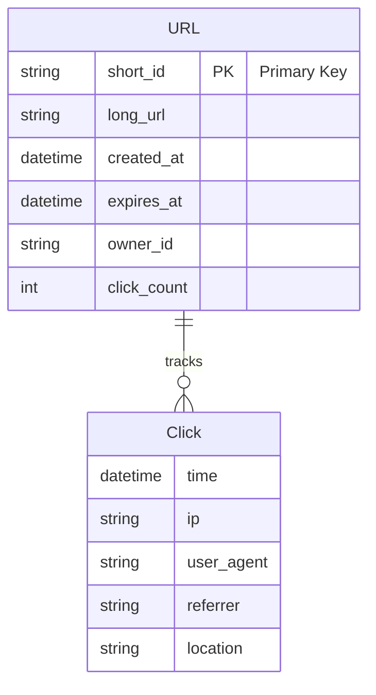
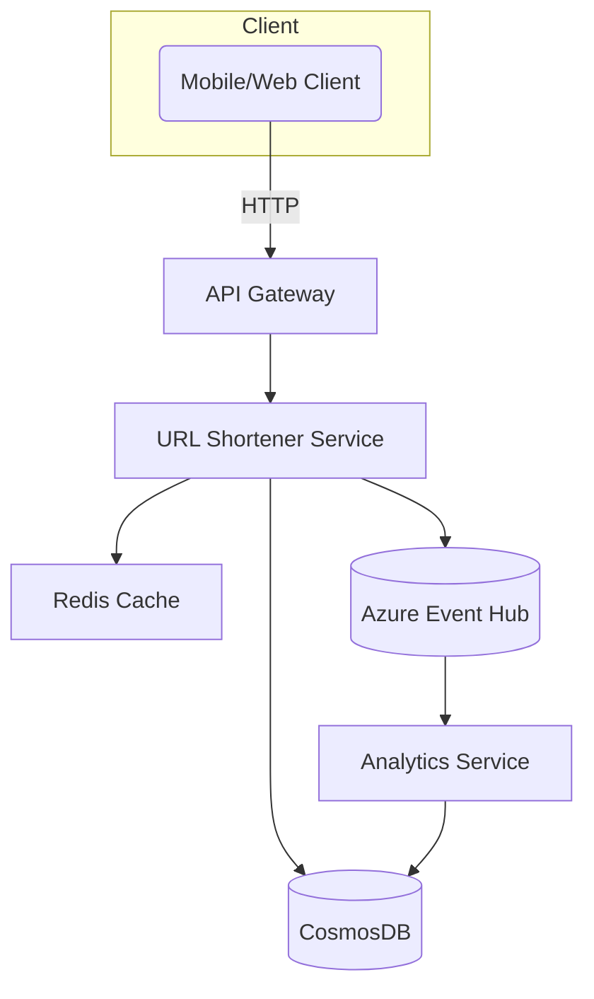

# URL Shortener Service - System Design Document

---

## 1. System Overview

- Generates compact aliases for long URLs enabling easy sharing and tracking.
- Core problem: Efficiently map short URLs to original URLs at large scale with high availability and low latency.
- Challenges: collision-free ID generation, handling write-heavy patterns, fast redirection, scalable storage, abuse prevention.

---

## 2. Requirements Analysis

### Functional Requirements (FRs)
- Create unique short URL from a long URL.
- Redirect short URL to original long URL.
- Provide usage analytics (clicks, referrers).
- Support URL expiry and deletion.
- User authentication and URL management.

### Non-Functional Requirements (NFRs)
- CAP Theorem: Prioritize Consistency and Partition tolerance (CP) for redirect correctness; Eventual consistency permitted for analytics (AP).
- SLA: 99.95% uptime; P99 redirect latency < 100ms.
- Scale: 10M DAU, ~100K QPS with ~90:10 read-to-write ratio.
- Data Volume: Store ~1 billion URLs initially, growing daily.
- Consistency vs Availability: Strong consistency for redirect path; metrics can tolerate eventual consistency.

---

## 3. Capacity Planning & Back-of-Envelope Calculations

- Writes/day = 10K QPS * 86400 = 864M writes/day.
- Reads/day = 90K QPS * 86400 = ~7.7B reads/day.
- Avg record size ~ 500 bytes  Daily data growth ~ 432GB.
- Hot data cached in Redis; cold data on CosmosDB partitioned by short_id.
- Bandwidth optimized via CDN for redirection.
- Cost focus: Azure CosmosDB, Azure Redis Cache, AKS compute, Network egress.

---

## 4. Data Model



- DB choice: Azure CosmosDB for global scale, low-latency reads, and automatic partitioning.
- Partition key: short_id, offering efficient key-value access.
- Index short_id (primary) and owner_id (for user URLs).
- Trade-off: No strong consistency for click data reduces load; strong consistency needed for URL mapping.

---

## 5. API Design

- REST chosen for broad client compatibility.

| API               | Method | Path                   | Description                  |
|-------------------|--------|------------------------|------------------------------|
| Create Short URL   | POST   | /urls                  | Request: long_url, TTL, auth |
| Retrieve Long URL  | GET    | /urls/{short_id}       | Redirect to long URL         |
| URL Analytics     | GET    | /urls/{short_id}/stats | Return click analytics       |
| Delete URL        | DELETE | /urls/{short_id}       | Auth-required deletion       |
| User Login        | POST   | /auth/login            | Returns auth token           |

- Status codes: 201, 200, 404, 401, 429.
- Rate limiting: Per API key via Azure API Management.

---

## 6. High-Level Architecture (HLD)


- Key flows: Client  API Gateway  URL Service.
- URL retrieval served from Redis cache or CosmosDB fallback.
- URL writes trigger async analytics events.
- Analytics service processes click events granularly.

---

## 7. Microservices Decomposition

| Service          | Responsibility                               |
|------------------|----------------------------------------------|
| URL Shortener    | Generate and resolve short URLs               |
| Analytics        | Process, aggregate click and usage data      |
| Auth Service     | Authenticate and authorize users              |

- Sync calls for CRUD and retrieval.
- Async events via Event Hub for analytics.
- Service discovery with AKS DNS or Azure Service Fabric.

---

## 8. Deep Dives


<summary>Caching Strategies and Invalidation</summary>

- Redis used as a hot cache for short_id  long_url.
- TTL synchronized with URL expiration.
- Cache miss fallback to CosmosDB.

```python
key = f"url:{short_id}"
url = redis.get(key)
if not url:
    url = db.get_url(short_id)
    if url:
        redis.set(key, url, ttl=expiry)
return url
```


<summary>Rate Limiting and Throttling</summary>

- Implemented using Azure API Management with token bucket algorithm.
- Handles burst and steady-state limits per user/IP.

```typescript
class TokenBucket {
  tokens = capacity;
  lastRefill = Date.now();
  refillRate = tokensPerSecond;

  consume() {
    this.refill();
    if (this.tokens > 0) {
      this.tokens--;
      return true;
    }
    return false;
  }
  refill() {
    const now = Date.now();
    const elapsed = (now - this.lastRefill) / 1000;
    this.tokens = Math.min(this.tokens + elapsed * this.refillRate, capacity);
    this.lastRefill = now;
  }
}
```


---

## 9. Infrastructure & DevOps

- Azure Kubernetes Service (AKS) for microservices hosting.
- CosmosDB globally distributed database.
- Azure Redis Cache for low-latency hot data.
- Azure Event Hub for event streaming.
- Azure API Management for security and rate limiting.
- Application Insights for observability and tracing.
- Terraform for infrastructure as code.
- Blue-green or canary deployments for zero downtime.

---

## 10. Cross-Cutting Concerns

- Security: Azure AD OAuth2 authentication, RBAC, TLS encryption, Key Vault for secrets.
- Observability: Azure Monitor Metrics, App Insights tracing, centralized logs.
- Resilience: Circuit breakers, retries with backoff, bulkheads.
- Performance: Multi-tier caching, CDN for static redirect paths, connection pooling.

---

## 11. Scalability & Reliability

- AKS with KEDA auto-scaling on CPU/memory/queue length.
- CosmosDB multi-region replicas with read region routing.
- CQRS: Reads optimized via caching; writes handled with strong consistency.
- Disaster recovery with geo-replication and backups (RTO < 5min).
- Load balancing via Azure Front Door (L7) and internal ILB (L4).

---

## 12. Trade-offs & Alternatives

| Decision             | Pros                      | Cons                         |
|----------------------|---------------------------|------------------------------|
| CosmosDB vs PostgreSQL| Elastic scale & low latency| Higher cost, complexity       |
| REST vs gRPC         | Simplicity & compatibility | gRPC faster but less browser-friendly |
| Microservices vs Monolith | Scalability & team velocity | Operational overhead          |
| Cache vs DB hit      | Faster reads               | Potential stale data issues   |

---

## 13. Interview Discussion Points

- How to prevent short ID collisions?
- Strategies for URL expiration and cleanup.
- Abuse detection (spam, bots, phishing).
- Analytical data consistency and reporting.
- Feature extensions: vanity/custom URLs, QR code integration.
- Handling 10x/100x growth: database sharding, cache partitioning.

> [!tip]
> Focus interview discussion on practical trade-offs, bottlenecks, and debugging strategies for 3 AM incidents.

---
