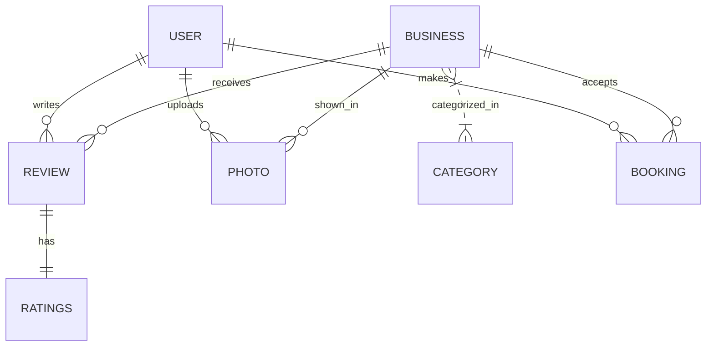
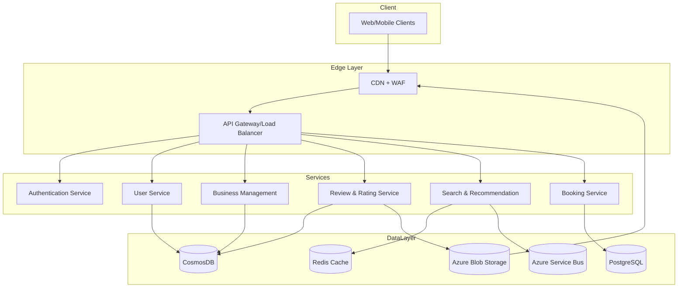

# Yelp/Tripadvisor System Design

---

## 1. System Overview

- **Executive summary:** Yelp/Tripadvisor is a large-scale review and recommendation platform for local businesses, restaurants, and travel destinations. It enables users to discover, review, and book experiences backed by community-generated content.
- **Core problem:** Build a scalable, highly available platform that delivers personalized, real-time local business and travel recommendations with user-generated reviews and bookings.
- **Scope boundaries:** User reviews, search and discovery, personalized recommendations, booking integration, and social/community features.
- **Key challenges:** Handling high read/write traffic, real-time updates, relevance and personalization at scale, eventual consistency trade-offs, and multi-geo deployments.

---

## 2. Requirements Analysis

### Functional Requirements (FRs)
- User registration, profiles, and authentication
- Business listing and catalog management
- Reviews and ratings submission, moderation
- Search and discovery with filters (location, category, rating)
- Booking/reservation integration with third-party APIs
- Personalized recommendations
- Social features: user follow, comments, photos

### Non-Functional Requirements (NFRs)
- **CAP Positioning:** AP (Availability & Partition tolerance) for user-generated content with eventual consistency in review propagation; CP (Consistency & Partition tolerance) for booking transactions.
- **SLAs:** P99 latency < 200ms on reads, 500ms on writes; 99.95% uptime
- **Scale estimates:**
  - DAU: ~10M users
  - Peak QPS: ~50K reads, 5K writes
  - Read/Write ratio: 10:1
  - Data volume: ~1PB mostly warm data (reviews, photos)
- Consistency prioritized for booking, availability prioritized for reviews/search

---

## 3. Capacity Planning & Back-of-Envelope Calculations

- Traffic: 10M DAU with avg 5 actions/day = 50M actions/day ~ 600K RPS peak (distributed globally)
- Storage: 100M businesses, 1B reviews, 10B photos (hot/cold split)
- Bandwidth: Avg photo 500KB, 10B photos ~5PB storage, CDN caching critical
- Compute: Autoscale API servers with AKS, Search clusters with elastisearch
- Cost: CosmosDB for multi-region writes ($), Blob Storage + CDN for media cost-efficient

---

## 4. Data Model



- Database: CosmosDB for scalability, global distribution; PostgreSQL for relational transactional data (booking)
- Partitioning: Hash by business_id for reviews/photos; range by timestamp for logs
- Indexing: GSI on user_id, business_id for reviews; text index on business name/category

---

## 5. API Design

- Protocol: RESTful APIs for simplicity, widespread use, and statelessness
- Critical APIs:
  - `POST /users` - register user
  - `GET /businesses/{id}` - get business details
  - `POST /reviews` - submit review
  - `GET /search` - filter/search businesses
  - `POST /bookings` - book a reservation
  - `GET /users/{id}/recommendations` - personalized suggestions

- Error handling: Standard HTTP codes, 429 for rate limit, 401 for auth failure
- Auth: OAuth 2.0 with JWT tokens
- Rate limiting: Per user/IP with tiered quotas

---

## 6. High-Level Architecture (HLD)



- Request flow: Client -> CDN -> API Gateway -> appropriate microservice -> data store
- Messaging for async events like review moderation, notifications

---

## 7. Microservices Decomposition

| Service          | Responsibility                            |
|------------------|------------------------------------------|
| AuthService      | User authentication, token management    |
| UserService      | User profiles and preferences             |
| BusinessService  | CRUD for business listings                 |
| ReviewService    | Managing reviews, ratings, photos          |
| SearchService    | Search indexing, query processing          |
| BookingService   | Reservation transactions and availability |

- Communication: Mostly synchronous REST; async via message bus for events
- Service discovery via Azure Kubernetes Service (AKS) and service mesh
- Bounded contexts split by domain (user, business, review, booking)

---

## 8. Deep Dives

### Search Implementation
- Azure Cognitive Search with custom scoring profiles
- Near real-time indexing via Change Feed from CosmosDB
- Query optimization by caching popular filters

### Notification System Architecture
- Event-driven via Azure Service Bus
- Fanout via SignalR for real-time user notifications
- Retry and dead-letter queue for reliability

### Caching Strategy
- Redis for hot data caching (business details, popular reviews)
- Cache invalidation on updates with TTL and pub/sub

```python
# Simple Redis cache get/set with expiration
import redis

cache = redis.Redis(host='redis-host', port=6379)

def get_cache(key):
    return cache.get(key)

def set_cache(key, value, expiry=300):
    cache.set(key, value, ex=expiry)
```

---

## 9. Infrastructure & DevOps

- AKS for container orchestration
- Azure CosmosDB for globally distributed NoSQL
- Azure Blob Storage + CDN for media
- Azure Service Bus for async messaging
- Azure Application Insights, Monitor for observability
- CI/CD with Azure DevOps or GitHub Actions
- Terraform for infra as code
- Blue-green deployment via AKS and App Gateway

---

## 10. Cross-Cutting Concerns

### Security
- OAuth2 with Azure AD
- RBAC for service authorization
- Encryption at rest (TDE) and in transit (TLS)
- Azure Key Vault for secrets management

### Observability
- App Insights for tracing, logging, metrics
- Distributed tracing with OpenTelemetry
- Alerts on SLAs and errors

### Resilience
- Circuit breakers with Polly
- Exponential backoff retries
- Bulkheads in microservices
- Chaos testing via Azure Chaos Studio

### Performance
- Redis caching and CDN usage
- DB query optimization and connection pooling
- Lazy loading for heavy UI data

---

## 11. Scalability & Reliability

- Auto-scaling in AKS based on CPU/memory/QPS
- Read replicas and CQRS for scaling reads
- Message queues for write buffering
- Multi-region active-active deployment
- Backup/restore with RTO < 30min, RPO < 5min
- L4 Load balancing with Azure Front Door, L7 with API Gateway

---

## 12. Trade-offs & Alternatives

| Decision          | Pros                                    | Cons                                  |
|-------------------|----------------------------------------|--------------------------------------|
| CosmosDB          | Global distribution, multi-master      | Costly, complexity                   |
| PostgreSQL        | Strong consistency, transaction support| Scalability limits at large scale   |
| Microservices     | Modular, scalable, independent deploy  | Complexity, operational overhead    |
| REST APIs         | Simplicity, tooling support             | Over-fetching, less flexible than GraphQL|

- At 10x scale, consider further CQRS, sharding, and dedicated data lakes
- Build vs Buy: Leveraged Azure managed services for faster delivery

---

## 13. Interview Discussion Points

- How to handle eventual consistency in reviews without hurting user experience?
- Design considerations for multi-geo compliance and data sovereignty
- Scaling search indexing for billions of documents
- Handling booking transaction failures and retries
- Real-time user activity feeds and notifications
- Limits of microservices in a tightly coupled domain like bookings
