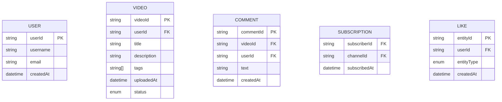
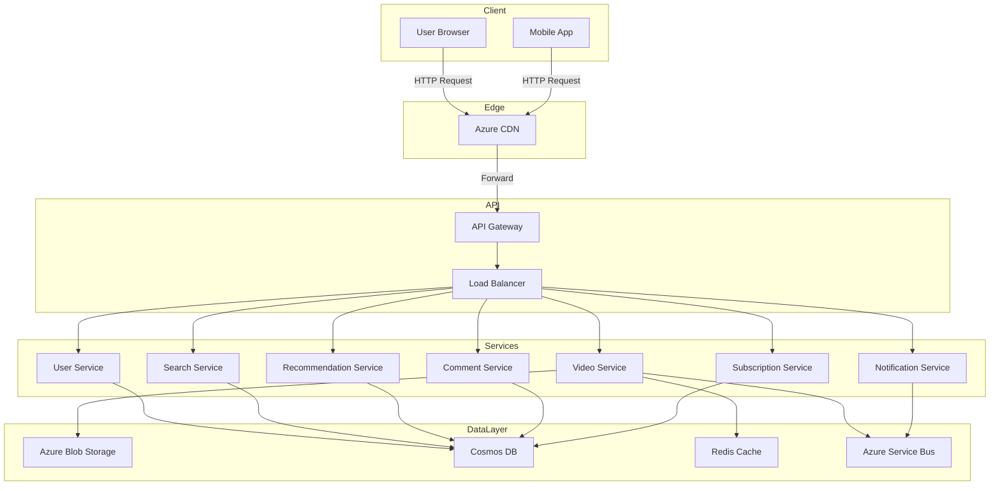

# YouTube System Design Document

---

## 1. System Overview

YouTube is a large-scale video-sharing platform enabling users to upload, watch, share, and interact with video content globally. It must deliver high availability, low latency video streaming, and real-time user engagement features.

**Problem Statement:** Design a scalable, highly available video platform handling millions of daily users with efficient content delivery, personalized recommendations, and multi-format streaming.

**Key Challenges:**
- Managing massive video upload and storage at scale
- Low-latency & high-throughput streaming
- Personalized recommendations and search at scale
- Handling spikes in traffic and viral content
- Ensuring data consistency & global availability

---

## 2. Requirements Analysis

**Functional Requirements:**
- FR1: Users can upload videos with metadata
- FR2: Stream videos with adaptive bitrate
- FR3: Search videos by title, description, tags
- FR4: Personalized video recommendations
- FR5: User interactions (likes, comments, subscriptions)
- FR6: Real-time notifications for new content
- FR7: Video analytics for creators

**Non-Functional Requirements:**
- Strong availability & partition tolerance (CAP) with eventual consistency for some features
- Latency: P99 < 200ms for video start
- Uptime: 99.95%+
- Scale: 500M DAU, peak QPS: 2M reads / 100k writes
- Storage: Petabytes with hot/cold data separation

**CAP Positioning:**
Focus on Availability and Partition tolerance (AP) with eventual consistency for user interactions and recommendations. Consistency prioritized for metadata updates and subscriptions.

---

## 3. Capacity Planning & Back-of-Envelope Calculations

- DAU: 500M
- Average video starts per user per day: 5
- Video start QPS (reads): \( rac{500	imes10^6 	imes 5}{86400} pprox 29k \) peak: 2M scaled for spikes
- Writes (uploads, interactions): ~100k QPS
- Storage per video: avg 100MB, 500k uploads/day \~50TB daily, monthly \~1.5PB
- Bandwidth: 4K videos ~20Mbps peak per stream
- Compute: Transcoding, recommendation ML models, real-time messaging
- Cost Estimate: Azure Blob at $0.018 per GB/month storage, CDN networking, AKS/GKE for microservices

---

## 4. Data Model

- **Database Choice:** Cosmos DB for metadata (global distribution + multi-model), Azure Blob Storage for video content
- **Partitioning:** UserID for user data, VideoID for video metadata
- **Indexing:** Composite indexes on tags, title for search, time-based indexes on comments

> [!tip] Use NoSQL (Cosmos DB) for scalability and Azure Blob Storage for blobs to optimize cost/performance.

---

## 5. API Design

- Protocol: RESTful for web compatibility and wide ecosystem

| Endpoint               | Method | Request                         | Response                      | Notes                         |
|------------------------|--------|---------------------------------|------------------------------|-------------------------------|
| /videos/upload         | POST   | Multipart video + metadata     | 202 Accepted + videoId        | Async processing              |
| /videos/{videoId}      | GET    | videoId                        | Video stream URL + metadata  | Supports range requests       |
| /videos/search         | GET    | query params                   | List of video metadata       | Pagination, filters supported |
| /users/{userId}/subs   | POST   | channelId                     | 200 OK                       | Auth required                 |
| /videos/{videoId}/like | POST   | userId                        | 200 OK                       | Rate limited                  |
| /comments/{videoId}    | POST   | userId, text                  | 201 Created                  | Moderation queue optional     |

- Authentication: OAuth 2.0 with Azure AD B2C
- Rate limiting: 100 req/min per user
- Error handling: Standard HTTP codes (400, 401, 403, 404, 500)

---

## 6. High-Level Architecture

> [!tip] Use CDN for video content delivery to reduce latency and handle traffic spikes.

---

## 7. Microservices Decomposition

| Service            | Responsibility                         |
|--------------------|-------------------------------------|
| Video Service      | Video upload, transcoding, storage  |
| User Service       | User profiles and authentication    |
| Search Service     | Video metadata search                |
| Recommendation     | Personalized recommendations         |
| Comment Service    | Manage comments and moderation       |
| Subscription Service | Subscriber channel management      |
| Notification Service | Push notifications & messages       |

- Communication: Mostly async with Azure Service Bus queues; synchronous REST for query APIs
- Service Discovery: AKS with internal DNS or Azure Service Fabric

> [!tip] Define bounded contexts around core domains to reduce coupling.

---

## 8. Deep Dives

### File Storage and CDN Strategy

- Use Azure Blob Storage for persistent video storage (Blob tiers: hot, cool, archive)
- Integrate Azure CDN for edge caching and global video delivery
- Video transcoding generates multiple bitrates stored separately
- Support range requests for client adaptive streaming

### Search Implementation

- Use Azure Cognitive Search on Cosmos DB video metadata
- Index title, description, tags with autocomplete and fuzzy search
- Periodically update indexed data asynchronously

### Real-Time Notifications

- Use Azure Service Bus for message queuing
- SignalR for pushing notifications to web and mobile clients
- Support subscription event, new video alerts

---

## 9. Infrastructure & DevOps

- Use Azure Kubernetes Service (AKS) for container orchestration
- Cosmos DB for globally distributed metadata storage
- Azure Blob Storage for video files
- Azure Service Bus for messaging
- Azure Monitor and Application Insights for observability
- CI/CD: GitHub Actions or Azure DevOps pipelines
- IaC: Terraform or Bicep for repeatable infra provisioning
- Blue-green and canary deployments to minimize downtime

---

## 10. Cross-Cutting Concerns

| Concern      | Approach                                                     |
|--------------|--------------------------------------------------------------|
| Security     | OAuth 2.0 (AAD B2C), RBAC, TLS, Key Vault for secrets       |
| Observability| Azure Monitor Metrics, Application Insights, OpenTelemetry  |
| Resilience   | Circuit breakers, retries, bulkheads, timeouts              |
| Performance  | Redis caching, CDN, query optimization, connection pooling   |

---

## 11. Scalability & Reliability

- Horizontal pod autoscaling on AKS
- Cosmos DB read replicas & multi-region
- Use CQRS for heavy read workloads (search, recommendations)
- Message Queue buffering for write spikes
- Geo-redundant video storage and backup for DR
- Azure Front Door & Load Balancer for global traffic management

---

## 12. Trade-offs & Alternatives

| Decision                | Pros                     | Cons                          |
|------------------------|--------------------------|-------------------------------|
| Cosmos DB vs SQL DB     | Global distribution      | Complex transactions           |
| REST vs gRPC           | Easy integration          | Less efficient for streaming  |
| Microservices vs Monolith | Scalability, isolation | Operational overhead           |
| Build vs Buy (search)   | Custom features          | Maintenance cost              |

- At 100x scale, move towards specialized datastores for logs, analytics
- Consider event sourcing for better audit trail

---

## 13. Interview Discussion Points

- How to handle viral video spikes?
- Strategies for reducing cold start latency
- Suggestions for multi-tenant log analytics
- Impact of eventual consistency on user experience?
- Handling deletions and GDPR compliance

> [!important] Always highlight trade-offs and reasoning behind architectural choices during the interview.

