# 🌐 Content Delivery Network (CDN) System Design

> **Quick Pitch**: Globally distributed proxy servers that cache and deliver content from edge locations closest to users, reducing latency from 500ms → 50ms

**Tags**: #system-design #distributed-systems #caching #networking #cdn

---

## 📋 Functional Requirements (FR)

- ✅ **Deliver static content** (images, videos, CSS, JS, HTML) globally
- ✅ **Content upload/update** from origin servers
- ✅ **Intelligent caching** with TTL-based eviction
- ✅ **On-demand purge** - invalidate stale content instantly
- ✅ **Geographic routing** - serve from nearest edge
- ✅ **Origin pull** on cache MISS
- ✅ **Analytics** - bandwidth, cache hit rate, request patterns

---

## ⚡ Non-Functional Requirements (NFR)

### Performance & Scale
| Metric | Target | Notes |
|--------|--------|-------|
| **Latency** | <50ms (cached) | <500ms (cache MISS) |
| **Availability** | 99.99% | ~52min downtime/year |
| **Throughput** | 10M requests/sec | Peak global load |
| **Cache Hit Rate** | >90% | Reduces origin load by 10x |
| **DAU** | 1B users | Global distribution |
| **Data Transfer** | 100 PB/month | Mostly video streaming |

### CAP Theorem Position
```
   Consistency ←————→ Availability
        ↑                    ↑
      (Low)              (HIGH) ← CDN favors AP
        
   Partition Tolerance: REQUIRED
```

**CDN Choice**: **AP** (Availability + Partition Tolerance)
- 🎯 Eventual consistency acceptable
- 🎯 Content can be stale for seconds/minutes
- 🎯 Availability > Fresh content

### System Characteristics
- 📖 **Read Heavy**: 99.9% reads, 0.1% writes
- ⚡ **Low latency > Strong consistency**
- 🌍 **Geo-distributed** by design

---

## 🗄️ Core Entities

### 1. EdgeServer
```json
{
  "id": "edge-us-east-1a-001",
  "region": "us-east-1",
  "pop": "ashburn-dc1",
  "status": "active",
  "capacity": {
    "cpu": 0.65,
    "memory_gb": 128,
    "cache_size_tb": 10
  }
}
```

### 2. CachedContent
```json
{
  "content_id": "uuid",
  "path": "/images/hero.webp",
  "etag": "hash-abc123",
  "size_bytes": 450000,
  "ttl_seconds": 86400,
  "created_at": "2025-10-04T10:00:00Z",
  "access_count": 50000,
  "compression": "brotli"
}
```

### 3. OriginServer
```json
{
  "id": "origin-prod-01",
  "url": "https://origin.example.com",
  "type": "primary",
  "health": "healthy",
  "regions": ["us-east", "eu-west"]
}
```

### 4. PurgeJob
```json
{
  "job_id": "purge-xyz789",
  "paths": ["/css/*", "/js/app.js"],
  "type": "soft",
  "status": "in_progress",
  "affected_edges": 187
}
```

---

## 🔌 APIs

### Content Delivery (Public)
```http
GET https://cdn.example.com/images/logo.png
Headers:
  If-None-Match: "abc123"
  If-Modified-Since: "2025-10-01T00:00:00Z"

Response: 200 OK | 304 Not Modified | 404 Not Found
Headers:
  Cache-Control: max-age=86400
  ETag: "abc123"
  X-Cache: HIT
  X-Edge-Location: us-east-1a
```

### Content Management (Admin)
```http
POST https://api.cdn.com/v1/content/upload
Body:
{
  "path": "/videos/intro.mp4",
  "ttl": 3600,
  "cache_control": "public, max-age=3600"
}

Response: 201 Created
{
  "url": "https://cdn.example.com/videos/intro.mp4",
  "version": "v1.0.0"
}
```

### Purge/Invalidation
```http
POST https://api.cdn.com/v1/content/purge
Body:
{
  "paths": ["/images/*"],
  "type": "hard"
}

Response: 202 Accepted
{
  "job_id": "purge-xyz789",
  "status": "queued",
  "estimated_time_sec": 30
}
```

### Analytics
```http
GET https://api.cdn.com/v1/analytics/metrics
Params:
  start_time=2025-10-01T00:00:00Z
  end_time=2025-10-04T23:59:59Z
  metric=cache_hit_rate
  region=us-east

Response: 200 OK
{
  "cache_hit_rate": 0.92,
  "total_requests": 1000000000,
  "bandwidth_tb": 5000
}
```

---

## 🎯 Microservices

| Service | Function |
|---------|----------|
| **🌐 Edge Proxy** | Nginx/Varnish - serves cached content, TLS termination |
| **🗺️ GeoDNS Router** | Routes users to nearest PoP based on latency |
| **📦 Cache Manager** | LRU/LFU eviction, TTL enforcement, cache warming |
| **🔄 Origin Fetcher** | Pulls content from origin on MISS, handles retries |
| **🛡️ Origin Shield** | Collapses duplicate requests, reduces origin load |
| **🧹 Purge Orchestrator** | Distributes invalidation commands via message queue |
| **📊 Analytics Collector** | Aggregates logs, metrics from all edges |
| **💚 Health Monitor** | Checks edge/origin health, updates DNS routing |
| **⚙️ Config Manager** | Distributes SSL certs, routing rules, cache policies |

---

## 🏗️ High-Level Design

### System Architecture

![[cdn_system.png]]
### Request Flow - Cache HIT 🎯

```mermaid
sequenceDiagram
    participant C as 👤 Client
    participant D as 🗺️ GeoDNS
    participant E as 🌐 Edge Server
    participant M as 📦 Memory Cache
    participant S as 💿 SSD Cache

    C->>D: 1. Resolve cdn.example.com
    D->>C: 2. IP of nearest edge (50.1.2.3)
    C->>E: 3. GET /images/logo.png
    E->>M: 4. Check L1 cache (RAM)
    M-->>E: 5. HIT! Return content
    E->>C: 6. 200 OK + X-Cache: HIT<br/>Latency: 15ms ⚡
    
    Note over C,E: Total Time: ~20-50ms
```



### Request Flow - Cache MISS 😔

```mermaid
sequenceDiagram
    participant C as 👤 Client
    participant E as 🌐 Edge
    participant RC as 📦 Regional Cache
    participant OS as 🛡️ Origin Shield
    participant O as 💾 Origin

    C->>E: 1. GET /videos/new.mp4
    E->>E: 2. Check local cache - MISS
    E->>RC: 3. Check regional cache
    RC-->>E: 4. MISS
    E->>OS: 5. Request from shield
    OS->>OS: 6. Check if already fetching?
    OS->>O: 7. Fetch from origin
    O-->>OS: 8. Return content
    OS->>RC: 9. Cache in regional
    OS->>E: 10. Forward to edge
    E->>E: 11. Cache locally (SSD)
    E->>C: 12. 200 OK + X-Cache: MISS<br/>Latency: 450ms
    
    Note over C,O: Total Time: 200-500ms<br/>Next request will HIT!
```



---

## 💾 Database Design

### Edge Metadata Store (Distributed KV Store)

**Technology**: Redis Cluster / DynamoDB

**Schema**:
```json
Key: "content:{path_hash}"
Value: {
  "path": "/images/logo.png",
  "origin_url": "https://origin.example.com/images/logo.png",
  "etag": "abc123",
  "size_bytes": 450000,
  "ttl": 86400,
  "last_modified": "2025-10-04T10:00:00Z",
  "edge_locations": ["us-east-1a", "eu-west-1b"]
}
```

**Indexing Strategy**:
- 🔑 **Primary Key**: `content_id` (UUID)
- 📇 **Secondary Index**: `path` (GSI for lookups)
- 🏷️ **TTL Index**: Automatic expiration

**Partitioning**:
- ✂️ **Partition Key**: `hash(path)` - evenly distributes content
- 🌍 **Region**: Multi-region replication for metadata

### Analytics Database (Time-Series)

**Technology**: ClickHouse / TimescaleDB

**Schema**:
```sql
CREATE TABLE request_logs (
    timestamp DateTime,
    edge_id String,
    path String,
    status_code UInt16,
    cache_status Enum('HIT', 'MISS', 'STALE'),
    response_time_ms UInt32,
    bytes_sent UInt64,
    user_country String,
    INDEX idx_timestamp timestamp,
    INDEX idx_path path
) ENGINE = MergeTree()
PARTITION BY toYYYYMM(timestamp)
ORDER BY (timestamp, edge_id);
```

**Sharding Strategy**:
- 📅 **Partition**: By month (`toYYYYMM(timestamp)`)
- 🗂️ **Order**: `(timestamp, edge_id)` for time-range queries

**Indexes**:
- ⚡ `idx_timestamp` - range queries
- 🔍 `idx_path` - content-specific analytics

### Configuration Store (Consensus)

**Technology**: etcd / Consul

**Data**:
```json
Key: "/config/edges/us-east-1a/cache_policy"
Value: {
  "default_ttl": 3600,
  "max_size_gb": 10000,
  "eviction_policy": "LRU",
  "compression": "brotli"
}
```

**No partitioning needed** - small config data, strongly consistent

---

## 🧠 Deep Dive: Cache Eviction Algorithm

### Multi-Tier Cache Strategy

```
┌─────────────────────────────────────┐
│   L1: Memory (Hot - 10% content)    │
│   Algorithm: LRU                     │
│   Size: 128 GB RAM                   │
│   Serves: 90% of requests            │
└─────────────────────────────────────┘
              ↓ Cache MISS
┌─────────────────────────────────────┐
│   L2: SSD (Warm - 40% content)      │
│   Algorithm: LFU                     │
│   Size: 10 TB NVMe                   │
│   Serves: 9% of requests             │
└─────────────────────────────────────┘
              ↓ Cache MISS
┌─────────────────────────────────────┐
│   L3: Regional Cache (Redis)        │
│   Algorithm: TTL-based               │
│   Size: 100 TB distributed           │
│   Serves: 0.9% of requests           │
└─────────────────────────────────────┘
              ↓ Cache MISS
          Origin Fetch (0.1%)
```

### LRU Implementation (Memory Cache)

```python
# Pseudocode for Edge Server Cache
class LRUCache:
    def __init__(self, capacity_gb):
        self.capacity = capacity_gb * 1024 * 1024 * 1024  # bytes
        self.cache = OrderedDict()  # maintains insertion order
        self.current_size = 0
    
    def get(self, key):
        if key in self.cache:
            self.cache.move_to_end(key)  # Mark as recently used
            return self.cache[key]
        return None  # Cache MISS
    
    def put(self, key, value, size_bytes):
        # Evict if needed
        while self.current_size + size_bytes > self.capacity:
            oldest_key = next(iter(self.cache))  # LRU item
            evicted = self.cache.pop(oldest_key)
            self.current_size -= evicted.size
            
        self.cache[key] = value
        self.cache.move_to_end(key)
        self.current_size += size_bytes
```

**Why LRU for L1?**
- ✅ Simple, fast O(1) operations
- ✅ Works well for hot content (recent = popular)
- ✅ Low overhead for memory cache

**Why LFU for L2?**
- ✅ Better for larger SSD cache
- ✅ Keeps truly popular content longer
- ✅ Prevents one-time large files from evicting hot content

---

## 🧠 Deep Dive: Origin Shield (Thundering Herd Prevention)

### Problem: Cache Expiry Stampede


### Solution: Origin Shield with Request Coalescing

```python
# Pseudocode for Origin Shield
class OriginShield:
    def __init__(self):
        self.in_flight_requests = {}  # Track pending fetches
        self.lock = threading.Lock()
    
    def fetch(self, content_path):
        with self.lock:
            # Check if already fetching
            if content_path in self.in_flight_requests:
                # Wait for existing request to complete
                future = self.in_flight_requests[content_path]
                return future.result()  # Block until ready
            
            # Create new fetch operation
            future = Future()
            self.in_flight_requests[content_path] = future
        
        try:
            # Fetch from origin (only ONE request)
            content = origin_client.get(content_path)
            future.set_result(content)
            return content
        finally:
            with self.lock:
                del self.in_flight_requests[content_path]
```

**Result**: 100 simultaneous requests → 1 origin request 🎯

---

## 🧠 Deep Dive: Purge Propagation Strategy

### Soft Purge vs Hard Purge

| Type | Behavior | Use Case | Speed |
|------|----------|----------|-------|
| **Soft Purge** | Mark stale, serve while revalidating | Minor updates, can serve old content | ~5 sec |
| **Hard Purge** | Immediate delete, force origin fetch | Critical bug fix, security issue | ~30 sec |

### Purge Flow


**Why Kafka?**
- ✅ Reliable delivery to all edges
- ✅ Replay capability if edge was offline
- ✅ Ordered processing per partition
- ✅ At-least-once delivery guarantee

---

## ⚖️ Trade-offs

### 1. Consistency vs. Availability
- **Choice**: Eventual Consistency (AP)
- ❌ **Trade-off**: Users may see stale content for seconds/minutes
- ✅ **Benefit**: 99.99% availability, low latency
- **Mitigation**: Short TTLs for dynamic content, instant purge for critical updates

### 2. Cache Size vs. Hit Rate
- **Choice**: 10TB per edge (stores ~40% of content)
- ❌ **Trade-off**: Cannot cache everything, cold content has high latency
- ✅ **Benefit**: Cost-effective, 90%+ hit rate achievable
- **Mitigation**: Multi-tier caching, intelligent prefetching

### 3. Pull vs. Push Model
- **Choice**: Pull-based (origin pull on MISS)
- ❌ **Trade-off**: First request is slow (cache warming)
- ✅ **Benefit**: No wasted bandwidth for unused content
- **Mitigation**: Pre-warming for known popular content (product launches)

### 4. Geographic Granularity
- **Choice**: 200 PoPs globally
- ❌ **Trade-off**: High infrastructure cost, complex management
- ✅ **Benefit**: Sub-50ms latency for 95% of users
- **Mitigation**: Shared PoPs for multiple customers, economies of scale

### 5. Security vs. Performance
- **Choice**: TLS termination at edge
- ❌ **Trade-off**: Edge servers hold private keys (security risk)
- ✅ **Benefit**: No SSL handshake latency to origin
- **Mitigation**: Hardware security modules (HSMs), key rotation

### 6. Origin Shield vs. Direct Origin Access
- **Choice**: Shield layer between edge and origin
- ❌ **Trade-off**: Additional hop adds 20-50ms
- ✅ **Benefit**: 90% reduction in origin requests
- **Mitigation**: Only for popular content, bypass for rare content

---

## 💭 Closing Thoughts

### Key Takeaways for Interviews

1. **CDN = Caching at the edge** 🌍
   - Bring content close to users
   - 10x latency improvement (500ms → 50ms)

2. **Multi-tier caching is essential** 📦
   - Memory → SSD → Regional → Origin
   - 90%+ hit rate = 10x origin load reduction

3. **Eventual consistency is acceptable** ⚖️
   - Users tolerate stale content for speed
   - Purge mechanism for critical updates

4. **Origin Shield prevents stampedes** 🛡️
   - Collapses concurrent requests
   - Saves origin from traffic spikes

5. **GeoDNS routes intelligently** 🗺️
   - Anycast for global IPs
   - Health-aware routing

### Scalability Bottlenecks & Solutions

| Bottleneck | Solution |
|------------|----------|
| **Origin overload** | Origin Shield + high cache hit rate |
| **Edge storage** | Tiered cache (memory/SSD) + LRU/LFU |
| **Purge propagation** | Kafka message queue + regional consumers |
| **DNS resolution** | GeoDNS + Anycast + edge-side routing |
| **TLS handshake** | Session resumption + TLS 1.3 |

### Real-World Examples
- **Cloudflare**: 300+ PoPs, 25 million websites
- **Akamai**: 325,000+ servers, 1,300+ networks
- **Amazon CloudFront**: 450+ PoPs, integrated with AWS

### When NOT to use a CDN
- ❌ Highly personalized content (can't cache)
- ❌ Content that changes every second (no TTL works)
- ❌ Very small user base in single location
- ❌ Real-time data (stock prices, live sports scores)

---

## 🎯 Interview Flashcards

#flashcard 
**Q**: What is the primary benefit of a CDN?
**A**: Reduces latency by serving content from geographically distributed edge servers closest to users (500ms → 50ms)

---

#flashcard 
**Q**: Why does CDN favor AP over CP in CAP theorem?
**A**: Availability and low latency are more important than strong consistency. Stale content for seconds is acceptable.

---

#flashcard 
**Q**: How does Origin Shield prevent the thundering herd problem?
**A**: Collapses multiple concurrent requests for the same content into a single origin fetch using request coalescing.

---

#flashcard 
**Q**: What's the difference between soft purge and hard purge?
**A**: Soft purge marks content stale and serves while revalidating (~5s). Hard purge immediately deletes and forces origin fetch (~30s).

---

#flashcard 
**Q**: Why use multi-tier caching (L1/L2/L3)?
**A**: Balances speed, capacity, and cost. Hot content in memory (fast), warm in SSD (larger), cold fetched on-demand.

---

#flashcard 
**Q**: How do you achieve 99.99% availability for a CDN?
**A**: Geographic redundancy (multiple PoPs), health checks, automatic failover, redundant origins, and degraded mode operation.

---

#flashcard 
**Q**: What database partitioning strategy for CDN metadata?
**A**: Partition by hash(path) for even distribution. Use TTL-based indexes for automatic expiration.

---

#flashcard 
**Q**: Why is CDN read-heavy and how does it affect design?
**A**: 99.9% reads. Optimize for read performance: aggressive caching, read replicas, eventually consistent writes.

---

## 📚 Related Concepts

- [[Load Balancer Design]] - Edge servers use LB patterns
- [[Distributed Caching]] - Core CDN component
- [[Rate Limiting]] - DDoS protection at edge
- [[Consistent Hashing]] - Content distribution across edges
- [[CAP Theorem]] - AP vs CP trade-offs
- [[DNS and GeoDNS]] - User routing mechanism

---

**Last Updated**: 2025-10-04
**Difficulty**: 🔴 Hard
**Companies**: Amazon, Cloudflare, Akamai, Fastly, Google Cloud CDN