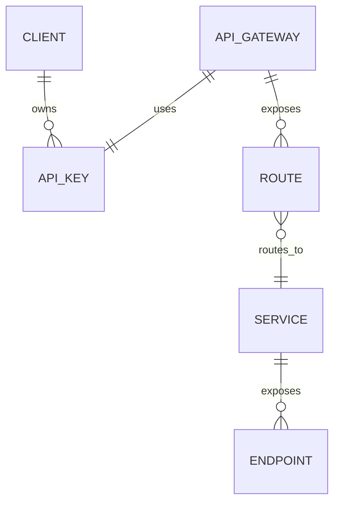
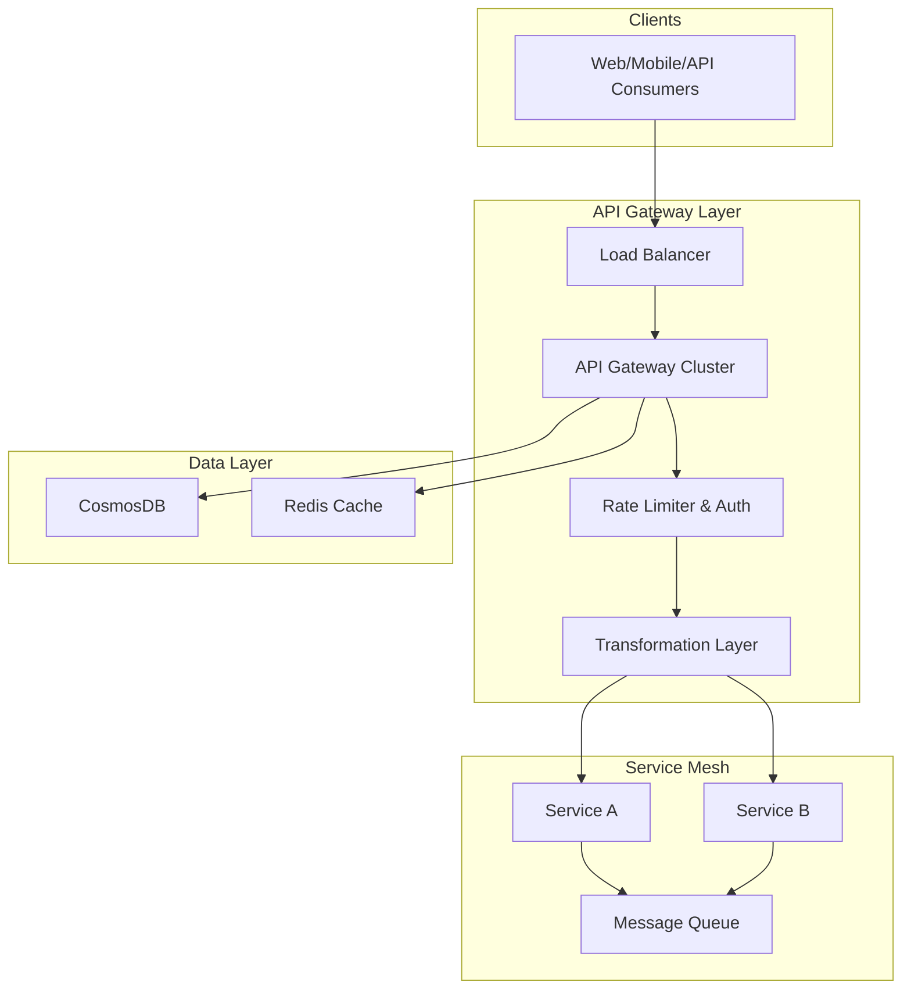

# API Gateway System Design

---

## 1. System Overview

**Executive Summary:**
An API Gateway serves as the single entry point for clients into a distributed system, simplifying client interactions by routing requests, enforcing security, performing protocol translations, and managing cross-cutting concerns such as rate limiting and logging. This system is critical for enabling scalable, secure, and maintainable microservices architecture at cloud scale.

**Problem Statement and Scope:**
- Provide a unified interface to diverse backend microservices.
- Abstract complexity of the service ecosystem from clients.
- Enforce centralized policies and cross-cutting concerns.
- Provide resilience and observability at the edge.

**Key Challenges:**
- Balancing low-latency routing with rich processing capabilities.
- Handling traffic spikes and attack vectors gracefully.
- Maintaining high availability and fault tolerance.
- Supporting multi-protocol clients and flexible authentication.

---

## 2. Requirements Analysis

### Functional Requirements (FRs):
- FR1: Request routing to appropriate microservices based on path, method, headers
- FR2: Authentication and authorization enforcement (OAuth2, JWT, AAD)
- FR3: Rate limiting and throttling per client/API key
- FR4: Request/response transformation and protocol translation (REST, gRPC)
- FR5: Load balancing with health checks and failover
- FR6: Centralized logging, metrics, tracing integration
- FR7: API versioning and management

### Non-Functional Requirements (NFRs):
- CAP Positioning: Prioritize Availability and Partition tolerance (AP) with graceful degradation of Consistency at gateway layer
- SLAs: P99 latency < 200ms, 99.95% uptime
- Scale Estimates: 5 million DAU, 100K QPS (80% read, 20% write)
- Consistency vs Availability: Favor availability for external API ingress; eventual consistency internally

---

## 3. Capacity Planning & Back-of-Envelope Calculations

- QPS estimate: 100,000 QPS with 5% peak factor => 105,000 QPS
- Data volume: Mainly stateless request routing; minimal persistent state; logs ~ 50TB/month
- Bandwidth: Assuming 2KB average request+response, ~400 Mbps sustained
- Compute: Load balanced clusters on AKS sized for 200K pods; estimated 500 nodes for resilience
- Cost: AKS clusters + Azure Application Gateway + Azure Redis Cache + CosmosDB for config store

---

## 4. Data Model



- Core Entities: Client, API Key, API Gateway, Route, Service, Endpoint
- DB Choice: CosmosDB (multi-region, low-latency, schema-flexible) for config and analytics
- Partitioning: Logical partition by API key and region
- Indexing: Composite indexes on client_id+api_key for fast auth lookup

---

## 5. API Design

| API | Method | Path | Request | Response | Notes |
|---|---|---|---|---|---|
| GetRoute | GET | /routes/{routeId} | routeId | Route details | Auth required |
| CreateAPIKey | POST | /apikeys | Client info | API key info | Rate limited |
| Authenticate | POST | /auth | Credentials | JWT token | OAuth2 compatible |
| RateLimitStatus | GET | /ratelimit/status | API key | Limit & usage | Cached |
| Metrics | GET | /metrics | - | API gateway metrics | Admin only |

- Status code conventions: 200, 201, 401 (Unauthorized), 403 (Forbidden), 429 (Too Many Requests), 500
- Token-based auth (JWT), TLS mandatory

---

## 6. High-Level Architecture (HLD)



> [!tip] Request flow example: Client -> API Gateway (auth + rate limiting) -> Transformation -> Load balanced microservices -> Async queue for processing

---

## 7. Microservices Decomposition

| Service | Responsibility |
|---|---|
| API Gateway Service | Request routing, auth, throttling, protocol translation |
| Auth Service | OAuth2 token issuance, validation, user management |
| Rate Limiter Service | Per-client rate limit enforcement |
| Configuration Service | Stores routes, APIs, keys metadata |
| Monitoring Service | Metrics collection and alerting |

- Communication: API Gateway communicates synchronously with auth and rate-limiter; async for logging and config updates
- Discovery: Service registry with DNS-based discovery; Azure Service Fabric or Kubernetes DNS discovery
- Boundaries inspired by DDD—clear separation of concerns promotes scalability and maintainability

---

## 8. Deep Dives

### Rate Limiting and Throttling

- Use token bucket algorithm for fine-grained control
- Implement distributed counters via Redis with Lua atomic scripts
- Handle burst traffic and gradual replenishment

```python
# Token bucket rate limiting snippet
class RateLimiter:
    def __init__(self, capacity, refill_rate):
        self.capacity = capacity
        self.refill_rate = refill_rate
        self.tokens = capacity
        self.last_checked = time.time()
    def allow_request(self):
        now = time.time()
        delta = now - self.last_checked
        self.tokens = min(self.capacity, self.tokens + delta * self.refill_rate)
        self.last_checked = now
        if self.tokens >= 1:
            self.tokens -= 1
            return True
        return False
```

### Caching and Cache Invalidation

- Use Redis for multi-tier caching (edge + regional cache)
- TTL based eviction with manual invalidation on config changes
- Cache critical auth tokens and route configs

### Distributed Tracing and Observability

- OpenTelemetry instrumentation
- Correlate logs with traces using trace IDs
- Azure Application Insights integration

---

## 9. Infrastructure & DevOps

- AKS for container orchestration with managed scaling
- Azure Application Gateway with WAF for API ingress
- CosmosDB for config and metadata
- Azure Redis Cache for rate limiting and caching
- Azure Service Bus for async messaging
- Azure Monitor and App Insights for observability
- CI/CD with GitHub Actions and Azure DevOps pipelines
- Infrastructure as Code with Terraform
- Blue-green deployments with Azure Traffic Manager

---

## 10. Cross-Cutting Concerns

- **Security:** Azure AD OAuth2 integration, RBAC, TLS everywhere, Key Vault for secrets
- **Observability:** Metrics (Azure Monitor), tracing (App Insights), centralized logging (ELK stack)
- **Resilience:** Circuit breakers, retries with exponential backoff, graceful degradation
- **Performance:** Redis caching, CDN for static assets, connection pooling

---

## 11. Scalability & Reliability

- Auto-scaling API Gateway pods by CPU and queue length
- CosmosDB with multi-region writes and read replicas
- CQRS for separating read-heavy telemetry queries
- Message queues buffer spikes for async processing
- Disaster recovery with daily backups, RTO < 15 mins
- Multi-region active-active deployment using Azure Front Door
- Load balancing at L4 (Azure Load Balancer) and L7 (Application Gateway)

---

## 12. Trade-offs & Alternatives

| Decision | Pros | Cons |
|---|---|---|
| CosmosDB vs PostgreSQL | Highly scalable, multi-region, schema-flexible | More expensive, eventual consistency challenges |
| AKS vs Azure Functions | Full control, container orchestration | More operational overhead vs serverless simplicity |
| REST vs gRPC | Universal support, caching | Lower perf than gRPC, harder to evolve API |
| Microservices vs Monolith | Scalability, independent deployment | Added complexity, distributed debugging |

- At 10x scale, invest in CQRS and event sourcing for write-heavy APIs
- Monolith is viable early on but limits flexibility at scale
- Buy API management service only if SLA and extensibility matches requirements

---

## 13. Interview Discussion Points

- How to extend rate limiting for geo-distributed clients?
- Handling API Gateway failures gracefully
- Trade-offs between consistency and availability in API Gateway context
- Evolving API versioning strategies and backward compatibility
- Detecting and mitigating DOS attacks
- Strategies for caching dynamic vs static API responses
- Observability for 3 AM incident debugging
- Handling spikes and burst traffic without degrading SLA

