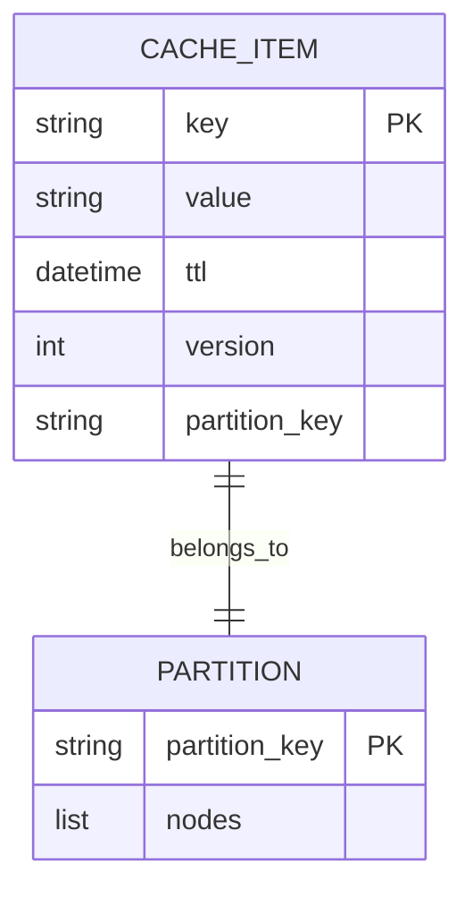
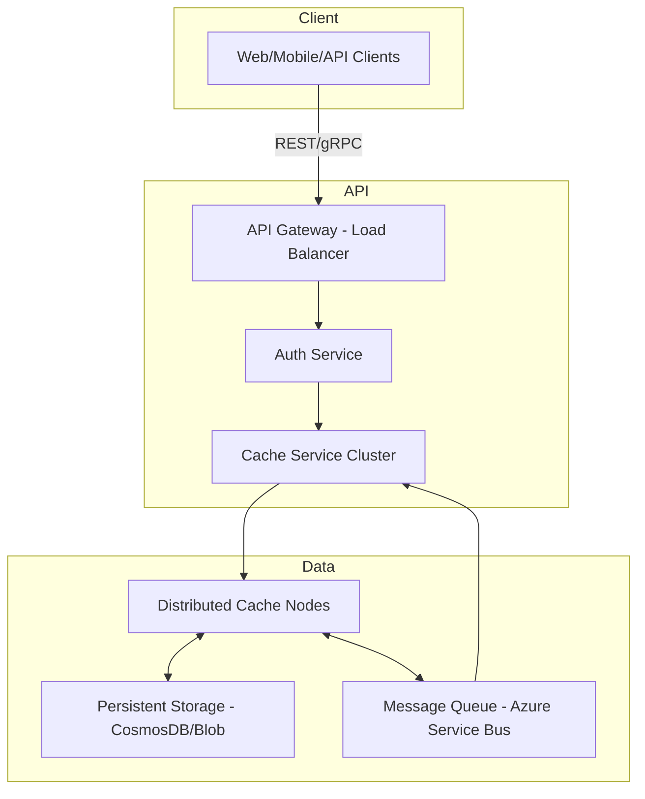
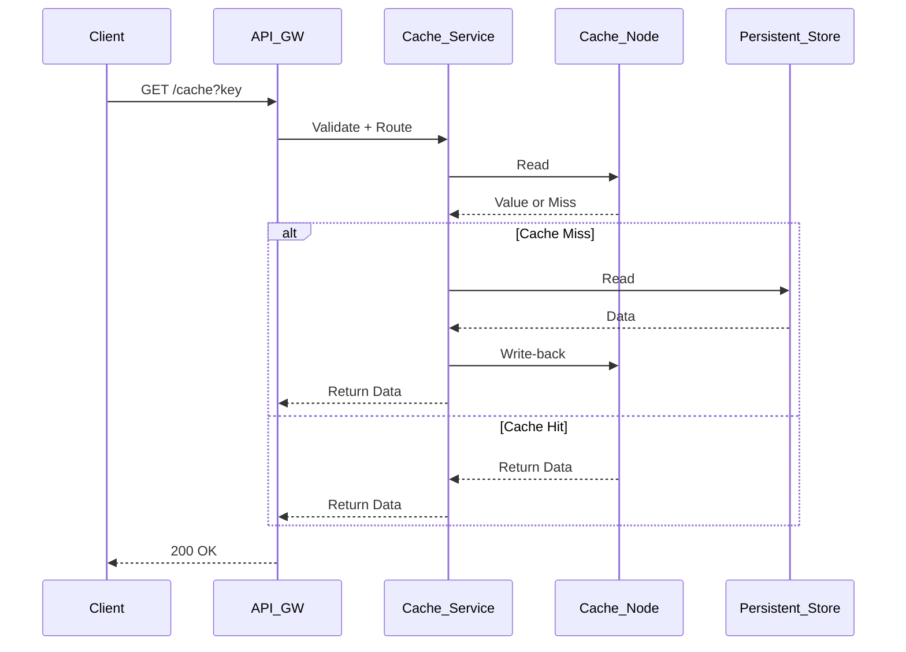

# Distributed Cache System Design

---

## 1. System Overview

A **Distributed Cache** is a high-performance, low-latency caching layer distributed across multiple nodes to reduce backend load and improve application responsiveness. Designed for cloud-native environments, it targets millions of queries per second (QPS) with fault tolerance and flexible consistency.

**Problem Statement:** Build a fault-tolerant distributed caching system enabling fast read/write access with flexible eviction, consistency options, and horizontal scalability.

**Key Challenges:**
- Ensuring cache consistency across distributed nodes
- Efficient invalidation and eviction strategies
- Handling hot keys and avoiding cache stampede
- Balancing CAP theorem trade-offs
- Scaling with low latency at high throughput

---

## 2. Requirements Analysis

### Functional Requirements (FRs)
- FR1: Sub-millisecond read/write latency
- FR2: TTL and manual eviction
- FR3: Configurable consistency (strong/eventual)
- FR4: Distributed partitioning with replication
- FR5: Cache operation APIs (GET, SET, DELETE, INCR)
- FR6: Cache invalidation via pub/sub
- FR7: Metrics and health endpoints

### Non-Functional Requirements (NFRs)
- **CAP Positioning:** AP with tunable consistency levels for flexibility
- **SLAs:** P99 latency < 5ms read, <10ms write; 99.95% uptime
- **Scale:** 10M+ Daily Active Users (DAU), 2M QPS reads, 500K QPS writes (~4:1 R/W)
- **Data Size:** 1TB+ hot cache, multi-TB with tiered storage
- **Trade-offs:** Accept eventual consistency for speed; strong consistency selectively

---

## 3. Capacity Planning & Back-of-Envelope Calculations

- Total QPS (read + write) = 2.5M
- Average payload: ~500B key/value + 256B overhead = ~756B per op
- Bandwidth ≈ 2.5M * 756B ≈ 1.8 Tbps ingress/egress
- Storage: 1TB hot data * 3 (replication) = 3TB total in memory
- Compute: ~100k vCPUs (e.g., Azure Vm size c5.large equivalent) considering CPU & mem workload
- Monthly Cost Estimate (Azure Redis Enterprise + VMs + Bandwidth): ≈ $200k

---

## 4. Data Model



- **NoSQL choice:** Azure CosmosDB or Redis for flexibility & throughput
- Partition key: hash-based shard key for even data distribution
- Index on partition_key, TTL for efficient eviction

> [!tip] Avoid relational DBs to maintain sub-ms latency and scale

---

## 5. API Design

| Endpoint         | Method | Request Payload                    | Response                | Status Codes           | Notes                         |
|------------------|--------|----------------------------------|-------------------------|------------------------|-------------------------------|
| /cache           | GET    | { key }                          | { value, ttl }          | 200, 404               | Rate limited, OAuth2 via Azure AD |
| /cache           | SET    | { key, value, ttl? }             | { success }             | 200, 400               | Auth required                  |
| /cache           | DELETE | { key }                         | { success }             | 200, 404               |                               |
| /cache/incr      | POST   | { key, increment_by (int) }      | { new_value }           | 200, 404, 409           | Atomic increments             |
| /cache/subscribe | WS     | { topic, key }                   | Stream of invalidation events | WS close, error codes | Push invalidation subscription |

- Use HTTPS REST for broad compatibility
- Authentication: OAuth2 with Azure AD
- Rate limiting at API gateway

---

## 6. High-Level Architecture



### Sequence: GET Cache Data



---

## 7. Microservices Decomposition

| Service            | Responsibility                              |
|--------------------|---------------------------------------------|
| API Gateway        | Routing, rate limiting, authentication      |
| Auth Service       | OAuth2/AAD token validation                  |
| Cache Service      | Business logic, consistency management      |
| Cache Node         | In-memory cache storage, replication         |
| Storage Service    | Persistent cache fallback                    |
| Messaging Service  | Pub/sub for cache invalidation events       |

- Communication:
  - API Gateway → Auth/Cache Service: sync HTTP REST
  - Cache Service ↔ Cache Nodes: sync TCP/gRPC
  - Cache Nodes ↔ Messaging Service: async events
- Service boundaries reflect bounded contexts separating cache control and storage

---

## 8. Deep Dives

### Caching Strategies & Cache Invalidation

- Multi-tier caching:
  - L1: local in-memory cache (in-process) for microsecond latency
  - L2: distributed cache across nodes (e.g., Redis cluster)
- Eviction policies:
  - TTL expiry
  - LRU/LFU for hot keys
- Consistency:
  - Write-through for strong consistency (sync writes)
  - Write-back or write-around for performance
  - Cache invalidation via pub/sub to notify nodes

```python
# Simplified cache invalidation logic
class CacheNode:
    def __init__(self):
        self.cache = {}

    def set(self, key, value):
        self.cache[key] = value
        self.publish_invalidation(key)

    def publish_invalidation(self, key):
        # Publish invalidation event to messaging queue
        pass
```

### Distributed Transactions & Consistency

- Use saga pattern for multi-cache or multi-service updates
- Prefer eventual consistency with compensating transactions
- Centralized coordination avoided to reduce latency and improve availability

---

## 9. Infrastructure & DevOps

- Kubernetes cluster (Azure AKS) for orchestration
- Azure Cache for Redis Enterprise for distributed caching
- Azure CosmosDB for persistent backing store
- Azure Service Bus for pub/sub messaging
- Azure Active Directory for authentication
- Observability via Azure Monitor and Application Insights
- IaC with Terraform or Azure Bicep
- CI/CD pipelines using GitHub Actions
- Canary and blue-green deployments with feature flags

---

## 10. Cross-Cutting Concerns

### Security
- OAuth2 with Azure AD for authentication
- Role-Based Access Control (RBAC)
- Encryption: TLS in transit, AES-256 at rest
- Secrets management via Azure Key Vault

### Observability
- Metrics: Cache hit ratio, latency, evictions monitored through App Insights
- Distributed tracing with OpenTelemetry
- Aggregated logging in Azure Monitor
- Alerting on SLA violations

### Resilience
- Circuit breakers at API Gateway
- Retries with exponential backoff on cache misses
- Bulkheads to isolate failures
- Chaos engineering exercises to validate fault tolerance

### Performance
- Multi-tier (L1, L2) caching
- Connection pooling
- Query optimization and lazy loading

---

## 11. Scalability & Reliability

- Horizontal scaling with AKS autoscaling based on CPU/mem
- Redis cluster with automatic shard resharding
- CQRS pattern for separating reads and writes if needed
- Daily backups to Azure Blob Storage
- Multi-region deployments with geo-replication
- Global L4 load balancers and geo-DNS

---

## 12. Trade-offs & Alternatives

| Decision                 | Pros                                | Cons                                 |
|--------------------------|-------------------------------------|-------------------------------------|
| Strong consistency       | Data correctness, simpler reads     | Higher latency, complex coordination|
| Eventual consistency     | High availability, fast response    | Stale reads, harder conflict resolution|
| Redis vs CosmosDB Cache  | Redis: ultra-low latency             | CosmosDB: durable, higher cost      |
| Microservices vs Monolith| Scalability, fault domain isolation | Increased operational complexity     |

- At 10x scale, consider sharded caches with hot key mitigation
- At 100x, leverage multi-region cache coherence protocols
- Evaluate build vs buy: use managed Redis Enterprise for speed vs own solution for customization

---

## 13. Interview Discussion Points

- Hot key problem and mitigation (e.g., request coalescing, random TTL jitter)
- Cache stampede prevention approaches
- Multi-region cache coherence strategy
- TTL setting and refresh/update policies
- Handling partial failures and retries
- Key metrics for production monitoring and alerting


---
