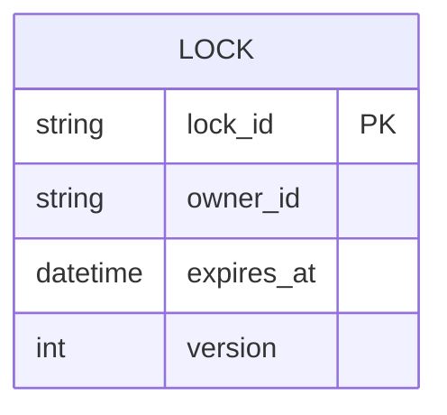
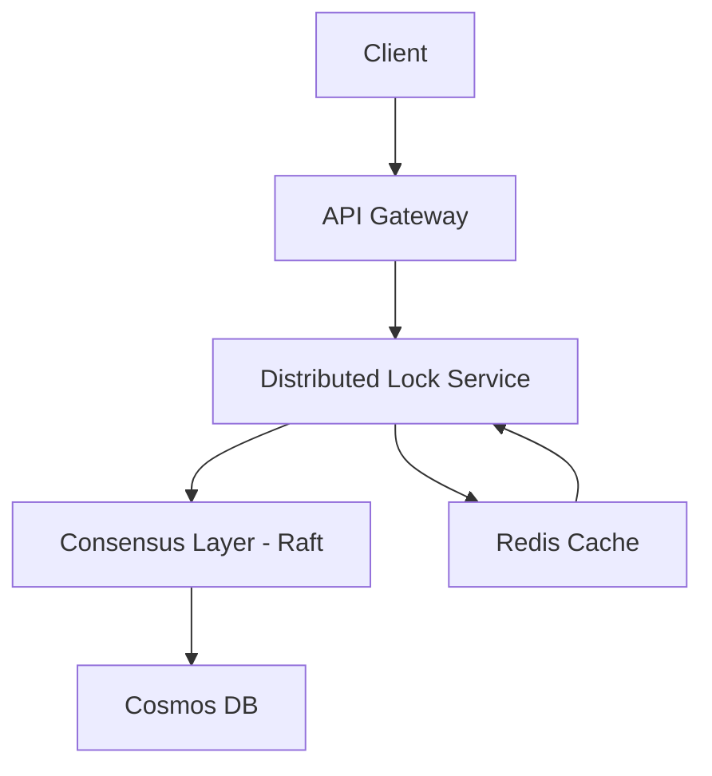

# Distributed Lock System Design

---

## 1. System Overview

- Distributed Locking enables mutual exclusion across distributed processes or services, preventing resource conflicts in multi-node environments.
- The system scope includes distributed locks for short-lived critical sections primarily used in microservices and cloud-native apps.
- Key challenges: clock synchronization, fault tolerance (node failures), lock lease expiration, scalability under high contention.

---

## 2. Requirements Analysis

### Functional Requirements
- Acquire lock on a resource with TTL (lease).
- Release lock explicitly before TTL expiry.
- Automatic lock expiration and recovery on client failure.
- Support for lock renewal (heartbeat) to extend lease.
- Query current lock owner and status.

### Non-Functional Requirements
- Consistency over availability: Strong consistency ensuring only one owner per lock.
- P99 latency &lt; 100ms under normal load.
- 99.99% uptime SLA.
- Scale to 100K QPS with a read/write ratio ~70:30.
- Data volume limited to lock metadata with ephemeral state.

> [!tip] Distributed locks are often CAP-sensitive, strongly favoring consistency and partition tolerance.

---

## 3. Capacity Planning & Back-of-Envelope Calculations

- Assume 100K QPS total, with 30K writes (lock/unlock/renew) and 70K reads (status inquiries).
- Average lock object size ~256 bytes.
- Memory footprint estimation: 100K concurrent locks * 256B = ~25MB in-memory.
- Network bandwidth: ~100K QPS * 512 bytes (request+response) ~ 50 MB/s.
- Compute: Each lock/unlock requires consensus or atomic update; estimate 0.5ms per request -> requires multiple nodes for concurrency.
- Cost: CosmosDB with 10 RU per write, 1 RU per read; scale RU accordingly (~350K RU/s).

---

## 4. Data Model



- Use CosmosDB for low-latency, globally distributed key-value store with conditional writes.
- Partition key: lock_id (ensures write locality).
- Index on expires_at for efficient cleanup.

> [!tip] Conditional writes with version help implement optimistic concurrency control for locking.

---

## 5. API Design

| HTTP Method | Path               | Description               | Request body                         | Response                   | Status Codes             |
|-------------|--------------------|---------------------------|------------------------------------|----------------------------|--------------------------|
| POST        | /locks/acquire      | Acquire a lock             | {lock_id, owner_id, ttl}            | {lock_acquired: bool}       | 200, 409 (Conflict)       |
| POST        | /locks/release      | Release a lock             | {lock_id, owner_id}                  | {released: bool}            | 200, 404 (Not Found)      |
| POST        | /locks/renew        | Renew lock lease           | {lock_id, owner_id, ttl}            | {renewed: bool}             | 200, 409 (Conflict)       |
| GET         | /locks/{lock_id}    | Get lock status            | None                               | {owner_id, expires_at}      | 200, 404                 |

> [!note] Authentication with OAuth2 and rate limiting per owner_id to prevent abuse.

---

## 6. High-Level Architecture (HLD)



- Client requests to API Gateway routed to distributed lock service.
- Lock service uses consensus protocol layer to guarantee single owner.
- Store persists lock state; cache used for hot reads.

---

## 7. Microservices Decomposition

| Service               | Responsibility                         |
|-----------------------|--------------------------------------|
| Lock Manager          | Handle lock lifecycle (acquire/release/renew) |
| Lease Monitor        | Track expirations, trigger cleanups  |
| Client API Gateway   | Auth, rate limiting, request routing |

- Communication mostly synchronous via REST/gRPC.
- Service discovery with Azure Service Fabric or Kubernetes DNS.

---

## 8. Deep Dives

### Consensus Algorithm (Raft)
- Used for strong consistency across lock managers.
- Leader election to ensure single serialized update stream.

```python
# Simplified lock acquire pseudocode
if compare_and_set(lock_id, expected_version, new_owner):
    return True
else:
    return False
```

### Lease Expiration & Renewal
- Clients renew lease before TTL.
- Lease Monitor runs periodic cleanup for expired locks.

---

## 9. Infrastructure & DevOps

- Use AKS for hosting microservices.
- Cosmos DB configured with multi-region writes.
- Azure Redis Cache for hot state.
- Azure Monitor & Application Insights for observability.
- Terraform for IaC, GitHub Actions for CI/CD.
- Canary deployments with Azure DevOps.

---

## 10. Cross-Cutting Concerns

- Security: OAuth2, RBAC, TLS encryption, Azure Key Vault for secrets.
- Observability: Distributed tracing, logs aggregation, custom metrics.
- Resilience: Circuit breakers, retries, bulkheads, chaos engineering.
- Performance: Redis caching, query optimization, connection pooling.

---

## 11. Scalability & Reliability

- Auto-scaling of AKS pods on CPU/memory.
- Read replicas in CosmosDB.
- Use CQRS to isolate read/write paths.
- Multi-region for DR with failover.
- Load balancers at L7 layer.

---

## 12. Trade-offs & Alternatives

| Decision           | Pros                             | Cons                       |
|--------------------|---------------------------------|----------------------------|
| Cosmos DB          | Low-latency, scalable, global   | costs, eventual consistency|
| Use Raft           | Strong consistency, leader model | increased latency overhead|
| Lease TTL          | Auto recovery                   | risk of lock expiration race|

- Build vs Buy: Using Redis/Consul lock vs custom solution for better control.

---

## 13. Interview Discussion Points

- Handling clock skew and lease expiration trade-offs.
- Dealing with network partitions and split-brain.
- Optimization for high contention locks.
- Extension to hierarchical or multi-resource locks.
- Failure scenarios: client crash, network delay, quorum loss.

