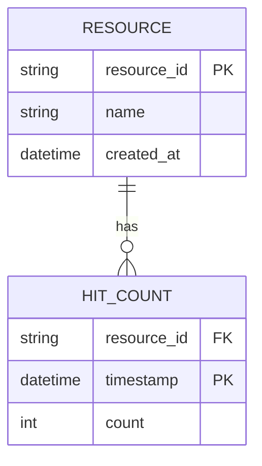
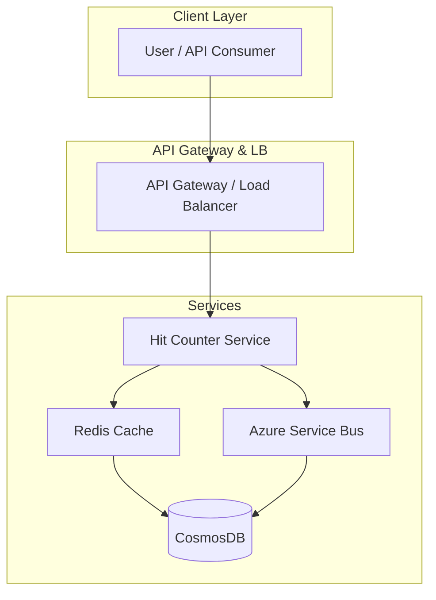
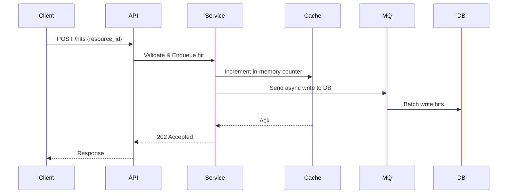
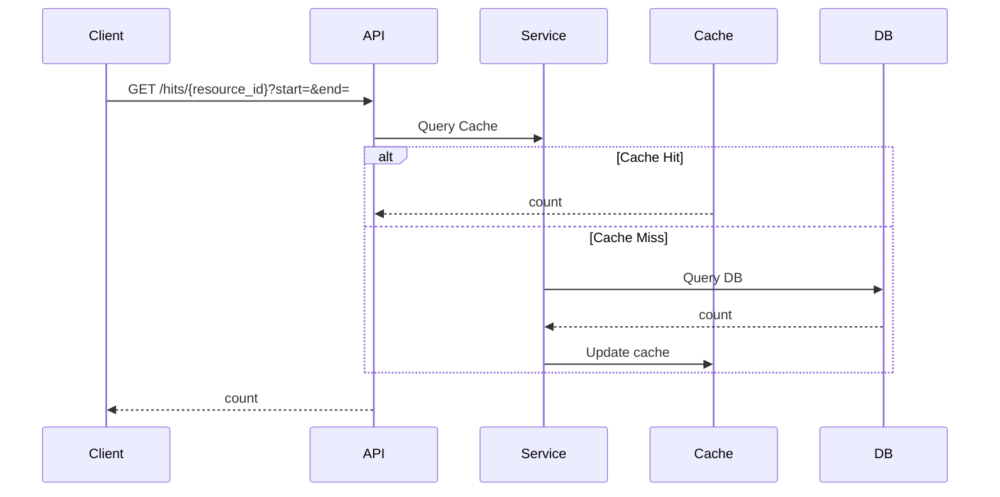

# Hit Counter System Design

## System Overview
- Tracks and reports hits to resources (e.g., webpages, APIs) in real-time.
- Designed for millions of QPS with low latency and high availability.
- Focus on scalable counting, querying by time windows, retention, and fault tolerance.
- Core challenges: high write throughput, concurrent consistency, horizontal scalability, cache invalidation.

## Requirements Analysis
### Functional Requirements
- Record a hit per resource ID.
- Query hit counts over arbitrary time windows (last minute, hour, day).
- Support creation and deletion of counters.
- Handle high concurrency with mostly writes.
- Data retention and expiry policies.

### Non-Functional Requirements
- **CAP Position:** Favor availability and partition tolerance; eventual consistency acceptable.
- **SLAs:** P99 read/write latency < 200ms; uptime 99.95%.
- **Scale Estimates:** 10M DAU, 100M hits/day, write-heavy QPS ~1200 (70% writes).
- Consistency: Eventual with read-after-write on hot data.

## Capacity Planning & Back-of-Envelope Calculations
- Traffic: 100M hits/day = ~1200 QPS (840 writes, 360 reads).
- Storage: ~36.5B hits/year; hot data (1 hour) in cache, cold data in DB.
- Bandwidth: ~200KB/s writes, 100KB/s reads.
- Compute: Autoscaling to handle peak loads.
- Azure costs: CosmosDB (storage), Redis (cache), AKS (compute).

## Data Model
### Core Entities


### Database Selection
- Use NoSQL (CosmosDB) for high write throughput and flexible schema.
- Relational DB for metadata management.
- Trade-off: NoSQL for scalability and availability, SQL for consistency.

### Partitioning & Indexing
- Partition by resource_id and time range with hash-based sharding.
- Index on resource_id + timestamp.
- TTL indexes for expiry.
> [!tip] Partitioning by resource_id prevents hot partitions and distributes load evenly.

### Schema Snippets
CosmosDB:
```json
{
  "id": "<resource_id>#<timestamp>",
  "resource_id": "<resource_id>",
  "timestamp": "<ISO8601 timestamp>",
  "hit_count": <integer>
}
```

PostgreSQL:
```sql
CREATE TABLE hit_counts (
    resource_id VARCHAR NOT NULL,
    timestamp TIMESTAMP NOT NULL,
    hit_count INT NOT NULL,
    PRIMARY KEY (resource_id, timestamp)
);
```

## API Design
- Use RESTful APIs for simplicity and broad compatibility.

### Critical APIs
| Method | Endpoint                | Request                       | Response                      | Status Codes         |
|--------|-------------------------|-------------------------------|-------------------------------|---------------------|
| POST   | /hits                   | {resource_id}                 | 202 Accepted                  | 202, 400, 429       |
| GET    | /hits/{resource_id}      | query: start_time, end_time   | {resource_id, count, period}  | 200, 404, 400       |
| POST   | /resources              | {name}                       | {resource_id}                 | 201, 400            |
| DELETE | /resources/{resource_id} | -                             | 204 No Content                | 204, 404            |

- Include rate limiting via API gateway and OAuth2/AAD authentication.

## High-Level Architecture


### Request Flow: Record a Hit


### Request Flow: Get Hit Count


## Microservices Decomposition
| Service               | Responsibility                              |
|-----------------------|----------------------------------------------|
| Hit Counter Service   | Handles write/read hits, caching logic     |
| Resource Management   | Manages resource metadata and lifecycle    |
| Analytics Service     | Aggregates and analyzes hit data            |

- Use sync communication for reads, async messaging (Azure Service Bus) for writes.
- Service discovery via AKS or Service Fabric.

## Deep Dives
### Caching Strategy and Invalidation
- Redis Cache for hot (last hour) data with TTL eviction.
- Write-through cache: update cache + enqueue DB writes asynchronously.
- TTL-based cache invalidation keeps data fresh.

### Rate Limiting
- API Gateway enforces rate limits per client and global.
- Token Bucket algorithm for burst handling.
- Exceeding limits returns HTTP 429.

### Distributed Transactions/Saga Pattern
- Not required due to simple count increments.
- Use idempotency keys with batched writes for reliability.
```python
class HitCounterService:
    def write_hit(self, resource_id, timestamp, count, idempotency_key):
        if self.has_processed(idempotency_key):
            return
        self.persist_hit(resource_id, timestamp, count)
        self.mark_processed(idempotency_key)
```

## Infrastructure & DevOps
- Azure AKS for container orchestration.
- Azure Service Bus for asynchronous messaging.
- CosmosDB as primary NoSQL store.
- Azure Redis Cache for in-memory hot data.
- CI/CD pipelines with Azure DevOps.
- Infrastructure as Code using Bicep or Terraform.
- Blue-green deployments for zero downtime.

## Cross-Cutting Concerns
### Security
- Azure AD/OAuth2 for authentication.
- RBAC for fine-grained authorization.
- Encryption at rest (Azure Storage) and in transit (TLS).
- Secrets management with Azure Key Vault.

### Observability
- Metrics and alerts via Azure Monitor.
- Distributed tracing using Application Insights.
- Centralized logging (Azure Log Analytics).
- SLA breach and error spike alerts.

### Resilience
- Circuit breakers, retries with exponential backoff.
- Bulkhead pattern for fault isolation.
- Graceful degradation by serving stale cache.

### Performance
- Multi-tier caching: Redis + CDN.
- Connection pooling and query tuning.

## Scalability & Reliability
- Autoscale AKS pods by CPU and queue length.
- CosmosDB read replicas for read scaling.
- Buffered writes using Azure Service Bus.
- Multi-region failover and backups.
- L4/L7 load balancing (Azure Front Door).

## Trade-offs & Alternatives
| Decision           | Pros                           | Cons                         |
|--------------------|--------------------------------|------------------------------|
| CosmosDB (NoSQL)   | Scalable, low-latency writes    | Eventual consistency issues  |
| SQL metadata store | Strong consistency              | Scaling challenges           |
| Microservices      | Independent deployability       | Increased complexity         |
| Write-through cache| Fresh cache data                | Higher write latency         |

- At 10x scale, implement CQRS and data aggregation.

## Interview Discussion Points
- Handling hotspots and hot keys.
- Data retention and archiving strategies.
- Consistency vs availability trade-offs.
- Disaster recovery and failover designs.
- Identifying bottlenecks in cache and storage.
