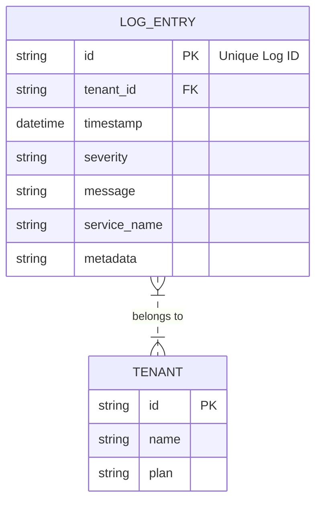
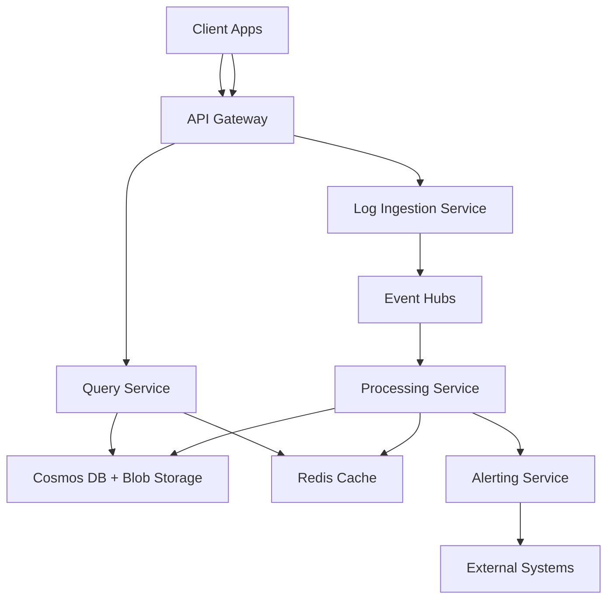

# High-Throughput Logging System Design

---

## 1. System Overview 🎯

- High-throughput logging system to ingest, process, store, and query massive volumes of logs from distributed sources.
- Scope: Real-time log ingestion, durable storage, search/analytics support, and alerting hooks.
- Challenges: High write QPS, data durability, low latency ingestion, scalable storage, fault tolerance, query flexibility.

---

## 2. Requirements Analysis 📊

### Functional Requirements (FRs)
- FR1: Ingest millions of log events per second from diverse clients.
- FR2: Durable, append-only storage for replay and audit.
- FR3: Real-time querying and analytics on fresh logs.
- FR4: Support structured & unstructured log formats.
- FR5: Multi-tenant support with access control.
- FR6: Alerting on log pattern detection.
- FR7: Bulk export and archival capabilities.

### Non-Functional Requirements (NFRs)
- CAP: Prioritize Availability & Partition tolerance (AP) due to need for continuous logging in distributed environments.
- SLAs: P99 write latency < 200ms, 99.95% uptime.
- Scale: Up to 10M QPS writes, Read:Write ratio ~1:10.
- Consistency: Eventual consistency acceptable for reads, strong consistency for critical metadata (e.g., configs).

---

## 3. Capacity Planning & Back-of-Envelope Calculations 📈

- Traffic: 10M QPS writes, 1M QPS reads. Growth 20% YoY.
- Storage: Avg log size = 1KB; daily data = 10M * 1KB * 86400 = ~864TB/day.
- Hot data (7 days) ~6.05PB; Cold archive (90 days) ~77PB.
- Bandwidth: Ingress ~80Gbps; Egress for queries depends but ~10Gbps baseline.
- Compute: Cluster of microservices scaled horizontally with autoscaling.
- Cost: Use Azure Blob Storage + Cosmos DB; Event Hubs for ingestion; Redis cache for hot reads.

---

## 4. Data Model 🔧



- DB Choice: Cosmos DB (NoSQL) for high write throughput, partitioning, schema flexibility.
- Schema: Semi-structured JSON stored in Cosmos Containers.
- Partitioning: TenantID + timestamp prefix for range queries.
- Indexing: Composite indexes on timestamp, severity for query efficiency.

> [!tip] Favor AP over CP for log storage to handle partitioned networks gracefully.

---

## 5. API Design ⚡

Protocol: REST with JSON due to broad compatibility.

| Endpoint                  | Method | Request Body                          | Response               | Notes                      |
|---------------------------|--------|-------------------------------------|------------------------|----------------------------|
| /logs/ingest              | POST   | batch of log entries                 | 202 Accepted           | Async ingestion; throttling|
| /logs/query               | POST   | query DSL (time range, filters)     | paginated logs          | Real-time query support     |
| /logs/export              | GET    | query params (time range, tenant)   | CSV/JSON stream        | Bulk export, async          |
| /alerts                   | POST   | alert config                        | alert ID               | Create alert rules          |
| /alerts/{id}              | DELETE | -                                   | 204 No Content         | Delete alert                |

- Use JWT tokens for auth; rate limit /logs/ingest per tenant.
- Error Handling: 429 for rate limiting, 400 for bad requests, 500 for server errors.

---

## 6. High-Level Architecture (HLD) 🏗️



> [!tip] Diagram breakdown supports scale and decoupled ingestion-processing-query flows.

---

## 7. Microservices Decomposition 🧱

| Service              | Responsibility                               |
|----------------------|----------------------------------------------|
| Ingestion Service    | Receive & batch log events, publish to queue|
| Processing Service   | Transform, enrich, store logs                 |
| Query Service       | Serve user queries with caching               |
| Alerting Service    | Evaluate logs against alert rules             |
| Tenant Management   | Handle tenants, auth, and rate limiting       |

- Communication mostly async via message queues; sync REST for queries.
- Service discovery using Azure Service Fabric or Kubernetes.
- Boundaries align with DDD: logging and alerting domains separated.

---

## 8. Deep Dives 🔍

### Search Implementation (Azure Cognitive Search)
- Index logs in near real-time from Cosmos DB.
- Support rich full-text search + filters.
- Handles scaling transparently.

### Rate Limiting & Throttling
- Token bucket algorithm per tenant.
- Graceful degradation when limits exceeded.

```python
 # Simplified token bucket rate limiter example
 class TokenBucket:
     def __init__(self, rate, capacity):
         self.rate = rate  # tokens per second
         self.capacity = capacity
         self.tokens = capacity
         self.timestamp = time.time()

     def consume(self, tokens=1):
         now = time.time()
         delta = now - self.timestamp
         self.tokens = min(self.capacity, self.tokens + delta * self.rate)
         self.timestamp = now
         if self.tokens >= tokens:
             self.tokens -= tokens
             return True
         return False
```

### Audit Logging & Event Sourcing
- Critical metadata changes logged immutably.
- Use event sourcing for alert configs and tenant management.

---

## 9. Infrastructure & DevOps 🛠️

- Azure Event Hubs for log ingestion buffering.
- Cosmos DB for storage; Blob Storage for cold archive.
- AKS for microservices hosting.
- Azure Redis Cache for hot data.
- Azure Monitor & App Insights for observability.
- CI/CD: GitHub Actions + Azure DevOps pipelines with Terraform IaC.
- Deploy: Blue/green + canary deployments with Kubernetes rollout.

---

## 10. Cross-Cutting Concerns 🛡️

- Security:
  - Authentication: Azure AD + OAuth2, JWT tokens.
  - Authorization: RBAC per tenant.
  - Encryption: TLS in transit, AES-256 at rest.
  - Secrets: Azure Key Vault.
- Observability:
  - Metrics with Azure Monitor.
  - Distributed tracing via App Insights/OpenTelemetry.
  - Centralized log aggregation and alerts.
- Resilience:
  - Circuit breakers & retries.
  - Bulkheads to isolate faults.
  - Graceful degradation under overload.
- Performance:
  - Redis multi-tier caching.
  - Query optimization with indexing.

---

## 11. Scalability & Reliability 📈

- Horizontal auto-scaling with AKS based on CPU/memory & queue length.
- Cosmos DB read replicas for query load.
- CQRS for separating write (ingestion) and read (query) workloads.
- Event Hubs provide durability and replay for ingestion.
- Disaster Recovery:
  - Azure Backup, snapshot policies.
  - Multi-region writes and geo-failover (RTO < 5 mins, RPO < 1 min).
- Load Balancers:
  - L7 API Gateway for routing & authentication.
  - L4 for microservice internal traffic.

---

## 12. Trade-offs & Alternatives 🔄

| Decision              | Pros                                   | Cons                                   |
|-----------------------|---------------------------------------|---------------------------------------|
| Cosmos DB vs SQL      | Scales writes, flexible schema        | Limited complex joins, eventual cons. |
| Event Hubs vs Kafka   | Managed, integrated with Azure        | Kafka more customizable but operational overhead |
| Monolith vs Microservices | Scalability, independent deploy       | Complexity, operational cost           |
| Build vs Buy Search    | Azure Cognitive Search ready to use   | Less control over indexing, cost      |

- At 10x scale: consider dedicated Kafka, sharded ES clusters.
- Microservices benefit in modularity but add complexity.

---

## 13. Interview Discussion Points 💬

- How to guarantee log ordering?
- Handling backpressure in ingestion?
- Data retention policies & cold storage trade-offs.
- Multi-region consistency challenges.
- Extending for anomaly detection and ML.
- Bottlenecks in query latency & scaling alerting.

---

> [!important] This document balances engineering rigor with brevity, suitable for senior/interview use.
