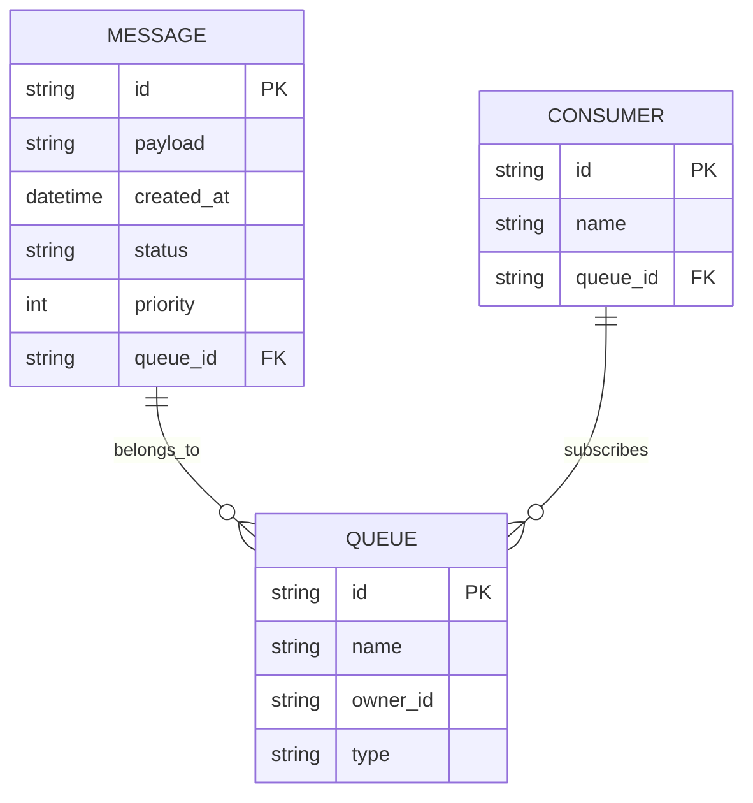
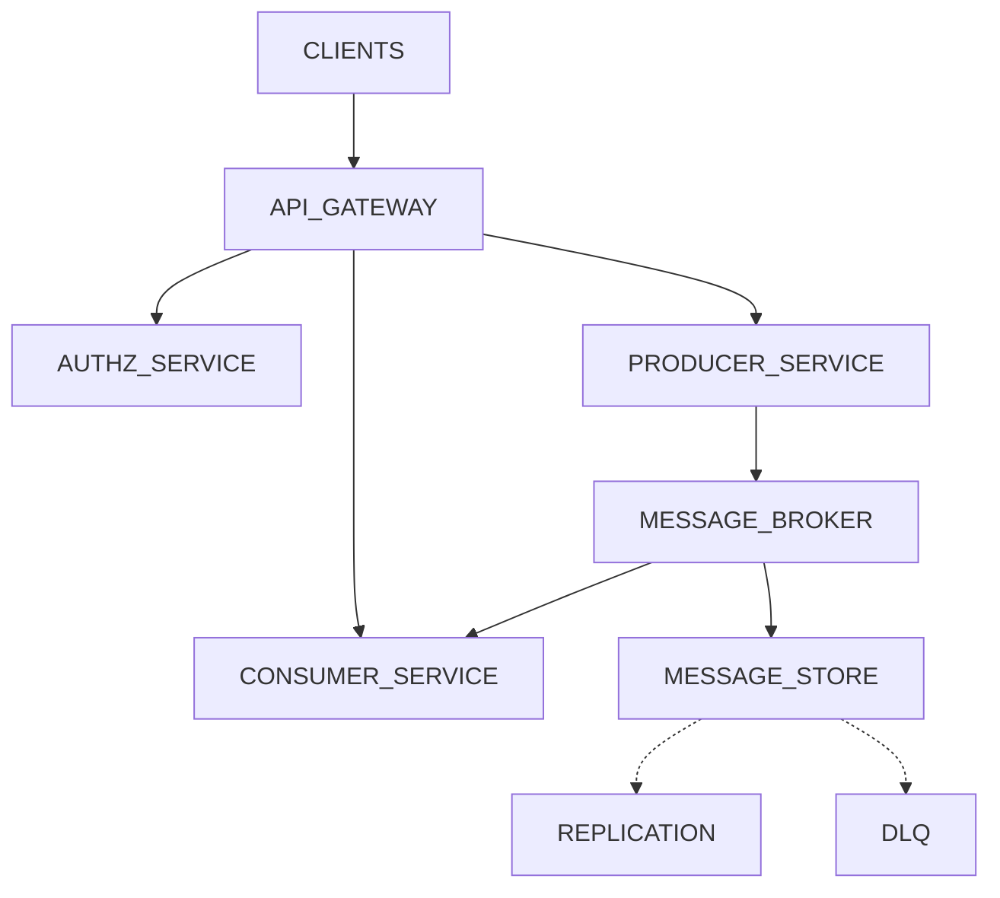

# Messaging Queues for Fault Tolerance and Scalability

---

## 1. System Overview 🎯
- Messaging queues enable asynchronous, reliable communication between distributed components, decoupling producers and consumers to improve fault tolerance and scalability.  
- **Core problem:** Designing a system that ensures reliable message delivery, high availability, and horizontal scalability for millions of QPS.  
- Challenges include handling failures without message loss, balancing consistency vs availability, scaling consumers dynamically, and minimizing latency.

## 2. Requirements Analysis 📊
- **Functional Requirements (FRs):**  
  - FR1: Durable message persistence with no loss  
  - FR2: At-least-once or exactly-once delivery guarantees  
  - FR3: Support for message ordering (FIFO) and priority queues  
  - FR4: Horizontal scalability for producers and consumers  
  - FR5: Dead Letter Queues (DLQ) and retry mechanisms  
  - FR6: Support synchronous and asynchronous consumption  
  - FR7: Multi-tenancy and access control per queue/topic  

- **Non-Functional Requirements (NFRs):**  
  - CAP: Partition tolerance mandatory; prefer Availability with eventual consistency in most use cases to maximize throughput and latency constraints.  
  - SLAs: P99 latency ≤ 200ms for enqueue/dequeue; 99.95% uptime; durability with RPO near zero.  
  - Scale estimates: DAU ~10M; average QPS ~1M writes, 2M reads (read:write ~2:1); daily data volume ~100s of GB.  
  - Trade-off: Choose Availability over Strong Consistency where possible; use transactions & idempotency for critical paths.

## 3. Capacity Planning & Back-of-the-Envelope Calculations ⚡
- **Traffic:**  
  - Peak QPS write = 1M msg/s, read = 2M msg/s  
  - Growth: 50% YoY → ~1.5M writes & 3M reads in 1 year  

- **Storage:**  
  - Avg msg size = 1KB → daily storage ~ (1M * 3600 * 24 * 1KB) ≈ 86 TB raw  
  - Retention: 7 days hot storage + 30 days cold → ~610 TB total  

- **Bandwidth & Compute:**  
  - Network bandwidth ~ peak QPS * msg size * 2 (in/out) ~ 2 GB/s  
  - Compute: autoscale consumers/producers on AKS nodes; ~1000 nodes initially  

- **Cost:**  
  - Use Azure Service Bus & Cosmos DB for storage; estimate $10K-$30K/month at this scale  

> [!tip] Focus capacity planning on growth elasticity and durable storage costs on Azure.

## 4. Data Model 🔧




- **Database choice:** Cosmos DB (NoSQL) for distributed low-latency storage; alternatives: Azure SQL with partitioning.  
- Partitioning by queue_id + hash key for scale and isolation.  
- Index on queue_id, status, priority for query efficiency.  

> [!tip] Cosmos DB's multi-region replication supports fault tolerance and low latency.

## 5. API Design 🔍
- Protocol: REST + gRPC hybrid; REST for management, gRPC for high-throughput messaging  
- Critical APIs:  
```node
  - POST /queues: Create queue  
  - POST /queues/{id}/messages: Enqueue message  
  - GET /queues/{id}/messages: Dequeue message  
  - POST /queues/{id}/messages/{msgId}/ack: Acknowledge message  
  - GET /queues/{id}/dlq: Access dead letter queue  
  - POST /queues/{id}/messages/retry: Trigger retry  
```
- Return codes: 200/201 success, 400 bad request, 429 rate limit, 503 temporary failure  
- Auth: OAuth2 with Azure AD; RBAC at queue level  
- Rate limits: per client/queue with bursts allowed  

## 6. High-Level Architecture (HLD) 📈



- API Gateway handles auth, routing, rate limiting  
- Producers enqueue messages asynchronously to Message Broker (Azure Service Bus or Kafka)  
- Consumers subscribe and process messages  
- Message Store uses Cosmos DB with replication for durability  
- DLQ supports failed message handling  
- Sequence: Producer→API Gateway→Message Broker→Consumer→Ack

## 7. Microservices Decomposition 🔩
- **Producer Service:** Receives messages, validates, sends to broker  
- **Consumer Service:** Polls, processes, acknowledges messages  
- **Queue Management:** Create/update/delete queues, authorization  
- **Monitoring & Alerting:** Tracks queue lengths, lag, errors  
- Comm: Async via broker, sync REST/gRPC for control plane  
- Discovery: Kubernetes service mesh (e.g., Istio)  
- Boundaries per domain: message ingestion vs message consumption vs management  

## 8. Deep Dives 

<details>
<summary>Distributed Transactions and Sagas</summary>

- Use sagas for cross-service message processing compensations  
- Idempotent consumers with deduplication by message ID  

```python
## Exponential Backoff Retry
import time
def retry(func, retries=5):
	for i in range(retries):
		try:
			return func()
		except Exception:
			time.sleep(2 ** i)
			raise Exception("Max retries reached")
```

</details>
<details>
<summary>Real-time Updates with SignalR</summary>

- Push message status or DLQ alerts via SignalR for web clients  
- Auto-scale SignalR hubs in Azure for high throughput  

</details>
<details>
<summary>Caching and Cache Invalidation</summary>

- Use Redis cache for frequently queried queue metadata  
- Cache invalidation on queue updates via pub/sub  

</details>

## 9. Infrastructure & DevOps 🚀
- AKS cluster for microservices orchestration  
- Azure Service Bus for message broker or Event Hubs for event stream  
- Cosmos DB globally distributed for data storage  
- Azure Monitor + App Insights for observability  
- CI/CD: Azure DevOps pipelines, Terraform IaC  
- Deployment: Canary + blue/green via AKS and load balancers  

## 10. Cross-Cutting Concerns 🛡️
- **Security:** OAuth2 via Azure AD, RBAC, encryption in transit (TLS) and at rest (AES-256), Key Vault for secrets  
- **Observability:** Metrics (queue length, latency), App Insights tracing, centralized logs, alerts on lag & failure  
- **Resilience:** Circuit breaker in consumer, retry with backoff, bulkheading consumer threads  
- **Performance:** Redis caching, connection pooling, CDN for static assets if any  

## 11. Scalability & Reliability 📈
- Horizontal scaling of consumers/producers based on queue depth  
- Use CosmosDB change feed for event-driven processing  
- CQRS pattern for read vs write workloads (separate read replicas)  
- Multi-region active-active deployment for DR with failover  
- Load balancing on L4 (TCP) and L7 (HTTP) at ingress  

## 12. Trade-offs & Alternatives ⚖️
| Decision              | Pros                           | Cons                       |
|----------------------|--------------------------------|----------------------------|
| Cosmos DB vs SQL     | Global scale, multi-master      | Complex transactions       |
| Service Bus vs Event Hubs | Rich features, DLQ support    | Lower throughput vs Event Hubs |
| Microservices vs Monolith | Scalability, independent deploy | Complexity, operational overhead |
| Exact vs At-least-once delivery | Guaranteed no duplicates       | Higher latency, complexity |

- At 10x scale, use partitioned Kafka clusters or shard Cosmos DB further  
- Build vs buy: prefer managed Azure services to focus on business logic  

## 13. Interview Discussion Points 💬
- How to handle message duplication and ordering guarantees?  
- Strategies for consumer failures and DLQ processing?  
- Design choices under network partition (CAP trade-offs)?  
- Impact of scaling consumers on delivery semantics?  
- How to monitor and alert for message backlog and latency spikes?  
- Handling cross-queue transactions or saga consistency?  

---

> [!important] This document balances architectural maturity with practical constraints emphasizing Azure cloud-native design, fault tolerance, and scalability for senior role interviews.
