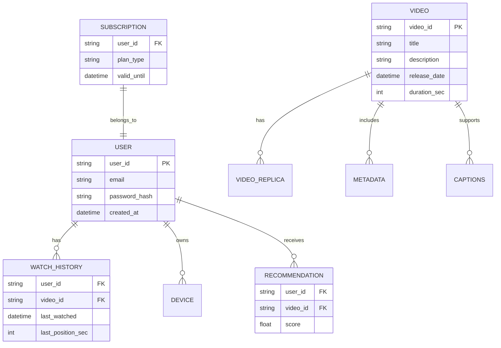
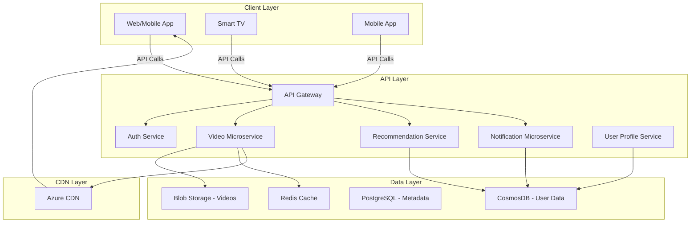
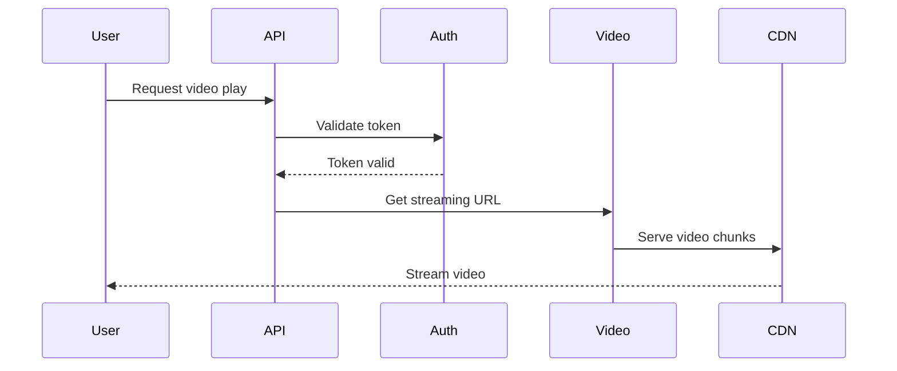

# Netflix System Design - Senior/Staff/Principal Engineer Interview

---

## 1. System Overview

Netflix is a global video streaming service delivering on-demand multimedia content at massive scale. The system's core responsibility is to provide highly available, low-latency video streaming with personalized recommendations and seamless user experience.

**Problem Statement:**
- Efficiently store, index, and stream petabytes of video data worldwide
- Support millions of concurrent users with minimal latency
- Personalize content recommendations and adapt to user preferences dynamically

**Key challenges:**
- Scalability for millions of daily active users (DAU) with peak concurrency
- High availability across multiple geographic regions
- Content delivery and streaming optimization
- Real-time personalization and search

---

## 2. Requirements Analysis

### Functional Requirements (FRs)
- User account management & authentication
- Video catalog browsing & search
- Video streaming with adaptive bitrate
- Personalized recommendations
- Watch history & resume playback
- Content uploading by licensors
- Notification system for new releases

### Non-Functional Requirements (NFRs)
- **CAP Theorem Positioning:** Prioritize Availability and Partition tolerance (AP) with eventual consistency for user personalized data; Strong consistency for critical user data like account info.
- **SLAs:** P99 latency < 200ms for UI interactions; Video streaming startup < 1s; 99.95% uptime globally
- **Scale Estimates:**
  - DAU: ~200M
  - Peak QPS: 20M (Read-heavy, 100:1 read/write ratio)
  - Data Volume: Multi-petabyte video store
- **Consistency vs Availability:** Critical data (authentication, subscription status) requires strong consistency; Recommendations and watch history can tolerate eventual consistency.

---

## 3. Capacity Planning & Back-of-Envelope Calculations

- **Traffic:**
  - DAU 200M, average sessions/day: 1.5, average session length: 1hr
  - Assume peak concurrency: 10% of DAU = 20M concurrent users
  - Average QPS: 20M, mostly read operations (video stream requests, UI data)

- **Storage:**
  - Video content size: 10PB (multi-representation for adaptive bitrate)
  - Metadata & user data: 10TB
  - Hot data: Recent & popular videos (20%) stored on SSD cache
  - Cold data: Older/out-of-demand videos on cheaper storage

- **Bandwidth & Compute:**
  - Average bitrate 3 Mbps -> peak bandwidth ~60 Tbps globally
  - Need geo-distributed CDN
  - Transcoding compute for uploading/licensing content

- **Cost Implications:**
  - Use Azure Blob Storage for cold data, Premium SSD for hot metadata
  - AKS/EKS for microservices
  - Azure CDN or equivalent

---

## 4. Data Model



### Database Selection
- Use CosmosDB for user and session data (multi-region, low latency, flexible consistency)
- Blob Storage for video content
- Metadata in SQL (PostgreSQL Hyperscale) for relational querying

### Partitioning Strategy
- User data partitioned by user_id
- Video metadata partitioned by video_id
- Recommendations partitioned by user_id

### Indexing Strategy
- Secondary indexes on user_id and video_id for fast lookups

> [!tip] Choose NoSQL for scale & geo-distribution in user/session data, SQL for strong relational features in metadata.

---

## 5. API Design

| API Endpoint                 | Method | Description                      | Request Body / Params                       | Response                                | Status Codes            |
|------------------------------|--------|--------------------------------|--------------------------------------------|----------------------------------------|------------------------|
| POST /users/signup            | POST   | Create new user account         | {email, password}                          | {user_id, token}                        | 201, 400, 409           |
| POST /users/login             | POST   | Authenticate user               | {email, password}                          | {token, user_id}                       | 200, 401                |
| GET /videos                  | GET    | List videos & filtering         | {category, sort_by, page, limit}           | [VideoMetadata]                        | 200                     |
| GET /videos/{video_id}/play  | GET    | Stream video with adaptive bitrate | video_id in path                          | Streaming URL / chunks                  | 200, 404                 |
| GET /recommendations          | GET    | Personalized recommendations   | user_id (auth token)                       | [VideoMetadata]                        | 200                     |
| POST /watch-history          | POST   | Update resume position          | {user_id, video_id, position}              | 200                                    | 200, 400                 |
| POST /notifications/subscribe | POST   | Subscribe to notifications      | {user_id, notification_type}                | 200                                    | 200                     |

- Auth via OAuth 2.0 / JWT
- Rate limit critical endpoints

---

## 6. High-Level Architecture (HLD)



### Sequence Diagram: Play Video



---

## 7. Microservices Decomposition

| Service Name          | Responsibility                              | Communication         |
|-----------------------|---------------------------------------------|-----------------------|
| Auth Service          | User authentication & authorization         | Sync (REST/gRPC)       |
| User Profile Service  | Manage user accounts & preferences           | Sync (REST/gRPC)       |
| Video Service         | Video metadata & streaming link management    | Sync + Async (events)  |
| Recommendation Service| Generate & serve personalized recommendations | Async (event-driven)   |
| Notification Service  | Manage user notifications                      | Async (Pub/Sub)        |

- Service boundaries based on bounded contexts: user management, video, recommendations
- Async communication for recommendation and notifications via message queues

---

## 8. Deep Dives

### a) Caching Strategy
- Multi-tier cache: Redis for metadata hot cache; CDN for video content caching
- Cache invalidation via event-driven updates for metadata changes
- Consider TTLs and stale-while-revalidate policies

### b) File Storage & CDN Strategy
- Store videos in Azure Blob Storage with geo-replication
- Use Azure CDN for global low-latency delivery
- Adaptive bitrate streaming leveraging manifest files (HLS/DASH)

### c) Distributed Transactions (Saga Pattern)
- Use Saga orchestrator for multi-step workflows like subscription updates
- Use compensating transactions to handle failures

```python
# Python snippet for saga orchestration example
class SagaOrchestrator:
    def __init__(self):
        self.steps = []

    def add_step(self, action, compensation):
        self.steps.append((action, compensation))

    def execute(self):
        for action, compensation in self.steps:
            try:
                action()
            except Exception:
                for _, comp in reversed(self.steps):
                    comp()
                raise
```

---

## 9. Infrastructure & DevOps

- Azure Kubernetes Service (AKS) for container orchestration
- Azure Cosmos DB for multi-region, low-latency user data
- Azure Blob Storage with CDN for content delivery
- Azure Service Bus for async messaging
- Monitoring with Azure Monitor & Application Insights
- CI/CD via Azure DevOps pipelines
- Terraform/Bicep for IaC
- Canary deployments + blue-green release

---

## 10. Cross-Cutting Concerns

### Security
- Authentication: Azure AD & OAuth 2.0 JWT tokens
- RBAC for authorization
- Encryption in transit (TLS) & at rest (AES-256)
- Secrets management via Azure Key Vault

### Observability
- Metrics with Azure Monitor
- Distributed tracing with Application Insights + OpenTelemetry
- Log aggregation with Log Analytics
- Alerting on SLIs/SLOs breaches

### Resilience
- Circuit breakers and retries with exponential backoff
- Bulkheads to isolate failures
- Graceful degradation for non-critical features

### Performance
- Caching layers: multi-tier Redis + CDN
- Connection pooling in DB clients
- Query optimization & lazy loading

---

## 11. Scalability & Reliability

- Horizontal scaling with AKS auto-scalers
- Database read replicas & CQRS pattern for read scalability
- Azure Service Bus for buffering and smoothing spikes
- Multi-region deployment with active-active regions
- Disaster recovery: daily backups, RTO < 30 mins, RPO < 15 mins
- Load balancing using Azure Front Door (L7) + VIPs (L4)

---

## 12. Trade-offs & Alternatives

| Decision                     | Pros                                      | Cons                                    |
|------------------------------|-------------------------------------------|-----------------------------------------|
| CosmosDB vs SQL              | Geo-distribution, low latency, scalability| Eventual consistency on some data       |
| Microservices vs Monolith    | Scalability, team autonomy, fault isolation | Operational complexity                  |
| Azure Blob + CDN vs Custom CDN | Fully managed, cost effective            | Less customization                      |

- At 10x scale: consider CQRS and event sourcing
- Monolith might simplify early-stage development but not scale well
- Build recommendation engine vs third-party personalization APIs balance time-to-market vs customization

---

## 13. Interview Discussion Points

- How to handle real-time recommendation updates?
- Strategies for graceful degradation in streaming failures
- Consistency trade-offs in user session management
- Handling data privacy, compliance across regions
- Debugging performance bottlenecks at scale
- What failure modes are you most concerned about and mitigation?

---
