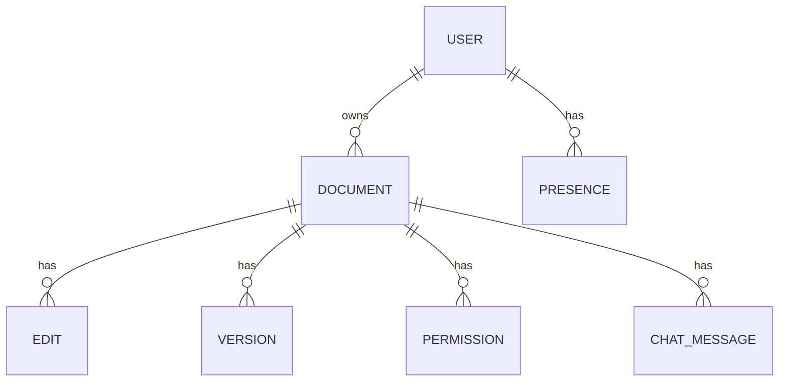
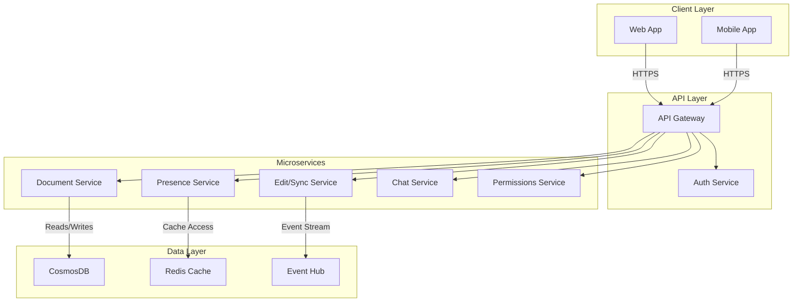

# Real-Time Collaboration Tool System Design

---

## 1. System Overview 🎯

- Real-time collaboration tool enabling multiple users to edit and interact on shared documents/spaces simultaneously.
- Scope: Real-time text/graphics collaboration, presence, and messaging. Excludes complex video/audio conferencing.
- Key challenges: Low latency synchronization, conflict resolution, scalability, and data consistency across geo-distributed clients.

## 2. Requirements Analysis 📋

### Functional Requirements (FRs)
- FR1: Multi-user real-time document editing with concurrent cursors and presence indicators.
- FR2: Document versioning and conflict resolution for offline edits sync.
- FR3: Real-time messaging/chat within document context.
- FR4: Access control and permissions management.
- FR5: File attachments and media embedding.
- FR6: User presence and activity indicators.
- FR7: Audit trail for document changes.

### Non-Functional Requirements (NFRs)
- CAP positioning: Prioritize Consistency and Availability over Partition tolerance due to expected reliable network (CA in typical LAN) with fallback to eventual consistency in WAN.
- SLA: P99 latency < 200ms for edit sync; 99.95% uptime.
- Scale: DAU ~ 10M, QPS 100k writes / 1M reads; 10:1 read/write ratio.
- Consistency vs Availability: Strong eventual consistency for selected conflict prone operations; optimistic concurrency control.

## 3. Capacity Planning & Back-of-Envelope Calculations 📊

- Users: 10M DAU; average session 30min; 50% concurrent active editors ~ 5M;
- Writes: 100k QPS (edit ops/events), Reads: 1M QPS (document fetch, presence updates)
- Data: Avg document size 100 KB, 100K active documents;
- Storage: Hot data (active docs, 20%) ~ 2TB, Cold archive 8TB/year
- Bandwidth: Edit event size ~1KB; total ~100MB/s write + 1GB/s read
- Compute: Approx 1000 mid-tier VMs or AKS pods with autoscaling
- Cost: Azure CosmosDB + Redis + Event Hubs + AKS cluster + CDN approx $100k/month

## 4. Data Model 💾

### Core Entities (Mermaid ER)


### Database Selection
- Use CosmosDB (multi-region, low latency) for document storage + audit log.
- Use Redis for presence and session state caching.
- Trade-off: CosmosDB offers scalability and global distribution, sacrifices strong ACID but supports transactional batch operations.

### Schema snippet (CosmosDB)
```json
{
  "id": "doc123",
  "type": "DOCUMENT",
  "ownerId": "userA",
  "content": "...",
  "version": 10,
  "permissions": ["userA", "userB"],
  "lastModified": "2025-10-01T12:00:00Z"
}
```

### Partitioning
- Partition by DocumentID for document operations to localize access.
- Use UserID partition for presence to shard by user session.

### Indexing
- Composite indexes on (DocumentID + Version) for version queries.

> [!tip] Partition wisely to avoid hot partitions and enable horizontal scaling.

## 5. API Design 🔧

- Use REST with JSON for simplicity and wide client compatibility.
- Auth via OAuth2 / AAD tokens.

| API Endpoint          | Method | Request                     | Response                  | Status Codes             | Notes                      |
|-----------------------|--------|-----------------------------|---------------------------|--------------------------|----------------------------|
| /documents            | POST   | {title, ownerId}             | {docId, createdAt}         | 201, 400, 401             | Create new document         |
| /documents/{id}       | GET    |                             | {docDetails}               | 200, 404                  | Fetch document details      |
| /documents/{id}/edit  | PATCH  | {changes, clientVersion}     | {newVersion, conflicts}   | 200, 409                  | Apply edits with concurrency|
| /documents/{id}/chat  | POST   | {message, senderId}          | {messageId, timestamp}    | 201, 401                  | Post chat message          |
| /presence/{userId}    | GET    |                             | {onlineStatus}             | 200                      | Get user presence          |

- Rate limit: 1000 req/min per user
- Error handling: standard HTTP codes + error object with codes

## 6. High-Level Architecture 🌐



> [!note] Client sends edits to Edit/Sync Service which streams changes via Event Hub for durability and fanout.

## 7. Microservices Decomposition 🛠️

- Document Service: CRUD and version management
- Edit/Sync Service: Real-time updates, operational transform/CRDT logic
- Presence Service: Online status, activity indicators
- Chat Service: Messaging within documents
- Permissions Service: Access control and enforcement

- Communication:
  - Sync via REST/gRPC for main APIs
  - Async via Event Hub for edit propagation

> [!tip] Service boundaries align with domain contexts and scalability needs.

## 8. Deep Dives 🔍

### Real-time updates
- Use WebSockets with fallback to SSE for browsers.
- Leverage SignalR in Azure for scaling connection hubs.
- Client sends patches (diffs) via WebSocket to Edit/Sync Service.

### Conflict Resolution
- Operational Transforms (OT) or CRDTs for merge without blocking.
- Example OT pseudocode:
```python
# Apply client patch with server version control
if client_version == server_version + 1:
    apply_patch(patch)
else:
    transform_patch()
```

### Cache invalidation
- Use Redis pub/sub to notify all service instances to invalidate stale cache on document updates.

## 9. Infrastructure & DevOps ⚙️

- AKS with Azure Service Mesh for microservices
- Azure CosmosDB multi-region for storage
- Azure Event Hubs for event streaming
- Azure Redis Cache for session and presence
- Azure App Insights for observability
- Terraform for IaC
- CI/CD with GitHub Actions deploying to AKS
- Blue-green deployment with feature flags

## 10. Cross-Cutting Concerns 🛡️

### Security
- OAuth2 with Azure AD for authentication
- RBAC for permissions
- TLS everywhere; encryption at rest with Azure Key Vault
- API Gateway for rate limiting and threat detection

### Observability
- Distributed tracing with App Insights & OpenTelemetry
- Centralized logs, metrics dashboards, alerts

### Resilience
- Circuit breakers with Polly
- Exponential backoff retries
- Bulkheads in service mesh
- Chaos experiments

### Performance
- Multi-layer caching (Redis + CDN)
- CDN for static assets
- Optimized DB queries with selective indexes

## 11. Scalability & Reliability 📈

- Autoscale AKS pods by CPU/memory and queue length
- CosmosDB auto-scale throughput
- CQRS pattern: read replicas for query scale
- Event Hubs buffer for write spikes
- Disaster recovery with multi-region failover
- L4/L7 load balancers with geoDNS

## 12. Trade-offs & Alternatives ⚖️

| Decision            | Pros                                | Cons                                |
|---------------------|-----------------------------------|------------------------------------|
| CosmosDB DB choice  | Globally distributed, low latency | Weaker ACID, eventual consistency  |
| WebSockets for RT    | Bidirectional, low latency        | Complex scaling, fallback needed   |
| Microservices       | Scalability, clear domains        | Service orchestration overhead     |
| OT vs CRDT          | OT mature but complex; CRDT simpler | OT needs centralized server; CRDT complexity |

- At 10x scale, consider event sourcing for audit and CQRS
- Monolith not suitable due to scaling
- Buy SaaS alternatives if speed-to-market prioritized

## 13. Interview Discussion Points 💬

- How to handle offline edits and conflict merges?
- Scaling WebSocket connections globally?
- GDPR and data locality considerations?
- Optimizing event stream latency?
- Handling partition tolerance in WAN scenarios?
- Extending to support multi-media real-time collaboration?

---

> [!important] This document balances architectural maturity and concise interview delivery to demonstrate expertise in distributed real-time systems and cloud-native Azure design.
