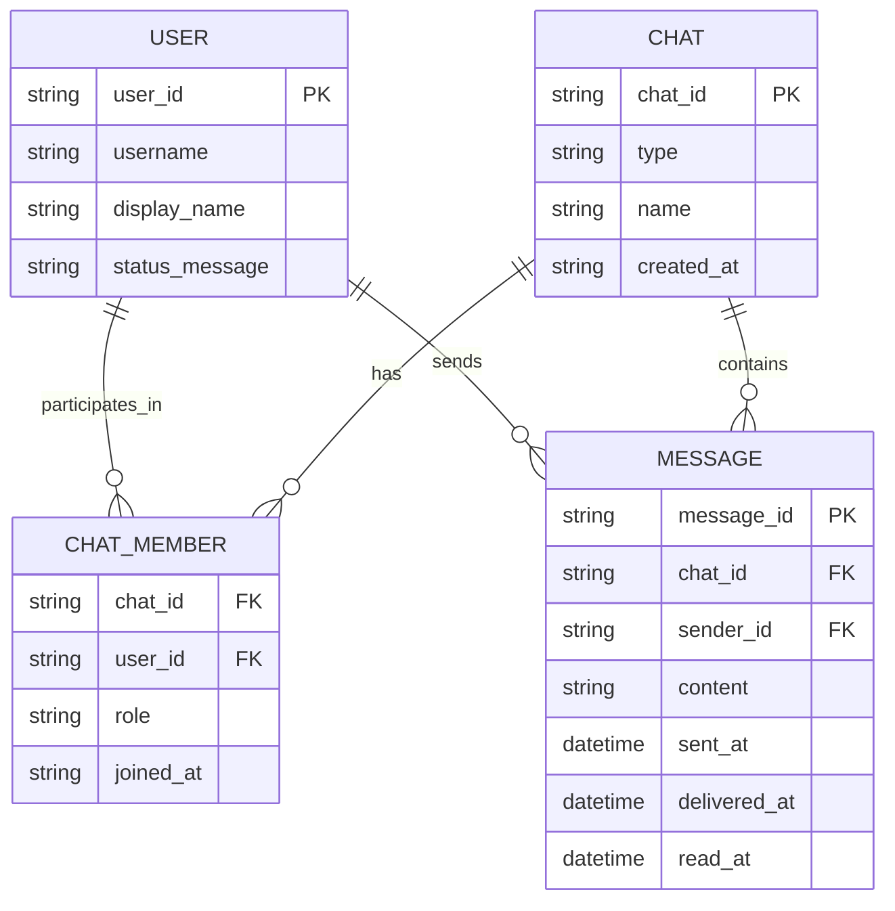
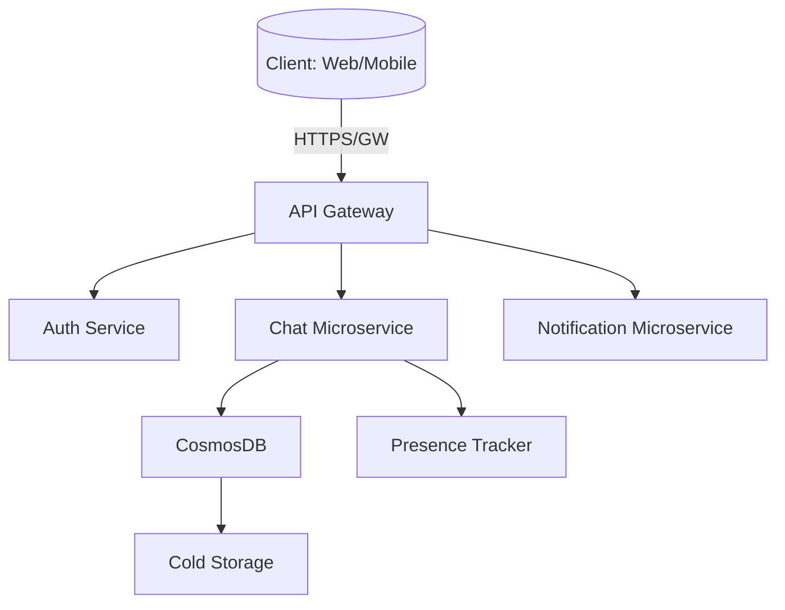
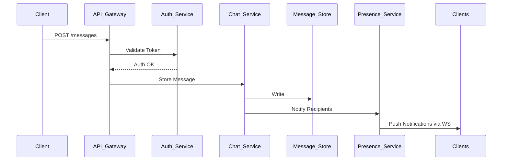

# Scalable Chat System Design

---

## 1. System Overview 🎯

- Scalable Chat is a distributed messaging platform designed to support millions of concurrent users with low latency, high availability, and strong consistency guarantees for typical chat workloads.
- The system enables real-time, asynchronous messaging with support for group chats, presence, and message history.
- Key challenges include balancing consistency and availability, real-time message delivery, and efficient storage at scale.

## 2. Requirements Analysis

### Functional Requirements (FRs)
- User-to-user real-time messaging with durable delivery
- Group chat support with membership management
- Presence and typing indicators
- Message history retrieval with chronological consistency
- Message search (text-based, metadata)
- Message read receipts and delivery status
- User profile and settings management

### Non-Functional Requirements (NFRs)
- **CAP Positioning:** Prioritize availability and partition tolerance (AP), with eventual consistency for message delivery but strong sequential consistency for message history per chat.
- **SLAs:** P99 latency < 150ms for message send/receive, 99.95% uptime, message durability 99.999%
- **Scale:** 
  - DAU: 50M active users
  - Peak QPS: 2M writes, 10M reads (5:1 read/write ratio)
  - Data Volume: ~40 PB cold storage annually
- **Consistency vs Availability:** Favor availability during network partitions; use causal and eventual consistency with compensating mechanisms.

## 3. Capacity Planning & Back-of-Envelope Calculations 📊

- Traffic:
  - Writes: 2M QPS peak, assume 10k messages/user/day
  - Reads: 10M QPS peak (including message fetch, presence updates)
- Storage:
  - Average message size: 1 KB
  - Hot storage (last 30 days): ~3 PB, cold storage thereafter
- Bandwidth:
  - Estimated 12 GB/s ingress/egress network bandwidth
- Compute:
  - Estimate 1000+ API servers, 500+ message processing workers
- Cost:
  - Use CosmosDB for hot data, Blob storage for cold archival
  - AKS clusters for compute, Azure Service Bus/Event Hubs for messaging

## 4. Data Model 💾



- **DB Selection:** CosmosDB for multi-region, low-latency global scale; Blob storage for archival
- **Partitioning:** Horizontal partition by chat_id for messages; user_id for user profiles
- **Indexing:** Secondary indexes on (chat_id, sent_at) for range queries; user_id for searches

> [!tip] Partition keys determine data locality and performance; careful selection balances scale and query efficiency.

## 5. API Design 🔧

- Use RESTful APIs with WebSockets for real-time message push

| Endpoint                 | Method | Request                                                    | Response                          | Notes                        |
|--------------------------|--------|------------------------------------------------------------|---------------------------------|------------------------------|
| POST /api/v1/messages    | POST   | {chat_id, sender_id, content}                              | {message_id, sent_at}            | Validates membership          |
| GET /api/v1/messages     | GET    | ?chat_id=&limit=&since=                                    | [messages]                      | Supports pagination           |
| POST /api/v1/chats       | POST   | {type, name, members[]}                                    | {chat_id}                      | Create group or private chat  |
| GET /api/v1/chats/{id}   | GET    |                                                            | {chat_info, members[]}          | Membership and metadata       |
| POST /api/v1/presence    | POST   | {user_id, status}                                          | {success}                      | User presence update          |
| WS /ws/messages          | WS     | Auth token                                                 | Real-time messages push         | WebSocket connection for push|

- Authentication: JWT tokens OAuth2, rate limiting per user
- Error codes: 400 (bad request), 401 (unauthorized), 403 (forbidden), 429 (rate limit)

## 6. High-Level Architecture (HLD) 🌐



### Sequence: Sending a Message


## 7. Microservices Decomposition 🔍

- **Auth Service:** User authentication and token management
- **Chat Service:** Core messaging, chat/group management
- **Presence Service:** Tracks user online status, typing
- **Notification Service:** Push and pull notifications

- **Communication:** REST + async events (Service Bus)
- Service registry via Azure Service Fabric or Kubernetes DNS

> [!important] Bounded contexts around domain logic clean separation, reduces cross-service coupling.

## 8. Deep Dives ⚡

### Real-time Updates (WebSockets + SignalR)
- Maintain long-lived WS connections per user (Azure SignalR Service)
- Use pub/sub internally to distribute messages efficiently
- Handle reconnects, backpressure

### Distributed Transactions / Saga Pattern
- Use compensating transactions for message delivery, group membership changes
- Event-driven saga orchestration via Azure Functions

### Caching & Invalidation
- Redis cache for recent messages and presence states
- Cache expiry tuned for consistency vs performance

```python
# Example: Basic message cache invalidation snippet
class MessageCache:
    def __init__(self):
        self.cache = {}

    def add_message(self, chat_id, message):
        if chat_id not in self.cache:
            self.cache[chat_id] = []
        self.cache[chat_id].append(message)

    def invalidate_cache(self, chat_id):
        if chat_id in self.cache:
            del self.cache[chat_id]
```

## 9. Infrastructure & DevOps 🔧

- Azure AKS for container orchestration
- CosmosDB for globally distributed database
- Azure Service Bus for async messaging
- Azure Functions for event-driven workflows
- Terraform for IaC; Azure DevOps pipeline for CI/CD
- Canary deployments via AKS ingress controller

## 10. Cross-Cutting Concerns 🛡️

- **Security:** OAuth2 & AAD based authentication, RBAC, data encryption (TLS + AES-256), Key Vault for secrets
- **Observability:** Azure Monitor, App Insights with distributed tracing (OpenTelemetry)
- **Resilience:** Circuit breakers, retries, bulkheads patterns implemented in core services
- **Performance:** Redis caching, CDN for static assets, optimized DB queries

## 11. Scalability & Reliability 📈

- Horizontal pod auto-scaling based on CPU, queue length
- CosmosDB multi-master for write availability
- CQRS pattern to separate read/write workloads
- Geo-replication with failover for disaster recovery
- Multi-region load balancing using Azure Front Door

## 12. Trade-offs & Alternatives ⚖️

| Decision                 | Pros                                   | Cons                                      |
|--------------------------|---------------------------------------|-------------------------------------------|
| CosmosDB (NoSQL)         | Ultra-low latency, multi-region scale | Complex consistency model                  |
| SQL DB (PostgreSQL)      | Strong consistency, relational schema | Limited geo-scale, complex sharding        |
| Microservices            | Scalability, team autonomy             | Operational complexity                      |
| Monolith                | Simplicity initially                  | Scalability and team velocity bottleneck  |

## 13. Interview Discussion Points 💬

- How to handle message ordering in distributed environment?
- Strategies for scaling WebSocket connections to millions?
- Handling offline message synchronization and delivery guarantees?
- Trade-offs between consistency and availability for chat messages?
- How to design audit logging and compliance for chat data?

---

> [!note] This document balances depth and brevity, with diagrams and callouts that guide a focused system design discussion for senior-level interviews.
