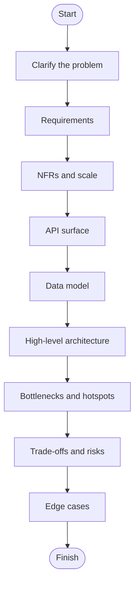
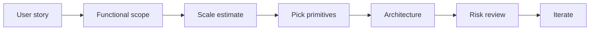

# 1. The System Design Playbook

> **Important:** Do not start with technology choices. Start with the problem, the scale, and the failure modes.

## The design template

1. **Clarify the use case.** What is the one thing this system must do? What does success look like for a user?
2. **Lock the functional requirements.** What features are in scope? Write them down so they stop shifting.
3. **Estimate scale and traffic.** QPS, storage, bandwidth. Back-of-the-envelope is a design tool, not a formality.
4. **Define the API and user journeys.** What are the request/response shapes? Who calls what?
5. **Design the data model and access patterns.** What is stored? How is it read most often?
6. **Draw the high-level architecture.** Boxes and arrows. Every box is a service, every arrow is a call or a queue.
7. **Identify bottlenecks, failure modes, and trade-offs.** Where does this design break? What is the price of each design choice?

> **Important:** Do not start with technology choices. Start with the problem, the scale, and the failure modes. Technology names are just labels for decisions you have already made.

## Google product lens

- Name the product behavior, not the buzzwords.
- Prefer open-source and local primitives first; mention managed cloud only when it is a better fit.
- When cloud is unavoidable, always translate it to equivalents in GCP, AWS, and Azure.
- For Google products, expect strong emphasis on offline sync, search/indexing, collaboration, media delivery, and reliability at global scale.

## What to ask first

These five questions unlock the rest of the design. Skipping any of them means you are guessing.

| Question | Why it matters |
|---|---|
| Who are the users? | Shapes latency, geography, and scale |
| What is the core action? | Defines the hot path — the one thing that must be fast |
| What must never fail? | Sets availability and consistency targets |
| What can be eventually consistent? | Saves cost, reduces complexity, and is often fine |
| What is the expected growth? | Forces capacity planning and avoids premature optimization |
| What are the read/write ratios? | Determines caching strategy, replica count, and index design |

## A simple activity flow

> **Tip:** If you cannot explain the hot path in one sentence, the design is not ready yet.
