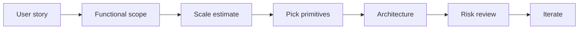

# 1. The System Design Playbook

> **Important:** Do not start with technology choices. Start with the problem, the scale, and the failure modes.

## The design template

1. Clarify the use case.
2. Lock the functional requirements.
3. Estimate scale and traffic.
4. Define the API and user journeys.
5. Design the data model and access patterns.
6. Draw the high-level architecture.
7. Identify bottlenecks, failure modes, and trade-offs.

## Google product lens

- Name the product behavior, not the buzzwords.
- Prefer open-source and local primitives first; mention managed cloud only when it is a better fit.
- When cloud is unavoidable, always translate it to equivalents in GCP, AWS, and Azure.
- For Google products, expect strong emphasis on offline sync, search/indexing, collaboration, media delivery, and reliability at global scale.

## What to ask first

| Question | Why it matters |
|---|---|
| Who are the users? | Shapes latency and scale |
| What is the core action? | Defines the hot path |
| What must never fail? | Sets availability and consistency targets |
| What can be eventually consistent? | Saves cost and complexity |
| What is the expected growth? | Forces capacity planning |

## A simple activity flow

> **Tip:** If you cannot explain the hot path in one sentence, the design is not ready yet.
