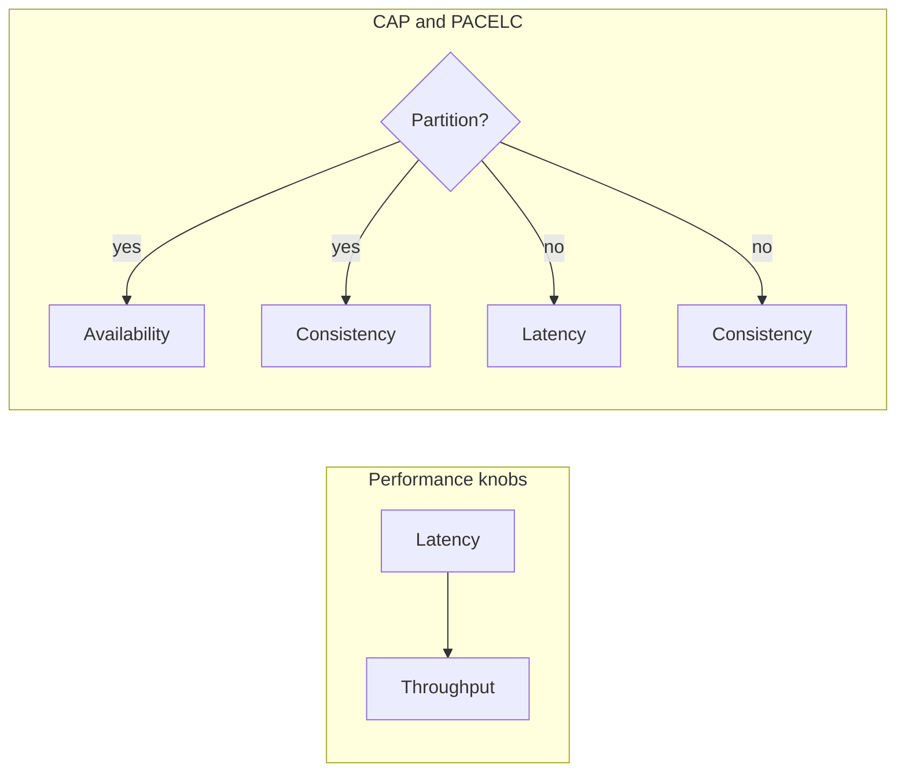

# 2. Scale, Latency, Availability, and CAP

> **Note:** Most systems fail because the team optimized the wrong dimension.



## The four numbers that matter

- **Latency**: how long one request takes.
- **Throughput**: how many requests the system can handle.
- **Availability**: how often the system responds.
- **Consistency**: whether different observers see the same truth.

## CAP in one line

A network partition is when nodes in a distributed system cannot communicate with each other.
When this happens, you must choose:

- **Keep answering** — serve reads and writes even though nodes may disagree (choose **Availability**).
- **Stay correct** — refuse requests until the partition heals (choose **Consistency**).

There is no third option. The network does not care about your SLA.

| Choice | What you get | When to choose it |
|---|---|---|
| CP | correctness over always-answering | money, inventory, leader election, coordination |
| AP | always-answering over immediate agreement | feeds, counters, user preferences, some telemetry |

**Important precision:**
- CAP's **C** means *linearizable* consistency — every read sees the most recent write. It does not mean "the system feels consistent."
- CAP's **A** means every non-failed node answers. It does not mean "the whole cluster is healthy."

## PACELC

CAP only describes the partition case. PACELC goes further:

- **If there is a partition (P)**: choose **A** (keep answering) or **C** (stay consistent).
- **Else (E)** — when the network is healthy: choose **L** (low latency) or **C** (strong consistency).

This is why every database vendor says "it depends" — because they genuinely face the PACELC trade-off for every workload. A read that waits for quorum acknowledgment is stronger but slower than a local replica read.

| Letter | Meaning |
|---|---|
| P | Partition exists |
| A | Availability during partition |
| C | Consistency during partition |
| E | Else (no partition) |
| L | Low latency when healthy |
| C′ | Consistency when healthy |

**Examples:**
- **Cassandra**: PA/EL — prefer availability during partition; prefer latency over consistency when healthy.
- **Spanner**: PC/EC — prefer consistency always; pays with latency.
- **DynamoDB (default)**: PA/EL — eventual reads are fast; strong consistency reads add latency.

## Capacity planning sketch

Back-of-the-envelope math is a design skill, not a distraction. Interviewers use it to test whether you think like an engineer or a wishful thinker.

- **QPS** = `daily_active_users × requests_per_user_per_day / 86_400`
- **Storage** = `write_rate_per_sec × object_size × retention_seconds`
- **Bandwidth** = `request_size × QPS`
- **P95/P99 latency** matters more than average — users do not experience averages; they experience tail latency.

**Quick unit conversions to memorize:**
```
1 million req/day  ≈ 12 req/sec
10 million req/day ≈ 115 req/sec
1 billion req/day  ≈ 12,000 req/sec
1 KB × 1M writes/day × 365 days ≈ 365 GB/year
```

> **Tip:** Rough estimates with stated assumptions are better than silent perfection. State your assumptions out loud — that is the point.
