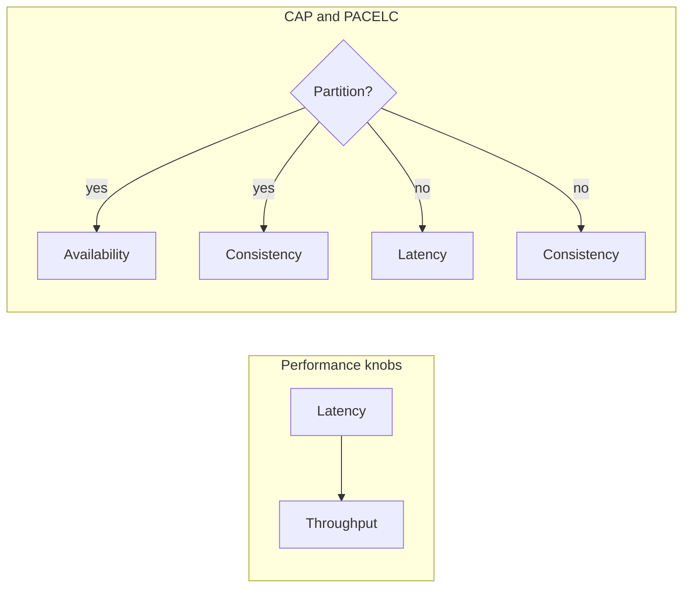

# 2. Scale, Latency, Availability, and CAP

> [!note]
> Most systems fail because the team optimized the wrong dimension.

## The four numbers that matter

- **Latency**: how long one request takes.
- **Throughput**: how many requests the system can handle.
- **Availability**: how often the system responds.
- **Consistency**: whether different observers see the same truth.

## CAP in one line

- During a network partition, you choose between consistency and availability.
- CAP's **C** means linearizable consistency, not "the system feels consistent."
- CAP's **A** means every non-failed node answers, not "the whole fleet is happy."

| Choice | What you get | Typical use |
|---|---|---|
| CP | correctness over always-answering | money, inventory, coordination |
| AP | always-answering over immediate agreement | feeds, counters, some telemetry |

## PACELC

- **If there is a partition (P)**: choose A or C.
- **Else (E)**: choose latency or consistency.
- This is why real systems keep saying "it depends" and still sound annoyingly right.

| Letter | Meaning |
|---|---|
| P | Partition |
| A | Availability during partition |
| C | Consistency during partition |
| E | Else, when no partition |
| L | Latency when no partition |
| C' | Consistency when no partition |

## Capacity planning sketch

- QPS = users x requests per user / time window
- Storage = item size x write rate x retention
- Bandwidth = request size x QPS
- P95/P99 matter more than averages because users do not experience averages

## Practical rule

> [!tip]
> Use strong consistency only where correctness depends on it. Everything else is a tax collector in disguise.
