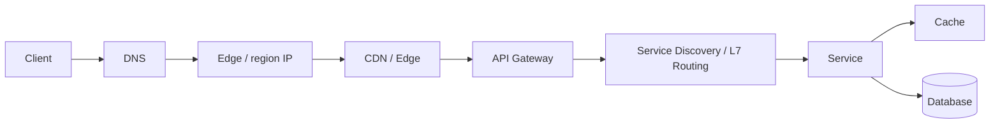
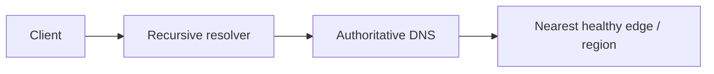
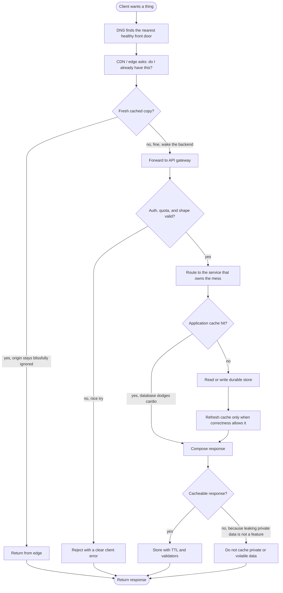
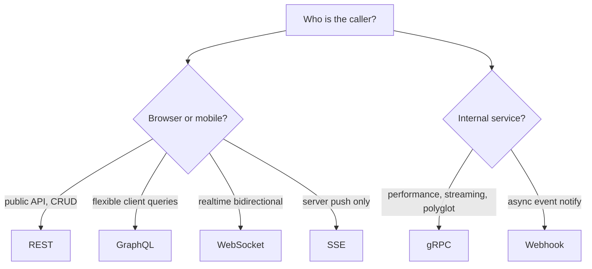
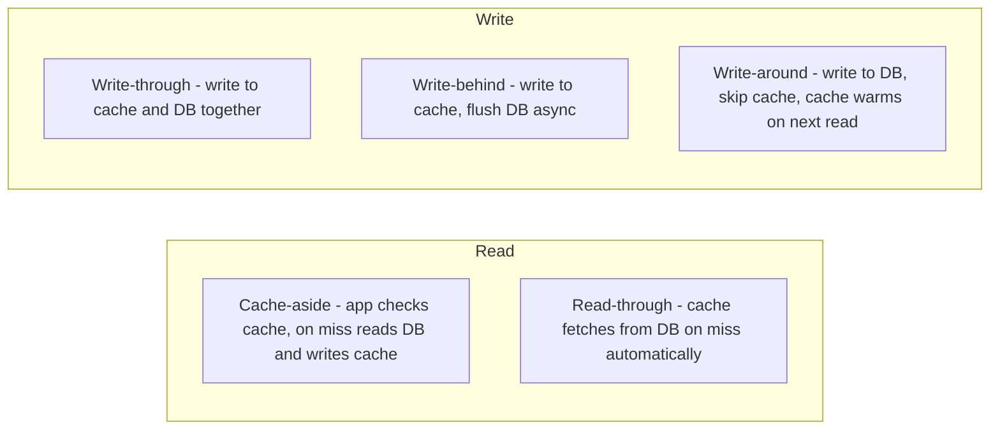
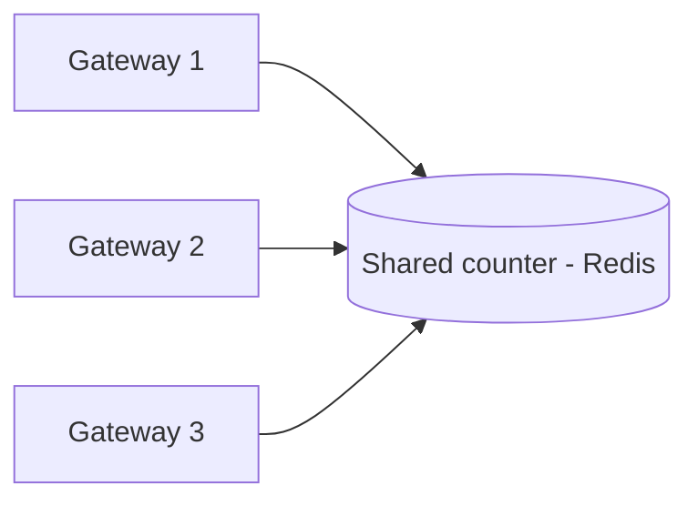
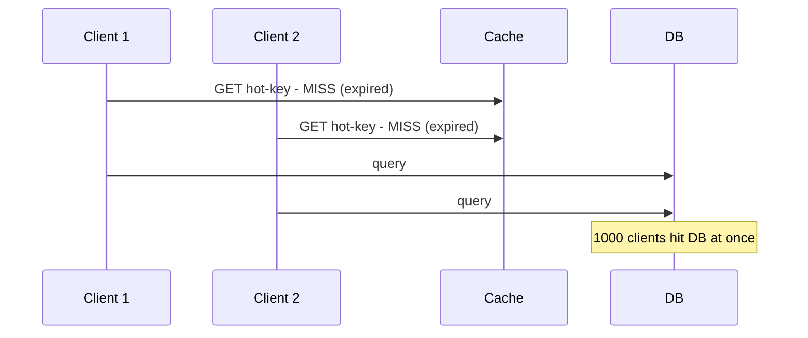
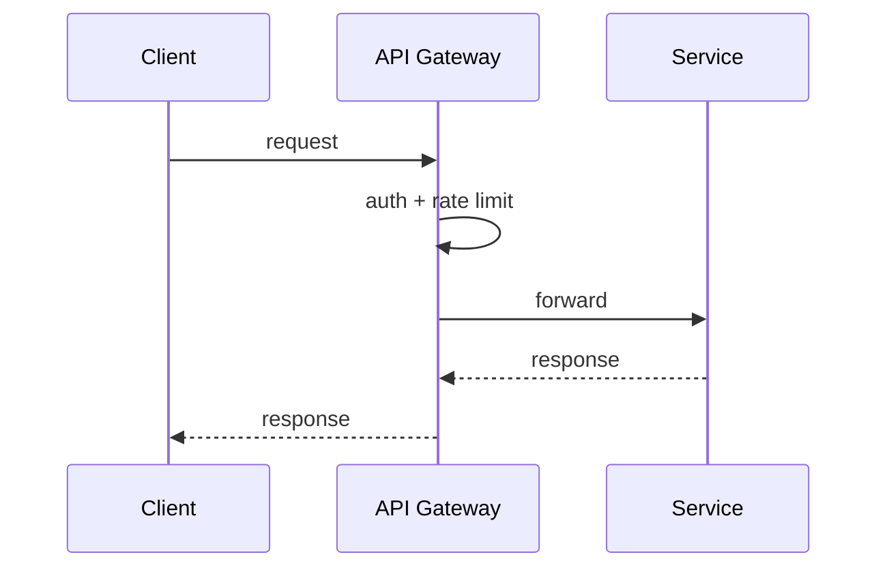

# 3. Request Path: DNS, CDN, Load Balancing, API Gateway

> **Note:** Most design problems begin with a client request and end with a very expensive box in the middle.

## DNS

- Maps names to IPs.
- TTL controls cache lifetime and propagation delay.
- GeoDNS and latency-based routing steer users to nearby regions.
- Anycast lets multiple edge sites advertise the same IP and route to the nearest healthy one.

## CDN

- Caches static and cacheable content close to users.
- Great for media, assets, and reducing origin load.

## Load balancing

- Spreads traffic across healthy instances.
- Common strategies: round robin, least connections, weighted routing, consistent hashing.

## API gateway

- Single ingress point for auth, routing, throttling, versioning, and request shaping.
- Keep it thin enough to be useful, not so thick that it becomes a second application.
- In many stacks, the gateway also acts as an L7 router; a separate internal load balancer is only needed when the topology really requires it.

## Activity diagram: request path decisions

Think of the request path as a bouncer, a shortcut, and a librarian arguing over who has to do real work. If the edge can answer, the origin gets to keep sipping coffee; if not, every gate checks the request before the database is bothered like royalty.

## API styles

Picking the right API style matters as much as picking the right database. Wrong choice = painful migration.

| Style | Protocol | Cacheable | Streaming | Best for |
|---|---|---|---|---|
| REST | HTTP/JSON | yes (GET) | no | public APIs, CRUD, browser clients |
| gRPC | HTTP/2 + Protobuf | no | yes (bidirectional) | internal services, low latency, polyglot |
| GraphQL | HTTP/JSON | partial | subscriptions | mobile, flexible queries, BFF pattern |
| WebSocket | TCP persistent | no | yes (bidirectional) | chat, live updates, gaming |
| SSE | HTTP chunked | no | server-to-client | feeds, live scores, dashboards |
| Webhook | HTTP callback | no | no | async event notification |

## Caching

A cache is a bet that the same data will be asked for again before it changes. It is usually a good bet.

### Strategies

| Strategy | Consistency | Write speed | Stale risk | Use when |
|---|---|---|---|---|
| Cache-aside | good | DB speed | low | general default |
| Read-through | good | DB speed | low | read-heavy, transparent |
| Write-through | excellent | slower | none | durability matters |
| Write-behind | eventual | fast | buffer-loss risk | throughput-critical writes |
| Write-around | good | fast | yes on first read | write-once, read-rarely data |

### Eviction policies

| Policy | Evicts | Use when |
|---|---|---|
| LRU (least recently used) | coldest access | general cache |
| LFU (least frequently used) | least popular | frequency > recency |
| TTL | expired items | time-bounded freshness |
| allkeys-lru | any key by LRU | Redis pure-cache mode |
| noeviction | nothing (returns error) | Redis durable data |

### Cache invalidation patterns

- **TTL expiry** — simplest; tolerate staleness up to TTL window
- **Write-through invalidation** — update cache on every write; tight consistency
- **Event-driven invalidation** — cache listens to DB change events (CDC) and evicts
- **Version-tagged keys** — `user:42:v7`; bump version on change, old keys expire naturally

## Rate limiting

Protects the system from noisy clients and bursts.

### Algorithms

| Algorithm | How it works | Burst allowed | Best for |
|---|---|---|---|
| Token bucket | tokens refill at fixed rate; request consumes 1 token | yes | most APIs — smooths average, allows bursts |
| Leaky bucket | requests drain at fixed rate from a queue | no | strict output rate control |
| Fixed window counter | count requests per fixed time window | yes (at boundary) | simple; suffers boundary burst problem |
| Sliding window log | log timestamp of each request; count in last N seconds | no | accurate; high memory use |
| Sliding window counter | weighted blend of current + previous window counts | partial | good accuracy, low memory |

> **Boundary burst problem:** fixed window allows 2x the limit if a client sends max at end of window T and max again at start of window T+1 — both windows are technically under limit. Sliding window fixes this.

### Distributed rate limiting

- Redis `INCR` + `EXPIRE` for fixed window; Sorted Set for sliding window log.
- Redis outage: fail-open (allow traffic) or fail-closed (reject) — choose based on risk tolerance.
- Local approximation: each gateway holds a local bucket, sync to Redis periodically for high-throughput paths.

### Cache stampede (Thundering Herd)

When a hot cache key expires, all waiting requests hit the database simultaneously.

**Mitigations:**
- **Mutex/single-flight**: first miss acquires a lock and fetches; others wait and use the result.
- **Probabilistic early expiration**: recompute before TTL expires with probability increasing as expiry approaches.
- **Background refresh**: a background job refreshes the key before it expires.
- **Staggered TTLs**: add random jitter to TTL so all hot keys don't expire simultaneously.

