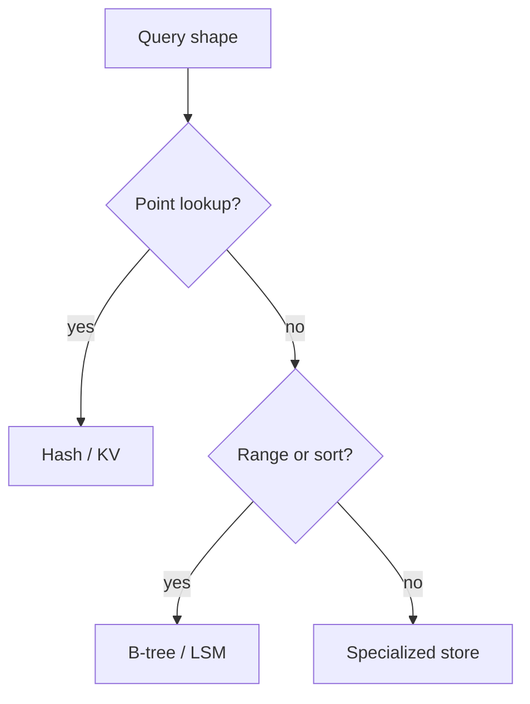
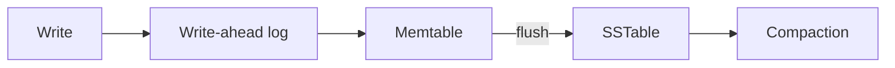
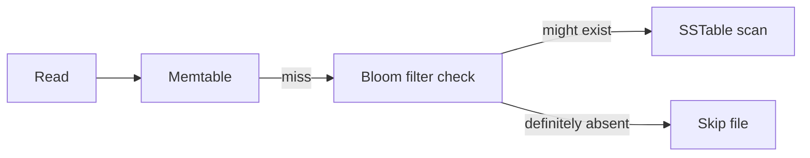
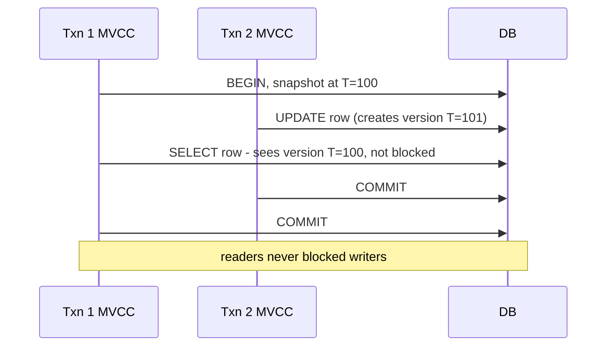
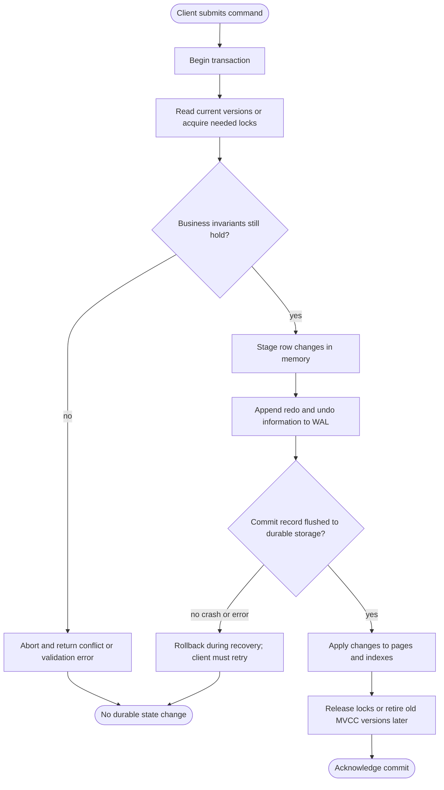

# 4. Storage, Indexes, and Transactions

> **Tip:** Storage design is mostly about matching access patterns to the right shape of data.

## Indexes

- **Hash index**: fast exact lookups, no range support.
- **B-tree**: ordered access and range queries. Good for mixed read/write workloads. Writes can cause page splits and random I/O — not write-optimized.
- **LSM tree**: write-optimized. Writes go to an in-memory memtable first, then flush to immutable SSTables on disk. Reads check memtable → SSTables (newest to oldest), aided by Bloom filters to skip irrelevant files. The WAL exists for crash recovery only — it is not in the normal read path.

## Concurrency control: MVCC and 2PL

Two mechanisms underpin every isolation level:

**Multi-Version Concurrency Control (MVCC)**
- Each write creates a new version; old versions are kept for active readers.
- Readers never block writers; writers never block readers.
- Snapshot isolation is built on MVCC: a transaction sees the consistent snapshot from its start time.
- Used by PostgreSQL, MySQL InnoDB, Oracle.

**Two-Phase Locking (2PL)**
- Phase 1 (growing): acquire locks, never release.
- Phase 2 (shrinking): release locks, never acquire.
- Ensures serializability but can cause deadlocks and long lock contention.
- Strict 2PL (hold until commit) is the common variant.

| Mechanism | Readers block writers? | Writers block readers? | Used for |
|---|---|---|---|
| MVCC | no | no | snapshot isolation, read-heavy |
| 2PL | yes | yes | serializability, write-heavy |

## Row vs column

- Row stores are strong for transactional point reads and updates.
- Column stores are strong for scans and analytics.

## ACID

ACID is the promise a relational database makes about transactions. It is not free — each property has a cost.

- **Atomicity**: all operations in a transaction commit or none do. If a crash occurs mid-transaction, the database rolls back to the pre-transaction state using the write-ahead log.
- **Consistency**: the database moves from one valid state to another. Invariants (foreign keys, check constraints, application-level rules) must hold before and after every transaction.
- **Isolation**: concurrent transactions behave as if they ran one at a time. Without isolation, one transaction can see another's in-flight dirty data, leading to corrupted state.
- **Durability**: once a transaction commits, the data survives crashes. Ensured by flushing the write-ahead log to durable storage before acknowledging the commit.

> **Intuition:** Atomicity is about *all or nothing*. Isolation is about *pretending nobody else exists*. Durability is about *surviving a power cut*. Consistency is the database holding up its end of the invariant contract.

## Activity diagram: safe transaction write

A correct transaction makes the success path boring and the crash path explicit. The acknowledgement only leaves the database after the commit record is durable.

## Isolation levels

Isolation is a spectrum. Stronger isolation costs more throughput; weaker isolation costs correctness.

| Level | Dirty read | Non-repeatable read | Phantom read | Write skew | Notes |
|---|---|---|---|---|---|
| Read uncommitted | ✓ possible | ✓ possible | ✓ possible | ✓ possible | Almost never use; shows in-flight data |
| Read committed | ✗ prevented | ✓ possible | ✓ possible | ✓ possible | Default in PostgreSQL and Oracle |
| Repeatable read | ✗ prevented | ✗ prevented | ✓ possible | ✓ possible | Default in MySQL InnoDB |
| Snapshot isolation | ✗ prevented | ✗ prevented | ✗ prevented | ✓ possible | MVCC-based; used by PostgreSQL SI |
| Serializable | ✗ prevented | ✗ prevented | ✗ prevented | ✗ prevented | Safest; highest cost |

**What these anomalies mean in plain English:**

- **Dirty read**: you read a value written by a transaction that has not committed yet — and then it rolls back. You saw data that never existed.
- **Non-repeatable read**: you read a row, another transaction updates it and commits, you read it again in the same transaction and get a different value.
- **Phantom read**: you query for rows matching a condition, another transaction inserts a row that matches, and your re-query returns extra rows.
- **Write skew**: two transactions each read a shared value, decide it is safe to proceed, and both write — but their combined writes violate an invariant neither could detect alone. Classic example: two doctors both see "there is 1 doctor on call" and both take themselves off call simultaneously.

> **Note:** A transaction is not correct because it "usually works." It is correct when the invariants survive the worst concurrent interleaving you can construct. Test with concurrent workloads, not just sequential ones.
