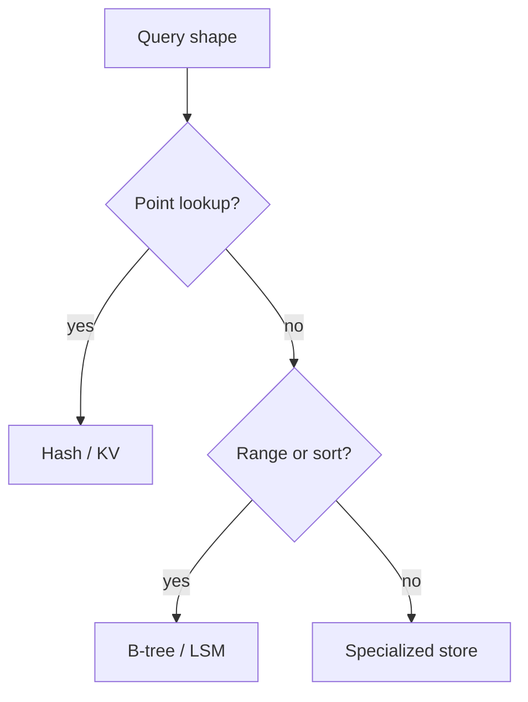
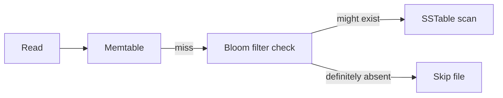
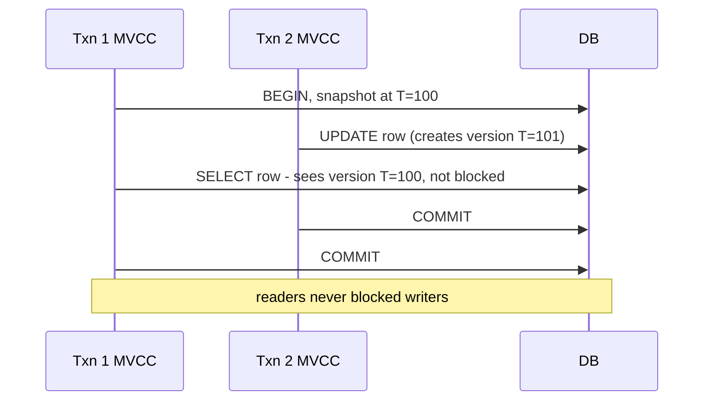

# 4. Storage, Indexes, and Transactions

> **Tip:** Storage design is mostly about matching access patterns to the right shape of data.

## Indexes

- **Hash index**: fast exact lookups, no range support.
- **B-tree**: ordered access and range queries. Good for mixed read/write workloads. Writes can cause page splits and random I/O — not write-optimized.
- **LSM tree**: write-optimized. Writes go to an in-memory memtable first, then flush to immutable SSTables on disk. Reads check memtable → SSTables (newest to oldest), aided by Bloom filters to skip irrelevant files. The WAL exists for crash recovery only — it is not in the normal read path.

## Concurrency control: MVCC and 2PL

Two mechanisms underpin every isolation level:

**Multi-Version Concurrency Control (MVCC)**
- Each write creates a new version; old versions are kept for active readers.
- Readers never block writers; writers never block readers.
- Snapshot isolation is built on MVCC: a transaction sees the consistent snapshot from its start time.
- Used by PostgreSQL, MySQL InnoDB, Oracle.

**Two-Phase Locking (2PL)**
- Phase 1 (growing): acquire locks, never release.
- Phase 2 (shrinking): release locks, never acquire.
- Ensures serializability but can cause deadlocks and long lock contention.
- Strict 2PL (hold until commit) is the common variant.

| Mechanism | Readers block writers? | Writers block readers? | Used for |
|---|---|---|---|
| MVCC | no | no | snapshot isolation, read-heavy |
| 2PL | yes | yes | serializability, write-heavy |

## Row vs column

- Row stores are strong for transactional point reads and updates.
- Column stores are strong for scans and analytics.

## ACID

- **Atomicity**: all or nothing.
- **Consistency**: invariants still hold.
- **Isolation**: concurrent transactions do not step on each other.
- **Durability**: committed data survives failure.

## Isolation levels

| Level | Main property | Main risk |
|---|---|---|
| Read committed | no dirty reads | non-repeatable reads |
| Snapshot isolation | stable snapshot | write skew |
| Serializable | behaves like one-at-a-time | lower throughput |

> **Note:** A transaction is not correct because it "usually works." It is correct when the invariants survive the worst interleaving you can imagine.
