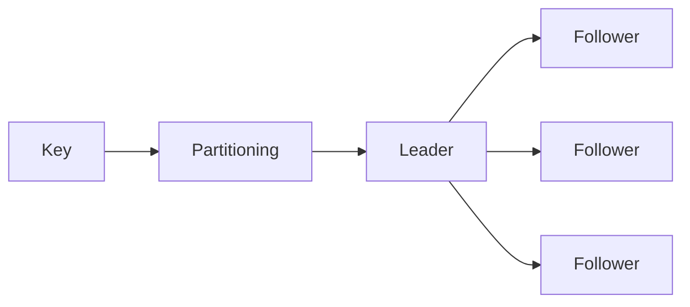
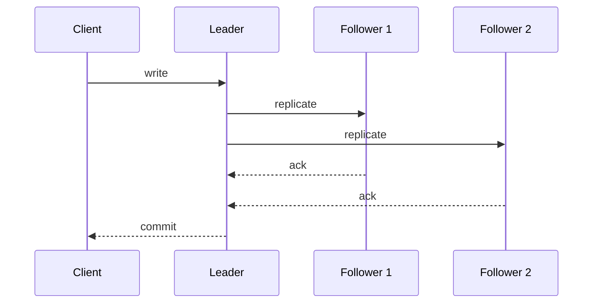

# 5. Replication, Partitioning, and Consensus

> [!warning]
> Once you replicate data, disagreement becomes a feature of the system.

## Replication

- Improves read scale and availability.
- Leader-based replication is simpler.
- Multi-leader and leaderless replication trade simplicity for availability and geo-distribution.

## Consistency models — linearizability vs serializability vs CAP

These three terms are frequently confused. They mean different things:

| Term | Scope | Meaning |
|---|---|---|
| **Linearizability** | single-object ops | every op appears to happen atomically at a single point in time; reads always see latest write |
| **Serializability** | multi-object transactions | transactions execute as if they ran one at a time in some serial order |
| **Strict serializability** | both | linearizable + serializable — the gold standard, used by Spanner |
| **CAP consistency** | replication | during a partition, all nodes see the same data (effectively linearizability) |
| **Snapshot isolation** | transactions | each transaction sees a consistent point-in-time snapshot; allows write skew |

> Serializability says transactions are ordered. Linearizability says operations are real-time ordered. You can have one without the other. Spanner gives you both and charges accordingly.

| Model | Meaning |
|---|---|
| Linearizable | every read sees the latest committed write |
| Sequential | everyone sees the same order, not necessarily real-time |
| Causal | causally related events stay ordered |
| Read-your-writes | a user sees their own recent writes |
| Eventual | replicas converge if writes stop |

## Partitioning

- Splits data across shards.
- Hash partitioning spreads keys evenly; range partitioning preserves ordering but can create hotspots.
- Good partition keys keep related data together and hot keys under control.

## Quorums

- `R + W > N` is the basic overlap rule for leaderless quorum systems.
- It helps ensure reads and writes intersect on at least one replica.
- It does **not** by itself guarantee freshness or total order.
- That's why quorum replication and consensus are related but not the same thing.

## Consensus

- Used when the cluster needs one agreed order of events.
- Raft is the practical default mental model: elect a leader, replicate a log, commit entries.
- Paxos exists; Raft is the version most people can explain without a whiteboard meltdown.

## Coordination

- ZooKeeper-style services manage leader election, locks, and configuration.
- They exist because distributed systems need a referee.
- The lower-level repair and membership primitives live in the distributed patterns chapter.
