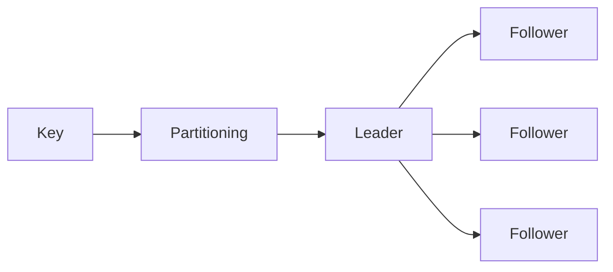
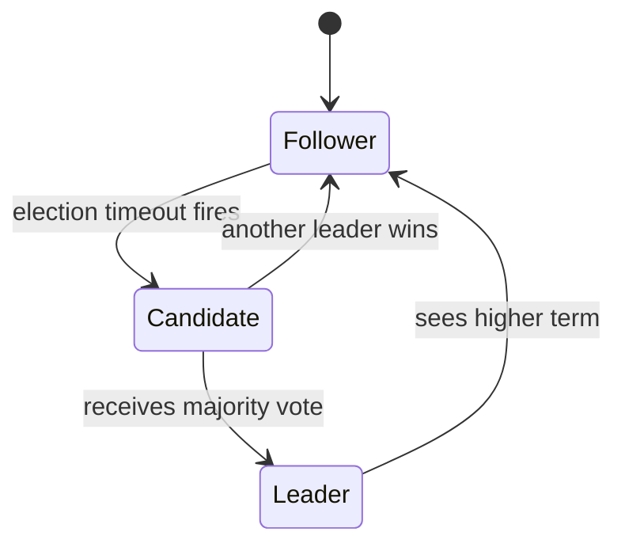
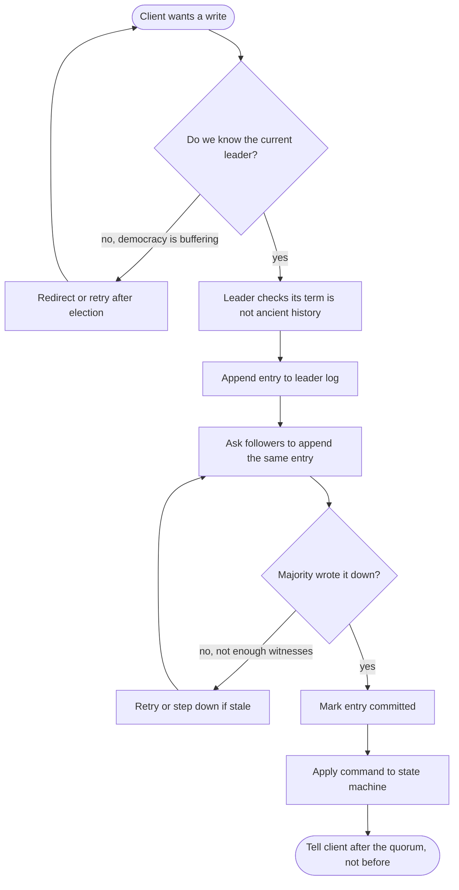

# 5. Replication, Partitioning, and Consensus

> **Warning:** Once you replicate data, disagreement becomes a feature of the system.

## Replication

- Improves read scale and availability.
- Leader-based replication is simpler.
- Multi-leader and leaderless replication trade simplicity for availability and geo-distribution.

## Consistency models — linearizability vs serializability vs CAP

These three terms are frequently confused. They mean different things:

| Term | Scope | Meaning |
|---|---|---|
| **Linearizability** | single-object ops | every op appears to happen atomically at a single point in time; reads always see latest write |
| **Serializability** | multi-object transactions | transactions execute as if they ran one at a time in some serial order |
| **Strict serializability** | both | linearizable + serializable — the gold standard, used by Spanner |
| **CAP consistency** | replication | during a partition, all nodes see the same data (effectively linearizability) |
| **Snapshot isolation** | transactions | each transaction sees a consistent point-in-time snapshot; allows write skew |

> Serializability says transactions are ordered. Linearizability says operations are real-time ordered. You can have one without the other. Spanner gives you both and charges accordingly.

| Model | Meaning |
|---|---|
| Linearizable | every read sees the latest committed write |
| Sequential | everyone sees the same order, not necessarily real-time |
| Causal | causally related events stay ordered |
| Read-your-writes | a user sees their own recent writes |
| Eventual | replicas converge if writes stop |

## Partitioning

- Splits data across shards.
- Hash partitioning spreads keys evenly; range partitioning preserves ordering but can create hotspots.
- Good partition keys keep related data together and hot keys under control.

## Quorums

In a leaderless system (Cassandra, DynamoDB), reads and writes go to multiple replicas simultaneously. Quorum rules ensure that at least one replica that participated in a write also participates in the subsequent read.

- **W + R > N** — the basic overlap rule: if you write to W replicas and read from R replicas in a cluster of N, the sets must overlap.
- Example: N=3, W=2, R=2 → overlap guaranteed on at least 1 replica.
- This gives **R + W > N** consistency: reads can see the latest write.
- It does **not** by itself guarantee total order or freshness — concurrent writes can still conflict. Cassandra uses last-write-wins (LWW) with timestamps to resolve conflicts, which is lossy.
- Quorum replication is not the same as consensus — Raft/Paxos provides stronger guarantees because they serialize all writes through a single leader.

**Common quorum configurations:**

| N | W | R | Property |
|---|---|---|---|
| 3 | 2 | 2 | strong quorum — standard default |
| 3 | 1 | 3 | fast writes, slow reads |
| 3 | 3 | 1 | slow writes, fast reads — fragile |
| 3 | 1 | 1 | fastest — eventual consistency only |

## Consensus

Consensus answers the question: **how do a group of nodes agree on a single value when any of them might fail?**

This is the fundamental problem behind leader election, distributed locks, and replicated state machines.

### Raft — the practical mental model

Raft decomposes consensus into three subproblems: leader election, log replication, and safety.

1. **Leader election**: nodes start as followers. If a follower hears no heartbeat within a timeout, it becomes a candidate and requests votes. A candidate that gets a majority becomes leader.
2. **Log replication**: the leader receives all writes, appends them to its log, replicates to followers, and commits once a majority acknowledges.
3. **Safety**: a node can only win an election if its log is at least as up-to-date as the majority — preventing stale nodes from becoming leader.

### Activity diagram: Raft write commit

Raft is group chat with rules: one leader talks, a majority must say "seen," and only then does the cluster act. Anything less is just distributed gossip wearing a fake moustache.

- **Term numbers** are Raft's logical clock — every message carries a term. A node that sees a higher term immediately reverts to follower. This prevents split-brain from stale leaders.
- **Commit = majority**: an entry is committed (safe to apply) once a majority of nodes have appended it to their log.
- Raft trades some performance for understandability — it is the algorithm most teams can explain, debug, and operate without a PhD.

> **Tip:** Paxos exists and predates Raft. Raft was designed to be equivalent but more understandable. In practice, use etcd or ZooKeeper (which implement Raft and ZAB respectively) rather than rolling your own.

## Coordination

- **etcd**: Raft-based key-value store; used for distributed config, leader election, and service discovery. The coordination layer behind Kubernetes and Patroni.
- **ZooKeeper**: ZAB-protocol (Paxos-like) coordination service; used for Kafka leader election (pre-KRaft), HBase, and custom distributed locking.
- **Chubby**: an internal coarse-grained locking service that inspired ZooKeeper.

These services exist because distributed systems need a **reliable referee** — a place to atomically record "node A is leader" without race conditions. The key insight: you cannot use the database you are trying to coordinate as the coordinator.
