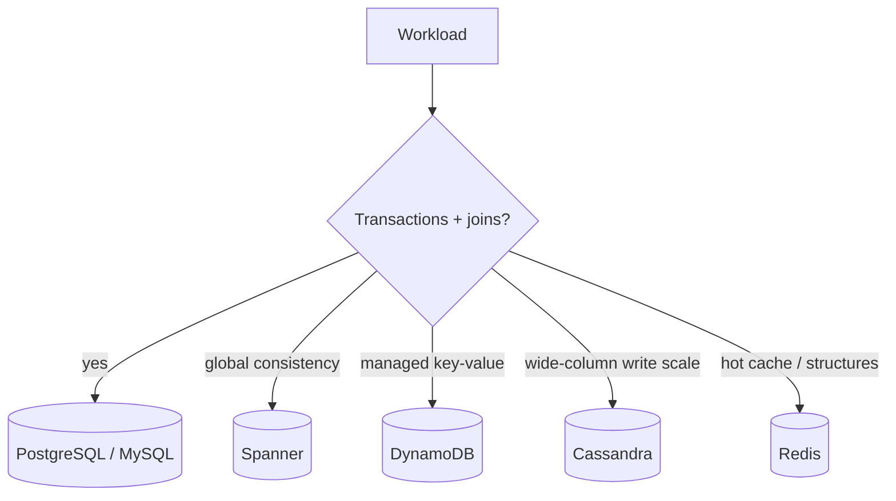
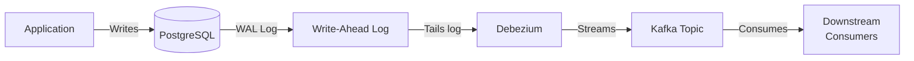
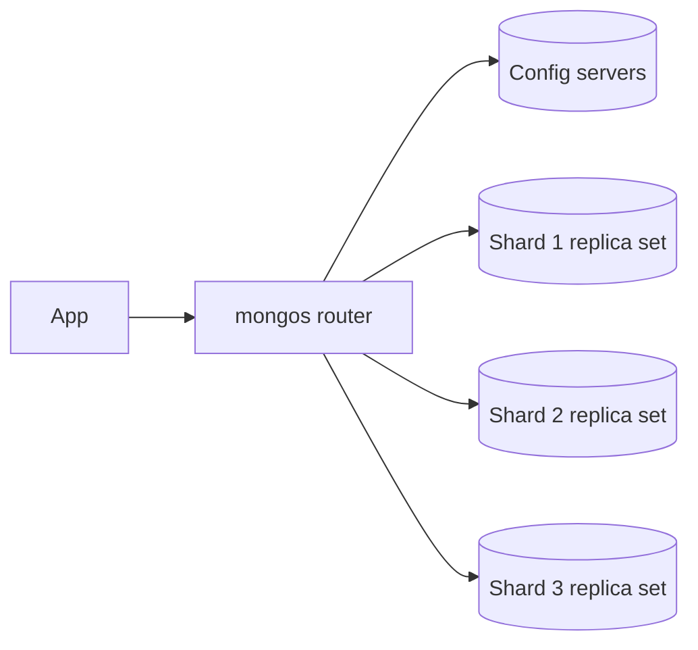
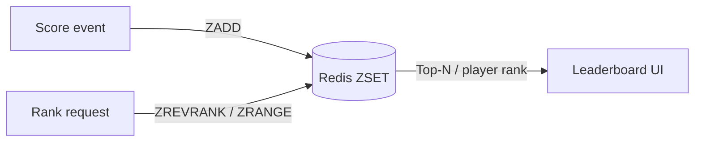

# 6. Databases in Practice

> **Note:** Real database choice is about workload shape, not brand loyalty.



## PostgreSQL and MySQL

- Best default choices for transactional systems.
- Strong consistency, mature indexing, familiar tooling.

### PostgreSQL Schema Design Refresher

When designing systems, fluency in translating concepts into concrete database schemas is essential. A schema is the skeleton of a system's truth. If the schema is clear, the application is easy to reason about; if it is vague, every feature becomes a small act of data archaeology. PostgreSQL provides a robust set of features to turn business ideas into durable, queryable structures.

#### The Core Data Types
Use these as your default toolkit:
- **Primary Keys:** `UUID` or `BIGINT GENERATED ALWAYS AS IDENTITY`.
- **Text:** `TEXT` or `VARCHAR(N)` (no performance difference in Postgres, only constraint enforcement).
- **Timestamps:** `TIMESTAMPTZ` (always store UTC).
- **Currency/Decimals:** `NUMERIC(precision, scale)`. Never use floats for financial data.

#### Creating Tables and Enums
Enums enforce data integrity at the database layer, preventing invalid states.

```sql
CREATE TYPE order_status AS ENUM ('pending', 'paid', 'shipped', 'delivered', 'cancelled');

CREATE TABLE orders (
    id UUID PRIMARY KEY DEFAULT gen_random_uuid(),
    user_id UUID NOT NULL, -- Assume references users(id)
    status order_status NOT NULL DEFAULT 'pending',
    total_amount NUMERIC(10, 2) NOT NULL,
    created_at TIMESTAMPTZ NOT NULL DEFAULT NOW(),
    updated_at TIMESTAMPTZ NOT NULL DEFAULT NOW()
);
```

#### JSONB for Semi-Structured Data
When schemas are highly variable (e.g., product attributes, user preferences, dynamic telemetry), use `JSONB`. It stores JSON efficiently in a binary format and supports robust indexing. Use `JSONB` when the shape is genuinely variable and the value is flexibility, not relational structure. If you need joins, constraints, or predictable analytics, keep the data relational and denormalize only when you have a clear reason.

```sql
ALTER TABLE orders ADD COLUMN metadata JSONB DEFAULT '{}'::jsonb;
```

#### Indexes: Beyond the Primary Key
Indexes speed up reads but slow down writes. Use them deliberately.

1. **B-Tree (Default):** Great for exact matches and range queries.
```sql
CREATE INDEX idx_orders_user_id ON orders(user_id);
```

2. **Partial Indexes:** Index only what matters to save space and write latency. Perfect for queue-like tables or statuses.
```sql
-- Only index active orders
CREATE INDEX idx_orders_active ON orders(status) 
WHERE status IN ('pending', 'paid', 'shipped');
```

3. **GIN Indexes:** Essential for querying inside unstructured columns like `JSONB`.
```sql
CREATE INDEX idx_orders_metadata ON orders USING GIN (metadata);
```

#### Triggers for Automated State Management
A classic use case is automatically updating the `updated_at` column so the application layer doesn't have to remember it.

```sql
CREATE OR REPLACE FUNCTION update_updated_at_column()
RETURNS TRIGGER AS $$
BEGIN
    NEW.updated_at = NOW();
    RETURN NEW;
END;
$$ LANGUAGE plpgsql;

CREATE TRIGGER update_orders_updated_at
    BEFORE UPDATE ON orders
    FOR EACH ROW
    EXECUTE FUNCTION update_updated_at_column();
```

#### Essential CRUD Queries

**Insert with Upsert (ON CONFLICT):**
```sql
-- Prerequisite: email must be unique for ON CONFLICT (email) to work.
CREATE UNIQUE INDEX idx_users_email_unique ON users(email);

-- Insert a new user, or update their last_login if they already exist.
INSERT INTO users (id, email, last_login) 
VALUES ('123e4567-e89b-12d3-a456-426614174000', 'alice@example.com', NOW())
ON CONFLICT (email) 
DO UPDATE SET last_login = EXCLUDED.last_login;
```

**Update with RETURNING:**
Often you need to read the row you just updated, avoiding a second query.
```sql
UPDATE orders 
SET status = 'shipped' 
WHERE id = '...' AND status = 'paid'
RETURNING id, status, updated_at;
```

**Select with Joins and Aggregation:**
```sql
SELECT u.email, COUNT(o.id) as total_orders, SUM(o.total_amount) as lifetime_value
FROM users u
JOIN orders o ON u.id = o.user_id
WHERE o.status != 'cancelled'
GROUP BY u.email
HAVING SUM(o.total_amount) > 1000;
```

#### Change Data Capture (CDC)
When a record changes (like an order being paid), you often need to update a cache, a search index, or notify a shipping service. Dual-writing from the application to both the database and the broker is highly prone to race conditions and failure.

Instead, use CDC:


1. PostgreSQL writes all changes to its **Write-Ahead Log (WAL)**.
2. Tools like **Debezium** read the WAL via logical decoding.
3. Debezium publishes the ordered stream of events to a message broker (e.g., Kafka).
4. Consumers process the events asynchronously.

With durable WAL retention, a healthy connector, and a durable broker, this gives downstream systems an eventually consistent path from committed database changes without requiring the application to dual-write.

## Spanner and CockroachDB

- Globally distributed relational databases with strong consistency (NewSQL).
- Useful when a single global truth matters more than convenience.
- Both decouple computation from storage and use consensus (Paxos for Spanner, Raft for CockroachDB) to maintain synchronous replicas across regions.

### CockroachDB Schema Design Refresher

CockroachDB speaks the PostgreSQL wire protocol but operates in a fundamentally different way under the hood. Data is stored in a distributed key-value store (Pebble) where rows are lexicographically sorted by their primary keys.

#### Anti-Pattern: Sequential Primary Keys
In PostgreSQL, `SERIAL` or `BIGINT GENERATED ALWAYS AS IDENTITY` is standard. In CockroachDB, this is a fatal anti-pattern. Because rows are sorted by key, sequential inserts route to the exact same physical range (node), creating massive write hotspots.

```sql
-- BAD: Creates a write hotspot
CREATE TABLE users (
    id SERIAL PRIMARY KEY,
    email TEXT
);

-- GOOD: Randomly distributes writes across all nodes
CREATE TABLE users (
    id UUID PRIMARY KEY DEFAULT gen_random_uuid(),
    email TEXT
);
```

#### Multi-Region Topologies
By default, CockroachDB optimizes for global survivability. You can optimize for local latency by explicitly telling the database where data lives using `LOCALITY`.

```sql
-- Pin table data to a specific region for low-latency local reads/writes
ALTER TABLE users SET LOCALITY REGIONAL BY TABLE IN PRIMARY REGION "eu-west-1";

-- For data like lookup tables (e.g., country codes) that are read everywhere but rarely written
ALTER TABLE country_codes SET LOCALITY GLOBAL;
```

## DynamoDB

- Managed key-value/document store with partition key and sort key semantics.
- Excellent for predictable access patterns and horizontal scale.

## Cassandra

- Wide-column database designed for write-heavy, distributed workloads.
- Tunable consistency and high availability, with application responsibility for query design.

### Cassandra Schema Design Refresher

Cassandra does not support joins. You must model your tables around your **queries**, not your entities. Data duplication (denormalization) is a feature, not a bug.

#### Partition Keys and Clustering Keys
The primary key in Cassandra has one required part and one optional part:
1. **Partition Key:** Hashes the row to a token range and determines the replica set that stores the partition.
2. **Clustering Key:** Optional columns that determine how rows are sorted within that partition.

```sql
-- Model for: "Get all sensor readings for a specific device, ordered by time"
CREATE TABLE sensor_data (
    device_id UUID,
    recorded_at TIMESTAMP,
    temperature DECIMAL,
    humidity DECIMAL,
    PRIMARY KEY ((device_id), recorded_at)
) WITH CLUSTERING ORDER BY (recorded_at DESC);
```
- `(device_id)` is the partition key. All readings for a device are colocated in the same logical partition and replicated according to the keyspace's replication strategy.
- `recorded_at` is the clustering key. Readings are stored in descending time order within that partition.

#### Essential CQL Queries

**Insert data:**
```sql
INSERT INTO sensor_data (device_id, recorded_at, temperature, humidity) 
VALUES (123e4567-e89b-12d3-a456-426614174000, toTimestamp(now()), 22.5, 45.0)
USING TTL 86400; -- Data automatically expires after 1 day
```

**Query data (anchor reads on the partition key):**
```sql
-- Fast path: the partition key routes the request to the replicas for one partition,
-- and LIMIT 10 returns the newest rows because recorded_at is clustered DESC.
SELECT temperature FROM sensor_data 
WHERE device_id = 123e4567-e89b-12d3-a456-426614174000 
LIMIT 10;
```

```sql
-- Bad data model for Cassandra: without an index this is rejected,
-- and forcing it with ALLOW FILTERING would require scanning too much data.
SELECT * FROM sensor_data WHERE temperature > 25.0; 
```

**Time-Series Pattern (Bucketing):**
If a single device produces millions of readings, the partition will grow too large (a "wide row"). Solve this by bucketing the partition key by time.
```sql
CREATE TABLE sensor_data_bucketed (
    device_id UUID,
    month TEXT, -- e.g., '2026-07'
    recorded_at TIMESTAMP,
    temperature DECIMAL,
    PRIMARY KEY ((device_id, month), recorded_at)
);
```

## MongoDB

- Document database. Stores JSON-like documents with flexible schema — no ALTER TABLE required.
- Primary unit is the document; related data is embedded rather than joined.
- Replica set: 1 primary + 2 secondaries; elections use majority election protocol (Raft-like but MongoDB-specific).
- Sharded cluster: mongos router sits in front of config-server replica set + N shard replica sets.
- **Shard key is permanent and non-trivial.** Monotonic keys (ObjectId, timestamp) create write hotspots. Use hashed shard key for even distribution or compound keys for zone sharding.
- Consistency is tunable: `writeConcern: majority` ensures writes survive a primary failure; default read concern is `local` (may see stale data). Use `readConcern: majority` + `writeConcern: majority` for strong consistency at the cost of latency.



### MongoDB Schema Design Refresher

The fundamental question in MongoDB schema design is **Embedding vs. Referencing**. Because joins (`$lookup`) in MongoDB are expensive, you want data that is queried together to live together.

#### Embedding (The Default Choice)
If data has a 1-to-few relationship and the child data is never queried independently of the parent, embed it. This provides atomic updates and single-read efficiency.

```javascript
// A blog post with embedded comments
db.posts.insertOne({
  _id: ObjectId("507f1f77bcf86cd799439011"),
  title: "MongoDB Schema Design",
  content: "Embedding vs referencing...",
  comments: [
    { author: "Alice", text: "Great post!", created_at: ISODate("2026-07-06T10:00:00Z") },
    { author: "Bob", text: "I prefer Postgres.", created_at: ISODate("2026-07-06T11:00:00Z") }
  ]
});
```

#### Referencing (For Unbounded Growth)
If the array of child documents can grow infinitely (e.g., millions of IoT readings for a single device), embedding will hit the 16MB document size limit. In these 1-to-squillions relationships, you must use referencing.

```javascript
// Parent document
db.devices.insertOne({
  _id: ObjectId("device_123"),
  name: "Temperature Sensor A"
});

// Child documents referencing the parent
db.readings.insertMany([
  { device_id: ObjectId("device_123"), temp: 22.5, ts: ISODate("2026-07-06T10:00:00Z") },
  { device_id: ObjectId("device_123"), temp: 22.6, ts: ISODate("2026-07-06T10:01:00Z") }
]);

// Create an index to make the "join" fast
db.readings.createIndex({ device_id: 1, ts: -1 });
```

#### Essential CRUD Queries

**Upserting data:**
```javascript
// Update a user's login count, or create them if they don't exist
db.users.updateOne(
  { email: "alice@example.com" }, // Filter
  { 
    $inc: { login_count: 1 }, 
    $setOnInsert: { created_at: new Date() } 
  }, // Update operators
  { upsert: true } // Options
);
```

**Atomic Array Updates:**
```javascript
// Push a new comment to a post without reading the post first
db.posts.updateOne(
  { _id: ObjectId("507f1f77bcf86cd799439011") },
  { 
    $push: { 
      comments: { author: "Charlie", text: "Thanks!" } 
    } 
  }
);
```

## Redis

- In-memory data structure server used for cache, counters, sessions, locks, and fast lookups.
- Fantastic at being fast. Dangerous when treated as a casual primary database.

### Redis GEO — proximity and map problems

- `GEOADD key lon lat member` stores a location encoded internally as a **geohash**.
- `GEOSEARCH` / `GEORADIUS` returns members within a given radius, sorted by distance.
- The geohash encodes (longitude, latitude) into a 52-bit integer stored in a Sorted Set — so geo queries are just range queries in disguise.


- Common use: nearest drivers, nearby restaurants, delivery radius checks, map tiles by viewport.
- Precision is roughly 0.6 m at the default 52-bit level — good enough for almost every practical geo problem.

### Redis Sorted Set — leaderboard pattern

- `ZADD key score member` adds a member with a float score.
- `ZRANK` / `ZREVRANK` gives a member's rank in O(log N).
- `ZRANGE ... BYSCORE LIMIT` pages through a score range efficiently.



- Common use: game leaderboards, search ranking freshness, trending feeds, rate-limit counters with sliding windows.
- A single ZSET holds millions of members with O(log N) writes and reads — one of the cleanest patterns Redis offers.

| Redis data structure | Best for |
|---|---|
| String / Hash | key-value cache, session, config |
| List | queues, activity feeds |
| Set | unique members, tag unions |
| Sorted Set | leaderboards, ranked feeds, sliding-window rate limits |
| GEO | proximity search, map radius, geo-fencing |
| HyperLogLog | approximate unique counts at scale |
| Stream | append-only log, event sourcing |

| System | Mental model | Best for |
|---|---|---|
| PostgreSQL | general-purpose relational engine | OLTP, joins, integrity |
| MySQL | reliable relational engine | web apps, common OLTP |
| Spanner | global SQL | multi-region correctness |
| DynamoDB | managed partitioned key-value | known access patterns |
| Cassandra | distributed wide-column store | large writes, geo scale |
| Redis | in-memory multi-structure store | speed, geo, leaderboards, ephemeral state |

