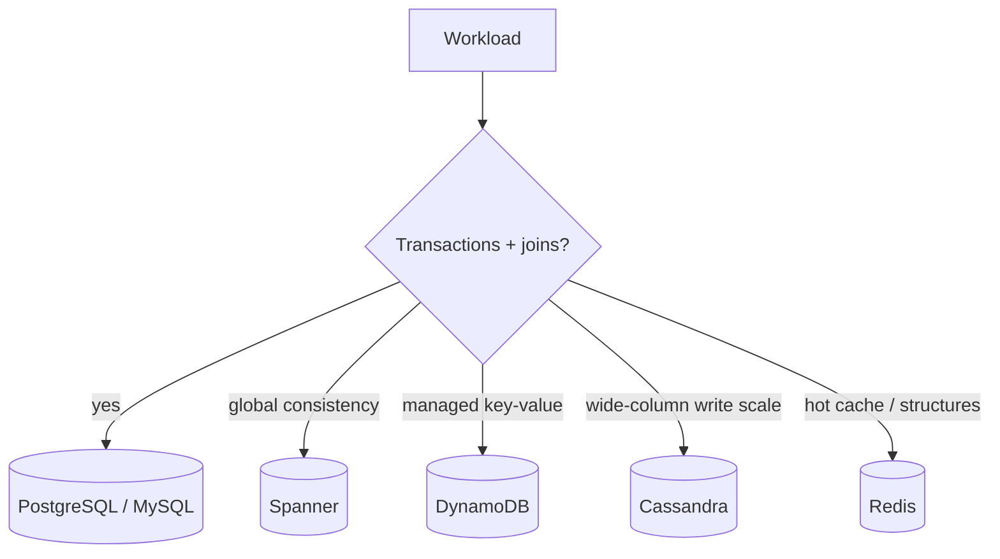
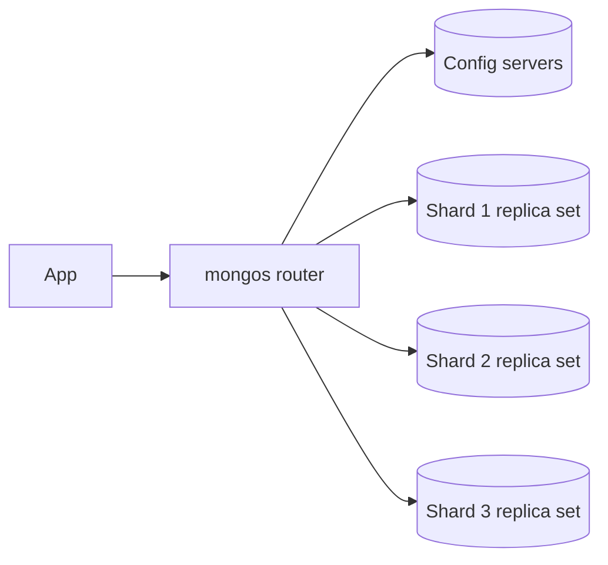
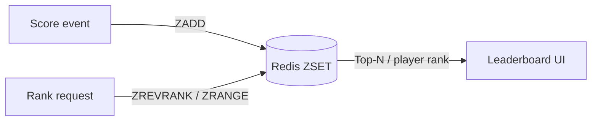

# 6. Databases in Practice

> **Note:** Real database choice is about workload shape, not brand loyalty.

## PostgreSQL and MySQL

- Best default choices for transactional systems.
- Strong consistency, mature indexing, familiar tooling.

## Spanner

- Globally distributed relational database with strong consistency.
- Useful when a single global truth matters more than convenience.

## DynamoDB

- Managed key-value/document store with partition key and sort key semantics.
- Excellent for predictable access patterns and horizontal scale.

## Cassandra

- Wide-column database designed for write-heavy, distributed workloads.
- Tunable consistency and high availability, with application responsibility for query design.

## MongoDB

- Document database. Stores JSON-like documents with flexible schema — no ALTER TABLE required.
- Primary unit is the document; related data is embedded rather than joined.
- Replica set: 1 primary + 2 secondaries; elections use majority election protocol (Raft-like but MongoDB-specific).
- Sharded cluster: mongos router sits in front of config-server replica set + N shard replica sets.
- **Shard key is permanent and non-trivial.** Monotonic keys (ObjectId, timestamp) create write hotspots. Use hashed shard key for even distribution or compound keys for zone sharding.
- Consistency is tunable: `writeConcern: majority` ensures writes survive a primary failure; default read concern is `local` (may see stale data). Use `readConcern: majority` + `writeConcern: majority` for strong consistency at the cost of latency.

## Redis

- In-memory data structure server used for cache, counters, sessions, locks, and fast lookups.
- Fantastic at being fast. Dangerous when treated as a casual primary database.

### Redis GEO — proximity and map problems

- `GEOADD key lon lat member` stores a location encoded internally as a **geohash**.
- `GEOSEARCH` / `GEORADIUS` returns members within a given radius, sorted by distance.
- The geohash encodes (longitude, latitude) into a 52-bit integer stored in a Sorted Set — so geo queries are just range queries in disguise.

- Common use: nearest drivers, nearby restaurants, delivery radius checks, map tiles by viewport.
- Precision is roughly 0.6 m at the default 52-bit level — good enough for almost every practical geo problem.

### Redis Sorted Set — leaderboard pattern

- `ZADD key score member` adds a member with a float score.
- `ZRANK` / `ZREVRANK` gives a member's rank in O(log N).
- `ZRANGE ... BYSCORE LIMIT` pages through a score range efficiently.

- Common use: game leaderboards, search ranking freshness, trending feeds, rate-limit counters with sliding windows.
- A single ZSET holds millions of members with O(log N) writes and reads — one of the cleanest patterns Redis offers.

| Redis data structure | Best for |
|---|---|
| String / Hash | key-value cache, session, config |
| List | queues, activity feeds |
| Set | unique members, tag unions |
| Sorted Set | leaderboards, ranked feeds, sliding-window rate limits |
| GEO | proximity search, map radius, geo-fencing |
| HyperLogLog | approximate unique counts at scale |
| Stream | append-only log, event sourcing |

| System | Mental model | Best for |
|---|---|---|
| PostgreSQL | general-purpose relational engine | OLTP, joins, integrity |
| MySQL | reliable relational engine | web apps, common OLTP |
| Spanner | global SQL | multi-region correctness |
| DynamoDB | managed partitioned key-value | known access patterns |
| Cassandra | distributed wide-column store | large writes, geo scale |
| Redis | in-memory multi-structure store | speed, geo, leaderboards, ephemeral state |

