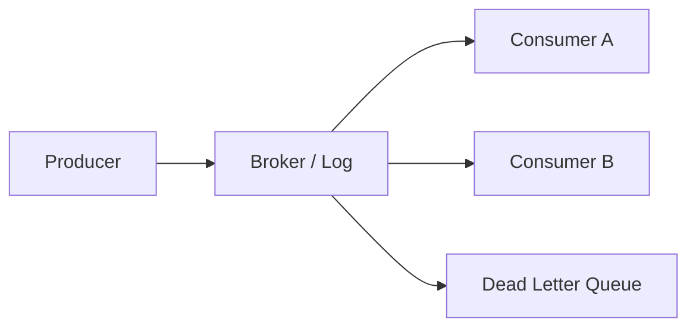
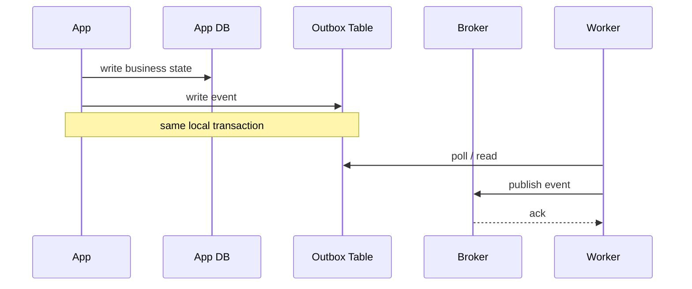
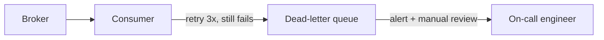
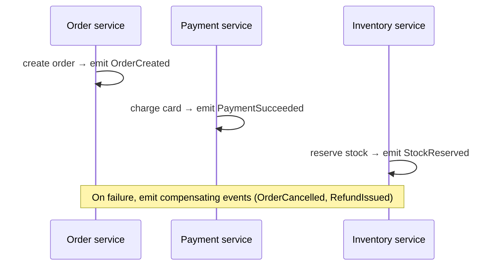
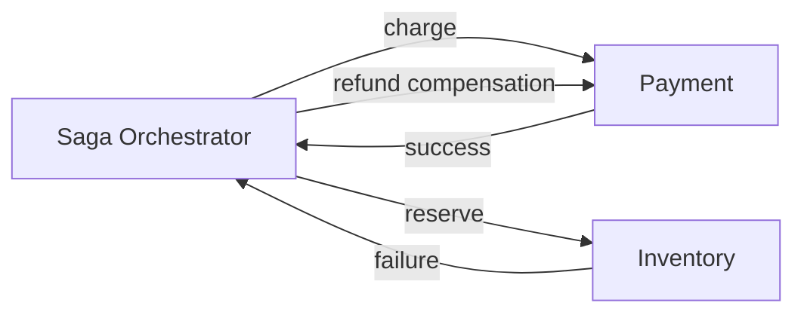
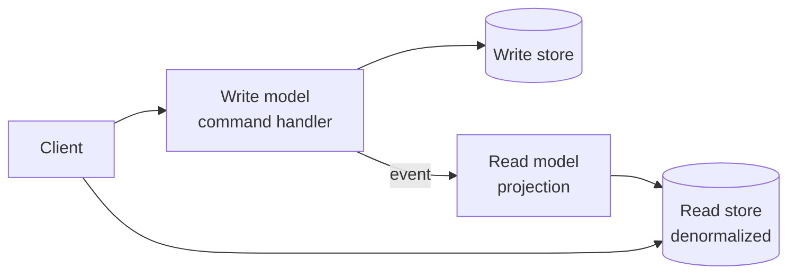
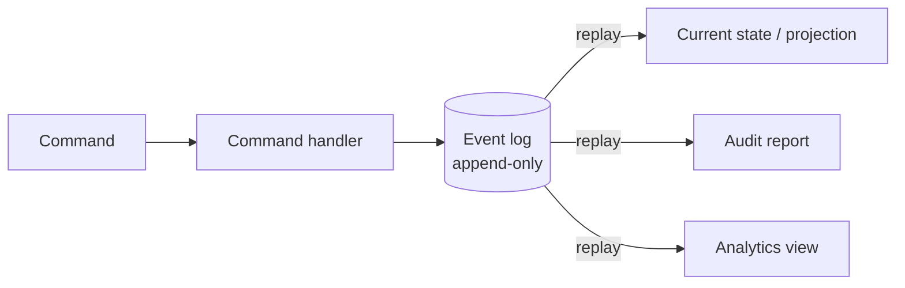

# 7. Messaging and Event-Driven Systems

> **Tip:** A broker turns direct coupling into an operational problem you can actually reason about.





## Message brokers

- Decouple senders from receivers.
- Useful for buffering bursts, async workflows, fanout, and integration.

## Kafka

- Durable append-only log, partitioned topics, consumer groups, replay.
- Consumers **pull** from partitions.
- Ordering is guaranteed **within a partition**, not across the whole topic.
- Great for event streams, analytics pipelines, and high-throughput messaging.

## RabbitMQ and queue-style brokers

- Better for routing patterns, work queues, and task dispatch.
- Broker semantics are more push-oriented and routing-heavy than Kafka's log model.
- Easier when you need message-centric semantics rather than a long-lived log.

## Delivery semantics

| Semantics | Meaning | Reality |
|---|---|---|
| At-most-once | may drop | fast, lossy |
| At-least-once | may duplicate | common, practical |
| Exactly-once | scoped transactional processing | end-to-end still needs idempotent sinks |

> **Note:** Kafka's "exactly once" is about the stream processing pipeline with transactions and idempotent producers/consumers. End-to-end exactly-once is still a system property, not a checkbox.

## Patterns

### Idempotency keys

Every retryable operation should carry an idempotency key — a unique ID the server uses to deduplicate requests.
If the same key arrives twice, the server returns the cached result instead of processing again.
This makes retries safe in the face of network failures, timeouts, and duplicate deliveries.

```
POST /payments
Idempotency-Key: txn-a1b2c3d4

→ if key seen before: return cached 200 OK
→ if key is new: process, store result, return 200 OK
```

### Retry with exponential backoff and jitter

- Retry immediately on transient failure (network blip, 503).
- Add exponential backoff: wait 1s, 2s, 4s, 8s … up to a cap.
- Add random jitter to avoid thundering herd when many clients fail at the same time.

### Dead-letter queue (DLQ)

Messages that fail repeatedly after all retries are moved to a dead-letter queue rather than discarded.
This preserves the failed message for inspection, alerting, and manual replay — you never silently lose work.



### Outbox pattern — guaranteed event publishing

The challenge: you need to write to your database **and** publish an event to the broker atomically.
If you write to the DB then crash before publishing, the event is lost. If you publish first then the DB write fails, you sent a lie.

**Solution:** write both the business state and the event to the DB in the same local transaction. A separate relay process reads the outbox table and publishes to the broker.

```mermaid
sequenceDiagram
  participant App
  participant DB as App DB + Outbox table
  participant Relay as Outbox relay
  participant Broker
  App->>DB: BEGIN; write business state; INSERT event into outbox; COMMIT
  Relay->>DB: poll outbox for unpublished events
  Relay->>Broker: publish event
  Broker-->>Relay: ack
  Relay->>DB: mark event as published
```

- The relay can use change-data capture (CDC via Debezium) to read the DB WAL instead of polling.
- Guarantees at-least-once delivery to the broker. Make consumers idempotent.

### Saga — distributed transactions without 2PC

A saga is a sequence of local transactions, each publishing an event or message that triggers the next step.
If any step fails, compensating transactions undo the work already done.

There are two coordination styles:

**Choreography** — each service reacts to events from the previous step.



**Orchestration** — a central saga orchestrator tells each service what to do.



| Style | Coupling | Visibility | Best for |
|---|---|---|---|
| Choreography | loose (event-driven) | harder to trace end-to-end | simple, few steps |
| Orchestration | tighter (central brain) | clear, easy to monitor | complex, many steps |

> **Tip:** Sagas give you eventual consistency across services without holding distributed locks. The price is that you must design compensating transactions for every failure path.

### CQRS — Command Query Responsibility Segregation

Separate the write path (commands that change state) from the read path (queries that return data).



- The write model handles complex business logic and enforces invariants.
- The read model is a denormalized projection optimized for the exact queries clients make — no joins, no N+1.
- Read and write stores can be different databases (PostgreSQL for writes, Redis or Elasticsearch for reads).
- Synchronization between write and read models is asynchronous → reads may be briefly stale.

### Event sourcing

Instead of storing current state, store the full history of events that produced it. The current state is always derived by replaying the event log.



- Provides a complete audit trail for free.
- Enables time-travel: replay from any point to reconstruct historical state.
- Pairs naturally with CQRS — the event log is the write store; projections are read models.
- Complexity: schema evolution is hard (old events must always be deserializable), and projection rebuilds can be slow on large logs.
