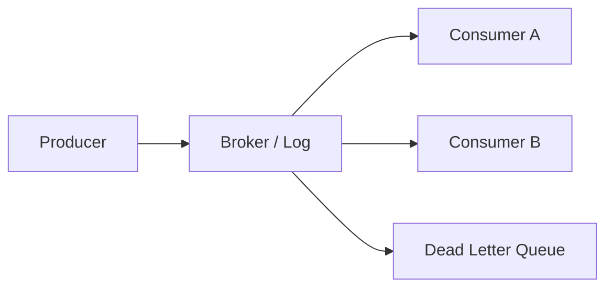
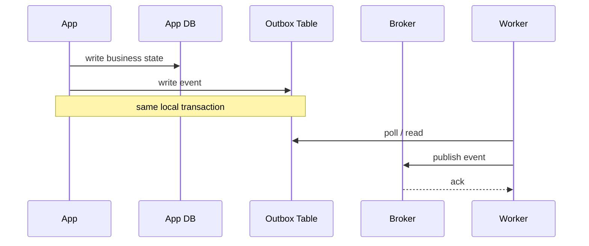

# 7. Messaging and Event-Driven Systems

> [!tip]
> A broker turns direct coupling into an operational problem you can actually reason about.

## Message brokers

- Decouple senders from receivers.
- Useful for buffering bursts, async workflows, fanout, and integration.

## Kafka

- Durable append-only log, partitioned topics, consumer groups, replay.
- Consumers **pull** from partitions.
- Ordering is guaranteed **within a partition**, not across the whole topic.
- Great for event streams, analytics pipelines, and high-throughput messaging.

## RabbitMQ and queue-style brokers

- Better for routing patterns, work queues, and task dispatch.
- Broker semantics are more push-oriented and routing-heavy than Kafka's log model.
- Easier when you need message-centric semantics rather than a long-lived log.

## Delivery semantics

| Semantics | Meaning | Reality |
|---|---|---|
| At-most-once | may drop | fast, lossy |
| At-least-once | may duplicate | common, practical |
| Exactly-once | scoped transactional processing | end-to-end still needs idempotent sinks |

> [!note]
> Kafka's "exactly once" is about the stream processing pipeline with transactions and idempotent producers/consumers. End-to-end exactly-once is still a system property, not a checkbox.

## Patterns

- Idempotency keys
- Retry with backoff
- Dead-letter queues
- Outbox pattern
- Saga for distributed workflows
