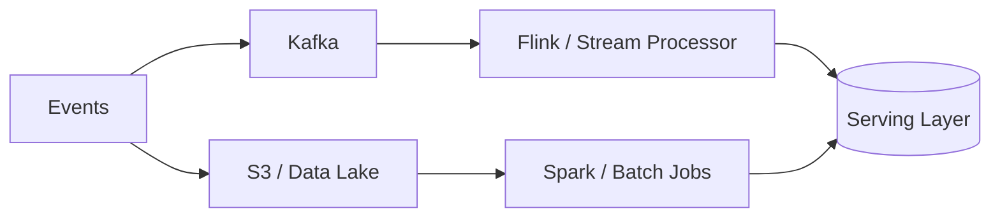
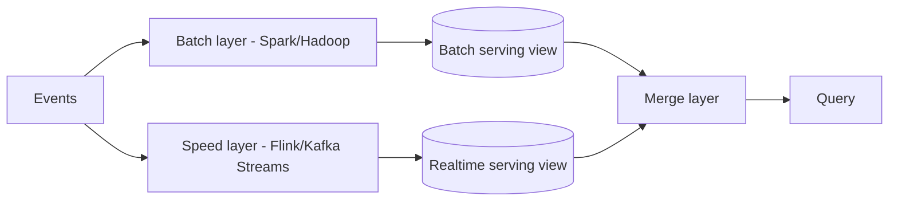

# 8. Batch, Stream, Search, and Specialized Stores

> [!note]
> Batch is for history. Stream is for immediacy. Search is for finding what humans actually meant.

## Batch — Lambda vs Kappa architecture

**Lambda architecture** maintains two parallel pipelines:

- Batch layer recomputes accurate historical views.
- Speed layer gives low-latency approximate recent results.
- Merge layer combines both for queries.
- Problem: two codebases for the same logic; painful to maintain.

**Kappa architecture** unifies on a single stream pipeline:

- One codebase; replay the Kafka log from offset 0 for reprocessing.
- Simpler operationally; requires Kafka retention long enough for full replay.
- Modern default for most new data platforms.

| Architecture | Complexity | Reprocessing | Latency | Consistency |
|---|---|---|---|---|
| Lambda | high — two pipelines | batch recompute | low (speed layer) | eventual merge |
| Kappa | low — one pipeline | Kafka replay | low | stream-consistent |

**Data Lakehouse** (Iceberg / Delta Lake / Hudi) bridges the gap further: ACID transactions and time-travel queries directly on object storage, eliminating the need for separate serving layers.

## Stream processing

- Hadoop and Spark are for large scans, ETL, backfills, and offline aggregation.
- Batch gives you completeness at the cost of latency.

## Stream processing

- Flink and similar engines are for event-time processing, windows, and stateful pipelines.
- Stream processing gives you freshness at the cost of operational complexity.

## Search

- Elasticsearch-style systems use inverted indexes and distributed shards.
- Search is retrieval plus ranking, not just substring matching.

## Specialized stores

- **Time-series**: metrics and telemetry with retention and compression.
- **Graph**: relationship traversal and connected data.
- **Geo**: spatial lookups and nearest-neighbor style queries.

| Workload | Best fit |
|---|---|
| Backfill / ETL | Spark |
| Real-time pipeline | Flink |
| Full-text search | Elasticsearch |
| Metrics | time-series DB |
| Relationship traversal | graph DB |
| Nearby location queries | geo index |

