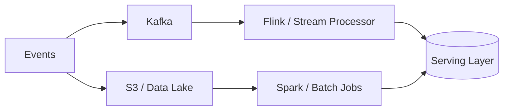
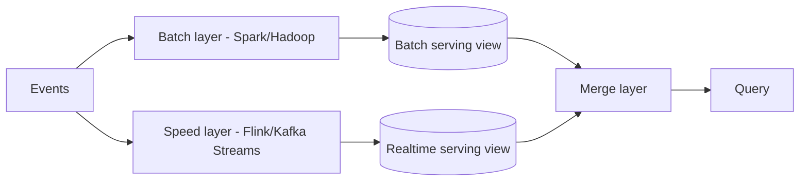
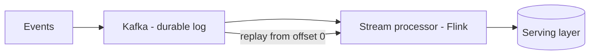
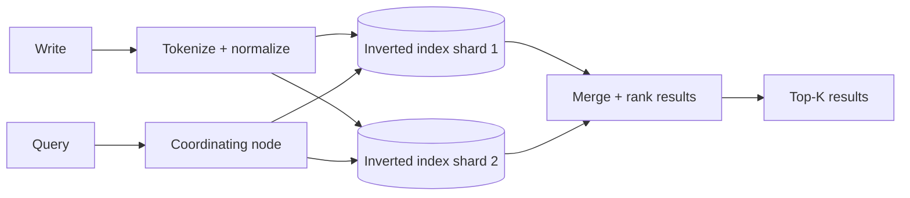

# 8. Batch, Stream, Search, and Specialized Stores

> **Note:** Batch is for history. Stream is for immediacy. Search is for finding what humans actually meant.



## Batch — Lambda vs Kappa architecture

**Lambda architecture** maintains two parallel pipelines:



- Batch layer recomputes accurate historical views.
- Speed layer gives low-latency approximate recent results.
- Merge layer combines both for queries.
- Problem: two codebases for the same logic; painful to maintain.

**Kappa architecture** unifies on a single stream pipeline:



- One codebase; replay the Kafka log from offset 0 for reprocessing.
- Simpler operationally; requires Kafka retention long enough for full replay.
- Modern default for most new data platforms.

| Architecture | Complexity | Reprocessing | Latency | Consistency |
|---|---|---|---|---|
| Lambda | high — two pipelines | batch recompute | low (speed layer) | eventual merge |
| Kappa | low — one pipeline | Kafka replay | low | stream-consistent |

**Data Lakehouse** (Iceberg / Delta Lake / Hudi) bridges the gap further: ACID transactions and time-travel queries directly on object storage, eliminating the need for separate serving layers.

## Batch processing

- **Hadoop MapReduce / Spark** are for large scans, ETL, backfills, and offline aggregation.
- Spark is the modern default: in-memory DAG execution, much faster than MapReduce for iterative jobs.
- Batch gives you completeness and correctness at the cost of latency — results are always slightly stale.
- Use cases: billing rollups, ML feature pipelines, data warehouse ETL, large-scale joins across cold data.

## Stream processing

- **Flink** and similar engines process events as they arrive, with support for event-time semantics, watermarks, and stateful windows.
- Stream processing gives you freshness at the cost of operational complexity and the challenge of out-of-order events.

### Windowing — how stream processors aggregate over time

| Window type | How it works | Use when |
|---|---|---|
| Tumbling | fixed non-overlapping buckets (0–60s, 60–120s) | hourly/daily aggregates |
| Sliding | overlapping windows of fixed size (last 60s, updated every 10s) | rolling averages |
| Session | dynamic window that closes after a gap in activity | user session analytics |

### Event time vs processing time

- **Event time**: the timestamp embedded in the event itself (when the thing actually happened).
- **Processing time**: when the event arrives at the stream processor.
- Network delays and retries mean events arrive out of order — Flink's **watermarks** mark "we believe all events before time T have arrived" and trigger window computation.

```mermaid
sequenceDiagram
  participant Src as Event Source
  participant Flink
  participant Out as Output / Serving
  Src->>Flink: event (event_time=T-5s)
  Src->>Flink: event (event_time=T)
  Src->>Flink: event (event_time=T-2s, late)
  Flink->>Flink: watermark advances; late event handled by allowed lateness
  Flink->>Out: window result emitted
```

## Search

Full-text search is not a database `LIKE` query at scale. It is a purpose-built retrieval and ranking pipeline.

### How Elasticsearch works

1. **Tokenize and index**: at write time, text is tokenized into terms and stored in an **inverted index** — a map from term → list of documents containing it.
2. **Relevance scoring**: queries score documents using BM25 (term frequency × inverse document frequency) and optionally vector similarity.
3. **Distributed shards**: an index is split across primary shards; each shard is replicated for availability.
4. **Near-real-time**: new documents appear in search results within ~1 second after indexing (a refresh cycle).



**Key concepts:**
- **Inverted index**: term → [doc1, doc3, doc7, …]; fast lookup, poor for updates.
- **Cardinality**: high-cardinality fields (user IDs) in aggregations are expensive — use with care.
- Elasticsearch is **AP** — it will serve stale reads under partition rather than refuse queries.
- Never use Elasticsearch as a source of truth for writes. Write to your primary store; sync to ES via CDC or outbox.

## Specialized stores

Different workloads need different data shapes. Knowing which store to reach for first is half the answer.

### Time-series databases

- Optimized for write-heavy ingest of timestamped numeric data with compression and retention policies.
- The query primitive is almost always: "give me metric X over time range T1–T2, grouped by tag Y."
- **TimescaleDB**: PostgreSQL extension; full SQL, ideal when you want time-series + relational joins.
- **InfluxDB**: purpose-built TSDB; good for high-cardinality sensor / IoT ingest.
- **Prometheus**: pull-based monitoring system; local storage is single-node — use **Thanos** or **Cortex** for long-term distributed storage.
- **ClickHouse**: columnar OLAP; use for analytics over billions of events, not for classic metrics monitoring.

### Graph databases

- Model relationships as first-class citizens — nodes and edges — instead of foreign keys and joins.
- Traversals like "friends of friends who bought X" are O(relationship count) instead of O(table rows).
- **Neo4j**: most mature graph DB; Cypher query language.
- **ArangoDB / TigerGraph**: multi-model or purpose-built for high-throughput graph analytics.
- Best for: social networks, fraud detection, knowledge graphs, recommendation engines based on graph topology.
- Avoid for: simple OLTP, high-volume writes, queries that don't need graph traversal.

### Geo / spatial stores

- Spatial indexes answer "find all entities within X km of point P" efficiently.
- **PostGIS** (PostgreSQL extension): full geospatial SQL, polygon intersection, routing with pgRouting.
- **Redis GEO**: geohash-backed sorted set; fast radius search, no polygon support — ideal for live location tracking.
- **S2 geometry** (used by Google): hierarchical grid cells for geofencing and spatial joins at massive scale.

| Workload | Best fit |
|---|---|
| Backfill / ETL | Spark |
| Real-time pipeline | Flink |
| Full-text search | Elasticsearch / OpenSearch |
| Metrics + monitoring | Prometheus + Thanos |
| Time-series + SQL | TimescaleDB |
| High-cardinality analytics | ClickHouse |
| Relationship traversal | Neo4j / ArangoDB |
| Live location / radius search | Redis GEO |
| Geospatial SQL + polygons | PostGIS |

