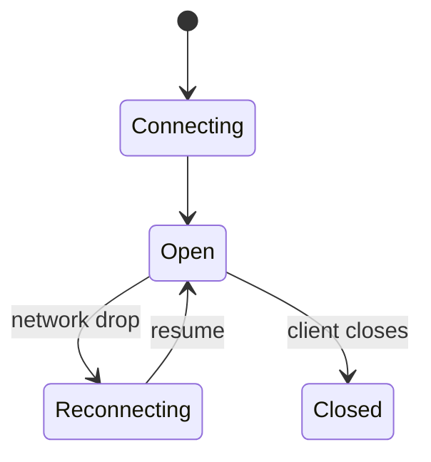
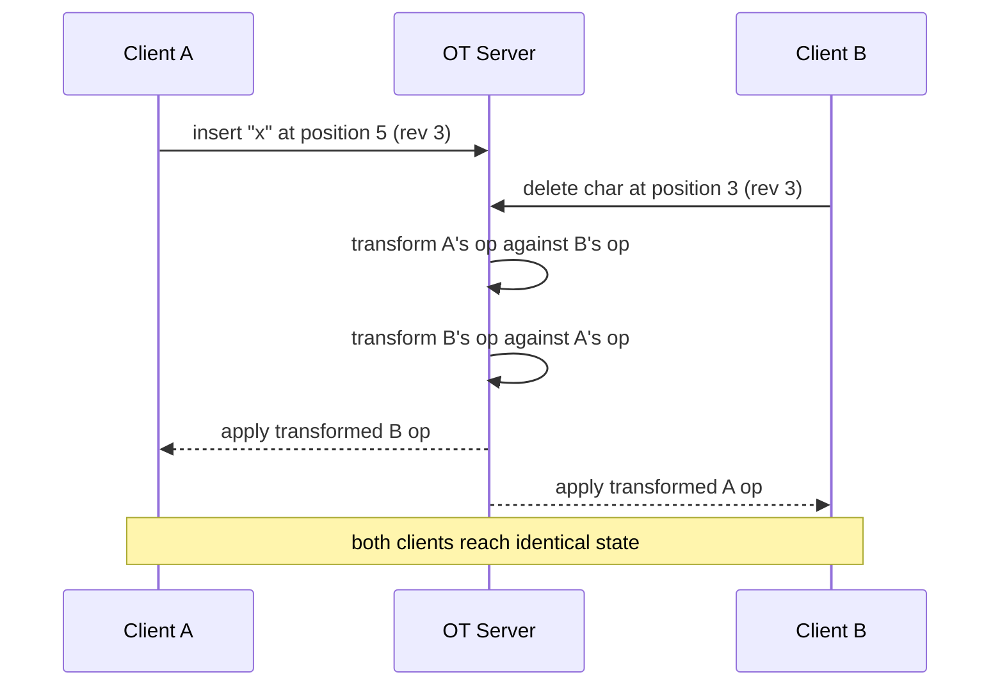
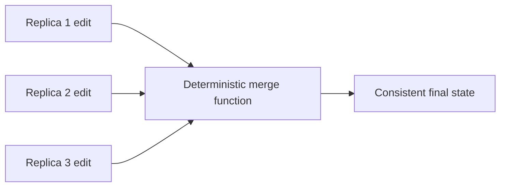
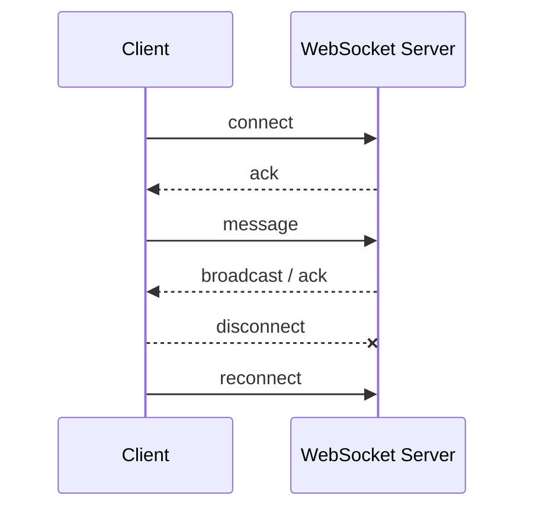
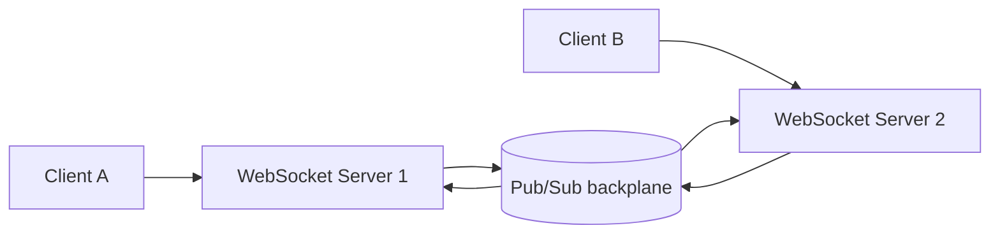

# 9. Realtime Systems and Coordination

> **Tip:** Realtime systems are just normal systems with a shorter patience budget.

## OT and CRDT — collaborative editing merge

When two users edit the same document simultaneously, you need a way to merge their changes without data loss and without a central lock.

### Operational Transformation (OT)

Each edit is an operation (insert/delete at position). When operations arrive out of order, the server **transforms** each operation against concurrent ones to adjust positions before applying.

- Google Docs historically used OT.
- Requires a central server to serialize and transform operations.

### CRDT (Conflict-free Replicated Data Types)

Data structures designed so that concurrent updates from any replica always merge deterministically — no server arbitration needed.

- Eventual consistency guaranteed by math, not coordination.
- Common CRDTs: G-Counter (grow-only counter), LWW-Register (last-write-wins), RGA (replicated growable array for text).
- Used by Figma, Notion, and most offline-first apps.

| Approach | Coordination needed | Works offline | Complexity |
|---|---|---|---|
| OT | yes (central server) | limited | high (transform logic) |
| CRDT | no | yes | medium (data structure choice) |

## Transport choices

- **Short polling**: client asks "anything new?" on a timer. Simple, wastes requests when idle. The baseline — everything else exists to beat this.
- **Long polling**: server holds the request open until data arrives or timeout. Better than short polling; still inefficient at scale.
- **Server-Sent Events (SSE)**: server-to-client push over a single HTTP connection. Simple and reliable for one-way feeds.
- **WebSockets**: full-duplex persistent TCP connection. Best for bidirectional real-time (chat, live collaboration).
- **WebRTC**: peer-to-peer data and media directly between browsers. Used for video calls, screen share, and low-latency file transfer. Requires a signaling server to bootstrap the peer connection but data flows P2P after that.

| Transport | Direction | Overhead | Best for |
|---|---|---|---|
| Short polling | client-to-server | high | simplest fallback |
| Long polling | server-to-client | medium | basic push, wide compatibility |
| SSE | server-to-client | low | feeds, live scores, dashboards |
| WebSocket | bidirectional | low | chat, games, live collaboration |
| WebRTC | peer-to-peer | very low | video, voice, P2P data |

## Use cases

- Chat
- Presence
- Collaborative editing
- Notifications
- Live dashboards

## Coordination

- Distributed locks
- Leader election
- Heartbeats
- Lease-based ownership

## Why realtime is hard

- State moves fast.
- Clients disconnect.
- Ordering matters.
- Fanout gets expensive.

> **Note:** WebSocket servers are stateful enough that horizontal scale usually needs a shared backplane for fanout and presence.
