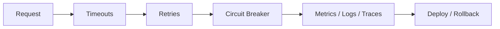
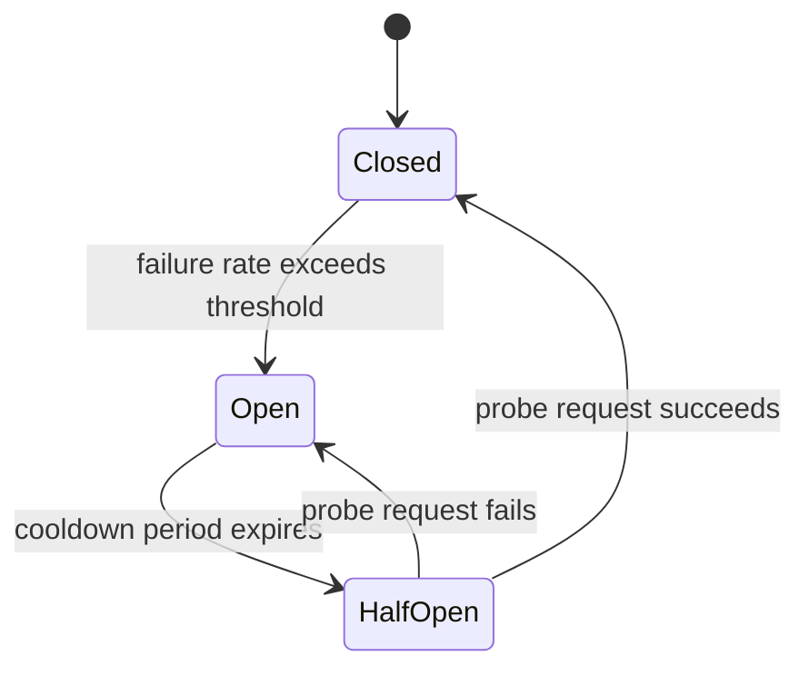
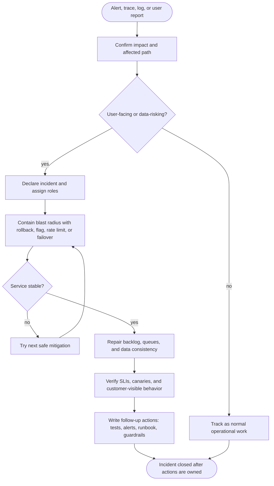
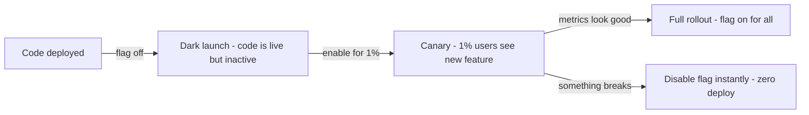

# 10. Reliability, Security, Observability, and Deployment

> **Warning:** The best architecture still fails if nobody can see it, secure it, or recover it.

## Resilience

Failures are inevitable. The goal is not to prevent failure — it is to make failure survivable and recoverable.

### Timeouts

Every call to an external service must have a timeout. Without a timeout, a slow downstream can hold your thread or connection forever, cascading into a full outage.

- Set timeouts based on the SLO of the caller, not the downstream's average.
- If P99 latency is 80 ms, a 200 ms timeout is reasonable. A 30-second timeout is not a safeguard — it is a slow-motion disaster.

### Retries with exponential backoff and jitter

- Retry on transient failures (network blips, 429, 503), but **not** on permanent failures (400, 401, 404).
- Use exponential backoff: wait 1s, 2s, 4s, 8s… up to a cap.
- Add random jitter to prevent all clients retrying simultaneously after a shared event (thundering herd).
- Always pair retries with idempotent operations or idempotency keys.

### Circuit breakers

A circuit breaker monitors failure rate. When failures exceed a threshold, the breaker **opens** — subsequent calls fail immediately without attempting the downstream. After a cooldown, it enters **half-open** state and lets one request through. If it succeeds, the breaker closes. If it fails, it opens again.

- Prevents a slow downstream from occupying all threads.
- Gives the downstream time to recover without being hammered by retry storms.
- Tools: Resilience4j, Hystrix (deprecated), Envoy, Istio.

### Bulkheads

Isolate failure domains so one dependency's failure cannot exhaust all resources.

- **Thread pool bulkhead**: each downstream dependency gets its own thread pool. If Dependency A hangs, only its pool is exhausted — your core service and Dependency B are unaffected.
- **Process bulkhead**: deploy different tiers in separate processes or pods. A memory leak in a worker does not kill the API process.

### Graceful degradation

Design systems to deliver reduced functionality rather than a complete outage.

- If the recommendation service is down, show default content instead of erroring the whole page.
- If the metrics pipeline is overloaded, sample at a lower rate instead of dropping the primary request.
- If the cache is down, fall back to the database with a warning — not a 500.

> **Tip:** Bulkheads prevent spread. Circuit breakers halt cascades. Timeouts set boundaries. Use all three — they solve different parts of the resilience problem.

## Observability

- Logs for what happened
- Metrics for how often and how much
- Traces for where the time went
- Alerts for when humans should wake up

### SLI, SLO, and error budgets

| Term | Meaning | Example |
|---|---|---|
| SLI (Service Level Indicator) | the metric you measure | p99 latency, error rate, availability |
| SLO (Service Level Objective) | the target for that metric | p99 latency < 200 ms over 30 days |
| SLA (Service Level Agreement) | contractual consequence of missing SLO | refund if availability < 99.9% |
| Error budget | 100% minus SLO | 0.1% downtime allowed = 43 min/month |

### RED and USE methods

**RED** (for services):
- **R**ate — requests per second
- **E**rrors — error rate
- **D**uration — latency distribution (p50, p95, p99)

**USE** (for resources/infrastructure):
- **U**tilization — % time resource is busy
- **S**aturation — queue depth / wait
- **E**rrors — hardware/driver errors

### Production monitoring checklist

- p99 latency alert on critical paths (not just average)
- Error rate alert separate from latency
- Saturation alerts: CPU, memory, disk, connection pool exhaustion
- Distributed trace IDs propagated through all services
- High-cardinality labels controlled (avoid per-user labels in Prometheus)
- On-call rotation with clear paging policy and runbooks

## Activity diagram: incident response loop

Reliability work is a loop, not a checklist: detect quickly, protect users, restore safely, and feed the lesson back into the system.

## Security

Security is not a feature you add at the end — it is a property you design for from the beginning.

### Authentication and authorization

- **Authentication**: prove who you are (JWT, OAuth 2.0, mTLS, API key).
- **Authorization**: prove you are allowed to do this (RBAC, ABAC, policy engines like OPA).
- Prefer short-lived tokens (JWTs with 15-minute expiry + refresh tokens) over long-lived credentials.
- For service-to-service calls, use mTLS or workload identity (SPIFFE/SPIRE, AWS IAM Roles, GCP Workload Identity) — never static shared secrets.

### Transport and data security

- **TLS everywhere in transit**: even internal service-to-service traffic. No plain HTTP inside the cluster.
- **Encryption at rest**: disk-level or application-level encryption for sensitive data. Key management matters as much as the cipher.
- **Secrets management**: store secrets in Vault, AWS Secrets Manager, or GCP Secret Manager — never in environment variables baked into images or committed to source control.

### Least privilege and defense in depth

- Each service should have the minimum permissions it needs — nothing more.
- Network: use service mesh mTLS + network policies to prevent lateral movement. Services should not be able to talk to each other unless explicitly allowed.
- Database: application credentials should only have `SELECT`/`INSERT`/`UPDATE` on the tables they own, not `DROP TABLE` or `pg_read_server_files`.

### Common vulnerabilities to design against

| Threat | Mitigation |
|---|---|
| Injection (SQL, command) | parameterized queries, input validation, no dynamic SQL |
| Broken authentication | short-lived tokens, MFA, rate-limit login endpoints |
| Sensitive data exposure | encrypt at rest + in transit, minimize PII stored |
| SSRF (Server-Side Request Forgery) | allowlist outbound destinations, block internal IP ranges |
| Excessive API exposure | rate limiting, input size limits, field-level authorization |

> **Tip:** The easiest vulnerability to exploit is not a cryptography flaw. It is an API endpoint that trusts the caller's claimed identity without verifying authorization.

## Deployment

### Packaging with containers

- **Docker** packages the application and its runtime dependencies into a portable image.
- Images should be minimal (distroless or alpine base), non-root user, and scanned for CVEs before promotion.
- Pin image tags to digests in production — `latest` is a footgun.

### Orchestration with Kubernetes

- **Kubernetes** schedules containers across a cluster, handles health checks, rolling updates, and self-healing.
- Key abstractions: `Deployment` (desired state), `Service` (stable network endpoint), `ConfigMap`/`Secret` (config injection), `HorizontalPodAutoscaler` (scale on CPU/custom metrics).
- Use `readinessProbe` + `livenessProbe` so Kubernetes can stop routing to unhealthy pods and restart broken ones.
- Resource requests and limits prevent noisy neighbours from starving each other.

### Deployment strategies

| Strategy | How | Risk | Rollback |
|---|---|---|---|
| Recreate | kill all old, start all new | full downtime window | redeploy previous version |
| Rolling update | replace pods one by one | brief mixed-version state | rollback deployment |
| Blue-green | run two full environments; flip traffic | doubles infrastructure cost | instant — flip traffic back |
| Canary | route a small % of traffic to new version | catches bugs before full rollout | remove canary; adjust traffic weight |

**Canary is usually the right choice** for high-traffic services. It limits blast radius while giving real production signals.

### Feature flags

- Deploy code before it is enabled. Separate deploy from release.
- Turn on features gradually (1% → 10% → 100%), roll back instantly without a new deploy.
- Useful for A/B testing, kill switches, and gradual migrations.
- Tools: LaunchDarkly, Unleash, Flipt, or a simple database-backed flag store.

## Recovery

The fastest way to discover your backup strategy is broken is during an incident at 3 AM. Test recovery before you need it.

### RTO and RPO

- **RTO (Recovery Time Objective)**: how long can the system be down? Hours = backup restore. Minutes = warm standby. Seconds = hot failover.
- **RPO (Recovery Point Objective)**: how much data can you lose? Hours = daily backups. Minutes = WAL archiving. Seconds = synchronous replication.

These two numbers drive every HA and backup architecture decision. Define them before choosing technology.

| Strategy | RTO | RPO | Cost |
|---|---|---|---|
| Cold backup (restore from S3) | hours | minutes to hours | low |
| Warm standby (replica, manual promote) | minutes | seconds | medium |
| Hot standby (auto-failover) | seconds | near-zero | high |
| Multi-region active-active | near-zero | near-zero | very high |

### Backup practices

- **Backups tested** — not just configured. Run a restore drill quarterly. Untested backups are assumptions.
- **Offsite / cross-region** — a backup in the same failure domain as the primary is not a backup.
- **WAL archiving** — for PostgreSQL, archive WAL segments to object storage (S3/GCS) for point-in-time recovery (PITR).
- **Retention policy** — keep enough history to recover from silent corruption, which may not be noticed immediately.

### Multi-region strategy

- **Active-passive**: primary region handles all writes; secondary region is a hot standby that can be promoted.
- **Active-active**: both regions handle writes; requires conflict resolution (complex) or partition-by-geography (simpler).
- DNS failover or anycast routing flips traffic to the surviving region.

### Incident runbooks

- Document the recovery steps before the incident, not during.
- A runbook should be executable under stress: step-by-step, with exact commands, expected outputs, and escalation paths.
- Runbooks rot — review them after every incident.

> **Tip:** If your system cannot be observed or rolled back, it is not production-ready; it is just exposed.

