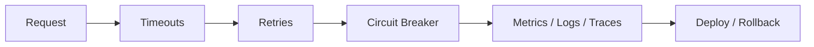

# 10. Reliability, Security, Observability, and Deployment

> [!warning]
> The best architecture still fails if nobody can see it, secure it, or recover it.

## Resilience

- Timeouts
- Retries with exponential backoff
- Circuit breakers
- Bulkheads
- Graceful degradation

## Observability

- Logs for what happened
- Metrics for how often and how much
- Traces for where the time went
- Alerts for when humans should wake up

### SLI, SLO, and error budgets

| Term | Meaning | Example |
|---|---|---|
| SLI (Service Level Indicator) | the metric you measure | p99 latency, error rate, availability |
| SLO (Service Level Objective) | the target for that metric | p99 latency < 200 ms over 30 days |
| SLA (Service Level Agreement) | contractual consequence of missing SLO | refund if availability < 99.9% |
| Error budget | 100% minus SLO | 0.1% downtime allowed = 43 min/month |

### RED and USE methods

**RED** (for services):
- **R**ate — requests per second
- **E**rrors — error rate
- **D**uration — latency distribution (p50, p95, p99)

**USE** (for resources/infrastructure):
- **U**tilization — % time resource is busy
- **S**aturation — queue depth / wait
- **E**rrors — hardware/driver errors

### Production monitoring checklist

- p99 latency alert on critical paths (not just average)
- Error rate alert separate from latency
- Saturation alerts: CPU, memory, disk, connection pool exhaustion
- Distributed trace IDs propagated through all services
- High-cardinality labels controlled (avoid per-user labels in Prometheus)
- On-call rotation with clear paging policy and runbooks

## Security

- Authentication
- Authorization
- TLS in transit
- Encryption at rest
- Secrets management
- Least privilege

## Deployment

- Docker for packaging
- Kubernetes for orchestration
- Blue-green and canary deployment for safer releases
- Feature flags for controlled rollout

## Recovery

- Backups
- Multi-region strategy
- RTO and RPO targets
- Incident runbooks

> [!tip]
> If your system cannot be observed or rolled back, it is not production-ready; it is just exposed.

