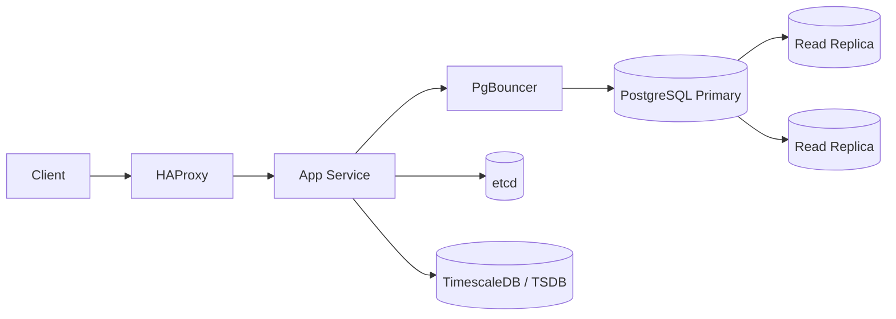
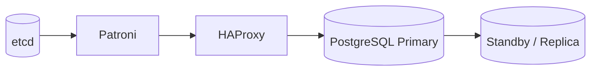
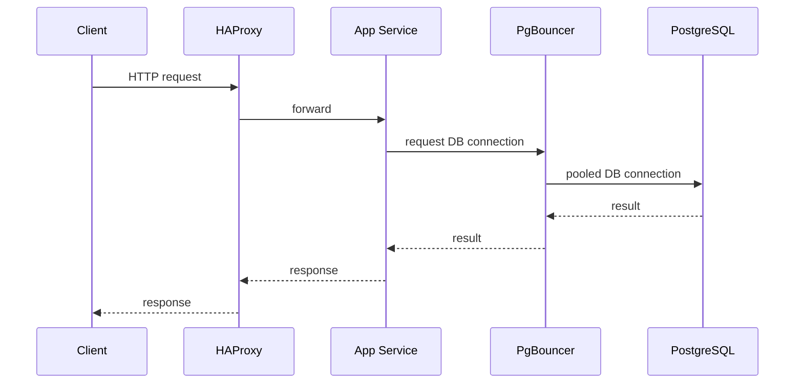

# 11. Open Source Production Stack

> **Important:** Real production systems are usually not built from one shiny database. They are built from boring, dependable tools that fail in understandable ways.
> Prefer local/open-source primitives first; use managed cloud only when it materially reduces risk or ops burden.

## etcd

- Distributed key-value store used for configuration, service discovery, leader election, and coordination.
- Keep the cluster small, consistent, and boring. That is the compliment.
- Common use: store dynamic config, election leases, and service metadata.
- etcd itself uses Raft, so it belongs in the "coordination and consensus" bucket, not the "app datastore" bucket.

## HAProxy

- High-performance load balancer for TCP and HTTP traffic.
- Use it for health checks, failover, TLS termination, routing, and controlled draining.

| Mode | Best for | Notes |
|---|---|---|
| L4 | raw TCP | simple, fast |
| L7 | HTTP-aware routing | smarter, more features |

## PostgreSQL in production

- Run PostgreSQL with streaming replication, backups, WAL archiving, and clear failover rules.
- Keep connection counts under control. PostgreSQL is excellent, but it is not a free-for-all nightclub.
- A common HA pattern is **Patroni + etcd + HAProxy**: etcd stores cluster state, Patroni handles leader election/failover, HAProxy routes clients to the current primary.
- If replication is asynchronous, failover can lose recent writes. If it is synchronous, latency and availability trade-offs get sharper.

### Typical request path

### PgBouncer

- Lightweight connection pooler for PostgreSQL.
- Use it when app servers create too many short-lived DB connections.
- Common pooling modes:
  - session: one client, one server connection
  - transaction: best default for web apps
  - statement: strictest, most limiting
- Transaction pooling breaks session-scoped features such as session `SET`, advisory locks, `LISTEN/NOTIFY`, and some prepared-statement workflows.

### Useful PostgreSQL extensions

| Extension | Why it exists |
|---|---|
| `pg_stat_statements` | query visibility and tuning |
| `pgcrypto` | crypto helpers; `gen_random_uuid()` in modern PostgreSQL |
| `postgis` | geospatial queries |
| `timescaledb` | time-series storage and compression |
| `pg_partman` | partition management |
| `citext` | case-insensitive text |

### Production checklist

- Autovacuum on and monitored
- Connection limits sized for reality
- Read replicas for read-heavy workloads
- Backups tested, not just configured
- WAL retention sized for recovery goals
- Slow-query visibility enabled

## Time-series databases

- Best for metrics, telemetry, sensor events, and any workload where time is the main filter.
- Good options: TimescaleDB, Prometheus, InfluxDB, ClickHouse depending on query shape.
- Typical pattern: write-heavy ingest, retention policies, compression, time-bucketed queries.
- Prometheus is usually a **pull-based monitoring system**, not a general-purpose TSDB. Its local storage does not scale horizontally — for long-term retention and federation use **Thanos** or **Cortex** as a distributed backend.
- ClickHouse is often used for time-series analytics and OLAP, not as a classic metrics TSDB.
- Watch cardinality. High-cardinality labels can turn a metrics system into a self-inflicted outage.

| Need | Good fit |
|---|---|
| Metrics + SQL | TimescaleDB |
| Monitoring | Prometheus |
| General time-series ingest | InfluxDB |
| Analytics over large event sets | ClickHouse |

> **Tip:** If the question is "can PostgreSQL do this?", the right answer is "yes, until the workload says no."
