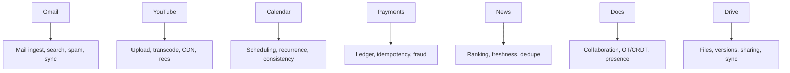
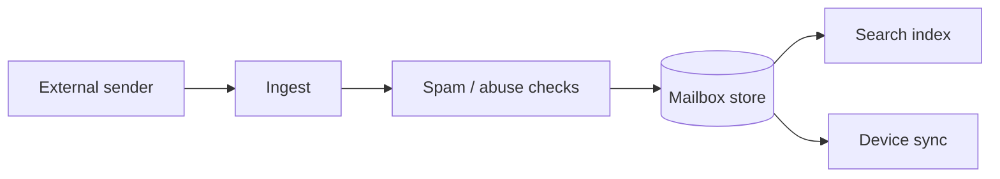
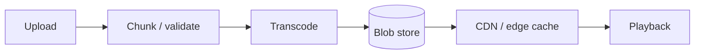
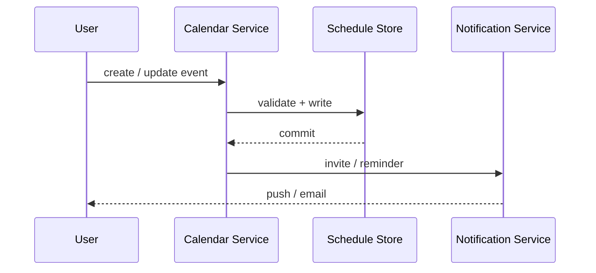
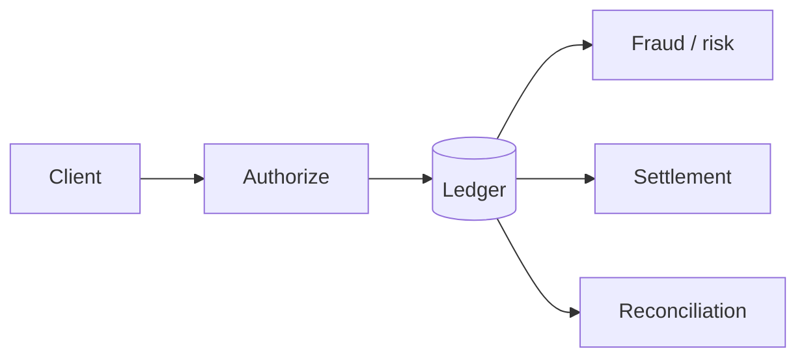
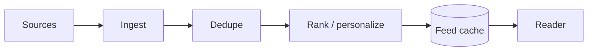
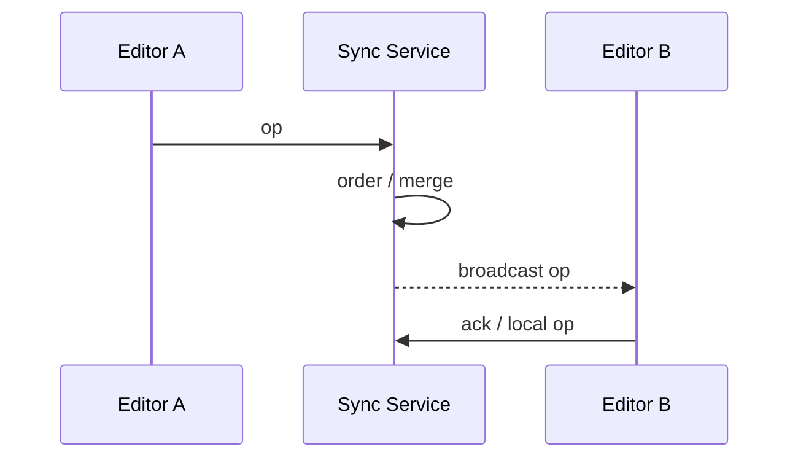
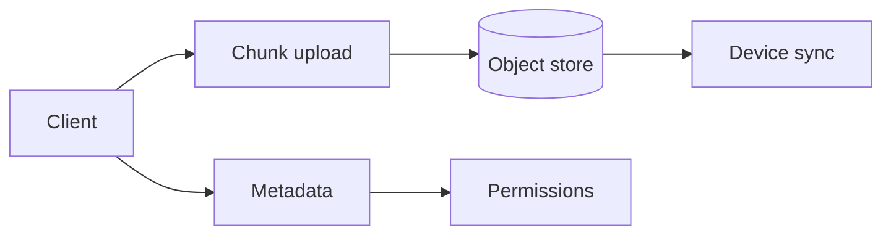
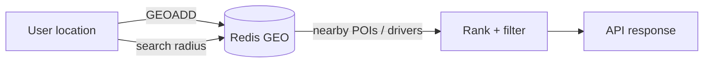
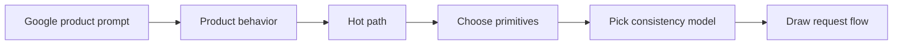

# 12. Google Product Archetypes

> **Note:** For Google products, the product name is just a wrapper. The real target is the concept pattern hidden inside it.

## Gmail

- Mail ingest, spam filtering, label/index search, attachments, offline sync.
- Key ideas: indexing, search, consistency for read/unread state, storage lifecycle.

## YouTube

- Upload pipeline, transcoding, chunked streaming, CDN/edge delivery, recommendations, comments.
- Key ideas: media pipeline, caching, fanout, ranking, global delivery.

### Trending and leaderboards

- Every view increments a Redis Sorted Set score: `ZINCRBY trending:day <videoId>`.
- Time-bucketed keys (`trending:2024-07-04:hour:14`) allow sliding-window trending.
- See the Databases chapter for the full ZADD/ZREVRANGE pattern and data-structure reference.

## Google Calendar

- Event creation, recurrence, timezone correctness, invites, reminders, conflict handling.
- Key ideas: consistency, time semantics, notification delivery, multi-device sync.

## Payment system

- Ledger, authorization, settlement, retries, idempotency, reconciliation, fraud detection.
- Key ideas: correctness, auditability, exactly-once-ish processing, compliance.

## Google News

- Source ingestion, ranking, freshness, deduplication, personalization, topic clustering.
- Key ideas: search/ranking, stream processing, caches, freshness versus completeness.

## Google Docs

- Real-time collaborative editing, presence, cursors, offline edits, conflict resolution.
- Key ideas: OT or CRDT style collaboration, low-latency sync, merge semantics.

## Google Drive

- File upload, chunking, metadata, sharing, ACLs, versioning, sync across devices.
- Key ideas: object storage, metadata store, dedupe, permissions, resumable uploads.

## Google Maps — proximity and geo search

- Geo search, routing, points of interest (POI), ETA, real-time traffic, directions.
- Key ideas: spatial indexing, geo hashing, tile serving, consistent routing graph.

### Redis GEO for proximity problems

- Use `GEOADD` to store driver locations and `GEOSEARCH BYRADIUS` to find nearest drivers.
- See the Databases chapter for the full command reference, geohash internals, and precision details.

| Problem | Redis primitive |
|---|---|
| Nearest K drivers | GEOSEARCH + BYRADIUS |
| Delivery zone check | GEOSEARCH + BYBOX |
| Driver location expiry | separate TTL key per driver; remove from GEO on expiry |
| Trending routes | ZSET with route hash key |

| Product | Core load shape | Hard part |
|---|---|---|
| Gmail | read-heavy with search | indexing + spam + sync |
| YouTube | write-heavy ingest with massive reads | transcode + CDN + recs + trending |
| Calendar | correctness-heavy writes | recurrence + timezones |
| Payments | correctness + audit | ledger + idempotency |
| News | freshness + ranking | dedupe + relevance |
| Docs | realtime collaboration | concurrency + merge |
| Drive | file sync + sharing | metadata + permissions |
| Maps | geo + routing | spatial index + real-time updates |

## The reusable mapping

| Product signal | Likely primitive |
|---|---|
| Search and mail-like retrieval | inverted index |
| Media at scale | object store + CDN + transcoding |
| Scheduling and recurrence | strong consistency + timezone logic |
| Money movement | ledger + idempotency + audit log |
| Collaborative editing | OT / CRDT + realtime transport |
| File sync | chunking + metadata + versioning |
| Trending / leaderboards | Redis Sorted Set (ZINCRBY + ZREVRANGE) |
| Proximity / geo radius | Redis GEO (GEOADD + GEOSEARCH) |

> **Tip:** The best answer is not "I would use X." It is "for this product, the hard part is Y, so I need X to make Y safe."
