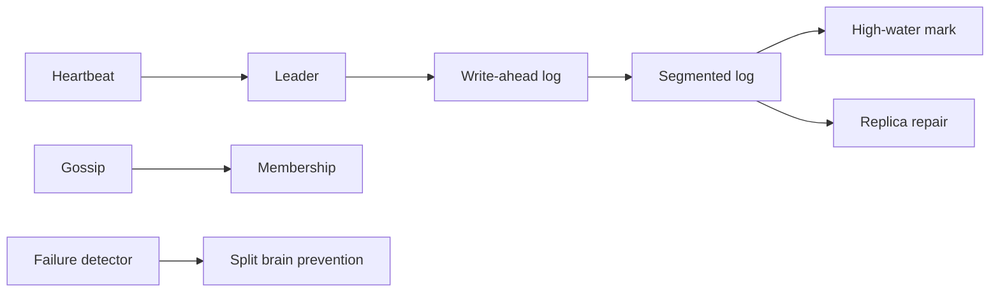
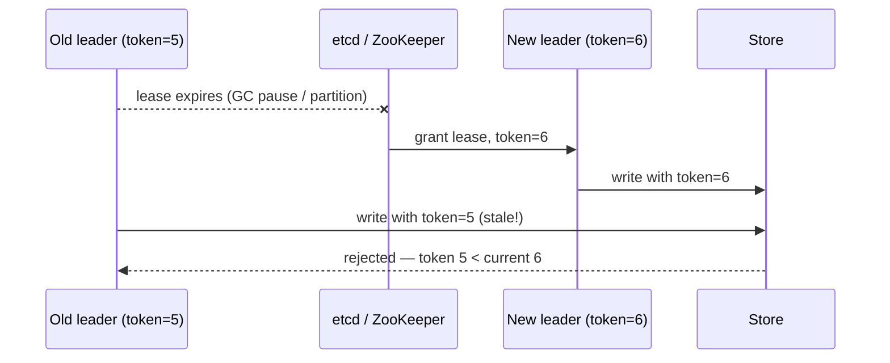
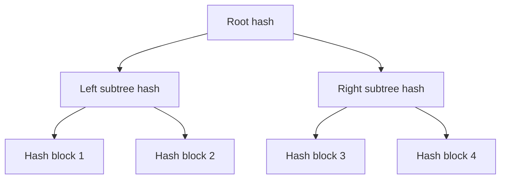

# 13. Distributed System Patterns

> **Important:** These are the primitives that keep distributed systems from turning into group projects with outages.



## Bloom filters

A Bloom filter answers the question "have I seen this key before?" in O(1) time and constant space — but probabilistically.

- **Definitely not in the set**: if the filter says no, believe it. Zero false negatives.
- **Probably in the set**: if the filter says yes, it might be wrong. False positives are possible. Tune the false-positive rate with more bits or more hash functions.
- **Use case**: LSM trees (RocksDB, Cassandra) use Bloom filters per SSTable so reads skip files that definitely do not contain the key. Without Bloom filters, every read on a cold LSM tree would scan all SSTables.
- **Other uses**: duplicate URL detection in web crawlers; deduplication in messaging pipelines; CDN cache bypass decisions.

> Never use a Bloom filter when false positives are unacceptable (e.g., security allow-lists). Use it when false positives are cheap and false negatives are catastrophic — like skipping disk reads.

## Write-ahead log (WAL)

Before any data page is modified on disk, the intent is written to the WAL — a sequential, append-only log.

- If the system crashes mid-write, recovery replays the WAL to restore the committed state.
- Sequential writes to the WAL are much faster than random writes to data pages.
- The WAL is the foundation of durability in PostgreSQL, MySQL, RocksDB, and most serious databases.
- In LSM trees, the WAL handles crash recovery; the SSTable files are rebuilt from memtable flushes.

## Segmented log and high-water mark

- Logs are split into segments so old data can be compacted or removed.
- The high-water mark is the safe committed prefix used for replication and retention decisions.

## Lease

A lease is **time-bounded ownership** — a node holds a resource (leadership, a lock, a shard) for a defined duration and must actively renew it. If renewal stops (node crashes, network partition), the lease expires and another node can take over.

- **Why not permanent ownership?** Permanent ownership requires knowing the previous owner is truly dead. The lease approach sidesteps this — ownership simply expires.
- **Leader lease in Raft**: the leader renews its lease with heartbeats. If a follower does not hear from the leader within the lease duration, it starts an election.
- **Database advisory locks**: PostgreSQL advisory locks are session-scoped leases — they release automatically when the connection closes.
- **Distributed job scheduling**: only the node holding the lease runs a periodic job, preventing duplicate execution.

## Heartbeat

A heartbeat is a periodic liveness signal: "I am still alive and reachable."

- Missed heartbeats do not prove death — they prove **suspicion**. A node can miss a heartbeat because of a GC pause, a slow network, or a momentary CPU spike.
- Systems use configurable timeouts before declaring a node dead. Too short → false failures and unnecessary elections. Too long → slow failover.
- Heartbeats drive leader election in Raft, node failure detection in Cassandra (Gossip), and health checks in Kubernetes.

## Gossip protocol

Gossip (also called epidemic protocol) is how nodes in a large cluster share membership and state information without a central coordinator.

- Each node periodically picks a random peer and exchanges its view of the cluster state.
- Information spreads like a rumor — each exchange doubles the number of informed nodes. Full propagation takes O(log N) rounds.
- **Strengths**: scales to thousands of nodes, tolerates node failures naturally, no single point of failure.
- **Weaknesses**: eventual consistency of membership state; not suitable for decisions that need immediate agreement.
- **Used by**: Cassandra (gossip for ring membership and failure detection), DynamoDB, Consul.

## Phi accrual failure detection

Instead of a binary heartbeat timer ("missed = dead"), Phi accrual models heartbeat inter-arrival times with a probability distribution and computes a suspicion score φ (phi).

- φ grows continuously as a heartbeat falls overdue. The caller decides a death threshold (e.g., φ > 8 → declare dead).
- Better than a fixed timeout because networks are not emotionally stable — a GC pause that delays one heartbeat should not trigger a failover.
- Used by Cassandra and Akka.

## Split brain

Split brain occurs when two nodes each believe they are the leader of the same cluster — usually because a network partition cuts the cluster in half and both halves elect their own leader.

The result: two leaders accepting writes independently. When the partition heals, their diverged state must be reconciled — often with data loss.

**Prevention:**
- **Quorum**: require a majority (N/2 + 1) of nodes to agree before acting as leader. A half-partition that contains only a minority cannot elect a leader.
- **Fencing tokens**: even if a node thinks it is leader, downstream stores reject its writes if a newer leader has been elected (see Fencing below).
- **Lease expiry**: a leader's lease expires when it cannot renew — it must step down rather than continue writing.

## Fencing

Fencing prevents a stale (former) leader from writing to a resource after it has been superseded.

- The coordination service (etcd, ZooKeeper) issues a **monotonically increasing fencing token** to the leader.
- When a new leader is elected, it receives a higher token.
- Downstream stores check the token on every write — if the token is lower than the current known token, the write is rejected.



- Fencing tokens are cheap to check and provide a hard guarantee that old leaders cannot corrupt state.
- Without fencing, split brain is survivable on the coordination layer but leaks into the data layer.

## Checksum

A checksum is a fingerprint of a block of data — a fast way to detect corruption.

- Written alongside each data block (WAL segment, SSTable block, network packet).
- On read, recompute the checksum and compare. Mismatch → corruption detected → seek a replica.
- Common algorithms: CRC32 (fast, good for storage), SHA-256 (collision-resistant, for security contexts).
- PostgreSQL checksums data pages; Kafka checksums each message batch. Both catch silent bit rot.

## Vector clocks

A vector clock is a per-node counter that tracks causal history across replicas.

- Each node maintains a clock: `{nodeA: 3, nodeB: 1, nodeC: 2}`.
- On write, a node increments its own counter and attaches the full vector.
- On receive, a node merges clocks by taking element-wise max.
- Two events are **causally related** if one vector dominates the other. If neither dominates, the writes are **concurrent** — a conflict that needs resolution.

**Example:**

```
nodeA writes: {A:1, B:0}
nodeB writes: {A:0, B:1}
→ concurrent writes — neither happened before the other
→ application must resolve (LWW, merge, or user prompt)

nodeA reads nodeB's value then writes again: {A:2, B:1}
→ nodeA's second write causally follows nodeB's write
→ no conflict
```

- DynamoDB uses vector clocks internally for conflict detection.
- Riak exposes them to the application for client-side merge.

## Hinted handoff

If a replica is temporarily unavailable during a write, another node stores the write hint and forwards it later.

- Improves write availability: the coordinator does not have to block waiting for the sick replica.
- The hint is stored locally with a target address. When the replica comes back, the hinting node delivers the hint.
- Cassandra uses hinted handoff; hints are stored for a configurable window (default 3 hours). After that, the sick node must use read repair or anti-entropy to catch up.
- **Risk**: if the replica is down longer than the hint window, hints are dropped and the replica diverges — requiring manual repair.

## Read repair

A read that touches multiple replicas compares the returned values. If they differ, the coordinator writes the latest value back to the stale replicas.

- **On-read**: happens inline with the read; adds a small amount of write work per read.
- **Background anti-entropy**: a background process continuously compares replicas using Merkle trees and repairs differences, independent of reads.
- Reduces divergence over time without requiring application involvement.
- Effective but not instantaneous — stale reads are still possible between repairs.

## Merkle trees

A Merkle tree (hash tree) efficiently compares large datasets across replicas.

- Each leaf is a hash of a data block. Each parent is a hash of its children.
- To find differences between two replicas, compare root hashes. If roots match → identical. If roots differ → walk down the tree to find the differing leaves.
- This reduces synchronization from O(all data) to O(differing data) — crucial at scale.
- **Used by**: Cassandra (anti-entropy repair), Bitcoin (block verification), Git (object store).



## CAP and PACELC recap

**PACELC** expands as: **P**artition — **A**vailability vs **C**onsistency; **E**lse — **L**atency vs **C**onsistency.
When a partition exists, pick A or C. When the network is healthy, still pick: low latency or strong consistency.

| Term | Short version |
|---|---|
| CAP | during a partition, choose consistency or availability |
| PACELC | when partitioned: A vs C; else (no partition): latency vs consistency |

## Hinted handoff

If a replica is temporarily unavailable during a write, another node stores the write hint and forwards it later.

- Improves write availability: the coordinator does not have to block waiting for the sick replica.
- The hint is stored locally with a target address. When the replica comes back, the hinting node delivers the hint.
- Cassandra uses hinted handoff; hints are stored for a configurable window (default 3 hours). After that, the sick node must use read repair or anti-entropy to catch up.
- **Risk**: if the replica is down longer than the hint window, hints are dropped and the replica diverges — requiring manual repair.

## Read repair

A read that touches multiple replicas compares the returned values. If they differ, the coordinator writes the latest value back to the stale replicas.

- **On-read**: happens inline with the read; adds a small amount of write work per read.
- **Background anti-entropy**: a background process continuously compares replicas using Merkle trees and repairs differences, independent of reads.
- Reduces divergence over time without requiring application involvement.
- Effective but not instantaneous — stale reads are still possible between repairs.

## Merkle trees

A Merkle tree (hash tree) efficiently compares large datasets across replicas.

- Each leaf is a hash of a data block. Each parent is a hash of its children.
- To find differences between two replicas, compare root hashes. If roots match → identical. If roots differ → walk down the tree to find the differing leaves.
- This reduces synchronization from O(all data) to O(differing data) — crucial at scale.
- **Used by**: Cassandra (anti-entropy repair), Bitcoin (block verification), Git (object store).


> **Tip:** If you remember only one thing: logs make recovery possible, leases make ownership safe, and fencing makes failover sane.
