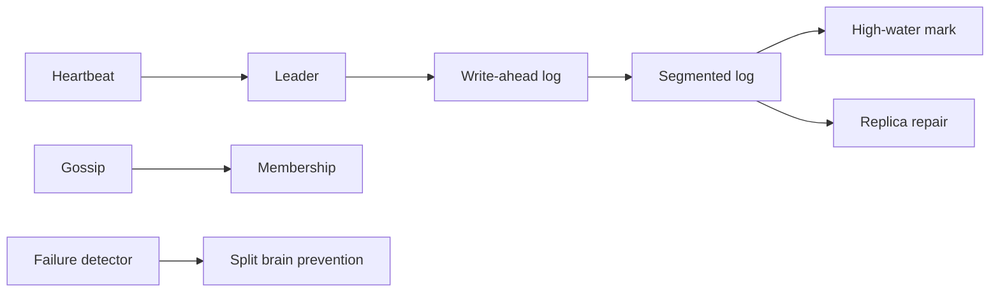
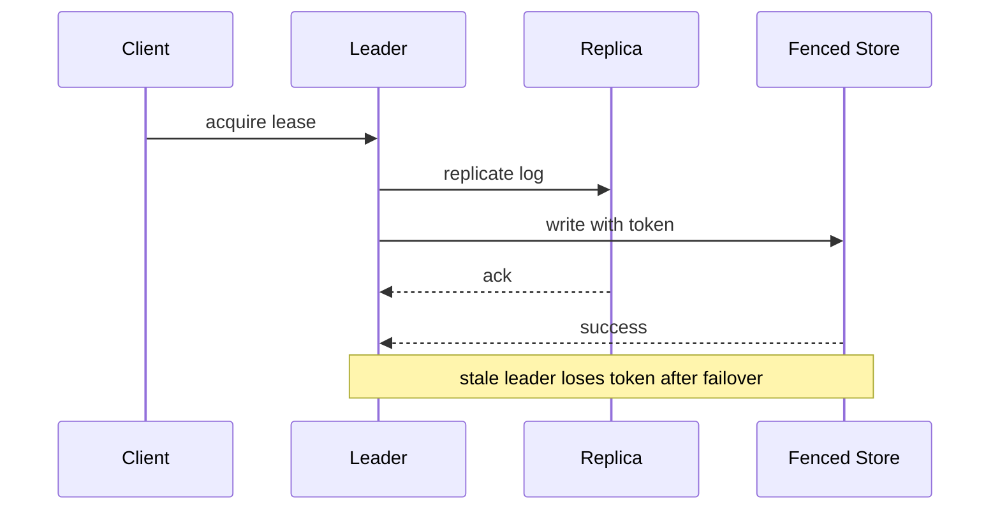

# 13. Distributed System Patterns

> [!important]
> These are the primitives that keep distributed systems from turning into group projects with outages.

## Bloom filters

- Probabilistic membership test: "definitely not" or "maybe."
- Great for skipping unnecessary disk reads in LSM-style storage.

## Write-ahead log

- Persist intent before data pages.
- Crash recovery replays the log to restore committed work.

## Segmented log and high-water mark

- Logs are split into segments so old data can be compacted or removed.
- The high-water mark is the safe committed prefix used for replication and retention decisions.

## Lease

- Time-bounded ownership.
- Useful for leader election, locks, and "only one writer" behavior.

## Heartbeat

- Periodic liveness signal.
- Missed heartbeats do not prove death instantly; they prove suspicion.

## Gossip protocol

- Nodes exchange membership and state information with peers.
- Scales well because information spreads indirectly instead of everyone shouting at once.

## Phi accrual failure detection

- Failure suspicion grows based on observed heartbeat timing.
- Better than a single rigid timeout because networks are rarely emotionally stable.

## Split brain

- Two nodes believe they are leader at the same time.
- Usually caused by partitions and poor fencing.

## Fencing

- A stale leader gets a monotonically increasing token; downstream stores reject writes with old tokens after leadership changes.
- Prevents old leaders from writing after a failover.

## Checksum

- Detects corruption in logs, segments, and blocks.
- Cheap insurance against silent bit rot.

## Vector clocks

- Track causal history across replicas.
- Helpful when you need to detect concurrent writes and reason about conflict merges.

## CAP and PACELC recap

**PACELC** expands as: **P**artition — **A**vailability vs **C**onsistency; **E**lse — **L**atency vs **C**onsistency.
When a partition exists, pick A or C. When the network is healthy, still pick: low latency or strong consistency.

| Term | Short version |
|---|---|
| CAP | during a partition, choose consistency or availability |
| PACELC | when partitioned: A vs C; else (no partition): latency vs consistency |

## Hinted handoff

- If a replica is temporarily down, another node stores the write hint and forwards it later.
- Improves availability at the cost of temporary inconsistency.

## Read repair

- A read notices stale replicas and repairs them in the background.
- Nice when combined with quorum reads; annoying when you forget it exists.

## Merkle trees

- Tree-structured hashes used to compare replicas efficiently.
- If hashes differ near the root, you know where to dig without comparing every row.

> [!tip]
> If you remember only one thing: logs make recovery possible, leases make ownership safe, and fencing makes failover sane.
