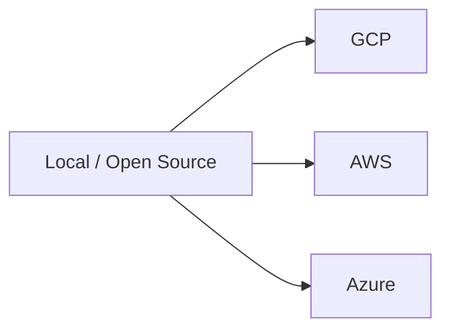

# 14. Local-First and Cloud Equivalents

> [!important]
> Start local and open-source. If a managed cloud service is justified, name the equivalent across GCP, AWS, and Azure so the design stays portable.

## Core mapping

| Capability | Local / open-source | GCP | AWS | Azure |
|---|---|---|---|---|
| Load balancing | HAProxy / Nginx / Envoy | Cloud Load Balancing | ALB / NLB | Application Gateway / Load Balancer |
| Object storage | MinIO / Ceph / local NAS | Cloud Storage | S3 | Blob Storage |
| Relational DB | PostgreSQL / MySQL | Cloud SQL / AlloyDB | RDS / Aurora | Azure Database for PostgreSQL / MySQL |
| Managed relational / global HA | PostgreSQL + sharding / Vitess | Cloud SQL / AlloyDB / Spanner | Aurora Global Database | Azure SQL Hyperscale |
| Cache | Redis / Memcached / KeyDB | Memorystore | ElastiCache | Azure Cache for Redis |
| Queue / pub-sub | Kafka / RabbitMQ / NATS / Pulsar | Pub/Sub / Pub/Sub Lite | SQS / SNS / MSK | Service Bus / Event Hubs |
| Search | Elasticsearch / OpenSearch / Solr | Vertex AI Search / Elastic on GCP | OpenSearch Service | Azure AI Search |
| Time-series / metrics | Prometheus / TimescaleDB / InfluxDB / ClickHouse | Cloud Monitoring / BigQuery / managed TS options | CloudWatch / Timestream | Azure Monitor / Data Explorer |
| Managed NoSQL / wide-column | Cassandra / ScyllaDB / Dynamo-style KV | Bigtable / Firestore | DynamoDB | Cosmos DB |
| Coordination | etcd / ZooKeeper / Consul | no exact 1:1; use GKE + etcd-backed patterns | no exact 1:1; use service discovery + managed primitives | no exact 1:1; use service fabric / app patterns |
| Secrets | Vault / local KMS / sealed secrets | Secret Manager | Secrets Manager | Key Vault |
| Container orchestration | Kubernetes | GKE | EKS | AKS |

## How to talk about it in design discussions

- Prefer the open-source primitive first.
- Mention cloud only if the workload really needs managed scale, cross-region durability, or reduced ops burden.
- If you mention one cloud, translate it immediately to the other two.
- Avoid calling a managed service "the only option" unless the requirement truly demands it.

## A good portable answer sounds like

> "I would start with PostgreSQL, HAProxy, Redis, and Kafka on Kubernetes. If we need managed operations, that maps to Cloud SQL / RDS / Azure Database for PostgreSQL, Cloud Load Balancing / ALB / Application Gateway, Memorystore / ElastiCache / Azure Cache for Redis, and Pub/Sub / SQS or SNS / Service Bus."

> [!tip]
> Portability is a design choice. Vendor names are just aliases until the requirements force otherwise.
