# 15. Production Topologies

> **Note:** "We'll figure out production later" is a classic engineer promise that becomes a 3 AM incident.
> These are the real cluster layouts that don't fall over when someone looks at them sideways.

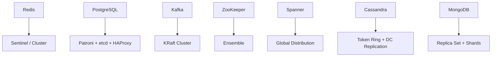

---

## Redis

Redis has three deployment modes. Pick the one that matches your failure tolerance, not the one that sounds coolest.

### Mode 1 — Single node (dev / testing only)

```
redis-server
```

Fine for localhost. One hardware sneeze and your cache is gone. Never in production.

### Mode 2 — Redis Sentinel (HA for a single dataset)

Three Sentinels watch one primary + N replicas. If the primary dies, Sentinels vote,
agree on a new leader, and update client routing. Clients talk to Sentinel first to
discover the current primary address.

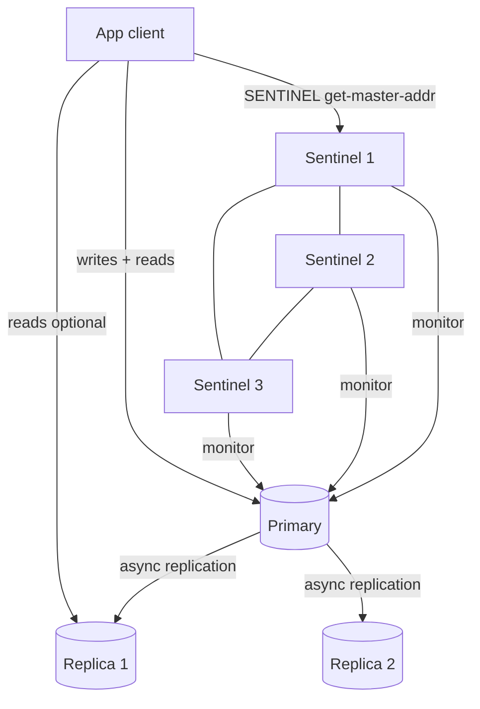

- Minimum 3 Sentinels on separate hosts — otherwise split-brain during network partition.
- Failover requires `quorum` Sentinels to agree (`quorum = 2` for a 3-Sentinel cluster).
- Replication is asynchronous by default → small window of data loss on failover.

**Key config**
```
# redis.conf (replica)
replicaof <primary-ip> 6379
# sentinel.conf
sentinel monitor mymaster <primary-ip> 6379 2   # quorum = 2
sentinel down-after-milliseconds mymaster 5000
sentinel failover-timeout mymaster 60000
```

### Mode 3 — Redis Cluster (horizontal sharding)

16 384 hash slots spread across N master nodes (minimum 3 masters + 3 replicas = 6 nodes).
Each key hashes into a slot; each master owns a range of slots.

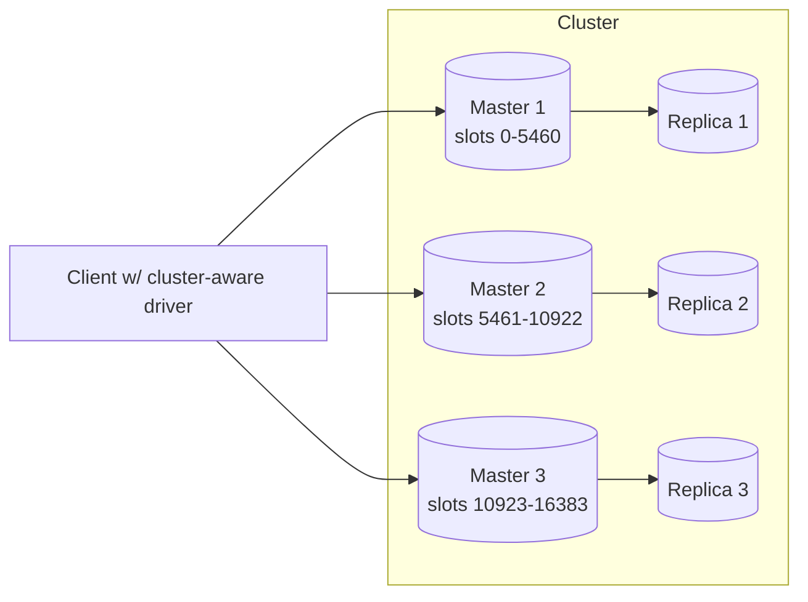

- Client libraries handle routing internally using the CLUSTER SLOTS map.
- Multi-key commands must target the same slot — use hash tags `{user}.session` to force co-location.
- Add a master + replica pair to rebalance; slots migrate live.

### Persistence: don't skip this

| Mode | What it does | Risk |
|---|---|---|
| No persistence | pure cache | full loss on restart |
| RDB (snapshot) | point-in-time dump at intervals | data gap since last snapshot |
| AOF (append-only file) | log every write | slower, larger disk use |
| AOF + RDB | both | recommended for durable data |

**Production checklist**
- `maxmemory` + eviction policy set (`allkeys-lru` for cache, `noeviction` for source-of-truth)
- Sentinel quorum ≥ 2 or Cluster ≥ 3 masters
- Persistence mode matches durability requirement
- Separate `bind` and `requirepass` — Redis has no auth by default
- Monitor `used_memory`, `evicted_keys`, `connected_clients`, replication lag

---

## PostgreSQL

See ch11 for deep config details. Here is the full HA topology in one diagram.

### Patroni + etcd + HAProxy + PgBouncer

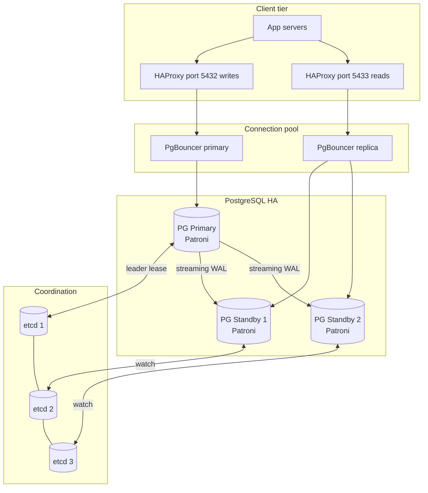

**Failover sequence**
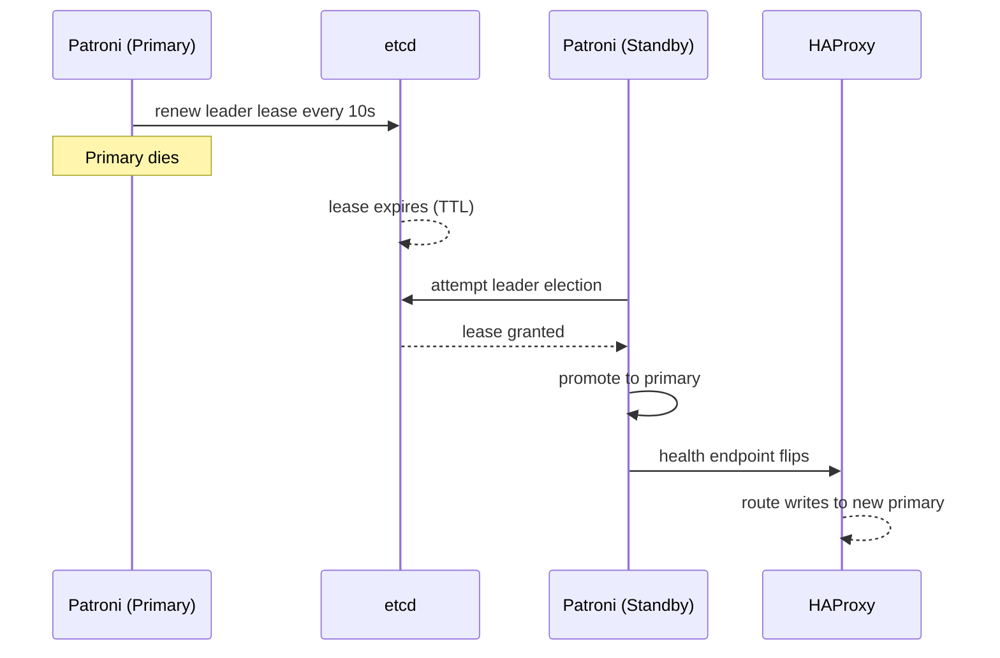

**Key numbers to tune**

| Parameter | Typical value | Why |
|---|---|---|
| `max_connections` | 100–200 | avoid process exhaustion |
| `shared_buffers` | 25% RAM | hot page cache |
| `wal_level` | `replica` | streaming replication |
| `synchronous_commit` | `on` (local durability) or `remote_apply` (standby sync) | `synchronous_standby_names` must also be set for standby sync |
| PgBouncer pool_mode | `transaction` | web app default |

---

## Kafka

Kafka is a distributed commit log. Don't try to use it as a database. It will let you try, then quietly humiliate you.

### KRaft mode (Kafka 3.3+ — no ZooKeeper needed)

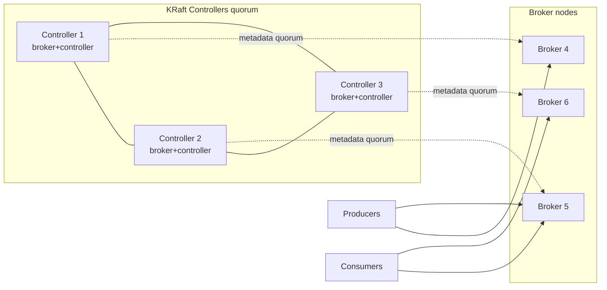

### Topic, partition, and replication

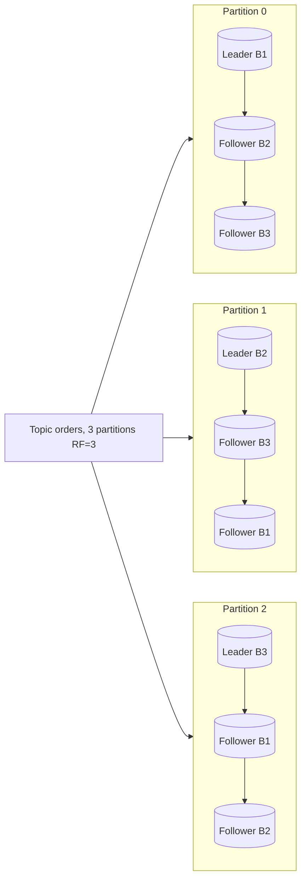

- **Replication factor 3 + `min.insync.replicas=2`** is the standard durability baseline.
- Producers with `acks=all` wait for ISR acknowledgment before confirming write.
- Consumers in a **consumer group** each get exclusive ownership of a partition subset.

### Consumer group partition assignment

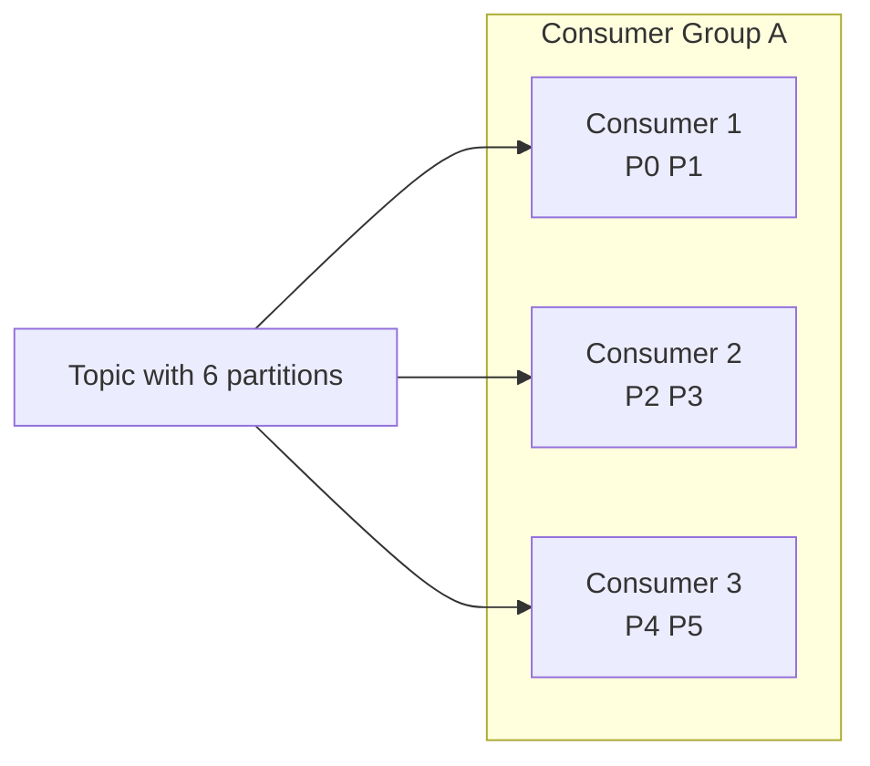

**Production checklist**
- 3+ brokers, RF=3, `min.insync.replicas=2`
- Producers: `acks=all`, `enable.idempotence=true`
- Consumers: commit offsets only after processing; handle rebalance gracefully
- Topic retention sized to replay window, not forever
- Monitor: consumer lag, ISR shrink, controller election rate
- Use KRaft; avoid ZooKeeper for new deployments

---

## ZooKeeper

ZooKeeper is the shared brain for distributed systems that need consensus without writing their own Raft.
Still relevant for HBase, older Kafka (pre-KRaft), and custom coordination needs.

### Ensemble topology

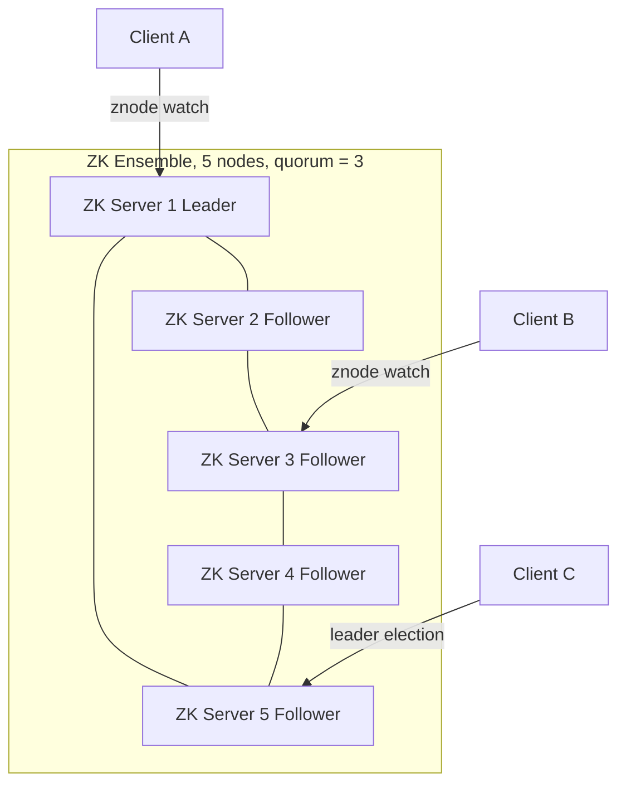

- **Odd ensemble sizes only** — 3 or 5 nodes. Even numbers don't improve fault tolerance.
- A 3-node ensemble tolerates 1 failure; a 5-node ensemble tolerates 2.
- ZooKeeper is strongly consistent (ZAB protocol) — writes go through the leader, reads can be stale from followers unless `sync` is called.
- **Not suitable for large data** — znodes are limited to 1 MB. Store metadata, not payloads.

**Common uses**

| Use case | ZK mechanism |
|---|---|
| Leader election | ephemeral sequential znode race |
| Service discovery | ephemeral znode per service instance |
| Config distribution | persistent znode + watches |
| Distributed lock | ephemeral znode + sequential ordering |

**Production checklist**
- Dedicated storage for transaction log (separate disk from snapshots)
- JVM heap 4–8 GB; GC pauses kill session timeouts
- `tickTime`, `sessionTimeout` tuned to network latency
- Monitor: outstanding requests, watch count, znode count
- Do not mix ZooKeeper with application traffic on the same node

---

## Google Spanner

Spanner is the "we solved globally distributed SQL" flex. TrueTime is the reason it works.

### Global distribution layout

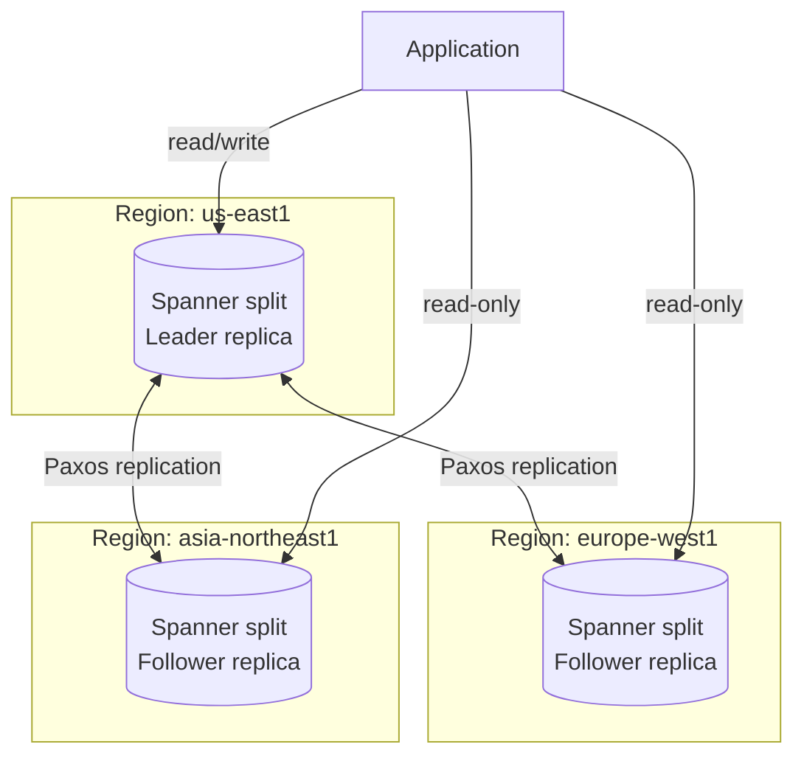

### TrueTime and external consistency

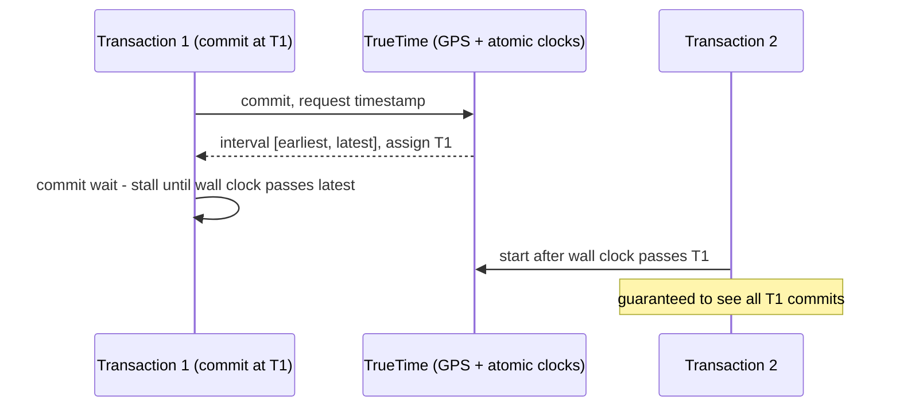

- **Commit wait** is what makes external consistency work — Spanner stalls ~7 ms to ensure T1 is in the past for everyone.
- Read-only transactions use a timestamp in the past → no locks, massive read scale.
- Splits (tablet-like shards) are automatically rebalanced across nodes.
- Not self-hostable. Cloud Spanner on GCP is the only production deployment. AlloyDB Omni is a PostgreSQL-compatible managed database — not a Spanner equivalent.

**When to use Spanner**

| Fits | Does not fit |
|---|---|
| Global ACID at scale | low-latency single-region OLTP |
| Relational schema + horizontal scale | cost-sensitive workloads |
| Multi-region consistency required | simple apps where PostgreSQL is fine |

---

## Cassandra

Cassandra's superpower is write availability. Its kryptonite is queries you didn't plan for.

### Token ring and replication

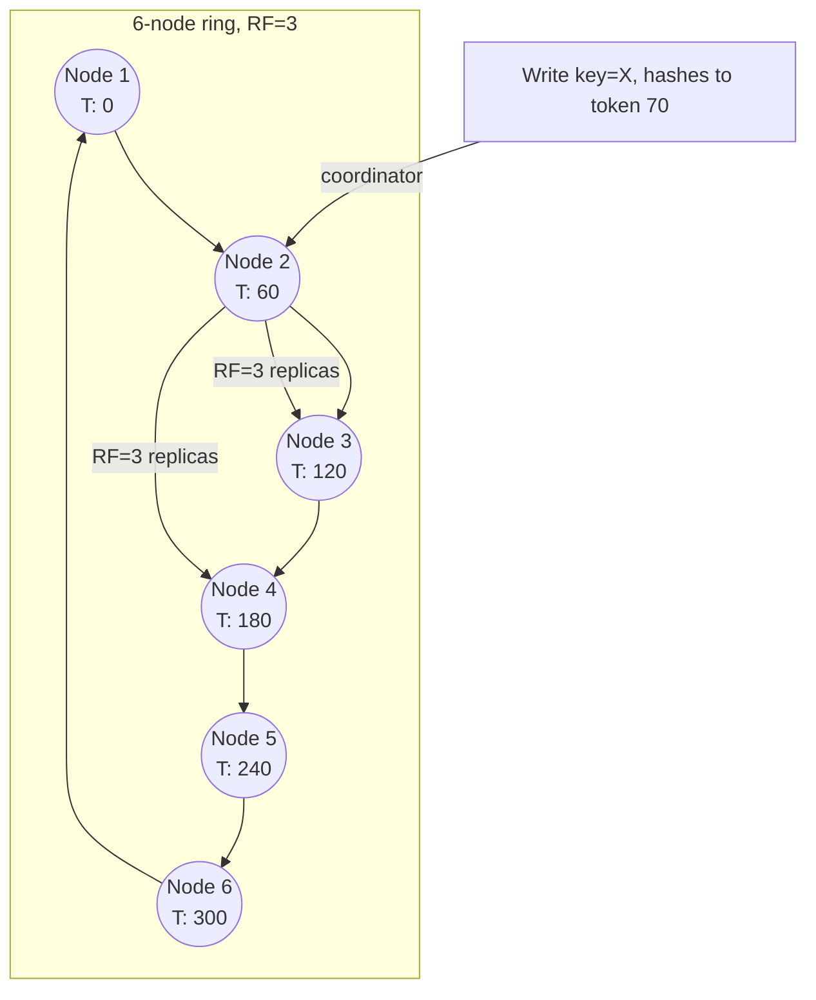

### Multi-DC replication

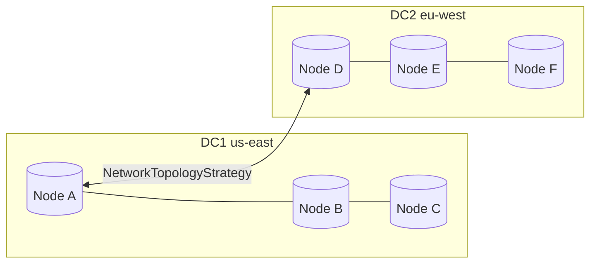

- **NetworkTopologyStrategy** with `RF per DC` is the production replication setup.
- `LOCAL_QUORUM` consistency = majority within local DC; fast + safe default.
- `EACH_QUORUM` = majority in every DC; use only when cross-DC consistency is required.

**Consistency level cheat sheet**

| Level | Writes ack from | Reads check | Notes |
|---|---|---|---|
| `ONE` | any 1 replica | any 1 | fastest, lossy |
| `LOCAL_QUORUM` | quorum in local DC | quorum in local DC | standard default |
| `QUORUM` | quorum across all DCs | quorum across all DCs | cross-region safe |
| `ALL` | every replica | every replica | kill availability |

**Production checklist**
- `NetworkTopologyStrategy` for multi-DC; never `SimpleStrategy` in prod
- Token allocation: use virtual nodes (`num_tokens = 16`) for even distribution — 256 was the Cassandra 2.x default and caused severe repair overhead; Cassandra 4.0 lowered the default to 16.
- Compaction strategy: `TWCS` for time-series, `LCS` for read-heavy, `STCS` for default
- `nodetool status` + `nodetool tpstats` for operational health
- Monitor: read/write latency at P99, pending compactions, dropped mutations

---

## MongoDB

MongoDB gives you flexible schema and the ability to store nested documents without crying into your JOIN syntax.

### Mode 1 — Replica set (HA for a single dataset)

```mermaid
flowchart TD
  subgraph RS [Replica Set, 3 nodes]
    PRI[(Primary)]
    SEC1[(Secondary 1)]
    SEC2[(Secondary 2)]
    PRI -->|oplog replication| SEC1
    PRI -->|oplog replication| SEC2
    SEC1 -.->|heartbeat| SEC2
    SEC1 -.->|heartbeat| PRI
    SEC2 -.->|heartbeat| PRI
  end
  App[Application] -->|writes| PRI
  App -->|reads optional| SEC1
  HR[Election if primary fails] -->|majority vote| SEC1
```

- Replica set uses Raft-style elections. Majority vote required to elect a new primary.
- Minimum 3 nodes for a voting majority. Arbiters possible but usually a bad idea (no data, just a vote).
- `writeConcern: { w: "majority" }` ensures a write survives a single node failure.

### Mode 2 — Sharded cluster (horizontal scale)

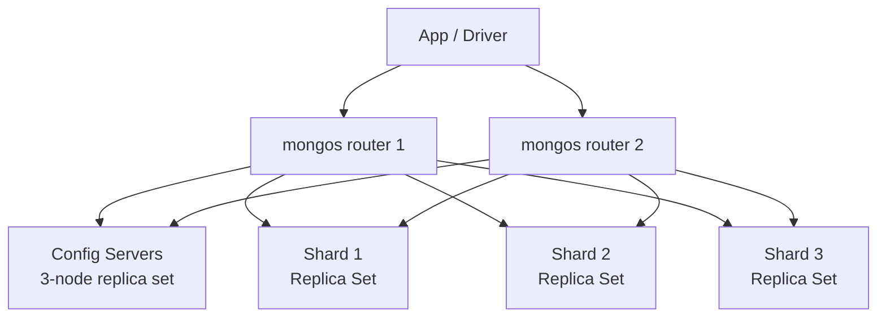

- **mongos** is a stateless query router; run multiple for HA.
- **Config servers** store cluster metadata (chunk ranges, shard map) — keep as replica set.
- **Shard key choice** is the most consequential decision: bad key → hot shard → all throughput on one node.

**Shard key patterns**

| Pattern | Risk | Example |
|---|---|---|
| Monotonic (timestamp, ObjectId) | write hotspot on latest shard | order_time |
| Low cardinality | can't split chunks | status (3 values) |
| Hashed shard key | even distribution, range queries expensive | hashed userId |
| Compound (zone sharding) | flexible; DC-aware | region + userId |

**Production checklist**
- Replica sets everywhere: config servers, every shard
- `writeConcern: majority`, `readConcern: majority` for data safety
- Indexes on shard key + any common query fields
- Chunk size default 128 MB; adjust for workload
- Monitor: chunk distribution balance, oplog window size, index miss rate
- Enable `WiredTiger` storage engine (default since 3.2) with document-level locking

---

## Side-by-side: HA story for each system

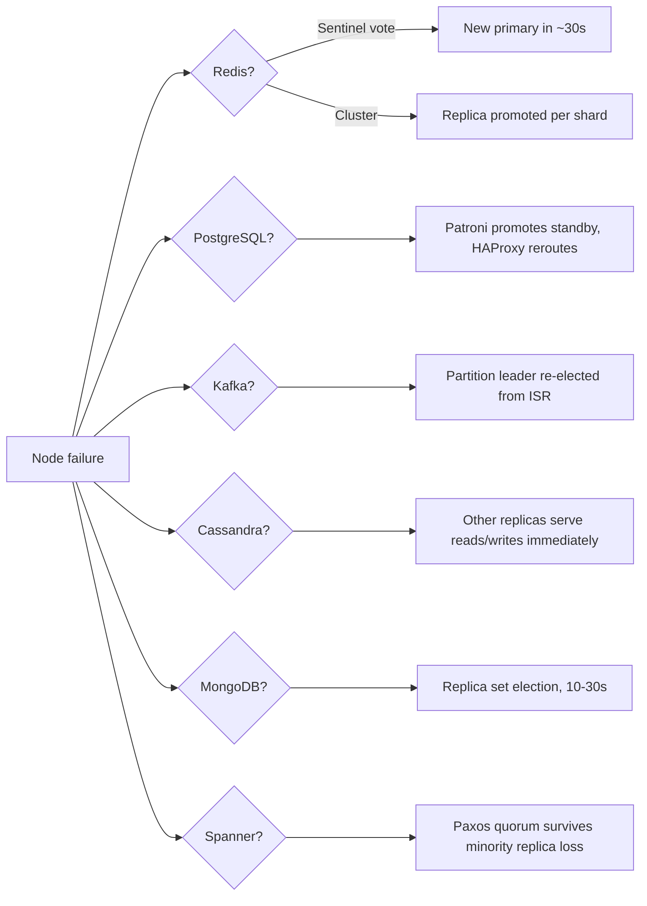

| System | HA mechanism | Typical failover time | Data loss risk |
|---|---|---|---|
| Redis Sentinel | Sentinel quorum vote | ~30 s | async replication gap |
| Redis Cluster | per-shard replica promotion | ~15 s | async replication gap |
| PostgreSQL + Patroni | etcd lease + Patroni promote | ~15–30 s | sync: none; async: small gap |
| Kafka | ISR leader re-election | ~30 s | none with acks=all |
| ZooKeeper | ZAB leader election | ~10–30 s | none (durable log) |
| Cassandra | no single point; coordinator reroutes | 0 s (degraded) | none at QUORUM |
| MongoDB RS | replica set election | ~10–30 s | none with writeConcern=majority |
| Spanner | Paxos minority failure | transparent | none |

> **Tip:** The best cluster topology is the one your on-call team can reason about at 3 AM without reading the docs.
> Boring, well-understood, and observable beats clever and opaque every time.
