# 16. Competing Systems — Same Problem, Different Choices

> **Note:** Every "build X like Y" interview question is secretly asking: "do you understand why Y made the choices Y made?"
> Two products in the same space solve the same user need with different bets on scale, consistency, and latency.
> This chapter maps those bets.

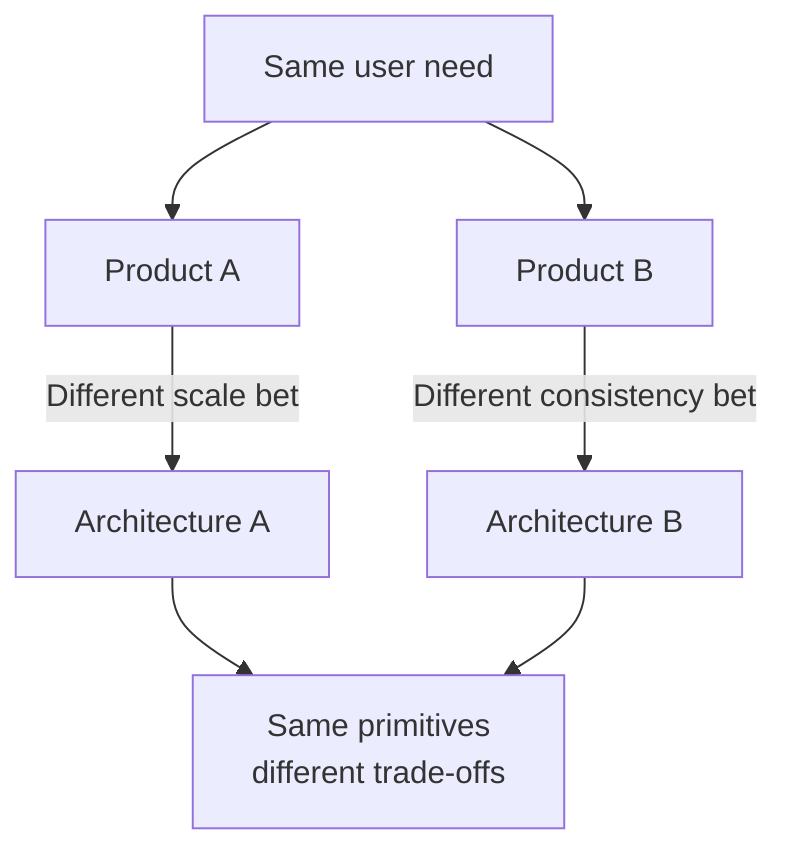

---

## Group 1 — File Sync & Cloud Storage

> Google Drive vs OneDrive vs Dropbox

All three sync files across devices. The difference is who they're glued to.

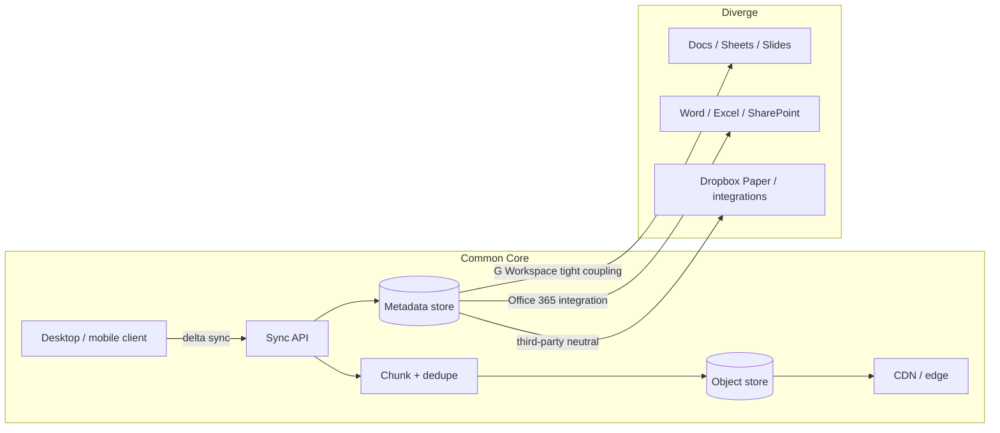

**How delta sync works**

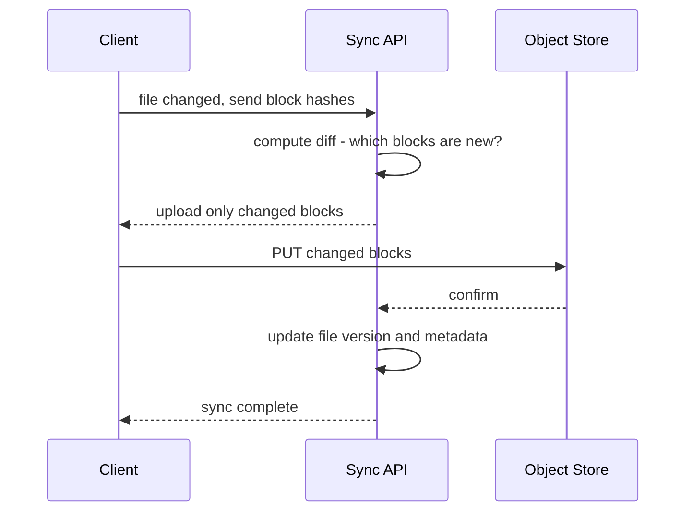

| Dimension | Google Drive | OneDrive | Dropbox |
|---|---|---|---|
| Primary storage | Google Cloud Storage | Azure Blob | S3 + own infra |
| Collaboration | Google Docs native | Office Online | Dropbox Paper (limited) |
| Metadata store | Spanner (global) | SQL + CosmosDB | PostgreSQL-based |
| Sync protocol | Drive API v3, delta tokens | MS Graph delta query | Longpoll delta API |
| Offline edit merge | Last write wins + OT for Docs | Office coauthoring | Last write wins |
| Max file size | 5 TB | 250 GB | 2 TB |

**Hard part:** Conflict resolution when two clients edit the same file offline. Drive punts and creates a conflict copy. Office uses OT for collaborative docs. Both are valid answers.

---

## Group 2 — Email at Scale

> Gmail vs Outlook (Exchange Online)

Both receive SMTP mail, filter spam, index for search, sync to clients. The divergence is the storage model and the protocol used for client sync.

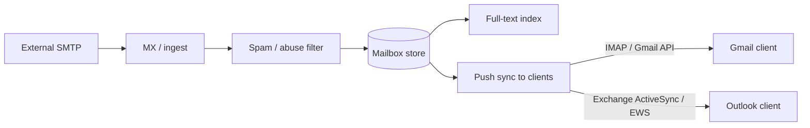

| Dimension | Gmail | Outlook / Exchange Online |
|---|---|---|
| Storage model | Conversation threads | Folder hierarchy |
| Primary index | Custom Bigtable-backed search | Exchange search + Lucene-based |
| Spam engine | ML + TensorFlow | SmartScreen + EOP |
| Sync protocol | Gmail API (REST) + IMAP | EAS, EWS, MAPI over HTTPS |
| Calendar integration | Google Calendar | Exchange Calendar (native) |
| Attachment storage | Google Drive link or inline | Azure Blob inline |
| Global replication | Spanner-backed user data | Exchange DAG (Database Availability Group) |

**Hard part:** Full-text search over billions of messages per user with low latency. Both use inverted indexes but with very different sharding strategies (Gmail: per-user shard; Exchange: per-database group).

---

## Group 3 — Food Discovery vs Food Delivery

> Yelp ≈ Google Maps Places (discovery)
> Zomato / Swiggy / DoorDash (delivery logistics)

> Note: These are NOT the same system. Yelp is a read-heavy review platform. Swiggy is a real-time logistics system. Zomato does both. Putting them in one group is like comparing a library to a courier company.

### Discovery (Yelp / Google Maps Places)

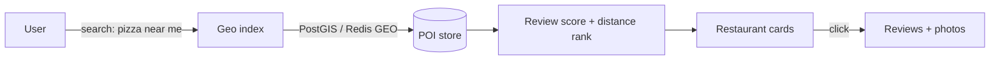

### Delivery (Swiggy / DoorDash)

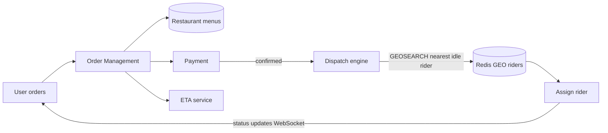

| Dimension | Yelp / Places | Swiggy / DoorDash |
|---|---|---|
| Core load shape | read-heavy, search + reviews | realtime 3-party coordination |
| Hard problem | ranking relevance + geo search | driver dispatch + ETA accuracy |
| Key data store | inverted index + PostGIS | Redis GEO + order state machine |
| Consistency need | eventual (reviews, ratings) | strong (payment, order status) |
| Realtime | no (static listings) | yes (driver location, ETA) |
| Fanout | low | high (restaurant + rider + user all notified) |

---

## Group 4 — Ride Hailing

> Uber vs Lyft vs Ola (cars) vs Rapido (bikes only)

Rapido is architecturally simpler — bike-only, no ride types, lower price point. The core dispatch problem is identical; the vehicle type changes supply density math.

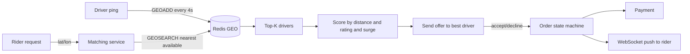

**State machine for a ride**

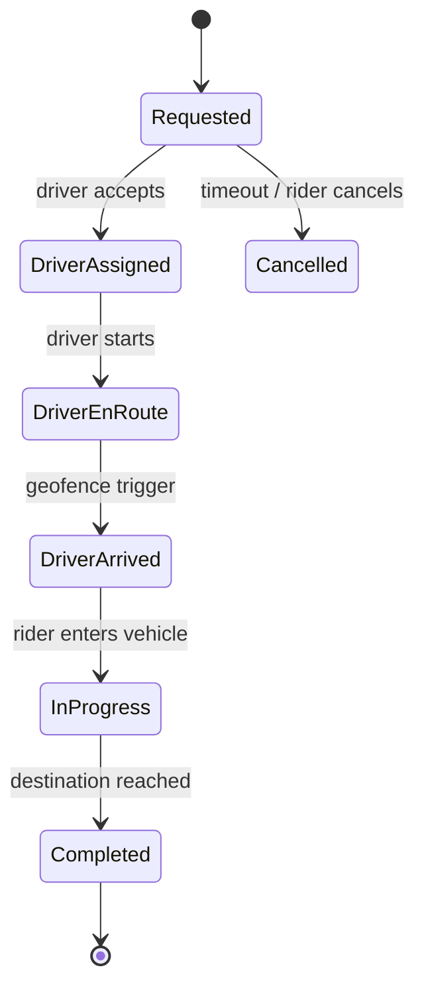

| Dimension | Uber / Lyft | Ola | Rapido |
|---|---|---|---|
| Vehicle types | car, SUV, auto, bike | car, auto, bike | bike only |
| Dispatch radius | city-wide adaptive | city-wide | tighter (bike coverage) |
| Surge pricing | dynamic heat map | dynamic | flat peak surge |
| Payment | card + wallet | card + wallet + UPI | UPI-heavy |
| Hard problem | global ETA + dynamic pricing | same + Indian traffic patterns | supply density in dense corridors |

---

## Group 5 — Social Media Feed Styles

> X (Twitter) vs Threads — microblog / real-time
> Instagram vs TikTok — visual / algorithmic
> Reddit vs Discord — community / async vs real-time

These are NOT one system. Group them by **fanout model** and **content type**.

### Fanout: push vs pull vs hybrid

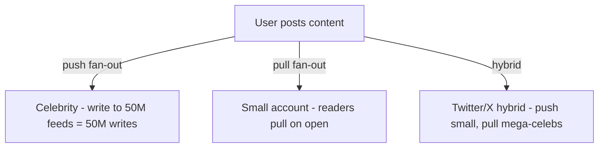

### X / Threads — microblog

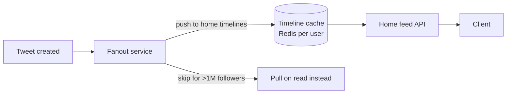

### Instagram / TikTok — visual + algorithmic

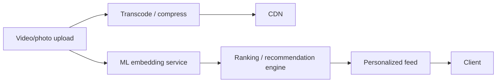

### Reddit / Discord — community

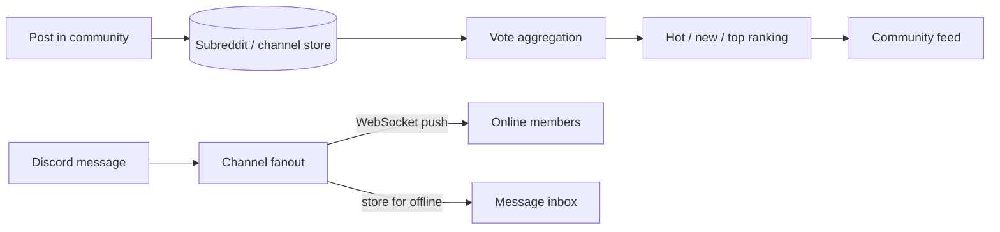

| System | Feed model | Hard problem | Content type | Real-time? |
|---|---|---|---|---|
| X / Threads | push + pull hybrid | celebrity fanout | text + links | yes |
| Instagram | pull + ML rank | recommendation freshness | photos + short video | partial |
| TikTok | pure ML rank, no social graph | cold start + engagement loop | short video | partial |
| Reddit | community vote sort | hot score decay + spam | links + text + media | no |
| Discord | WebSocket push per channel | presence at scale + voice | text + voice + media | yes |

---

## Group 6 — Video Platforms

> YouTube (UGC + ads) vs TikTok (algorithmic UGC) vs Netflix (licensed VOD)

Netflix does NOT take uploads from random people. That alone splits the architecture in half.

### YouTube / TikTok — upload pipeline

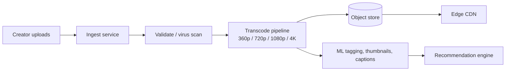

### Netflix — licensed content pipeline

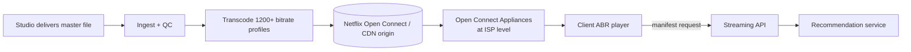

| Dimension | YouTube | TikTok | Netflix |
|---|---|---|---|
| Content source | user upload (UGC) | user upload (UGC) | licensed / studio |
| Recommendation | social graph + engagement | pure ML, no follow required | watch history + ML |
| CDN strategy | Google CDN global PoPs | Bytedance CDN | Open Connect (ISP-embedded appliances) |
| Transcode profiles | adaptive ladder ~5–8 | adaptive ladder | 1200+ bitrate+codec combos |
| Hard problem | UGC moderation at scale | cold-start recommendation | licensing DRM + global peering |
| Live streaming | yes | yes | no (mostly) |
| Offline | limited | limited | yes (download to device) |

---

## Group 7 — Messaging & Chat

> WhatsApp / iMessage / Telegram (consumer) vs Slack / Teams / Discord (enterprise/community)

The difference is **group size ceiling** and **delivery guarantee**.

### Consumer messaging (WhatsApp / Telegram)

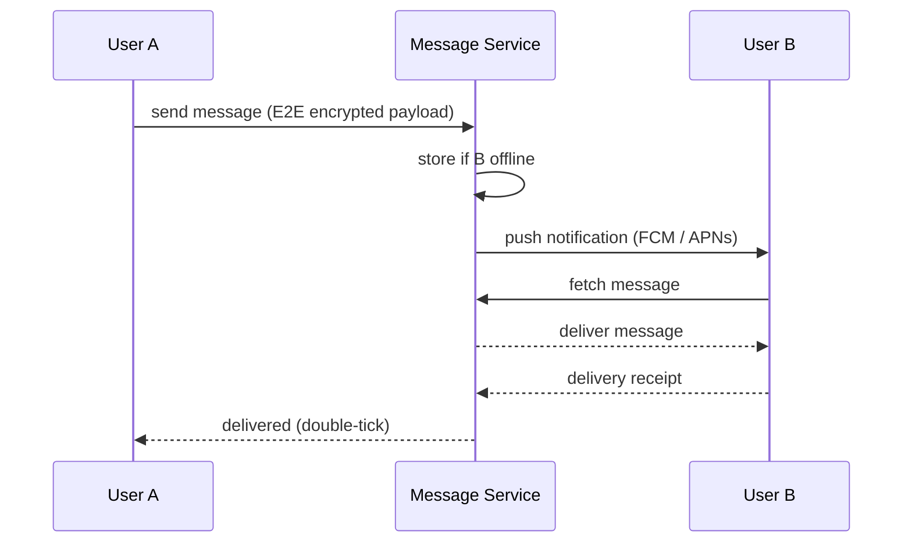

### Enterprise / community chat (Slack / Discord)

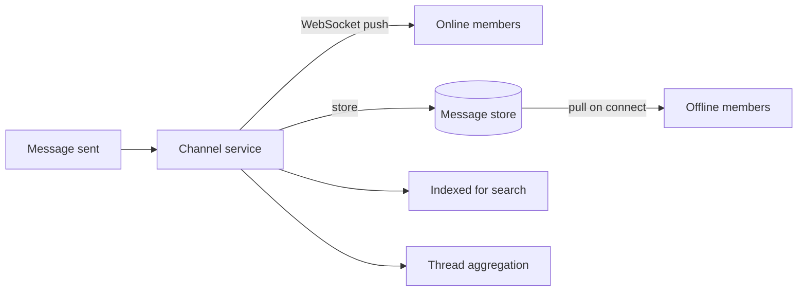

| Dimension | WhatsApp | Telegram | Slack | Discord |
|---|---|---|---|---|
| Encryption | E2E (Signal protocol) | optional (secret chats) | in-transit only | in-transit only |
| Group size limit | 1024 | unlimited channels | workspace-wide | server with 250K members |
| Message store | client-side primary | cloud by default | cloud (searchable) | cloud |
| Protocol | custom binary protocol over persistent TCP (not XMPP since 2011) | MTProto | HTTPS + WebSocket | HTTPS + WebSocket + WebRTC |
| Hard problem | E2E key exchange at scale | broadcast channel fan-out | search across org history | voice/video + text at scale |

---

## Group 8 — Payments

> Stripe / PayPal (global) vs UPI / PhonePe / GPay (India real-time)

Stripe is a developer-first payments API. UPI is an interbank real-time rail. Very different layers.

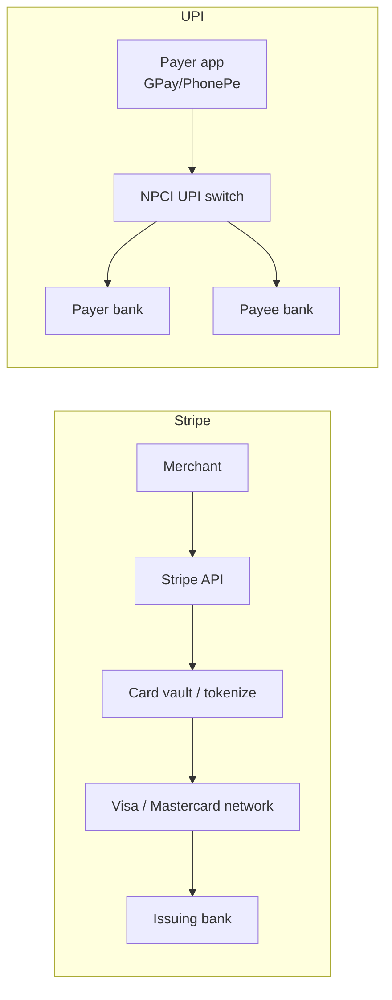

| Dimension | Stripe / PayPal | UPI / PhonePe |
|---|---|---|
| Settlement | T+1 or T+2 batch | near real-time (seconds) |
| Infrastructure | card network rails | interbank NPCI rail |
| Auth model | API key + webhook | VPA + device binding + PIN |
| Idempotency | idempotency key header | transaction ref ID |
| Hard problem | card fraud at global scale | 10B+ transactions/month, sub-second |

---

## The universal comparison template

When asked to compare two systems, answer these five questions:

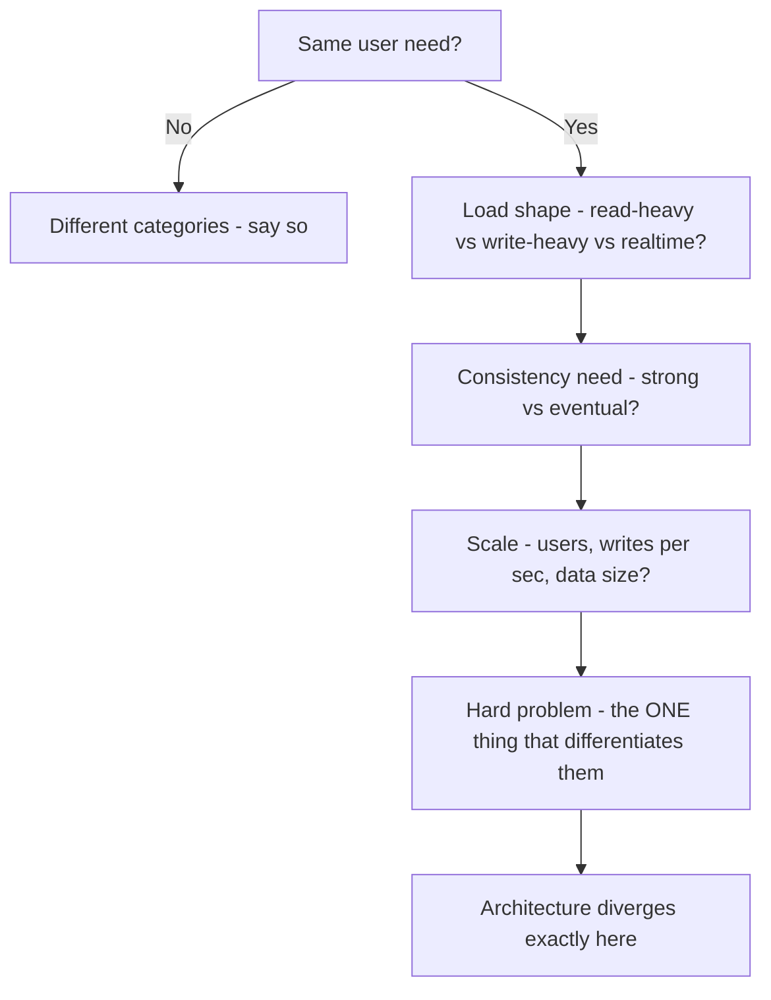

| System pair | The real difference |
|---|---|
| Drive vs OneDrive | Office integration vs G-Suite integration; same sync core |
| Gmail vs Outlook | Thread vs folder model; same ingest/spam/search core |
| Yelp vs Swiggy | Read/reviews vs realtime logistics; completely different backends |
| Uber vs Rapido | Same dispatch; Rapido = simpler vehicle type + tighter radius |
| YouTube vs Netflix | UGC upload pipeline vs licensed content; recommendation strategy |
| Slack vs WhatsApp | Enterprise search + threads vs E2E encrypted consumer messaging |
| Stripe vs UPI | Card network rail vs interbank real-time rail |

> **Tip:** The fastest way to answer a "compare X and Y" question is to first establish that both systems have an identical core (they always do), then precisely identify the one architectural decision where they diverge — and explain why that decision was forced by their business model, not just technology preference.
