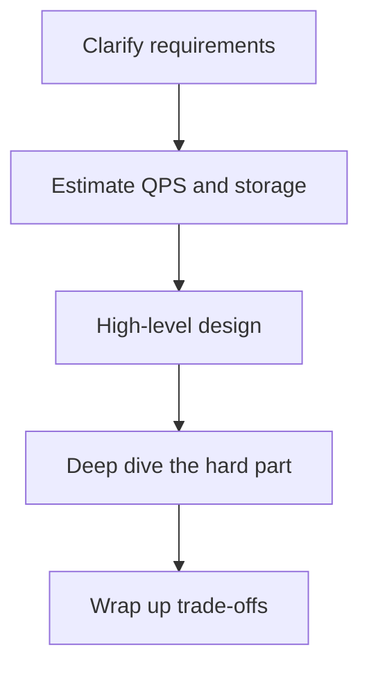
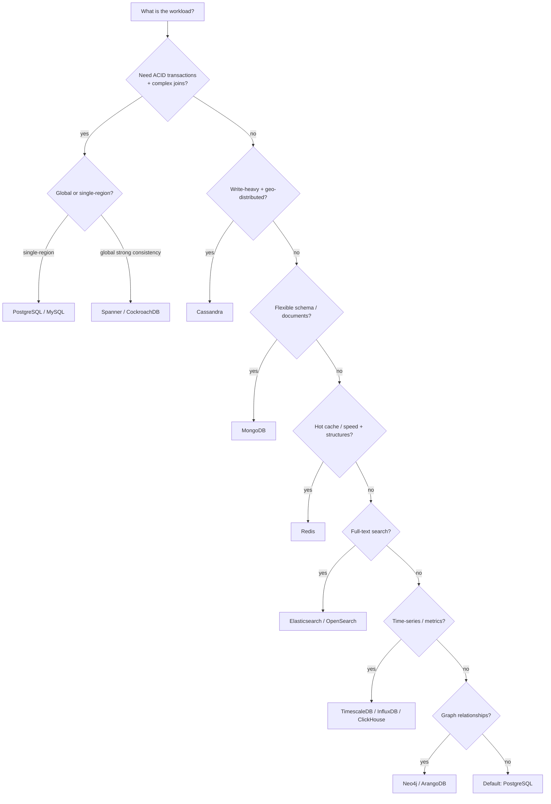
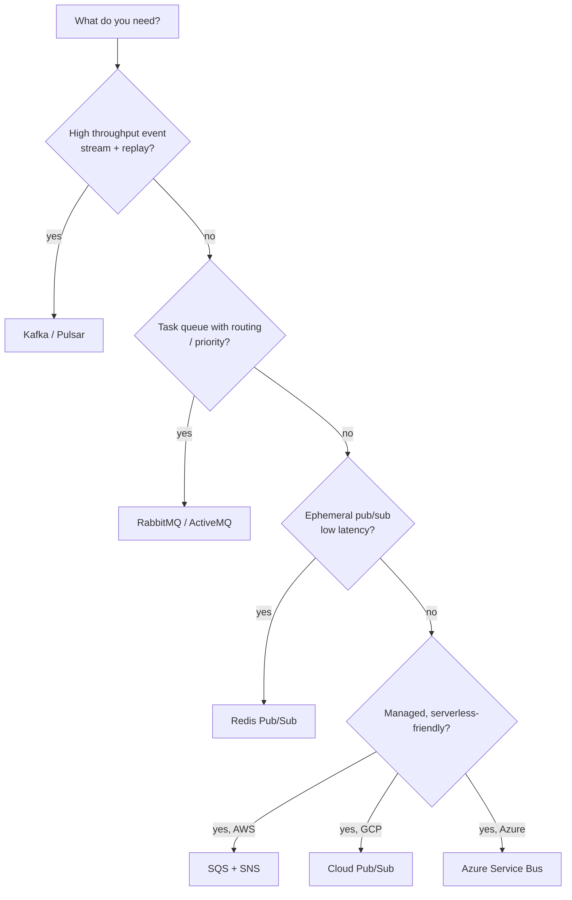
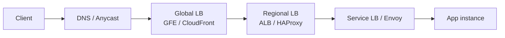
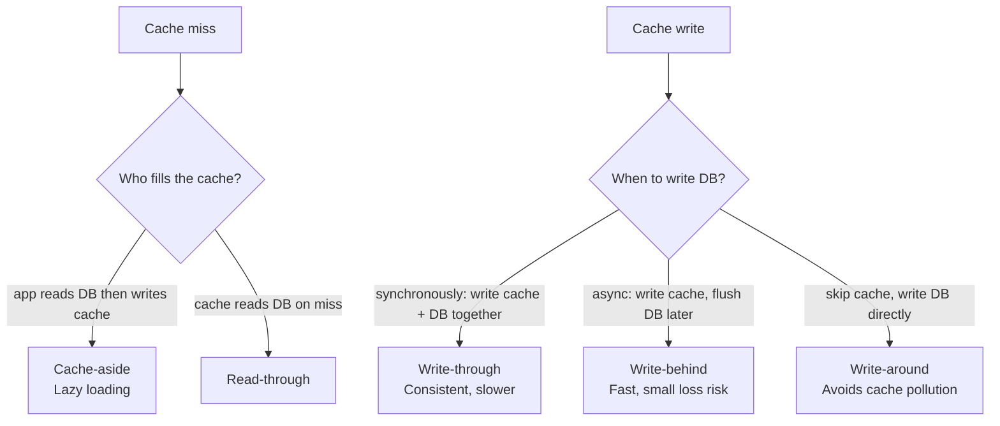
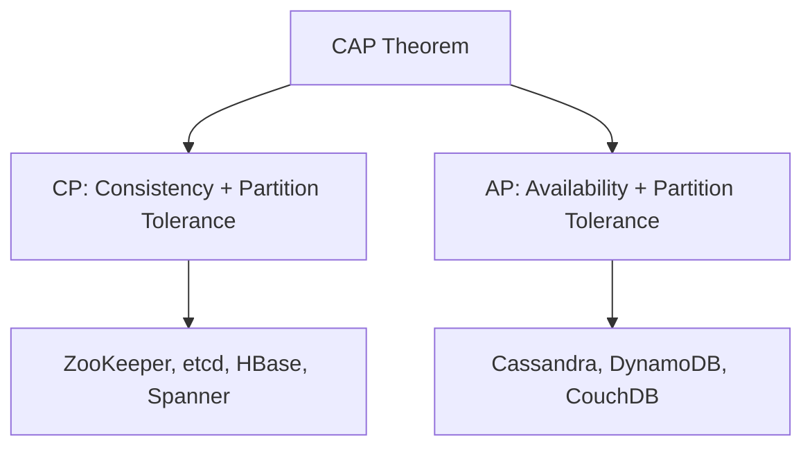
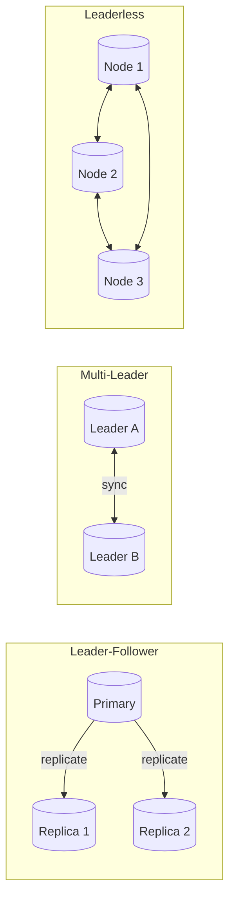
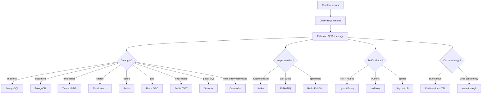

# 17. The Cheat Sheet

> **Note:** Print this. Tattoo it. Read it in the Uber to your interview.
> This is the one chapter where brevity is the entire point.

---

## The 5-Step Answer Framework



**Never skip step 1. Every wrong answer started by skipping step 1.**

---

## Numbers Every Engineer Must Know

### Latency hierarchy (memorize this order)

| Operation | Latency | Mental model |
|---|---|---|
| L1 cache hit | ~1 ns | speed of light in 30 cm |
| L2 cache hit | ~4 ns | |
| RAM read | ~100 ns | 100x slower than L1 |
| SSD random read | ~100 us | 1000x slower than RAM |
| Same-DC network round-trip | ~0.5 ms | faster than HDD |
| HDD seek | ~10 ms | 20x slower than same-DC network |
| Cross-region RTT (US to EU) | ~100 ms | |
| Cross-continent RTT (US to Asia) | ~200-300 ms | |
| Human perception threshold | ~100 ms | feel of "instant" |

> **Mnemonic:** ns → µs → ms each step is ~1000× slower. Cache → RAM → SSD → Network (Same-DC) → HDD → Network (Cross-region).

### Throughput baselines

| Resource | Rough ceiling |
|---|---|
| Single CPU core | ~100K–1M simple ops/sec |
| Single SSD | ~100K IOPS random, ~500 MB/s seq |
| 1 Gbps NIC | ~125 MB/s |
| 10 Gbps NIC | ~1.25 GB/s |
| Single PostgreSQL node | ~10–50K transactions/sec |
| Single Kafka broker | ~100K–1M messages/sec |
| Redis single-thread | ~100K ops/sec |

### Capacity estimation cheat

| Unit | Size |
|---|---|
| 1 char (ASCII) | 1 byte |
| 1 UUID | 16 bytes |
| 1 tweet (text) | ~300 bytes |
| 1 metadata row | ~1 KB |
| 1 thumbnail | ~30 KB |
| 1 average image | ~300 KB |
| 1 min 720p video | ~60 MB |
| 1 min 4K video | ~375 MB |

**QPS shortcuts**
```
1 million req/day   ≈ 12 req/sec
10 million req/day  ≈ 115 req/sec
100 million req/day ≈ 1,200 req/sec
1 billion req/day   ≈ 12,000 req/sec
```

**Storage shortcut:** `users × data_per_user × retention_years`

---

## Database Selection Decision Tree



### Database quick reference

| Database | Type | CAP | Best for | Avoid when |
|---|---|---|---|---|
| PostgreSQL | Relational OLTP | CA (single), CP (HA) | joins, ACID, default choice | massive horizontal writes |
| MySQL | Relational OLTP | CA (single) | web apps, read replicas | same as PG |
| MongoDB | Document | CP | flexible schema, nested docs | complex joins needed |
| Cassandra | Wide-column | AP | write-heavy, geo-scale | ad-hoc queries, ACID |
| DynamoDB | KV / Document | CP (writes), tunable (reads) | known access patterns, serverless | unpredictable query shapes |
| Redis | In-memory | Async replication (not truly CP) | cache, leaderboards, geo, queues | primary durable store |
| Elasticsearch | Search | AP | full-text, facets, log analytics | source-of-truth writes |
| ClickHouse | Columnar OLAP | CP | analytics, aggregations | OLTP / row-level mutations |
| Spanner | Distributed SQL | CP | global ACID at scale | cost-sensitive apps |
| Neo4j | Graph | CP | relationship traversals | non-graph workloads |
| TimescaleDB | Time-series (PG) | CP | metrics + SQL together | pure schemaless metrics |
| InfluxDB | Time-series | AP | sensor/IoT ingest, high cardinality | relational joins needed |

---

## Message Broker Selection



| Broker | Delivery | Ordering | Replay | Best for |
|---|---|---|---|---|
| Kafka | at-least-once | per partition | yes (retention) | event streaming, audit log, ETL |
| RabbitMQ | at-least-once | per queue | no | task queues, routing, RPC |
| Redis Pub/Sub | fire-and-forget | no | no | ephemeral notifications, live feeds |
| Redis Streams | at-least-once | yes (XREAD) | yes | lightweight event log |
| SQS | at-least-once | FIFO option | no | decoupled AWS microservices |
| Pulsar | at-least-once (exactly-once with transactions) | yes | yes | multi-tenant, geo-replicated streaming |

**Kafka production defaults (tattoo these):**
```
replication.factor = 3
min.insync.replicas = 2
acks = all
enable.idempotence = true
```

---

## Load Balancer & Proxy Selection

| Tool | Layer | Best for |
|---|---|---|
| HAProxy | L4 + L7 | TCP/HTTP LB, Postgres HA routing |
| nginx | L7 | HTTP reverse proxy, static files, SSL termination |
| Envoy | L7 | service mesh sidecar, gRPC, observability |
| Traefik | L7 | container-native, auto-discovers Docker/K8s services |
| AWS ALB | L7 | HTTP/HTTPS managed LB on AWS |
| AWS NLB | L4 | TCP/UDP, ultra-low latency, static IP |
| GCP Cloud LB | L7 (global) | global anycast, multi-region Google Front End |



**L4 vs L7 in one sentence:**
- L4 = route by IP:port, blind to HTTP content, faster
- L7 = route by URL/headers/cookies, smarter, slightly slower

---

## Caching Strategy Reference



| Strategy | Consistency | Write perf | Read perf | Data loss risk |
|---|---|---|---|---|
| Cache-aside | good | DB-speed | fast after warm | none |
| Read-through | good | DB-speed | fast after warm | none |
| Write-through | excellent | slower | fast | none |
| Write-behind | eventually | fast | fast | yes (buffer loss) |
| Write-around | good | fast | cold cache on first read | none |

**Cache eviction policies**

| Policy | Evicts | Use when |
|---|---|---|
| LRU | least recently used | general cache |
| LFU | least frequently used | frequency matters more than recency |
| TTL | expired items | time-bounded freshness |
| allkeys-lru | any key by LRU | Redis cache-only mode |
| noeviction | nothing (returns error) | Redis durable data |

---

## CAP Theorem Quick Map



> **Reminder:** "CA" (Consistency + Availability without Partition Tolerance) is a misconception. In a distributed system, network partitions will happen. You are always choosing between C and A when a partition occurs. Single-node relational databases are often called "CA", but they are simply not distributed.

---

## Consistency Levels Quick Reference

| Level | Meaning | Trade-off |
|---|---|---|
| Strong | reads always see latest write | high latency, requires quorum |
| Linearizable | strong + global real-time ordering | very slow across regions |
| Sequential | all operations appear in some total order | not real-time |
| Causal | causally related ops ordered | complex to implement |
| Read-your-writes | you see your own writes | session-scoped |
| Eventual | all replicas converge eventually | fast, stale possible |

**Cassandra shortcut:**
```
ONE < LOCAL_QUORUM < QUORUM < ALL
faster ←————————————————→ safer
```

---

## API Style Selection

| Style | Protocol | Best for | Avoid when |
|---|---|---|---|
| REST | HTTP/1.1 + JSON | public APIs, CRUD, cacheable resources | streaming, binary perf-critical |
| gRPC | HTTP/2 + Protobuf | internal services, streaming, polyglot | browser clients (limited support) |
| GraphQL | HTTP + JSON | mobile clients, flexible queries | simple CRUD, overfetch is fine |
| WebSocket | TCP persistent | bidirectional real-time (chat, live) | one-way push only |
| SSE | HTTP chunked | server-to-client push (feeds, alerts) | bidirectional needed |
| Webhook | HTTP callback | async event notification | low-latency required |

---

## Storage Type Reference

| Type | Examples | Best for |
|---|---|---|
| Block storage | EBS, Azure Disk, local NVMe | databases, OS volumes |
| Object storage | S3, GCS, Azure Blob | files, media, backups, data lake |
| File storage (NFS) | EFS, Azure Files, NFS | shared filesystems, legacy apps |
| In-memory | Redis, Memcached | cache, sessions, ephemeral state |
| Columnar | ClickHouse, BigQuery, Redshift | analytics, aggregations, OLAP |
| Time-series | InfluxDB, TimescaleDB, Prometheus | metrics, telemetry, sensor data |

---

## Partitioning (Sharding) Strategy Reference

| Strategy | How | Good for | Bad for |
|---|---|---|---|
| Hash partitioning | `hash(key) % N` | even distribution, KV access | range scans, hotspot-free |
| Range partitioning | key ranges per shard | range queries, ordered scans | hotspots on monotonic keys |
| Directory partitioning | lookup table maps key → shard | flexible re-routing | lookup table is a bottleneck |
| Geo partitioning | region/country → shard | data residency, latency | cross-region queries |
| Consistent hashing | virtual nodes on ring | minimal rebalancing on shard add/remove | implementation complexity |

**Hotspot fix:** add random suffix to hotspot key → `userId_0` to `userId_9`, scatter writes, merge on read.

---

## Replication Pattern Reference



| Pattern | Example | Write scale | Read scale | Conflict risk |
|---|---|---|---|---|
| Leader-follower | PostgreSQL, MySQL, Redis Sentinel | single leader | replicas | low |
| Multi-leader | CockroachDB, active-active DBs | multiple regions write | high | high |
| Leaderless | Cassandra, DynamoDB | all nodes | all nodes | handled by quorum |

---

## Distributed Patterns Quick Reference

| Pattern | Problem it solves | Classic example |
|---|---|---|
| Circuit breaker | prevent cascade failure | Hystrix, Resilience4j |
| Saga | distributed transaction without 2PC | order + payment + inventory |
| CQRS | separate read/write models | event-sourced systems |
| Event sourcing | audit log + state replay | banking ledger |
| Outbox pattern | guaranteed event publish with DB write | microservice event emit |
| Sidecar | cross-cutting concerns (auth, observability) | Envoy proxy in service mesh |
| Bulkhead | isolate failure domains | thread pool per dependency |
| Backpressure | slow consumer signals fast producer | Kafka consumer lag |
| Idempotency key | safe retries | payment APIs, Kafka producers |
| Two-phase commit | atomic writes across systems | XA transactions (avoid in practice) |

---

## Common Numbers for Real Systems (reference points)

| System | Scale |
|---|---|
| Twitter/X | ~6,000 tweets/sec peak |
| YouTube | 500 hours of video uploaded per minute |
| WhatsApp | ~100 billion messages/day |
| Google Search | ~99,000 queries/sec |
| Netflix | ~15% of global internet bandwidth |
| Uber peak | ~14 million trips/day |
| Amazon peak | ~66,000 orders/hour (Prime Day) |

---

## The One-Sentence Definitions (for when your brain blanks)

| Term | One sentence |
|---|---|
| CAP theorem | In a network partition, you can have consistency or availability, not both |
| ACID | Atomic, Consistent, Isolated, Durable — what every real transaction needs |
| BASE | Basically Available, Soft-state, Eventually consistent — the NoSQL promise |
| Idempotency | Running the same operation N times has the same effect as running it once |
| Sharding | Splitting data horizontally across machines so no single machine owns everything |
| Index | A data structure that speeds up reads at the cost of write overhead |
| CDN | Cache at the network edge so bytes travel fewer kilometers to reach users |
| Load balancer | Distribute requests across servers so one doesn't become everyone's problem |
| Consistent hashing | Assign nodes and keys to a ring so adding/removing a node moves minimal keys |
| Bloom filter | Probabilistic set membership — never false negative, sometimes false positive |
| Two-phase commit | Ask everyone to prepare, then tell everyone to commit — slow but atomic |
| Raft / Paxos | Consensus algorithms — get a majority to agree before anything is decided |
| Write-ahead log | Write changes to a log before applying them — survives crashes |
| Quorum | Majority agreement — read + write quorum must overlap to guarantee consistency |

---

## The Cheat Sheet in One Diagram



> **Tip:** In an interview you won't have this cheat sheet. So read it until it's in your head,
> not on the page.
