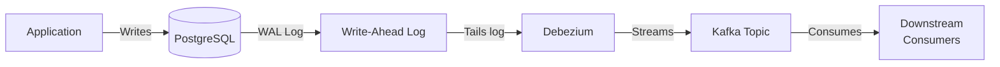

# 18. PostgreSQL Schema Design Refresher

When designing systems, fluency in translating concepts into concrete database schemas is essential. A schema is the skeleton of a system's truth. If the schema is clear, the application is easy to reason about; if it is vague, every feature becomes a small act of data archaeology. PostgreSQL provides a robust set of features to turn business ideas into durable, queryable structures.

## The Core Data Types
Use these as your default toolkit:
- **Primary Keys:** `UUID` or `BIGINT GENERATED ALWAYS AS IDENTITY`.
- **Text:** `TEXT` or `VARCHAR(N)` (no performance difference in Postgres, only constraint enforcement).
- **Timestamps:** `TIMESTAMPTZ` (always store UTC).
- **Currency/Decimals:** `NUMERIC(precision, scale)`. Never use floats for financial data.

## Creating Tables and Enums
Enums enforce data integrity at the database layer, preventing invalid states.

```sql
CREATE TYPE order_status AS ENUM ('pending', 'paid', 'shipped', 'delivered', 'cancelled');

CREATE TABLE orders (
    id UUID PRIMARY KEY DEFAULT gen_random_uuid(),
    user_id UUID NOT NULL, -- Assume references users(id)
    status order_status NOT NULL DEFAULT 'pending',
    total_amount NUMERIC(10, 2) NOT NULL,
    created_at TIMESTAMPTZ NOT NULL DEFAULT NOW(),
    updated_at TIMESTAMPTZ NOT NULL DEFAULT NOW()
);
```

## JSONB for Semi-Structured Data
When schemas are highly variable (e.g., product attributes, user preferences, dynamic telemetry), use `JSONB`. It stores JSON efficiently in a binary format and supports robust indexing. Use `JSONB` when the shape is genuinely variable and the value is flexibility, not relational structure. If you need joins, constraints, or predictable analytics, keep the data relational and denormalize only when you have a clear reason.

```sql
ALTER TABLE orders ADD COLUMN metadata JSONB DEFAULT '{}'::jsonb;
```

## Indexes: Beyond the Primary Key
Indexes speed up reads but slow down writes. Use them deliberately.

1. **B-Tree (Default):** Great for exact matches and range queries.
```sql
CREATE INDEX idx_orders_user_id ON orders(user_id);
```

2. **Partial Indexes:** Index only what matters to save space and write latency. Perfect for queue-like tables or statuses.
```sql
-- Only index active orders
CREATE INDEX idx_orders_active ON orders(status) 
WHERE status IN ('pending', 'paid', 'shipped');
```

3. **GIN Indexes:** Essential for querying inside unstructured columns like `JSONB`.
```sql
CREATE INDEX idx_orders_metadata ON orders USING GIN (metadata);
```

## Triggers for Automated State Management
A classic use case is automatically updating the `updated_at` column so the application layer doesn't have to remember it.

```sql
CREATE OR REPLACE FUNCTION update_updated_at_column()
RETURNS TRIGGER AS $$
BEGIN
    NEW.updated_at = NOW();
    RETURN NEW;
END;
$$ LANGUAGE plpgsql;

CREATE TRIGGER update_orders_updated_at
    BEFORE UPDATE ON orders
    FOR EACH ROW
    EXECUTE FUNCTION update_updated_at_column();
```

## Change Data Capture (CDC)
When a record changes (like an order being paid), you often need to update a cache, a search index, or notify a shipping service. Dual-writing from the application to both the database and the broker is highly prone to race conditions and failure.

Instead, use CDC:


1. PostgreSQL writes all changes to its **Write-Ahead Log (WAL)**.
2. Tools like **Debezium** read the WAL via logical decoding.
3. Debezium publishes the ordered stream of events to a message broker (e.g., Kafka).
4. Consumers process the events asynchronously.

This guarantees that if data is committed to the database, downstream systems will eventually see it.
