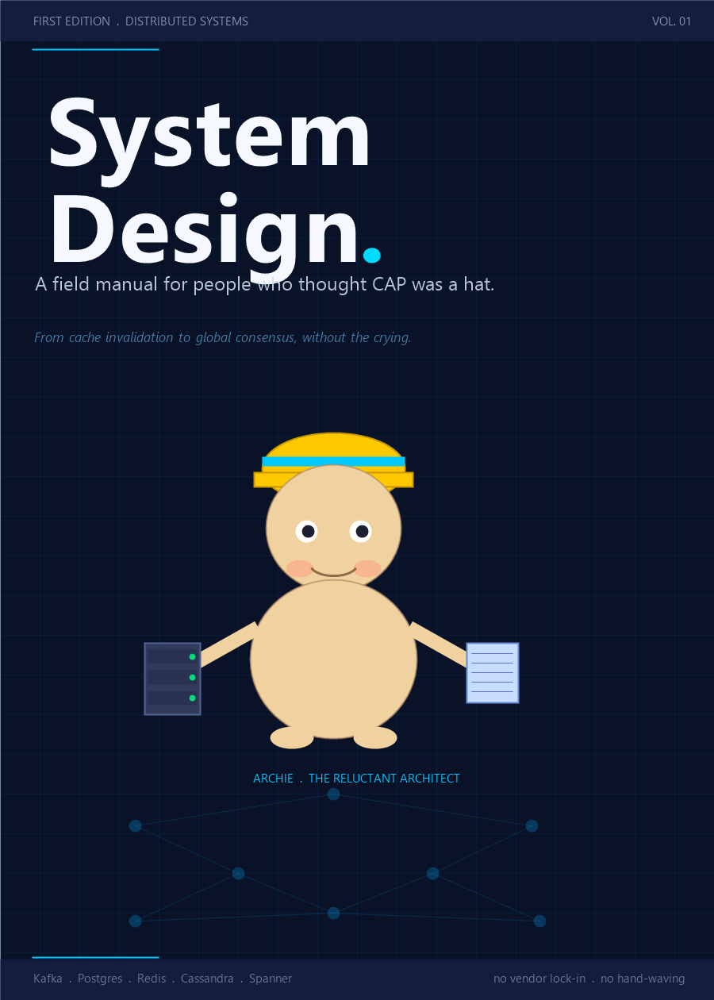

# Preface: Why This Book Exists

System design is what happens when a product meets physics and discovers the budget.
This book is the first pass: concept-first, diagram-driven, and optimized for recall.

The goal is not to memorize 200 tricks. The goal is to build a stable mental model for how large systems are shaped, scaled, and defended.
That is the difference between sounding confident and actually being useful in an architecture discussion.

This edition uses Google product archetypes as the primary recall surface.

## Who this is for

You want the shape of the problem before the brand names.
You want to know why a system is slow, expensive, inconsistent, or fragile.
You want the idea in your head before implementation details start cosplaying as the answer.

## What this is not

- Not a giant encyclopedia
- Not a product tutorial for any one company
- Not a replacement for the deeper scenario notes already in this folder

## What shaped it

- Alex Xu and ByteByteGo: crisp mental models and visual structure
- Classic system design writing: bottlenecks, trade-offs, and consequences
- The useful old habit of explaining the idea before the framework

## How to read it

Read the chapters in order once.
Do not memorize the words.
Memorize the reflex.

| If you see... | Think... |
|---|---|
| Hot read path | cache, index, CDN |
| Huge write load | log, queue, LSM, batch |
| Many readers, few writers | replica, column store |
| Ranges and ordering | B-tree, partition key, time series |
| Conflicts | leader, quorum, CRDT, consensus |
| "Works on my laptop" | that is not a design |

> **Tip:** The right question is rarely "what tool should I use?" It is usually "what is the bottleneck pretending to be a tool choice?"
