# 🎯 Scalable Task Management System Design

**Brief**: Distributed task management platform supporting project tracking, issue management, and team collaboration at enterprise scale.

---

## ⚡ Functional Requirements (FRs)

- **Task CRUD**: Create, read, update, delete tasks/issues
- **Project Management**: Organize tasks into projects/boards  
- **User Management**: Authentication, authorization, team assignments
- **Workflow Engine**: Custom workflows, status transitions
- **Comments & Attachments**: Rich collaboration features
- **Search & Filtering**: Full-text search, advanced filters
- **Notifications**: Real-time updates, email alerts
- **Reporting**: Dashboards, analytics, burndown charts

---

## 🎯 Non-Functional Requirements (NFRs)

### 📊 Scale & Performance
- **DAU**: 1M active users
- **QPS**: 10K read, 2K write
- **Latency**: <200ms p99 for reads, <500ms for writes
- **Storage**: ~10TB (tasks, comments, attachments)

### 🔄 CAP Focus

- **CP System** (Consistency over Availability)
- Strong consistency for task updates
- Eventually consistent for notifications/analytics

### 📈 Traffic Pattern

- **Read-heavy**: 80% reads, 20% writes
- Peak during business hours
- Seasonal spikes (sprint planning)

---

## 🏗️ Assumptions

- Average 100 tasks per user
- 50% mobile, 50% web traffic  
- Multi-tenant architecture
- Global deployment (US, EU, APAC)

---

## 🎲 Core Entities

```typescript
User { id, email, name, role, team_ids[] }
Project { id, name, owner_id, team_ids[], settings }
Task { id, title, description, status, priority, assignee_id, project_id, created_at, updated_at }
Comment { id, task_id, user_id, content, created_at }
Attachment { id, task_id, file_url, file_size, created_at }
```

## 🛠️ API Endpoints

### Tasks

```node
GET /api/v1/tasks?project_id=123&status=open → 200, task list
POST /api/v1/tasks → 201, task created
PUT /api/v1/tasks/{id} → 200, task updated
DELETE /api/v1/tasks/{id} → 204
```
### Projects

```node
GET /api/v1/projects → 200, project list
POST /api/v1/projects → 201, project created
```
### Search

```node
GET /api/v1/search?q=bug&filters=assignee:me → 200, results
```


## 🏢 Microservices

- 🔐 Auth Service: JWT tokens, RBAC, SSO integration
- 📋 Task Service: Core task CRUD, workflow engine
- 👥 Project Service: Project management, team assignments
- 🔍 Search Service: Elasticsearch indexing, full-text search
- 📧 Notification Service: Real-time WebSocket, email queue
- 📊 Analytics Service: Reporting, metrics aggregation
- 📎 File Service: Attachment upload, CDN integration


## 🏗️ High-Level Design

```mermaid
graph TB
    %% Client Layer
    subgraph "Client Layer"
        Web[🌐 Web App]
        Mobile[📱 Mobile App]
        API_Client[🔌 API Clients]
    end

    %% Load Balancer & CDN
    CDN[🌍 CDN]
    LB[⚖️ Load Balancer]

    %% API Gateway
    Gateway[🚪 API Gateway<br/>Rate Limiting<br/>Authentication]

    %% Microservices Layer
    subgraph "Microservices"
        AuthSvc[🔐 Auth Service<br/>JWT, RBAC, SSO]
        TaskSvc[📋 Task Service<br/>CRUD, Workflows]
        ProjSvc[👥 Project Service<br/>Teams, Settings]
        SearchSvc[🔍 Search Service<br/>Full-text Search]
        NotifSvc[📧 Notification Service<br/>WebSocket, Email]
        AnalyticsSvc[📊 Analytics Service<br/>Reporting, Metrics]
        FileSvc[📎 File Service<br/>Attachments, CDN]
    end

    %% Message Queue
    Queue[📬 Message Queue<br/>Redis/RabbitMQ]

    %% Caching Layer
    Cache[🚀 Redis Cache<br/>Session, Tasks]

    %% Database Layer
    subgraph "Database Layer"
        TaskDB[(🗄️ Task DB<br/>PostgreSQL<br/>Partitioned)]
        ProjDB[(🗄️ Project DB<br/>PostgreSQL)]
        UserDB[(🗄️ User DB<br/>PostgreSQL)]
        FileStore[(📁 File Storage<br/>S3/Blob)]
        ElasticSearch[(🔍 Elasticsearch<br/>Search Index)]
        AnalyticsDB[(📈 Analytics DB<br/>ClickHouse)]
    end

    %% Monitoring
    subgraph "Observability"
        Metrics[📊 Prometheus]
        Logs[📝 ELK Stack]
        Tracing[🔍 Jaeger]
    end

    %% Connections
    Web --> CDN
    Mobile --> CDN
    API_Client --> CDN
    CDN --> LB
    LB --> Gateway

    Gateway --> AuthSvc
    Gateway --> TaskSvc
    Gateway --> ProjSvc
    Gateway --> SearchSvc
    Gateway --> NotifSvc
    Gateway --> AnalyticsSvc
    Gateway --> FileSvc

    %% Service to Cache
    TaskSvc --> Cache
    ProjSvc --> Cache
    AuthSvc --> Cache

    %% Service to Queue
    TaskSvc --> Queue
    NotifSvc --> Queue
    AnalyticsSvc --> Queue

    %% Service to Database
    AuthSvc --> UserDB
    TaskSvc --> TaskDB
    ProjSvc --> ProjDB
    SearchSvc --> ElasticSearch
    FileSvc --> FileStore
    AnalyticsSvc --> AnalyticsDB

    %% Queue to Services
    Queue --> NotifSvc
    Queue --> SearchSvc
    Queue --> AnalyticsSvc

    %% Monitoring connections
    TaskSvc -.-> Metrics
    TaskSvc -.-> Logs
    TaskSvc -.-> Tracing
    ProjSvc -.-> Metrics
    AuthSvc -.-> Metrics

    %% Styling
    classDef clientStyle fill:#e1f5fe,stroke:#01579b,stroke-width:2px
    classDef serviceStyle fill:#f3e5f5,stroke:#4a148c,stroke-width:2px
    classDef dbStyle fill:#e8f5e8,stroke:#1b5e20,stroke-width:2px
    classDef infraStyle fill:#fff3e0,stroke:#e65100,stroke-width:2px
    classDef monitorStyle fill:#fce4ec,stroke:#880e4f,stroke-width:2px

    class Web,Mobile,API_Client clientStyle
    class AuthSvc,TaskSvc,ProjSvc,SearchSvc,NotifSvc,AnalyticsSvc,FileSvc serviceStyle
    class TaskDB,ProjDB,UserDB,FileStore,ElasticSearch,AnalyticsDB dbStyle
    class CDN,LB,Gateway,Queue,Cache infraStyle
    class Metrics,Logs,Tracing monitorStyle
```





![[task_management.png]]
## 🗃️ Database Design

### Task Table (Partitioned by `project_id`)
```sql
CREATE TABLE tasks (
    id UUID PRIMARY KEY,
    project_id UUID NOT NULL,
    title VARCHAR(255),
    status task_status,
    assignee_id UUID,
    created_at TIMESTAMP,
    updated_at TIMESTAMP
) PARTITION BY HASH(project_id);

-- Indexes
CREATE INDEX idx_task_assignee ON tasks(assignee_id);
CREATE INDEX idx_task_status ON tasks(status, project_id);
```

### Sharding Strategy

- Horizontal: Shard by `project_id`
- Vertical: Separate read replicas for analytics

## 🔒 Security Considerations

JWT + OAuth2 for authentication
RBAC with project-level permissions
Rate limiting: 1000 req/min per user
Input validation & SQL injection prevention
Audit logging for compliance

## 📊 Monitoring & Observability

📈 Metrics: Latency, throughput, error rates
📝 Logging: Structured logs (JSON), centralized
🔍 Tracing: Distributed tracing with correlation IDs
🚨 Alerts: SLA violations, error spikes

## ⚖️ Scalability & Reliability

### Horizontal Scaling

- Load balancers with health checks
- Auto-scaling based on CPU/memory
- Database read replicas for query distribution

### Reliability

- Circuit breakers for service failures
- Async processing for heavy operations
- Database backups with point-in-time recovery
- Multi-AZ deployment for high availability

## 🔍 Deep Dives

### Caching Strategy

```typescript

// Redis cache for frequently accessed tasks
const cacheKey = `task:${projectId}:${status}`;
const cachedTasks = await redis.get(cacheKey);
if (!cachedTasks) {
  const tasks = await db.query(sql);
  await redis.setex(cacheKey, 300, JSON.stringify(tasks));
}
```

### Real-time updates
```typescript
// WebSocket for live task updates
socket.join(`project:${projectId}`);
taskService.on('taskUpdated', (task) => {
  io.to(`project:${task.project_id}`).emit('taskUpdate', task);
});
```

## ⚖️ Trade-offs

| Decision               | Pros                                           | Cons                                            |
| ---------------------- | ---------------------------------------------- | ----------------------------------------------- |
| **PostgreSQL**         | ACID compliance, complex queries support       | Limited horizontal scaling capabilities         |
| **Microservices**      | Independent scaling, service isolation         | Network complexity, distributed system overhead |
| **Strong Consistency** | Data accuracy, ACID guarantees                 | Higher latency, reduced availability            |
| **WebSockets**         | Real-time updates, bidirectional communication | Connection overhead, resource consumption       |

## 💭 Closing Thoughts

### Key Success Factors:

- 🎯 Focus on core workflows first
- 📊 Monitor everything - metrics drive decisions
- 🔄 Iterate based on usage patterns
- 🚀 Plan for 10x growth from day one

Next Steps: Start with MVP (basic CRUD + auth), then add real-time features and advanced search.
